## CacheBlend: Fast Large Language Model Serving for RAG with Cached Knowledge Fusion

Jiayi Yao University of Chicago/CUHK Shenzhen

## Hanchen Li

University of Chicago

Yuhan Liu University of Chicago

## Siddhant Ray

University of Chicago

Yihua Cheng

University of Chicago

Qizheng Zhang Stanford University

Kuntai Du University of Chicago

Shan Lu Microsoft Research / University of Chicago

Junchen Jiang

University of Chicago

## Abstract

Large language models (LLMs) often incorporate multiple text chunks in their inputs to provide the necessary contexts. To speed up the prefill of the long LLM inputs, one can pre -compute the KV cache of a text and re -use the KV cache whenthe context is reused as the prefix of another LLM input. However, the reused text chunks are not always the input prefix, which makes precomputed KV caches not directly usable since they ignore the text's cross-attention with the preceding texts. Thus, the benefits of reusing KV caches remain largely unrealized.

This paper tackles just one challenge: when an LLM input contains multiple text chunks, how to quickly combine their precomputed KV caches in order to achieve the same generation quality as the expensive full prefill ( i.e., without reusing KV cache)? This challenge naturally arises in retrieval-augmented generation (RAG) where the input is supplemented with multiple retrieved texts as the context. We present CacheBlend, a scheme that reuses the precomputed KV caches, regardless prefix or not, and selectively recomputes the KV values of a small subset of tokens to partially update each reused KV cache. In the meantime, the small extra delay for recomputing some tokens can be pipelined with the retrieval of KV caches within the same job, allowing CacheBlend to store KV caches in slower devices with more storage capacity while retrieving them without increasing the inference delay. By comparing CacheBlend

Permission to make digital or hard copies of all or part of this work for personal or classroom use is granted without fee provided that copies are not made or distributed for profit or commercial advantage and that copies bear this notice and the full citation on the first page. Copyrights for components of this work owned by others than the author(s) must be honored. Abstracting with credit is permitted. To copy otherwise, or republish, to post on servers or to redistribute to lists, requires prior specific permission and/or a fee. Request permissions from permissions@acm.org. EuroSys '25, March 30-April 3, 2025, Rotterdam, Netherlands

© 2025 Copyright held by the owner/author(s). Publication rights licensed to ACM.

ACM ISBN 979-8-4007-1196-1/25/03...$15.00

https://doi.org/10.1145/3689031.3696098

with the state-of-the-art KV cache reusing schemes on three open-source LLMs of various sizes and four popular benchmark datasets of different tasks, we show that CacheBlend reduces time-to-first-token (TTFT) by 2.2-3.3 × and increases the inference throughput by 2.8-5 × from full KV recompute without compromising generation quality. The code is available at https://github.com/LMCache/LMCache .

CCS Concepts · Computing methodologies → Natural language processing ; · Networks → Cloud computing ; · Information systems → Data management systems .

Keywords Large Language Models, KV Cache, RetrievalAugmented-Generation

## ACMReference Format:

Jiayi Yao, Hanchen Li, Yuhan Liu, Siddhant Ray, Yihua Cheng, Qizheng Zhang, Kuntai Du, Shan Lu, and Junchen Jiang. 2025. CacheBlend: Fast Large Language Model Serving for RAG with Cached Knowledge Fusion. In Twentieth European Conference on Computer Systems (EuroSys '25), March 30-April 3, 2025, Rotterdam, Netherlands. ACM, New York, NY, USA, 16 pages. https: //doi.org/10.1145/3689031.3696098

## 1 Introduction

For their remarkable capabilities, large language models (LLMs) are widely used in personal assistance, AI healthcare, and question answering [1, 3, 4, 9]. To ensure high-quality and consistent responses, applications often supplement the user query with additional texts to provide the necessary context of domain knowledge or user-specific information. A typical example is Retrieval-Augmented Generation (RAG) where a user query will be prepended by multiple text chunks retrieved from a database to form the LLM input.

These context text chunks, however, significantly slow down LLM inference. This is because, before generating any token, an LLM first uses prefill to go through the entire LLM input to produce the KV cache -concatenation of tensors associated with each input token that embeds the token's 'attention' with its preceding tokens. Thus, the prefill delay determines the time to first token (TTFT). We refer to it as

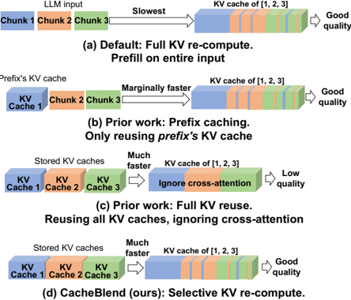

Reusing all KV caches but re-computing a small fraction of KV

Figure 1. Contrasting full KV recompute, prefix caching, full KV reuse, and CacheBlend's selective KV recompute.

full KV recompute (Figure 1(a)). Despite many optimizations, the delay and computation of prefill grow super-linearly with the input length, and can easily slow down the service, especially on long LLM inputs ( e.g., in RAG) [11, 53, 60].

So, how do we speed up the prefill of LLM inputs? Recent optimizations embrace the fact that same context texts are often reused by different LLM inputs. They then pre -compute the KV caches of these texts once and re -use the stored KV caches to avoid repeated prefill on these reused texts.

Limitations of existing methods: There are currently two approaches to KV cache reusing, but they both have limitations.

First, prefix caching only stores and reuses the KV cache of the prefix of the LLM input [33, 36, 41, 42, 59] (Figure 1(b)). Because the prefix's KV cache is independent of the succeeding texts, prefix caching does not hurt generation quality. However, many applications, such as RAG, include multiple text chunks, rather than one, in the LLM input to provide all necessary contexts to ensure good response quality. Thus, only the first text chunk is the prefix, and other reused texts' KV caches are not reused. As a result, the speed of prefix caching will be almost as slow as full KV recompute when input consists of many reused text chunks.

Second, full KV reuse aims to address this shortcoming (Figure 1(c)). When a reused text is not at the input prefix, it still reuses the KV cache by adjusting its positional embedding so that the LLM generation will produce meaningful output [24]. However, this method ignores the important cross-attention -the attention between tokens in one chunk with tokens in its preceding chunks. The cross-attention information cannot be pre-computed as the preceding chunks are not known in advance. Yet, cross-attention can be vital to answer queries ( e.g., about geopolitics) that naturally require understanding information from multiple chunks jointly ( e.g., chunks about geography and chunks about politics). §3.3 offers concrete examples to illustrate when prefix caching and modular caching are insufficient.

Ourapproach: This paper tackles only one challenge: when an LLM input includes multiple text chunks, how to quickly combine their individually pre-computed KV caches, in order to achieve the same generation quality as the expensive full prefill? In other words, we seek to have both the speed of full KV reuse and the generation quality of full KV recompute .

We present CacheBlend, a system that fuses multiple pre-computed KV caches, regardless of prefix or not, by selectively recomputing the KV cache of a small fraction of tokens, based on the preceding texts in the specific LLM input. We refer to it as selective KV recompute (Figure 1(d)). At a high level, selective KV recompute performs prefill on the input text in a traditional layer-by-layer fashion; however, in each layer, it updates the KV of only a small fraction of tokens while reusing the KV of other tokens.

Comparing with full KV recompute, an update fraction of less than 15% can typically generate same-quality responses based on our experience. The deeper reason why it suffices to only updating a small fraction of KV is due to the sparsity of attention matrices (see §4.3).

Comparing with full KV reuse, CacheBlend achieves higher generation quality with a small amount of extra KV update. Moreover, this small extra computation does not increase the inference latency, because CacheBlend parallelizes partial KV update on one layer with the fetching of the KV cache on the next layer into GPU memory. Such pipelining enables CacheBlend to store KV caches in slower non-volatile devices ( e.g., disk) without incurring extra delay, allowing more KV caches to be stored and reused.

To put our contribution in context, CacheBlend enables the reusing of KV caches of multiple text chunks in one LLM input, without compromising generation quality. This is complementary to the recent work that reduces KV cache storage sizes [28, 35, 42, 43, 45, 58] and optimizes the access patterns of KV cache [33, 59].

We implemented CacheBlend on top of vLLM and compared CacheBlend with state-of-the-art KV cache reusing schemes on three open-source LLMs of various sizes and three popular benchmark datasets of two LLM tasks (RAG and QA). We show that compared to prefix caching, CacheBlend reduces time-to-first-token (TTFT) by 2.2-3.3 × and increases the inference throughput by 2.8-5 × , without compromising generation quality or incurring more storage cost. Compared to full KV reuse, CacheBlend achieves almost the same TTFT but 0.1-0.2 higher absolute F1-scores on QA tasks and 0.03-0.25 higher absolute Rouge-L scores on summarization.

## 2 Background

Most LLM services today use transformers [13, 16, 52]. After receiving the input tokens, the LLM first uses the prefill

phase (explained shortly) to transform the tokens into key (K) and value (V) vectors, i.e., KV cache . After prefill, the LLM then iteratively decodes (generates) the next token with the current KV cache and appends the new K and V vectors of the new tokens to the KV cache for the next iteration.

The prefill phase computes the KV cache layer by layer. The input tokens embeddings on each layer are first transformed into query (Q), key (K), and value (V) vectors, of which the K and V vectors form one layer of the KV cache. The LLM then multiplies Q and K vectors to obtain the attention matrix -the attention between each token and its preceding tokens-and does another dot product between the (normalized and masked) attention matrix with the V vector. The resulting vector will go through multiple neural layers to obtain the tokens' embeddings on the next layer.

When the KV cache of a prefix is available, the prefill phase will only need to compute the forward attention matrix (between the suffix tokens and the prefix tokens) on each layer which directly affects the generated token.

The prefill phase can be slow, especially on long inputs. For instance, on an input of four thousand tokens (a typical context length in RAG [33]), running prefill can take three (or six) seconds for Llama-34B (or Llama-70B) on one A40 GPU. This causes a substantial delay that users have to wait before seeing the first word generated. Recent work also demonstrates that prefill can be a throughput bottleneck, by showing that getting rid of the prefill phase can double the throughput of an LLM inference system [60].

## 3 Motivation

## 3.1 Opportunities of reusing KV caches

Recent systems try to alleviate the prefill overhead by leveraging the observation that in many LLM use cases, the same texts are used repeatedly in different LLM inputs. This allows reusing KV caches of these reused texts (explained shortly).

Text reusing is particularly prevalent when same texts are included in the LLM input to provide necessary contexts to ensure high and consistent response quality. To make it more concrete, let's consider two scenarios.

- In a company that uses LLM to manage internal records, two queries can be 'who in the IT department proposed using RAG to enhance the customer service X during the last all-hands meeting?' and 'who from the IT department were graduates from college Y?' While seemingly different, both queries involve the list of employees in the IT department as a necessary context to generate correct answers.
- Similarly, in an LLM-based application that summarizes Arxiv papers, two queries can be 'what are the trending RAG techniques on Arxiv?' and 'what datasets are used recently to benchmark RAG-related papers on Arxiv?' They both need the recent Arxiv papers about RAG as the necessary context to generate correct results.

Since the reused contexts typically contain more information than the user queries, the prefill on the 'context' part of the input accounts for the bulk of prefill overhead [22, 33]. Thus, it would be ideal to store and reuse the KV caches of reused texts, in order to avoid the prefill overhead when these texts are used again in different LLM inputs.

## 3.2 Why is prefix caching insufficient?

Indeed, several recent systems are developed to reduce prefill delay by reusing KV caches. For example, in prefix caching, the KV cache of a reusable text chunk is precomputed once, and if the text chunk is at the prefix of an LLM input, then the precomputed KV cache can be reused to avoid prefill on the prefix. The advantage of prefix caching is that the KV cache of a prefix is not affected by the succeeding text, so the generation result will be identical to full KV recompute (without the KV cache). Several systems have followed this approach, e.g., vLLM [36], SGLang [59], and RAGCache [33].

The disadvantage of prefix caching is also clear. To answer one query, applications, such as RAG, often prepend multiple text chunks in the LLM input to provide different contexts necessary for answering the query. 1 As a result, except the first chunk, all other chunks' KV caches are not reused since they are not the prefix of the LLM input .

Let us think about the queries from §3.1. To answer ' whoin the IT department proposed using RAG to enhance the customer service X during the last all-hands meeting? ', we need contexts from multiple sources, including IT department's employees, information about service X, and meeting notes from the allhands meeting. Similarly, in the Arxiv-summarization app, answering the example queries will require the LLM to read several recent RAG-related Arxiv papers as the contexts. Being on different topics, these contexts are unlikely to appear together in one text chunk. They are separate text chunks used together only when answering a particular query.

To empirically show the needs for including multiple text chunks in LLM inputs, we use two popular multi-hop QA datasets, Musique and 2WikiMQA. These datasets consist of queries and multiple associated context texts needed to answer the queries. Following the common practice of RAG, we first create a vector database by splitting the contexts into chunks of 128 tokens (a popular number [29]) using the text chunking mechanism from Langchain [5]. For each query, we embed the query using SentenceTransformers [49],

1 Prepending all contexts in an LLM input is a popular way of augmenting user queries ( e.g., 'stuff' mode in Langchain and LlamaIndex). By default, this paper uses this mode. Other RAG methods like 'MapReduce' or 'Rerank' do not fit in this category. They first process each context text chunk separately before combining the results from each context. Since each chunk is always the prefix when processed separately, prefix caching works well. However, 'MapReduce' is slow since it needs to summarize every chunk before generating the answer from summaries. 'Rerank' suffers from low generation quality if multiple chunks contain relevant information as it processes every chunk individually. We also empirically evaluate these methods and compare them with CacheBlend in §7.

Figure 2. Generation quality improves as more text chunks are retrieved.

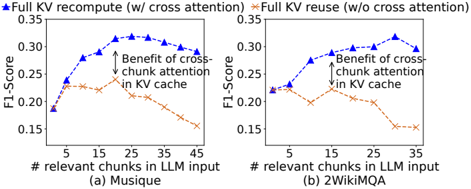

and fetch top-k relevant chunks from the database, based on the least L2 distance between the embeddings of the query and the chunk respectively. Figure 2 shows the generation quality, measured using a standard F1-score metric, with an increasing number of selected text chunks. We can see that the quality improves significantly as more text chunks are retrieved to supplement the LLM input, though including too many chunks hurts quality due to the well-known lostin-the-middle issue [40, 54].

In short, prefix caching can only save the prefill of the first text chunk , so the saving will be marginal when the LLM input includes more text chunks, even if they are reused.

## 3.3 Why is full KV reuse insufficient?

Full KV reuse is proposed to address this very problem. This approach is recently pioneered by PromptCache [24]. It concatenates independently precomputed KV caches of recurring text chunks with the help of buffers to maintain the positional accuracy of each text chunk. For instance, to concatenate the KV caches of chunks 𝐶 1 and 𝐶 2, PromptCache first needs to precompute the KV cache of 𝐶 2 by running prefill on a hypothetical input that prepends 𝐶 2 with a dummy prefix of length greater or equal to 𝐶 1. This way, even if 𝐶 2 is not the prefix, we still correctly preserve the positional information of 𝐶 2's KV cache, though each chunk's KV cache will have to be precomputed multiple times.

However, even with the positional information preserved, a more fundamental problem is that the KV cache of nonprefix text chunk ( e.g., 𝐶 2) ignores the cross-attention between the chunk and the preceding text ( e.g., 𝐶 1). This is because the preceding text is not known when precomputing the KV cache.

Ignoring cross-attention can lead to a wrong response. Figure 3 shows an illustrative example, where a user query "How many goals did Messi score more than Cristiano Ronaldo at FIFA World Cups?" is prepended by the two text chunks of the players' career statistics. With full prefill or prefix caching, the result is clear and correct. With full KV reuse the KV caches of the two text chunks are precomputed, with each chunk having the right positional embedding, and then concatenated to form the KV cache. However, if the LLM

(c) Full KV reuse gives wrong answer.

Figure 3. An illustrative example of an LLM input with two text chunks prepended to a query. Full KV recompute (b), without reusing KV cache, is slow but gives the correct answer. Full KV reuse (c), however, gives the wrong answer as it neglects cross-attention between the chunks (Figure 4).

uses this KV cache to generate the answer, it will start to ramble and not produce the right answer.

To understand why, we take a closer look at the attention matrix (explained in §2), particularly the cross-attention between the two text chunks talking about the players' statistics. Figure 4 visualizes the attention matrix resulting from the KV cache of the original (full) prefill and the KV cache of full KV reuse. Since full KV reuse precomputes each chunk separately, the cross attention between two chunks is completely missed (never computed) when the KV caches are precomputed. In this example, the first chunk contains Messi's goal count and the second chunk contains Ronaldo's. The LLM is queried to compare the goal counts between Messi and Ronaldo. Neglecting the interaction (cross-attention) between two chunks would lead to a flawed answer.

In fairness, it should be noted that full KV reuse does work when the cross-attention between chunks is low. This can commonly occur with prompt templates which are the main target application of PromptCache [24].

The absence of cross-attention in full KV reuse causes significant discrepancies in the forward attention matrix (explained in §2), which contains the attention between context tokens and the last few tokens, and directly affects the generated tokens.

To show the prevalence of cross-attention in multi-chunk LLM inputs, Figure 2 contrasts the response quality (in F1 score) between full KV recompute (with cross-attention) and full KV reuse (without cross-attention). We can see that as the number of relevant chunks increases, the disparity between full prefill and modular caching becomes more pronounced. This is because, with a larger number of chunks, the amount of cross-referencing and interdependency between different parts of the input (cross-attention) increases.

Figure 4. Contrasting the attention matrices of (a) full KV recompute and (b) full KV reuse. The yellow boxes highlight the cross-attention. The right-hand side plots show the resulting forward attention matrices whose discrepancies are a result of the different cross-attention between the two methods.

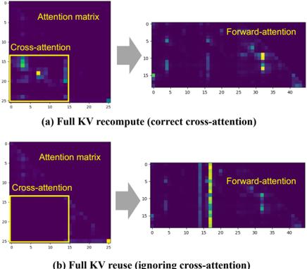

## 4 Fast KV Cache Fusing

Given that full KV recompute ( i.e., full prefill or prefix caching) can be too slow while full KV reuse has low quality, a natural question then is how to have both the speed of full KV reuse and the quality of full KV recompute. Our goal, therefore, is the following:

Goal. When an LLM input includes multiple re-used text chunks, how to quickly update the pre-computed KV cache, such that the forward attention matrix (and subsequently the output text) has minimum difference with the one produced by full KV recompute.

To achieve our goal, we present CacheBlend, which recomputes the KV of a selective subset of tokens on each layer while reusing other tokens' KV. 2 This section explains CacheBlend in three parts. We begin with the notations (§4.1), and then describe how to recompute the KV of only a small subset of tokens (§4.2), and finally explain how to select the tokens on each layer whose KV will be recomputed (§4.3).

## 4.1 Terminology

Table 1 summarizes the notations used in this section. For a given list of 𝑁 text chunks, we use 𝐾𝑉 full to denote the KV cache from full KV recompute, 𝐾𝑉 pre to denote the precomputed KV cache, and 𝐾𝑉 new to denote the CacheBlendupdated KV cache. Here, each of these KV caches is a concatenation of KV caches associated with different text chunks. Each layer 𝑖 of the KV cache, 𝐾𝑉 𝑖 , produces the forward attention matrix 𝐴 𝑖 .

2 For simplicity, we use the terms KV and KV cache interchangeably.

Table 1. Summary of terminology

| Notation                                           | Description                                                                                                                 |
|----------------------------------------------------|-----------------------------------------------------------------------------------------------------------------------------|
| 𝑖 𝑗                                                | Layer index Token index                                                                                                     |
| 𝐾𝑉 𝐾𝑉 𝑖 𝐾𝑉 𝑖 [ 𝑗 ] 𝐾𝑉 full 𝐾𝑉 pre 𝐾𝑉 new 𝑖 𝐴 pre 𝑖 | Forward attention matrix on layer 𝑖 Forward attention matrix of full KV recompute Forward attention matrix of full KV reuse |
|                                                    | KV cache                                                                                                                    |
|                                                    | KV on layer 𝑖                                                                                                               |
|                                                    | KV on layer 𝑖 at token 𝑗                                                                                                    |
|                                                    | Fully recomputed KV cache                                                                                                   |
|                                                    | Pre-computed KV cache                                                                                                       |
|                                                    | CacheBlend-updated KV cache                                                                                                 |
| 𝐴 𝑖 𝐴 full                                         |                                                                                                                             |
| 𝐴 new 𝑖 Δ kv ( 𝐾𝑉 𝑖 ,𝐾𝑉 full 𝑖 ) [ 𝑗 ]             | Forward attention matrix with CacheBlend KV deviation between 𝐾𝑉 𝑖 [ 𝑗 ] and 𝐾𝑉 full 𝑖 [ 𝑗 ]                                |
| Δ attn ( 𝐴 𝑖 ,𝐴 full )                             |                                                                                                                             |
| 𝑖                                                  | Attention deviation between 𝐴 𝑖 and 𝐴 full 𝑖                                                                                |

The difference between the full KV recompute (full prefill) and the full KV re-use is two-fold.

- KV deviation: We define the KV deviation of a KV cache 𝐾𝑉 on layer 𝑖 of token 𝑗 as the absolute difference between 𝐾𝑉 𝑖 [ 𝑗 ] and 𝐾𝑉 full 𝑖 [ 𝑗 ] , denoted as Δ kv ( 𝐾𝑉 𝑖 , 𝐾𝑉 full 𝑖 ) [ 𝑗 ] . It measures how much different the given KV is on a particular token and layer compared to the full-prefilled KV cache. Wewill later use the KV deviation to identify which tokens' KV has higher deviation and thus need to be updated.
- Attention deviation: Similarly, for the forward attention matrix 𝐴 𝑖 on layer 𝑖 , we define the attention deviation , denoted as Δ attn ( 𝐴 𝑖 , 𝐴 full 𝑖 ) , to be the L-2 norm of its difference with 𝐴 full 𝑖 . Recall from §3.3 that full KV reuse suffers from deviation in the forward attention matrix (illustrated in Figure 4) due to the absence of cross-attention.

Using these notations, our goal can be formulated as how to quickly update the precomputed KV cache 𝐾𝑉 pre to the new KV cache 𝐾𝑉 new , such that the attention deviation Δ attn ( 𝐴 new 𝑖 , 𝐴 full 𝑖 ) on any layer 𝑖 , is minimized.

## 4.2 Selectively recomputing KV cache

For now, let us assume we have already selected a subset of tokens to recompute on each layer (we will explain how to select them in §4.3). Here, we describe how CacheBlend recomputes the KV of these selected tokens on each layer.

Workflow: The default implementation of prefill (depicted in Figure 5(a)) does not 'skip' tokens while only computes the KV of a subset of tokens. Instead, CacheBlend runs the following steps (depicted in Figure 5(b)):

- It first applies a mask on the input of each layer 𝑖 to reduce it to a subset of selected tokens.
- It then transforms the reduced input into the 𝑄 𝑖 , 𝐾 𝑖 and 𝑉 𝑖 vectors will also be restricted to the selected tokens.
- It then expands the 𝐾 𝑖 vector and 𝑉 𝑖 vector by reusing the KV cache entries associated with the un-selected tokens

(b) Selective KV recompute on two selected tokens

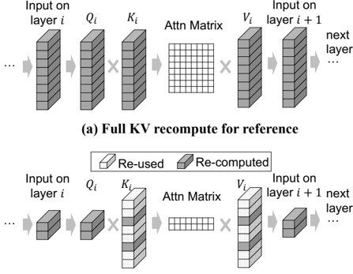

Figure 5. Illustrated contrast between (a) full KV recompute and (b) selective KV recompute on one layer.

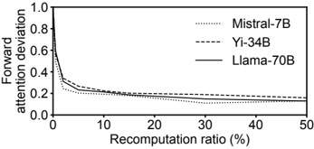

Figure 6. Attention deviation reduces as we recompute the KV of more tokens on each layer. Importantly, the biggest drop in attention deviation results from recomputing the KV of the tokens with the highest KV deviation (i.e., HKVD tokens).

on layer 𝑖 , so that the attention matrix includes attention between selected tokens and all other tokens.

- Finally, it runs the same attention module to produce the input of the next layer.

These changes make little assumption on the exact transformer process and can be integrated with many popular transformers (more details in §6). It is important to notice that the compute overhead is proportional to the number of selected tokens. This is because it only runs computation associated with the selected tokens. If we recompute 𝑟 % of tokens per layer, the total compute overhead will be 𝑟 % of full prefill.

## 4.3 Selecting which tokens to recompute

Next, we explain how to choose the tokens whose KV should be recomputed on each layer in order to reduce the attention deviation on each layer, which results from the KV deviation. Our intuition, therefore, is to prioritize recomputing the KV of tokens who have high KV deviations. Of course, this intuitive scheme is not feasible as it needs to know fullprefilled KV cache, and we will make it practical shortly.

To show the effectiveness of selecting tokens with high KV deviations, Figure 6 uses three models on the dataset of Musique (please see §7.1 for details). It shows the change of average attention deviation across all layers 𝑖 , Δ attn ( 𝐴 𝑖 , 𝐴 full 𝑖 ) , after we use the aforementioned scheme (§4.2) to select and recompute the 𝑟 %of tokens 𝑗 who have the highest KV deviation Δ kv ( 𝐾𝑉 𝑖 , 𝐾𝑉 full 𝑖 ) [ 𝑗 ] . As the recompute ratio ( 𝑟 ) increases, we can see that the attention deviation gradually reduces, and the biggest drops happen when the top few tokens with the highest KV deviations are recomputed. Empirically, it suggests the following insight.

Insight 1. On layer 𝑖 , recomputing the KV of token 𝑗 who has a higher KV deviation (i.e., Δ kv ( 𝐾𝑉 𝑖 , 𝐾𝑉 full 𝑖 ) [ 𝑗 ] ) reduces the attention deviation (i.e., Δ attn ( 𝐴 𝑖 , 𝐴 full 𝑖 ) ) by a greater amount.

Thus, if we recompute the KV of, say 10%, of tokens on a layer 𝑖 , we should choose the 10% of tokens which have the highest KV deviations. 3 We refer to these tokens as the High-KV-Deviation (or HKVD ) tokens on layer 𝑖 .

Now that we know we should recompute KV for the HKVD tokens, two natural questions arise.

Do we need to recompute KV for most tokens? In §7, we empirically show that choosing 10-20% tokens as HKVD tokens and recomputing their KV suffices to greatly reduce the attention deviation and preserve generation quality.

This can be intuitively explained by attention sparsity , a well-studied property observed in many transformer models by prior research [14, 15, 43, 58]. It says that in an attention matrix, high attention typically only occurs between a small number of tokens and their preceding tokens. To validate this observation, Figure 7 uses the same models and dataset as Figure 6. It shows the distribution of KV deviation on one layer. We can see that a small fraction, about 10-15%, of tokens have much higher KV deviation than others, which corroborates the sparsity of cross-attention.

If a token has very low attention with other chunks' tokens ( i.e., low cross-attention with other chunks), the KV deviation between 𝐴 pre and 𝐴 full will be low and thus do not need to be recomputed. Only when a token has a high attention with other chunks (high KV deviation compared with ground truth), should its KV be recomputed.

How to identify the HKVD tokens without knowing the true KV values or attention matrix? Naively, to identify the HKVD tokens, one must know the fully recomputed 𝐾𝑉 full 𝑖 of each layer 𝑖 in the first place, but doing so is too

3 In the precomputed KV cache, the K vector of each chunk must be adjusted with the correct positional embedding. In SOTA positional embedding scheme (Rotary Positional Embedding or ROPE [50]), this correction is done simply by multiplying the K vector by a rotation matrix of GLYPH&lt;18&gt; GLYPH&lt;19&gt;

cos 𝑚𝜃 -sin 𝑚𝜃 sin 𝑚𝜃 cos 𝑚𝜃 . (The n-dimensional case in Appendix A) This step has negligible overhead since the multiplication is performed only once.

Figure 7. Distribution of KV deviation of different tokens on one layer.

Figure 8. Rank correlation of the KV deviation per token between two consecutive layers.

expensive and defeats the purpose of selective KV recompute. Instead, we observe that the HKVD tokens on different layers are not independent:

Insight 2. Tokens with the highest KV deviations on one layer are likely to have the highest KV deviations on the next layer.

For instance, if the HKVD tokens on the first layer are tokens 2, 3, and 5, these three tokens will likely also have higher KV deviations than most other tokens on the second layer.

Figure 8 uses the same setting as Figure 7 and shows Spearman's rank correlation score between the KV deviation of tokens between two neighboring layers. The figure shows a consistently high similarity of HKVD tokens between different layers. 4

The intuition behind this correlation lies in the previous observation that the input embedding of each token changes slowly between layers in transformer models [44, 47]. Therefore, KV cache between layers should also bear similarity as KV cache is generated from the input embedding with a linear transformation.

Given the substantial correlation between the HKVD tokens, a straightforward solution is that we can perform prefill on the first layer first, pick the HKVD tokens of the first layer, and only update their KV on all other layers. Since an LLM usually has over 30 layers, this process can save most of the compute compared to full KV recompute. That said, using only the attention deviation of different tokens on the first layer may not be statistically reliable to pick HKVD tokens of all layers, especially deeper layers.

4 We should clarify that although the HKVD tokens are similar across layers, the attention matrices between layers can still be quite different.

Figure 9. CacheBlend selects the HKVD (high KV deviation) tokens of one layer by computing KV deviation of only the HKVD tokens selected from the previous layer and selecting the tokens among them with high KV deviation.

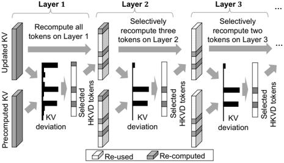

Thus, we opt for a gradual filtering scheme (depicted in Figure 9). If on average we want to pick 𝑟 % HKVD tokens per layer, we will pick 𝑟 1% tokens based on the token-wise attention deviation on the first layer, with 𝑟 1 being slightly higher than 𝑟 , and use them as the HKVD tokens on the second layer. Then we recompute the KV of these 𝑟 1% HKVD tokens on the second layer and pick 𝑟 2% tokens that have the highest token-wise attention deviation, with 𝑟 2 slightly less than 𝑟 1, as the HKVD tokens on the next layer, and so forth. Intuitively, this gradual-filtering scheme eventually picks the HKVD tokens who have high attention deviation, not only on the first layer but also on multiple layers, which empirically is statistically more reliable to identify the HKVD tokens on each layer.

Although the KV-cache space of the layer i performing the HKVDcalculation holds both Updated-KV and PrecomputedKV, layer-i's extra Precomputed-KV is immediately discarded once the inference proceeds to layer i+1. This makes the memory overhead in HKVD negligible.

## 5 CacheBlend System Design

Wepresent a concrete system design for CacheBlend, which reduces the impact of the selective KV recompute using the following basic insight.

Basic insight: If the delay for selective KV recompute (§4.3) is faster than the loading of KV into GPU memory, then properly pipelining the selective KV recompute and KV loading makes the extra delay of KV recompute negligible.

Pipelining KV loading and recompute: In CacheBlend, the selective recompute of one layer can start immediately after pre-computed the KV cache of the previous layer is loaded into the GPU. This is because which tokens' KV to recompute on one layer only depends on the KV deviation of the previous layer's tokens. As a result, if loading the precomputed KV for one layer is faster or equal to selective KV

Figure 10. (a) Smartly picking the recompute ratio will not incur an extra delay. (b) Smartly picking storage device(s) to store KVs saves cost while not increasing delay.

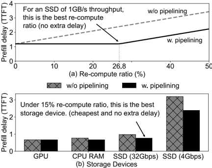

recompute of one layer, the KV-loading delay should be able to hide the selective recompute delay, i.e., without incurring any extra delay on time-to-first-token (TTFT).

Take the Llama-7B model and a 4K-long context, recomputing 15% of the tokens (the default recompute ratio) only takes 3 ms per layer, while loading one layer's KV cache takes 16 ms from an NVME SSD (§7). In this case, KV loading can hide the delay for KV recompute on 15% of the tokens, i.e., KV recompute incurs no extra delay. Recomputing more tokens, which can slightly improve generation quality, may not incur extra delay either, as long as the delay is below 16 ms. On the contrary, with another model, Llama-70B, recomputing 15% of tokens takes 7 ms, but it only takes 4 ms to load one layer's KV from an NVME SSD. Here KV loading does not completely hide the recompute delay. In short, a controller is needed to intelligently pick the recompute ratio as well as where to store the KV cache (if applicable).

## 5.1 Key Components

To realize the benefit of pipelining KV loading and recompute, our system has three major components.

Loading Controller: We face two design questions in practice: First, given a fixed storage device to use, how to choose a recompute ratio (what fraction of tokens to recompute KV per layer) without incurring extra delay to time-to-first-token (TTFT)? Figure 10(a) illustrates an example that, if we select a recompute ratio wisely, the recompute should not cause any extra delay to loading if loading is slow.

For this, the controller uses two delay estimators to find an idealized recompute ratio, such that the recompute delay is close to the loading delay. Given the recompute ratio 𝑟 , length of context to be loaded 𝐿 , and LLM, the recompute delay estimator calculates the expected delay 𝑇 𝑟𝑒𝑐𝑜𝑚𝑝𝑢𝑡𝑒 ( 𝑟 % , 𝐿𝐿𝑀, 𝐿 ) 5 .

5 𝑇 𝑟𝑒𝑐𝑜𝑚𝑝𝑢𝑡𝑒 ( 𝑟 % , 𝐿𝐿𝑀, 𝐿 ) = 𝑟 % × 𝑃𝑟𝑒𝑓 𝑖𝑙𝑙 ( 𝐿𝐿𝑀,𝐿 ) . 𝑃𝑟𝑒𝑓 𝑖𝑙𝑙 ( 𝐿𝐿𝑀,𝐿 ) is offline profiled.

The loading delay estimator estimates the loading delay of the KVcache of one layer, 𝑇 𝑙𝑜𝑎𝑑 ( 𝐿𝐿𝑀,𝐿,𝑠𝑡𝑜𝑟𝑎𝑔𝑒 \_ 𝑑𝑒𝑣𝑖𝑐𝑒 ) 6 , based on the LLM, the storage device's speed (which is measured offline), and the length of context 𝐿 .

The controller calculates an idealized recomputation ratio such that the loading delay can hide the recompute delay, without degrading the inference quality. It first picks the recompute ratio 𝑟 % such that 𝑇 𝑟𝑒𝑐𝑜𝑚𝑝𝑢𝑡𝑒 ( 𝑟 % , 𝐿𝐿𝑀, 𝐿 ) is equal to 𝑇 𝑙𝑜𝑎𝑑 ( 𝐿𝐿𝑀,𝐿,𝑠𝑡𝑜𝑟𝑎𝑔𝑒 \_ 𝑑𝑒𝑣𝑖𝑐𝑒 ) , and then takes the max of 𝑟 % and 𝑟 ∗ %, where 𝑟 ∗ % is the minimal recompute ratio that empirically has low negligible quality drop from full KV recompute. In practice, we found 𝑟 ∗ % to be 15% from Figure 16. This means that even if the storage device is a fast device (ex. CPU RAM), the delay will be lower-bounded by the minimal recomputation to guarantee quality.

In practice, CacheBlend faces another challenge: which storage devices should the developer use? To solve this challenge, we present a more formulated question to the loading controller: If we only do KV recompute of a fixed selective recompute ratio (ex. 15% ), how can we choose the right storage device to store KVs such that no extra delay is caused? As shown in Figure 10(b), under a fixed recompute ratio, the controller should pick the cheapest storage device among all devices that do not increase the delay.

In CacheBlend, the system developers can provide a list of potential storage device(s), and the controller uses a storage cost estimator which estimates the cost of storing KVs for each device, namely 𝐶 𝑠𝑡𝑜𝑟𝑒 ( 𝐿𝐿𝑀,𝐿,𝑇,𝑠𝑡𝑜𝑟𝑎𝑔𝑒 \_ 𝑑𝑒𝑣𝑖𝑐𝑒 ) , based on the LLM, length of context 𝐿 and time duration 𝑇 needed to store it (if it is cloud storage). Then it uses 𝑇 𝑟𝑒𝑐𝑜𝑚𝑝𝑢𝑡𝑒 ( 15% , 𝐿𝐿𝑀, 𝐿 ) and 𝑇 𝑙𝑜𝑎𝑑 ( 𝐿𝐿𝑀,𝐿,𝑠𝑡𝑜𝑟𝑎𝑔𝑒 \_ 𝑑𝑒𝑣𝑖𝑐𝑒 ) to estimate the recompute and loading delays for all devices. Lastly, it finds out which storage device is the cheapest where 𝑇 𝑟𝑒𝑐𝑜𝑚𝑝𝑢𝑡𝑒 ≥ 𝑇 𝑙𝑜𝑎𝑑 . In this way, if the developer can navigate through the different storage devices for the KV caches given a fixed recomputation target that satisfies the generation quality requirement.

KVcache store (mapping LLM input to KV caches) : The KVcache store splits an LLM input into multiple text chunks, each of which can be reused or new. For instance, a RAG input typically consists of multiple retrieved context chunks (likely of a fixed length) and the user input. The splitting of LLM inputs is specific to the application, and we implement the same strategy as described in recent work [24, 38]. Once the input is split into text chunks, each chunk is hashed to find their corresponding KV cache, in the same way as the block hashing is implemented in vLLM [36]. The KV caches of new chunks generated by the fusor (explained soon) are added to the devices. When the storage devices are full, we evict the least recently used KV cache. In this paper, we only focus on storing KV cache in one single level of storage device such as CPU RAM or SSD.

6 𝑇 𝑙𝑜𝑎𝑑 ( 𝐿𝐿𝑀,𝐿,𝑠𝑡𝑜𝑟𝑎𝑔𝑒 \_ 𝑑𝑒𝑣𝑖𝑐𝑒 ) = 𝑃𝑒𝑟𝑇𝑜𝑘𝑒𝑛𝐾𝑉𝑆𝑖𝑧𝑒 ( 𝐿𝐿𝑀 ) × 𝐿 𝑇ℎ𝑟𝑜𝑢𝑔ℎ𝑝𝑢𝑡 ( 𝑠𝑡𝑜𝑟𝑎𝑔𝑒 \_ 𝑑𝑒𝑣𝑖𝑐𝑒 ) .

Figure 11. CacheBlend system (green stared) in light of LLM context augmented generation for a single request. CacheBlend uses text provided by the retriever, interacts with the storage device(s), and provides KV cache on top of LLM inference engines.

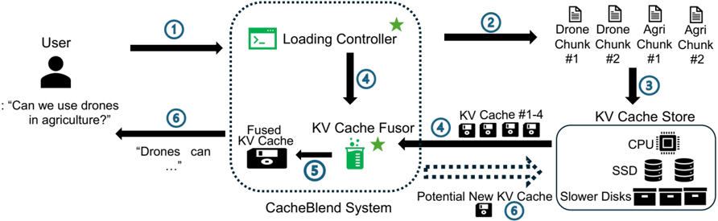

Fusor: The cache fusor (§4) merges pre-computed KV caches via selective recompute. Recall from §4.3, the decision of which tokens need to be recomputed for one layer depends on the recompute of the previous layer. Thus, the fusor waits until the recompute for the previous layer is done, and the KV caches for layer 𝐿 are loaded into the queue on GPU memory and then perform selective recompute using the recompute ratio 𝑟 % calculated by the loading controller. The fusor repeats this process until all the layers are recomputed.

## 5.2 Putting them together

We put the key components together in an LLM inference workflow in Figure 11. When a user of an LLM application submits a question, a list of relevant text chunks will be queried. The loading controller then queries the KV cache manager on whether the KV caches for those text chunks exist, and where they are stored. Next, the KV cache manager returns this information back to the loading controller and the controller computes the idealized selective recomputation ratio, sends it to the fusor, and loads the KV caches into a queue in GPU memory. The KV cache fusor continuously recomputes the KV caches in the queue, until all layers are recomputed. Lastly, the fused KV cache is input into the LLM inference engine, which generates the answer to the user question based on the KV cache.

## 6 Implementation

We implement CacheBlend on top of vLLM with about 3K lines of code in Python based on PyTorch v2.0.

Integrating Fusor into LLM serving engine: CacheBlend performs the partial prefill process in a layer-wise manner through three interfaces:

- fetch\_kv(text, layer\_id) -&gt; KVCache : given a piece of text and a layer id, CacheBlend fetches the corresponding KV cache from KV store into the GPU. Returns -1 if the KV cache is not in the system.
- prefill\_layer(input\_dict, KVCache) -&gt; output\_dict : CacheBlend takes in the input and KV cache of this layer

and performs the partial prefill process for this particular layer. The output is used as the input for the next layer.

- synchronize() : CacheBlend requires synchronization before prefilling every layer to make sure the KV cache of this layer has already been loaded into the GPU.

We implement these three interfaces inside vLLMs. For fetch\_kv , we first calculate the hash of the text and search if it is inside the KV store system. If it is present, we call torch.load() to load it into GPU memory if KV cache is on disk or use torch.cuda() if the KV cache is inside CPU memory. For prefill\_layer , we implement this interface on top of the original layer function in vLLM that performs one layer of prefill. Three key-value pairs are recorded in the input\_dict : (1) the original input data input\_org required for prefilling an LLM layer (e.g., input\_tensor, in-put\_metadata), (2) a check\_flag indicating whether HKVD tokens will be selected in this layer, and (3) HKVD\_indices that track the indices of HKVD tokens. If check\_flag is True , the input tokens with the largest deviation between the newly computed KV cache and the loaded KV cache will be selected as the HKVD tokens. If check\_flag is False , partial prefill will only be performed on the current HKVD tokens indicated by HKVD\_indices . Only the KV cache of the HKVD tokens will be computed and updated at each layer. In the partial prefill for layer 𝑖 , two threads are used to pipeline the computation ( prefill\_layer ) of layer 𝑖 and the KV cache loading ( fetch\_kv ) of the next layer 𝑖 + 1. synchronize is called before prefill\_layer to assure the KV cache needed for prefill has been loaded into GPU.

Managing KV cache: CacheBlend manages the KV caches such that: If KV cache is not inside the system and is recomputed by the LLM engine in the runtime, we will move the KV cache into CPU by torch.cpu() and open a thread to write it back to disk in the background with torch.save() . During fetch\_kv , we go through through the hash tables to fetch KV cache for the fusor. The hash tables are kept in CPU for their relatively small size (16MB for one million chunks).

Figure 12. CacheBlend reduces TTFT by 2.2-3.3 × compared to full KV recompute with negligible quality drop across four datasets and three models.

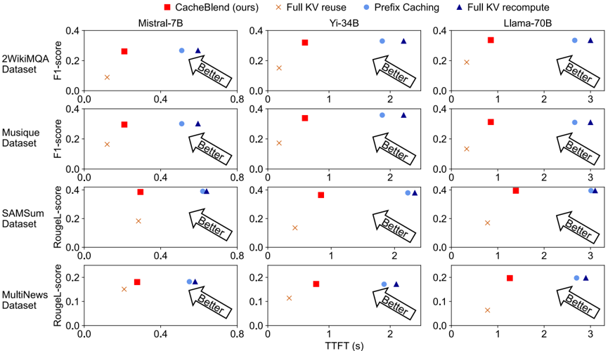

Figure 13. Generation quality of CacheBlend with Yi-34B vs MapReduce and MapRerank.

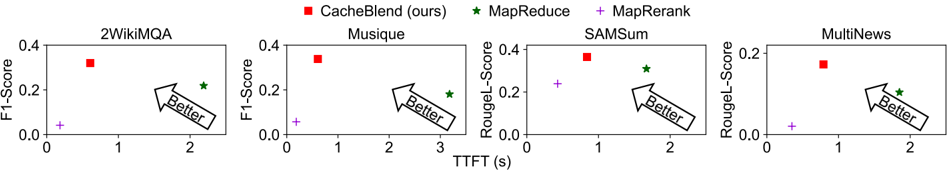

## 7 Evaluation

Our key takeaways from the evaluation are:

- TTFT reduction: Compared to full KV recompute, CacheBlend reduces TTFT by 2.2-3.3 × over several models and tasks.

model quantization to Llama-70B and Yi-34B. We run our end-to-end experiments on Runpod GPUs [10] with 128 GB RAM, 2 Nvidia A40 GPUs, and 1TB NVME SSD whose measured throughput is 4.8 GB/s. We use 1 GPU to serve Mistral7B and Yi-34B, and 2 GPUs to serve Llama-70B.

- High quality: Compared with full KV reuse, CacheBlend improves quality from 0.15 to 0.35 in F1-score and Rouge-L score, while having no more than 0.01-0.03 quality drop compared to full KV recompute and prefix caching.
- Higher throughput: At the same TTFT, CacheBlend can increase throughput by up to 5 × compared with full KV recompute and 3.3 × compared with prefix caching.

## 7.1 Setup

Models and hardware settings: Weevaluate CacheBlend on Mistral-7B[30], Yi-34B[56] and Llama-70B[2] to represent a wide scale of open source models. Note that we apply 8-bit

Datasets: Our evaluation covers the following datasets.

- 2WikiMQA 7 [27]: This dataset aims to test LLM's reasoning skills by requiring the model to read multiple paragraphs to answer a given question. We included 200 test cases, following the dataset size of previous work [12].
- Musique 7 [51]: This is a multi-document question-answering dataset. It is designated to test LLM's multi-hop reasoning ability where one reasoning step critically relies on information from another and contains 150 test cases.

7 Since the standard answers for 2WikiMQA and Musique are always less than 5 words, we append 'Answer within 5 words.' to their prompts to reduce the impact of answer length mismatch in F1 score calculation.

Figure 14. CacheBlend achieves lower TTFT with higher throughput in RAG scenarios compared with baselines of similar quality.

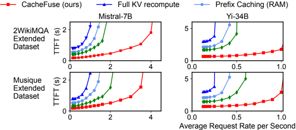

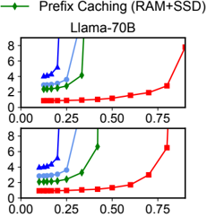

Figure 15. CacheBlend outperforms baseline with varying chunk numbers, chunk lengths, and batch sizes.

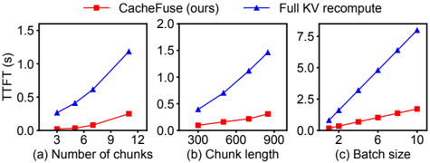

- SAMSum [25]: This dataset comprises multiple pairs of dialogues and summaries, and requires the LLM to output a summary to a new dialogue. It is intended to test the few-shot learning ability of language models and contains 200 test cases.
- MultiNews [20]: This dataset consists of news articles and human-written summaries of these articles from the site newser.com. Each summary is professionally written by editors and includes links to the original articles cited and contains 60 sampled cases.

We split contexts into 512-token chunks with Langchain and use the original 200-400 token chunks in SAMSum. We also create a synthetic dataset to simulate the chunk reuse in RAG scenarios. Specifically, we randomly pick 1500 queries in the Musique and 2WikiMQA datasets each and build a context chunk database by splitting each query's context into 512-token chunks [29] with Langchain [5]. For each query, we use GPT4 API to generate 3 more similar queries. In the 6000 queries (1500 original + 4500 simulated), we retrieve the top-6 chunks 8 based on L2 distance, in a random order[34]. We refer to these datasets as Musique extended and 2WikiMQA extended . We only report for baselines with similar quality and skip the result for the first 1K queries as the initial storage is completely empty.

Quality metrics: We adopt the following standard metrics to measure the generation quality.

8 Max number of chunks that fit into input token limit for Llama-70B.

- F1-score [6] is used to evaluate 2WikiMQA and Musique datasets [12]. It measures the similarity between the model's output and the ground-truth answer of the question based on the number of overlapping words.
- Rouge-L score [39] is used to evaluate MultiNews and SAMSum datasets [12]. It measures the similarity between the model's output and the ground-truth summaries based on the longest common sequence.

Baselines: We compare CacheBlend with the following baselines:

- Full KV recompute : The raw texts are fed into LLM as input. The LLM calculates KV cache of all tokens during prefill.
- Prefix caching [33, 36, 59]: We adopt the techniques from SGLang [59] to identify the frequently used prefix chunks and store their KV caches in both RAM and SSD. The KV cache of non-prefix tokens needs to be computed during prefill. We also make an idealized assumption in favor of prefix caching that there is no loading delay from RAM or SSD to GPU. This assumption makes it perform better than it would under real-world conditions.
- Full KV reuse [24]: We implement full KV reuse by using the approach proposed in PromptCache [24]. We append a buffer before the text to prepare its KV cache to be used in different positions with correct positional encoding. We did not compare with the scaffolding scheme since its application to RAG scenarios requires human users to manually select important chunks at runtime.
- MapReduce [7]: Different from traditional MapReduce [18], this is an alternative RAG method in LangChain. The LLM first summarises all chunks in parallel and concatenates them together. The concatenated summaries are then fed to the LLM again to generate the final answer.
- MapRerank [8]: This is another RAG method in LangChain. In MapRerank, the LLM independently generates an answer from each chunk along with a score based on its confidence that the answer is correct. The answer with the highest score is picked as the final output.

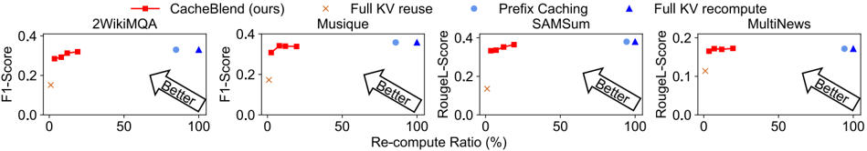

Figure 16. CacheBlend has minimal loss in quality compared with full KV recompute, with 5%-18% selective recompute ratio, with Yi-34B.

prefix caching, CacheBlend is also better in terms of higher throughput and lower delay as prefix caching needs to store multiple versions of KV caches for the same chunk if they have different prefixes. Thus, given the total storage space is fixed, prefix caching will incur a higher miss rate.

Figure 17. CacheBlend's outperforms baselines when using RAM and slower disks

## 7.2 Overall Improvement

Reduced TTFT with minimal quality drop: Figure 12 compares the average quality and TTFT across the requests, where each request has a context of 6 top chunks picked by lowest L2-distance between the respective embeddings generated by SentenceTransformers [49] (512 tokens per chunk). As shown in the graph, compared to the full KV recompute and prefix caching, CacheBlend's reduction in F1 and Rouge-L score is within 0.02, while it significantly reduces the TTFT by 2.2-3.3 × across all models and datasets. While CacheBlend is slower than full KV reuse due to its selective recomputation, its quality stably outperforms full KV reuse by a large margin (in many cases more than 2 × ).

Figure 13 compares CacheBlend with RAG methods including MapReduce and MapRerank. Compared to MapReduce, CacheBlend has a 2-5 × lower TTFT and higher F1 score.

Higher throughput with lower delay: In Figure 14, we compare CacheBlend with full KV recompute and prefix caching on Musique extended and 2WikiMQA datasets under different request rates. CacheBlend achieves lower delay with higher throughput by 2.8-5 × than all the baselines across different models and datasets.

UnderstandingCacheBlend'simprovement: CacheBlend is better than all baselines for different reasons. Compared to the full KV recompute, CacheBlend has a much lower delay and higher throughput due to only a small amount of tokens are recomputed. Compared to full KV reuse, although its delay is lower than CacheBlend, the quality drops a lot as full KVreuse did not perform any of the recompute, thus missing the cross-attention between different chunks. Compared to

Finally, compared to other RAG methods, like MapReduce and MapRerank, CacheBlend is also better in terms of quality or delay. For MapReduce, it has a higher delay than CacheBlend due to additional LLM inference. Although MapRerank has slightly lower TTFT than CacheBlend, its quality is much worse, since processing the input chunks separately ignores the dependencies between chunks.

## 7.3 Sensitivity Analysis

For a better understanding of CacheBlend, we further analyze how varying the configurations impacts overall performance.

Varying chunk numbers and lengths: Figure 15a and 15b show the minimum compute time needed by CacheBlend to maintain generation quality ( ≤ 0.015 loss in F1-score) at different numbers of chunks and chunk lengths. The experiment is conducted on 2WikiMQA with Mistral-7B model. As shown in the figure, the compute time reduction ratio remains similar across different numbers of chunks and chunk length settings.

Varying recompute ratios: Figure 16 shows the impact of the recompute ratio on the quality-TTFT trade-off across all datasets on Yi-34B model. Across all the datasets, CacheBlend's loss in generation quality is at most 0.002 in F1 score or Rouge-L score compared to full KV recompute, with 5%~18% recomputation ratio. To put the number into context, the 5%~18% recomputation ratio can be translated to 4.1-6.6 × TTFT reduction compared with full KV-recompute and 3.46.1 × TTFT reduction compared with prefix caching.

Varying batch size: Figure 15c shows the compute time of prefill phase of different batch sizes. It is worth noting that the time of the decoding phase increases slower than the prefill phase when the batch size becomes larger [36, 60], making prefill overhead dominant with increasing batch size. Therefore, CacheBlend's improvement over the prefill phase becomes more prominent to the overall delay reduction with larger batch sizes.

Varying storage device: To study the effect of different storage types on CacheBlend, we modify the underlying storage devices for every method and conduct a similar experiment as Figure 12 for the Yi-34B model and 2WikiMQA dataset. As shown in Figure 17, CacheBlend consistently reduces TTFT with minimal quality degradation when the KV cache is stored in RAM or a slower SSD device. Notice that the delay gap between CacheBlend and Full KV reuse is smaller for slower storage since the delay of CacheBlend would be more dominated by the loading delay instead of its partial KV recomputation.

## 8 Related Work

Retrieval augmented generation (RAG): RAG [22, 23, 37, 46, 48] can enhance the accuracy and reliability of LLMs with text chunks fetched from external sources. However, processing these text chunks in the LLM can take a long time. CacheBlend reduces this overhead by storing and reusing the KV caches of these text chunks.

KV cache reuse across requests: Storing and reusing KV cache across different requests have been commonly studied in recent work [24, 33, 41, 42, 59]. Most of these works [33, 41, 42, 59] focus on prefix-only caching. PromptCache [24] allows KV cache to be reused at different positions but fails to maintain satisfying generation quality due to inaccurate postional encoding and ignorance of cross attention. CacheBlend adopts a novel partial recomputation framework to better retain positional accuracies and cross attention. Most of the existing work stores KV cache in volatile memory devices for guaranteed performance (e.g., GPU HBM, CPU DRAM). While there are emerging research trying to reuse high-speed NVME SSD for KV caches [21], CacheBlend is unique in pipelining loading with partial recomputation and its extension to even slower object store.

General-purpose LLMserving systems: Numerousgeneralpurpose LLM serving systems have been developed [11, 36, 57, 60]. Orca [57] enables multiple requests to be processed in parallel with iteration-level scheduling. vLLM [36] further increases the parallelsim through more efficent GPU memory management. CacheBlend is complementary to these general-purpose LLM serving systems, empowering them with context resuing capabilities.

Context compression methods: Context compression techniques [19, 31, 32, 43, 55, 58] can be complementary to CacheBlend. Some of these techniques [31, 32] shorten the prompt length by prunining the unimportant tokens. CacheBlend is compatible with such methods in that it can take different chunk lengths as shown in §7.3. Another line of work [19, 43, 58] focus on dropping the unimportant KV vectors based on the attention matrix, which essentially reduce the KV cache size. CacheBlend can benifit from such techniques by storing and loading less KV cache.

## 9 Limitations and Future Work

Our method in this paper (e.g., the insights in § 4.3) currently only applies to language models with transformer structures. We leave investigation of architectures other than transformer such as Mamba [26] and Griffin [17] for future work. In our evaluation, we haven't tested CacheBlend's performance on more models and datasets with different quantization settings. For better understanding and improvement of the method, we have open-sourced our work to facilitate more effort in this direction.

In this paper, we integrated CacheBlend in vLLM but have not yet tested CacheBlend's performance on the latest serving engines like Distserve[60] or StableGen [11]. Nor have we studied how to apply CacheBlend to workloads that share KV cache across different compute nodes. Since CacheBlend is able to reduce the costly prefill phase, we believe combining CacheBlend with these new serving engines could potentially bring more savings. We leave the integration of CacheBlend into these novel inference frameworks for future work.

## 10 Conclusion

We present CacheBlend, a system that combines multiple pre-computed KV caches, when their corresponding texts are concatenated in the LLM input. To preserve generation quality, CacheBlend recovers the cross-attention among these texts by selectively recomputing the KV cache values of a small fraction of tokens. Through experiments across four datasets and three models, CacheBlend reduces TTFT by 2.2-3.3 × and increases throughput by 2.8-5 × , compared to full KV recompute, under negligible quality drop. The code is available at https://github.com/LMCache/LMCache .

## 11 Acknowledgement

We thank all the anonymous reviewers and our shepherd, Thaleia Dimitra Doudali, for their insightful feedback and suggestions. The project is funded by NSF CNS-2146496, CNS-2131826, CNS-2313190, CNS-1901466, CNS-2313190, CCF-2119184, CNS-1956180, and research awards from Google, CERES Center, Conviva, and Chameleon Cloud.

## References

- [1] 12 Practical Large Language Model (LLM) Applications - Techopedia. https://www.techopedia.com/12-practical-large-language-model-l lm-applications. (Accessed on 09/21/2023).
- [2] [2302.13971] llama: Open and efficient foundation language models. https://arxiv.org/abs/2302.13971. (Accessed on 09/21/2023).
- [3] 7 top large language model use cases and applications. https://www. projectpro.io/article/large-language-model-use-cases-and-applicati ons/887. (Accessed on 09/21/2023).
- [4] Applications of large language models - indata labs. https://indatalabs .com/blog/large-language-model-apps. (Accessed on 09/21/2023).

| [5] [6]   | Chains. https://python.langchain.com/docs/modules/chains/. Evaluating qa: Metrics, predictions, and the null response. https: //github.com/fastforwardlabs/ff14_blog/blob/master/_notebooks/20 20-06-09-Evaluating_BERT_on_SQuAD.ipynb.                                             |
|-----------|-------------------------------------------------------------------------------------------------------------------------------------------------------------------------------------------------------------------------------------------------------------------------------------|
| [7]       | Langchain: Map reduce. https://api.python.langchain.com/en/latest/c hains/langchain.chains.combine_documents.map_reduce.MapReduc eDocumentsChain.html#langchain.chains.combine_documents.ma p_reduce.MapReduceDocumentsChain.                                                       |
| [8]       | Langchain: Map rerank. https://api.python.langchain.com/en/latest/c hains/langchain.chains.combine_documents.map_rerank.MapReran kDocumentsChain.html.                                                                                                                              |
| [9]       | Real-world use cases for large language models (llms) | by cellstrat | medium. https://cellstrat.medium.com/real-world-use-cases-for-lar ge-language-models-llms-d71c3a577bf2. (Accessed on 09/21/2023).                                                                            |
| [10]      | Runpod: Cloud compute made easy. https://www.runpod.io/, 2024. Accessed: 2024-05-21.                                                                                                                                                                                                |
| [11]      | Amey Agrawal, Ashish Panwar, Jayashree Mohan, Nipun Kwatra, Bhargav S. Gulavani, and Ramachandran Ramjee. Sarathi: Efficient llm inference by piggybacking decodes with chunked prefills, 2023.                                                                                     |
| [12]      | Yushi Bai, Xin Lv, Jiajie Zhang, Hongchang Lyu, Jiankai Tang, Zhidian Huang, Zhengxiao Du, Xiao Liu, Aohan Zeng, Lei Hou, Yuxiao Dong, Jie Tang, and Juanzi Li. Longbench: A bilingual, multitask benchmark for long context understanding. arXiv preprint arXiv:2308.14508 , 2023. |
| [13]      | Tom Brown, Benjamin Mann, Nick Ryder, Melanie Subbiah, Jared D Kaplan, Prafulla Dhariwal, Arvind Neelakantan, Pranav Shyam, Girish Sastry, Amanda Askell, et al. Language models are few-shot learners. Advances in neural information processing systems , 33:1877-1901, 2020.     |
| [14]      | Beidi Chen, Tri Dao, Eric Winsor, Zhao Song, Atri Rudra, and Christo- pher Ré. Scatterbrain: Unifying sparse and low-rank attention. Ad- vances in Neural Information Processing Systems , 34:17413-17426, 2021.                                                                    |
| [15]      | Krzysztof Choromanski, Valerii Likhosherstov, David Dohan, Xingyou Song, Andreea Gane, Tamas Sarlos, Peter Hawkins, Jared Davis, Afroz Mohiuddin, Lukasz Kaiser, et al. Rethinking attention with performers. arXiv preprint arXiv:2009.14794 , 2020.                               |
| [16]      | Aakanksha Chowdhery, Sharan Narang, Jacob Devlin, Maarten Bosma, Gaurav Mishra, Adam Roberts, Paul Barham, Hyung Won Chung,                                                                                                                                                         |
|           | Charles Sutton, Sebastian Gehrmann, et al. Palm: Scaling language modeling with pathways. arXiv preprint arXiv:2204.02311 , 2022. Soham De, Samuel L. Smith, Anushan Fernando, Aleksandar Botev, George Cristian-Muraru, Albert Gu, Ruba Haroun, Leonard                            |
| [17]      | Berrada, Yutian Chen, Srivatsan Srinivasan, Guillaume Desjardins, Arnaud Doucet, David Budden, Yee Whye Teh, Razvan Pascanu, Nando De Freitas, and Caglar Gulcehre. Griffin: Mixing gated linear recurrences with local attention for efficient language models, 2024.              |
| [18]      | Jeffrey Dean and Sanjay Ghemawat. Mapreduce: simplified data pro- cessing on large clusters. Communications of the ACM , 51(1):107-113, 2008.                                                                                                                                       |
| [19]      | Harry Dong, Xinyu Yang, Zhenyu Zhang, Zhangyang Wang, Yuejie Chi, and Beidi Chen. Get more with less: Synthesizing recurrence with kv cache compression for efficient llm inference. arXiv preprint arXiv:2402.09398 , 2024.                                                        |
| [20]      | Alexander R Fabbri, Irene Li, Tianwei She, Suyi Li, and Dragomir R Radev. Multi-news: A large-scale multi-document summariza- tion dataset and abstractive hierarchical model. arXiv preprint , 2019.                                                                               |
| [21]      | Bin Gao, Zhuomin He, Puru Sharma, Qingxuan Kang, Djordje Jevdjic, Junbo Deng, Xingkun Yang, Zhou Yu, and Pengfei Zuo. Attentionstore: Cost-effective attention reuse across multi-turn conversations in large                                                                       |
| [22]      | language model serving, 2024. Yunfan Gao, Yun Xiong, Xinyu Gao, Kangxiang Jia, Jinliu Pan, Yuxi Bi, Yi Dai, Jiawei Sun, and Haofen Wang. Retrieval-augmented generation for large language models: A survey, 2023.                                                                  |
| [23]      | Yunfan Gao, Yun Xiong, Xinyu Gao, Kangxiang Jia, Jinliu Pan, Yuxi Bi, Yi Dai, Jiawei Sun, and Haofen Wang. Retrieval-augmented generation                                                                                                                                           |

|      | for large language models: A survey. arXiv preprint arXiv:2312.10997 ,                                                                                                                                                                                                                                       |
|------|--------------------------------------------------------------------------------------------------------------------------------------------------------------------------------------------------------------------------------------------------------------------------------------------------------------|
| [24] | 2023. In Gim, Guojun Chen, Seung seob Lee, Nikhil Sarda, Anurag Khan- delwal, and Lin Zhong. Prompt cache: Modular attention reuse for low-latency inference, 2023.                                                                                                                                          |
| [25] | Bogdan Gliwa, Iwona Mochol, Maciej Biesek, and Aleksander Wawer. Samsum corpus: A human-annotated dialogue dataset for abstractive summarization. arXiv preprint arXiv:1911.12237 , 2019.                                                                                                                    |
| [26] | Albert Gu and Tri Dao. Mamba: Linear-time sequence modeling with selective state spaces, 2023.                                                                                                                                                                                                               |
| [27] | Xanh Ho, Anh-Khoa Duong Nguyen, Saku Sugawara, and Akiko Aizawa. Constructing a multi-hop qa dataset for comprehensive eval- uation of reasoning steps. arXiv preprint arXiv:2011.01060 , 2020.                                                                                                              |
| [28] | Coleman Hooper, Sehoon Kim, Hiva Mohammadzadeh, MichaelWMa- honey, Yakun Sophia Shao, Kurt Keutzer, and Amir Gholami. Kvquant: Towards 10 million context length llm inference with kv cache quanti- zation. arXiv preprint arXiv:2401.18079 , 2024.                                                         |
| [29] | Muhammad Jan. Optimize rag efficiency with llamaindex: The perfect chunk size. https://datasciencedojo.com/blog/rag-with-llamaindex/, october 2023.                                                                                                                                                          |
| [30] | Albert QJiang, Alexandre Sablayrolles, Arthur Mensch, Chris Bamford, Devendra Singh Chaplot, Diego de las Casas, Florian Bressand, Gianna Lengyel, Guillaume Lample, Lucile Saulnier, et al. Mistral 7b. arXiv preprint arXiv:2310.06825 , 2023.                                                             |
| [31] | Huiqiang Jiang, Qianhui Wu, Chin-Yew Lin, Yuqing Yang, and Lili Qiu. Llmlingua: Compressing prompts for accelerated inference of large language models. arXiv preprint arXiv:2310.05736 , 2023.                                                                                                              |
| [32] | Huiqiang Jiang, Qianhui Wu,XufangLuo, Dongsheng Li, Chin-Yew Lin, Yuqing Yang, and Lili Qiu. Longllmlingua: Accelerating and enhancing llms in long context scenarios via prompt compression, 2023.                                                                                                          |
| [33] | Chao Jin, Zili Zhang, Xuanlin Jiang, Fangyue Liu, Xin Liu, Xuanzhe Liu, and Xin Jin. Ragcache: Efficient knowledge caching for retrieval- augmented generation. arXiv preprint arXiv:2404.12457 , 2024.                                                                                                      |
| [34] | Jeff Johnson, Matthijs Douze, and Hervé Jégou. Billion-scale similarity search with GPUs, 2017.                                                                                                                                                                                                              |
| [35] | Hao Kang, Qingru Zhang, Souvik Kundu, Geonhwa Jeong, Zaoxing Liu, Tushar Krishna, and Tuo Zhao. Gear: An efficient kv cache com- pression recipe for near-lossless generative inference of llm, 2024.                                                                                                        |
| [36] | Woosuk Kwon, Zhuohan Li, Siyuan Zhuang, Ying Sheng, Lianmin Zheng, Cody Hao Yu, Joseph Gonzalez, Hao Zhang, and Ion Stoica. Efficient memory management for large language model serving with pagedattention. In Proceedings of the 29th Symposium on Operating , pages 611-626, 2023.                       |
| [37] | Huayang Li, Yixuan Su, Deng Cai, Yan Wang, and Lemao Liu. A survey on retrieval-augmented text generation. arXiv preprint arXiv:2202.01110 , 2022.                                                                                                                                                           |
| [38] | Chaofan Lin, Chengruidong Zhang Zhenhua Han, Yuqing Yang, Fan Yang, Chen Chen, and Lili Qiu. Parrot: Efficient serving of llm-based applications with semantic variable. In 18th USENIX Symposium on Operating Systems Design and Implementation (OSDI 24) , Santa Clara, CA, July 2024. USENIX Association. |
| [39] | Chin-Yew Lin. ROUGE: A package for automatic evaluation of sum- maries. In Text Summarization Branches Out , pages 74-81, Barcelona, Spain, July 2004. Association for Computational Linguistics.                                                                                                            |
| [40] | Nelson F Liu, Kevin Lin, John Hewitt, Ashwin Paranjape, Michele Bevilacqua, Fabio Petroni, and Percy Liang. Lost in the middle: How language models use long contexts. arXiv preprint arXiv:2307.03172 , 2023.                                                                                               |
| [41] | Shu Liu, Asim Biswal, Audrey Cheng, Xiangxi Mo, Shiyi Cao, Joseph E. Gonzalez, Ion Stoica, and Matei Zaharia. Optimizing llm queries in relational workloads, 2024.                                                                                                                                          |
| [42] | Yuhan Liu, Hanchen Li, Kuntai Du, Jiayi Yao, Yihua Cheng, Yuyang Huang, Shan Lu, Michael Maire, Henry Hoffmann, Ari Holtzman, et al. Cachegen: Fast context loading for language model applications. arXiv                                                                                                   |

| [43]   | preprint arXiv:2310.07240 , 2023. Zichang Liu, Aditya Desai, Fangshuo Liao, Weitao Wang, Victor Xie, Zhaozhuo Xu, Anastasios Kyrillidis, and Anshumali Shrivastava. Scis- sorhands: Exploiting the persistence of importance hypothesis for llm kv cache compression at test time. Advances in Neural Information Processing Systems , 36, 2024.   |
|--------|----------------------------------------------------------------------------------------------------------------------------------------------------------------------------------------------------------------------------------------------------------------------------------------------------------------------------------------------------|
| [44]   | Zichang Liu, Jue Wang, Tri Dao, Tianyi Zhou, Binhang Yuan, Zhao Song, Anshumali Shrivastava, Ce Zhang, Yuandong Tian, Christopher Re, et al. Deja vu: Contextual sparsity for efficient llms at inference time. In International Conference on Machine Learning , pages 22137- 22176. PMLR, 2023.                                                  |
| [45]   | Zirui Liu, Jiayi Yuan, Hongye Jin, Shaochen Zhong, Zhaozhuo Xu, Vladimir Braverman, Beidi Chen, and Xia Hu. Kivi: Atuning-free asym- metric 2bit quantization for kv cache. arXiv preprint arXiv:2402.02750 , 2024.                                                                                                                                |
| [46]   | Yuning Mao, Pengcheng He, Xiaodong Liu, Yelong Shen, Jianfeng Gao, Jiawei Han, and Weizhu Chen. Generation-augmented retrieval for open-domain question answering. arXiv preprint arXiv:2009.08553 , 2020.                                                                                                                                         |
| [47]   | Jason Phang, Haokun Liu, and Samuel R Bowman. Fine-tuned trans- formers show clusters of similar representations across layers. arXiv preprint arXiv:2109.08406 , 2021.                                                                                                                                                                            |
| [48]   | Ori Ram, Yoav Levine, Itay Dalmedigos, Dor Muhlgay, Amnon Shashua, Kevin Leyton-Brown, and Yoav Shoham. In-context retrieval- augmented language models. Transactions of the Association for Com- putational Linguistics , 11:1316-1331, 2023.                                                                                                     |
| [49]   | Nils Reimers and Iryna Gurevych. Sentence-bert: Sentence embeddings using siamese bert-networks. In Proceedings of the 2019 Conference on Empirical Methods in Natural Language Processing . Association for Computational Linguistics, 11 2019.                                                                                                   |
| [50]   | Jianlin Su, Murtadha Ahmed, Yu Lu, Shengfeng Pan, Wen Bo, and Yunfeng Liu. Roformer: Enhanced transformer with rotary position embedding. Neurocomputing , 568:127063, 2024.                                                                                                                                                                       |
| [51]   | Harsh Trivedi, Niranjan Balasubramanian, Tushar Khot, and Ashish Sabharwal. Musique: Multihop questions via single-hop question composition, 2022.                                                                                                                                                                                                 |
| [52]   | Ashish Vaswani, Noam Shazeer, Niki Parmar, Jakob Uszkoreit, Llion Jones, Aidan N. Gomez, Lukasz Kaiser, and Illia Polosukhin. Attention                                                                                                                                                                                                            |
| [53]   | Bingyang Wu, Shengyu Liu, Yinmin Zhong, Peng Sun, Xuanzhe Liu, and Xin Jin. Loongserve: Efficiently serving long-context large lan- guage models with elastic sequence parallelism, 2024.                                                                                                                                                          |
| [54]   | Peng Xu, Wei Ping, Xianchao Wu, Lawrence McAfee, Chen Zhu, Zihan Liu, Sandeep Subramanian, Evelina Bakhturina, Mohammad Shoeybi, and Bryan Catanzaro. Retrieval meets long context large language models. arXiv preprint arXiv:2310.03025 , 2023.                                                                                                  |
| [55]   | Wangsong Yin, Mengwei Xu, Yuanchun Li, and Xuanzhe Liu. Llm as a system service on mobile devices, 2024.                                                                                                                                                                                                                                           |
| [56]   | Alex Young, Bei Chen, Chao Li, Chengen Huang, Ge Zhang, Guanwei Zhang, Heng Li, Jiangcheng Zhu, Jianqun Chen, Jing Chang, et al. Yi: Open foundation models by 01. ai. arXiv preprint arXiv:2403.04652 , 2024.                                                                                                                                     |
| [57]   | Gyeong-In Yu, Joo Seong Jeong, Geon-Woo Kim, Soojeong Kim, and Byung-Gon Chun. Orca: A distributed serving system for { Transformer-Based } generative models. In 16th USENIX Sympo- sium on Operating Systems Design and Implementation (OSDI 22) , pages 521-538, 2022.                                                                          |
| [58]   | Zhenyu Zhang, Ying Sheng, Tianyi Zhou, Tianlong Chen, Lianmin Zheng, Ruisi Cai, Zhao Song, Yuandong Tian, Christopher Ré, Clark Barrett, et al. H2o: Heavy-hitter oracle for efficient generative in- ference of large language models. Advances in Neural Information Processing Systems , 36, 2024.                                              |

- [59] Lianmin Zheng, Liangsheng Yin, Zhiqiang Xie, Jeff Huang, Chuyue Sun, Cody Hao Yu, Shiyi Cao, Christos Kozyrakis, Ion Stoica, Joseph E
2. Gonzalez, et al. Efficiently programming large language models using sglang. arXiv preprint arXiv:2312.07104 , 2023.
- [60] Yinmin Zhong, Shengyu Liu, Junda Chen, Jianbo Hu, Yibo Zhu, Xuanzhe Liu, Xin Jin, and Hao Zhang. Distserve: Disaggregating prefill and decoding for goodput-optimized large language model serving. arXiv preprint arXiv:2401.09670 , 2024.

## A N-dimensional positional recovery

Here we prove our positional recovery method can work in the N-dimensional scenario. We start with the definition of RoPE in N-dimensional space.

Definition 1 (Rotary Positional Encoding, ROPE[50]) . Let vectors 𝑞, 𝑘 ∈ R 𝑑 denote the query vector and key vector need to be embedded at some position m as 𝑞 𝑚 , 𝑘 𝑚 ∈ R 𝑑 . Rope encodes the positional information as the following:

<!-- formula-not-decoded -->

where

<!-- formula-not-decoded -->

is the rotary matrix with hyperparameter Θ ∈ { 𝜃 𝑖 = 10000 -2 𝑖𝑑 , 𝑖 ∈ [ 0 , 1 , ..., 𝑑 2 -1 ] }

The reason why our positional recovery method can work is because attention score between a pair of tokens is invaraint to their absolute positions. Below is the proof of this invariance.

Proposition A.1 (Rope only depends on relative position) . Let vector 𝑘 ∈ R 𝑑 denote a key vector and 𝑘 𝑚 ∈ R 𝑑 denote the key vector embedded at the fixed position m. And let vector 𝑞 ∈ R 𝑑 denote a query vector and 𝑞 𝑚 + 𝑙 ∈ R 𝑑 denote the query vector embedded at position (m+l). Then attention score 𝑞 𝑚 + 𝑙 𝑘 𝑚 is derived as follow

<!-- formula-not-decoded -->

where { 𝑞, 𝑘 } [ 𝑖 ] denotes i-th entry of vectors { 𝑞, 𝑘 } and ℎ 𝑖 denotes dot product 𝑞 𝑖 𝑘 𝑖 . The attention score 𝑞 𝑚 + 𝑙 𝑘 𝑚 only depends on the relative distance 𝑙 rather than the absolute position 𝑚 .