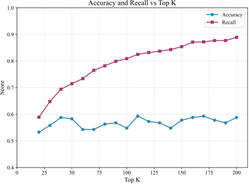
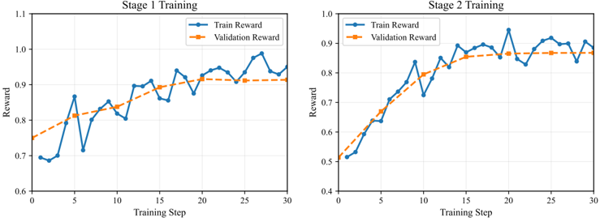

## Context-Picker : Dynamic context selection using multi-stage reinforcement learning

## Siyuan Zhu

## Chengdong Xu

School of Computer Science and Engineering Sun Yat-sen University zhusy58@mail2.sysu.edu.cn

## Kaiqiang Ke

School of Computer Science and Engineering Sun Yat-sen University xuchd6@mail2.sysu.edu.cn

## Chao Yu ∗

School of Computer Science and Engineering Sun Yat-sen University kekq@mail2.sysu.edu.cn

School of Computer Science and Engineering Sun Yat-sen University yuchao3@mail.sysu.edu.cn

## Abstract

In long-context question answering (LCQA), determining the optimal amount of context for a given query is a significant challenge. Including too few passages may omit critical information, while including too many can introduce noise and reduce the quality of the answer. Traditional approaches, such as fixed TopK retrieval and single-stage reranking, face the dilemma of selecting the right number of passages. This problem is particularly pronounced for factoid questions, which often require only a few specific pieces of evidence. To address this issue, we introduce Context-Picker , a reasoning-aware framework that shifts the paradigm from similarity-based ranking to minimal sufficient subset selection. Context-Picker treats context selection as a decision-making process optimized via a human-inspired, two-stage reinforcement learning schedule: a recall-oriented stage that prioritizes the coverage of reasoning chains, followed by a precision-oriented stage that aggressively prunes redundancy to distill a compact evidence set. To resolve reward sparsity, we propose an offline evidence distillation pipeline that mines "minimal sufficient sets" via a Leave-One-Out (LOO) procedure, providing dense, task-aligned supervision. Experiments on five long-context and multi-hop QA benchmarks demonstrate that Context-Picker significantly outperforms strong RAG baselines, achieving superior answer accuracy with comparable or reduced context lengths. Ablation studies indicate that the coarse-to-fine optimization schedule, the redundancy-aware reward shaping, and the rationale-guided format all contribute substantially to these gains.

## 1 Introduction

Retrieval-Augmented Generation (RAG) has become a standard paradigm for extending Large Language Models (LLMs) beyond their parametric knowledge, especially on knowledge-intensive and long-context question answering (LCQA) tasks [Lewis et al., 2021, Guu et al., 2020, Izacard et al., 2022]. By retrieving passages from an external corpus and conditioning generation on them, RAG mitigates hallucination and enables access to up-to-date or domain-specific information. In practice, most systems adopt a simple fixed TopK strategy: a retriever ranks candidate passages and the topK are concatenated and fed to the generator. However, the core design question of how much external context should be retrieved for a given query remains largely underexplored. When K is too small, the model may miss critical evidence and break multi-hop reasoning chains, while an overly large K introduces many weakly related passages, increasing inference cost and degrading answer quality through distractors, attention dilution, and the 'lost-in-the-middle' phenomenon where LLMs under-utilize information placed in the middle of long prompts [Liu et al., 2023]. Moreover, our experiments in Figure 1 show that increasing retrieval depth monotonically improves recall but leaves accuracy almost unchanged, which consistent with recent observations on long-context limitations in RAG [Jin et al., 2024]. This

∗ Corresponding author.

suggests that context handling in LCQA should be viewed not purely as a ranking problem, but as a subset selection problem: for each query, the system should construct a compact, query-specific evidence set that is sufficient for answering the question, rather than a long prefix of a ranked list.

Recent works on retrieval-augmented generation solve this problem from two main directions. One line of methods strengthens the retrieval pipeline while keeping the context size essentially fixed. Classical sparse retrievers and dense dual-encoder retrievers improve the recall and coarse ranking of candidate passages, and are often coupled with cross-encoder or sequence-to-sequence rerankers that refine the fine-grained ordering of documents [Robertson et al., 2009, Karpukhin et al., 2020, Xiong et al., 2020, Nogueira et al., 2020]. More recently, LLM-based rerankers score and prune contexts using queryaware, list-aware, or generator-aware signals [Sun et al., 2024, Chen et al., 2025, Drozdov et al., 2023, Wang et al., 2024, Deng et al., 2025]. These approaches are effective at promoting highly relevant passages in the ranked list and demoting obvious distractors, but the generator still typically consumes either a fixed topK prefix or a set obtained by hand-crafted thresholds, so the fundamental trade-off between missing evidence and accumulating noise remains.



A complementary line of work explicitly adapts the number of retrieved passages . Adaptive-RAG routes each query to

Figure 1: Accuracy vs. retrieval depth (TopK ) in a standard RAG pipeline. Recall increases with K , but answer accuracy does not improve, which is also reported in recent long context studies [Jin et al., 2024].

no-retrieval, single-step, or iterative RAG pipelines based on a learned complexity classifier [Jeong et al., 2024], while adaptivek methods select the cutoff K from the similarity-score distribution of the retrieved candidates without additional model tuning or extra LLM calls [Taguchi et al., 2025]. Although such methods alleviate the mismatch between simple and complex queries, they still rely on heuristic decision rules over per-passage similarity scores, and do not directly optimize for a minimal sufficient evidence subset under a given token budget.

To move beyond fixed heuristics, reinforcement learning (RL) has recently been explored as a way to optimize retrieval and selection policies directly from task feedback while keeping test-time inference to a single policy forward pass. DynamicRAG models the reranker as an RL agent over document sequences and uses LLM-judged answer quality as reward to jointly adjust both the order and the number of retrieved documents [Sun et al., 2025]. Beyond reranking, recent RL-based systems such as Memory-R1 and related memory agents frame long-term memory management and retrieval decisions as RL problems, training policies to decide what to store, update, or retrieve in order to support downstream QA and dialogue [Yan et al., 2025]. RL has also been applied to conversational query reformulation and retrieval alignment and to broader agentic RAG frameworks that optimize multi-step retrieval and reasoning trajectories [Zhu et al., 2025, Xiong et al., 2025, Jiang et al., 2025]. However, existing RL-style approaches still suffer from largely trajectory-level and sparse rewards, which makes it difficult to assign credit to individual passages or penalize redundancy, and they are typically trained to improve list-wise ranking quality or memory operations rather than to identify a minimal evidence subset that preserves answerability under a fixed input budget.

To address these challenges, we introduce Context-Picker , a reasoning-aware framework that fundamentally shifts the context selection paradigm from similarity-based ranking to minimal sufficient subset selection. Instead of treating retrieval as a sorting problem, Context-Picker formulates it as a decision-making process, learning to construct a variable-length evidence set that is strictly necessary for answering the query. Central to our approach is a humaninspired Coarse-to-Fine optimization strategy implemented via a two-stage reinforcement learning schedule. In Stage I (Recall-Oriented), the picker is trained to maximize information with a relaxed redundancy margin, so that all potentially relevant reasoning chains-especially those spanning multiple passages-are captured. In Stage II (Precision-Oriented), the objective shifts to refinement: the policy learns to prune redundant or weakly relevant passages, distilling the context into a compact, noise-free subset without compromising answerability. To stabilize training and alleviate reward sparsity, we introduce an offline evidence distillation pipeline that uses a generator-judge loop with greedy Leave-One-Out (LOO) pruning to mine 'minimal sufficient' evidence sets from raw documents. These distilled sets provide dense, task-aligned supervision, enabling the policy to learn the contribution of each evidence piece. Extensive experiments on five long-context and multi-hop QA benchmarks demonstrate that Context-Picker significantly outperforms strong RAG baselines, achieving superior answer accuracy with comparable or reduced context lengths.

Contributions. Our main contributions are summarized as follows:

- We propose Context-Picker , a reasoning-aware context picker trained with a two-stage reinforcement learning scheme and redundancy-aware reward shaping. The picker jointly decides which passages to keep and how many to include, with a recall-oriented stage for high-coverage picking and a precision-oriented stage for aggressive compression, explicitly addressing the limitations of fixed topK selection in long-context QA.
- We introduce an offline evidence mining pipeline that mines greedily minimal sufficient evidence sets via a generator-judge loop and a leave-one-out pruning procedure, providing high-quality, task-aligned supervision for training the picker.
- We conduct extensive experiments on five long-context and multi-hop QA benchmarks, showing that ContextPicker improves LLM-as-judge accuracy over strong RAG baselines on four datasets and achieves favorable accuracy-efficiency trade-offs on the remaining one, with ablations validating the impact of each key component.

## 2 Preliminaries

## 2.1 Retrieval-Augmented Generation

We follow the standard retrieval-augmented generation (RAG) formulation [Lewis et al., 2021, Guu et al., 2020, Izacard et al., 2022]. Let D denote a large non-parametric corpus (e.g., Wikipedia or a long-term memory store). In long-context QA, each document in D is first segmented into shorter passages ('chunks'), which serve as the retrieval units. Given a query q , a retriever operates over these passages and returns a candidate pool of at most K max passages

<!-- formula-not-decoded -->

optionally refined by a reranker that reorders C ( q ) according to query-specific relevance [Karpukhin et al., 2020, Xiong et al., 2020, Nogueira et al., 2020]. Unless otherwise stated, we use C ( q ) , or simply C when the query is clear from context, to denote this (re)ranked candidate pool. Later, when formulating Context-Picker, we additionally attach a unique identifier to each passage c j and write C = { ( c j , id j ) } N j =1 for convenience.

Context selection. Given C ( q ) , the system must choose a variable-length support set S ⊆ C ( q ) to feed into the generator under an input budget B . We view this as a subset selection problem that trades off task utility and brevity:

<!-- formula-not-decoded -->

where U ( q, S ) is a task utility, Len( S ) measures the size of the support set, λ ≥ 0 controls the quality-brevity trade-off, and Tok( q, S ) counts input tokens. A common baseline uses a fixed topK prefix S = { ˜ c 1 , . . . , ˜ c K } for all queries, which under- or over-includes context depending on query difficulty and can suffer from 'lost in the middle' effects in long prompts [Liu et al., 2023, Jin et al., 2024]. Adaptive strategies instead learn a policy π ϕ ( S | q, C ( q )) that jointly decides which passages to keep and how many to include [Sun et al., 2025, Deng et al., 2025]. Context-Picker builds on this formulation and learns a reasoning-aware policy under a token budget.

Response generation and utility. Given a support set S , we construct a prompt x = Tpl( q, S ) by concatenating instructions, the query, and the selected passages, and use a generator G to define a conditional distribution over answers: p θ ( y | x ) = G ( x ) , from which we decode an answer ˆ y . We instantiate the utility U ( q, S ) in Eq. (2) either with exact-match accuracy or with an LLM-as-judge score that evaluates the semantic correctness of ˆ y w.r.t. the reference answer.

## 2.2 Group Relative Policy Optimization (GRPO)

We view evidence picking as a policy optimization problem. Let o denote an observation which consists of a query q and its candidate pool C ( q ) , and let a denote a discrete action (a set of picked passage IDs). A stochastic policy π ϕ ( a | o ) with parameters ϕ induces the objective

<!-- formula-not-decoded -->

where R ( a, o ) is a task-specific reward.

We used Group Relative Policy Optimization (GRPO) [Shao et al., 2024] to optimize our training goal. For each observation o (e.g., a query and its candidate pool), the policy π ϕ (with a frozen reference policy π ϕ old ) samples a group of G candidate actions { a i } G i =1 ∼ π ϕ old ( · | o ) , and each action receives a scalar reward R i = R ( a i , o ) .

Figure 2: Overview of the Context-Picker framework. The pipeline consists of two parts: (1) Offline Evidence Mining , where a generator-judge loop employs a Leave-One-Out (LOO) strategy to mine minimal sufficient evidence sets ( S gold ) as supervision; and (2) Context-Picker Pipeline , where the picker policy ( π θ ) learns to select evidence from retrieved candidates ( C ). The training follows a Coarse-to-Fine schedule: Stage I optimizes for high recall to capture reasoning chains, while Stage II tightens the redundancy penalty to distill a compact support set, guided by GRPO updates.


The group-normalized advantage for the i -th action is ˆ A i = R i -mean ( { R j } G j =1 ) std ( { R j } G j =1 ) + ϵ , where ϵ is a small constant for numerical stability.

The probability ratio is defined as

<!-- formula-not-decoded -->

Our GRPO objective with decoupled, asymmetric clipping is

<!-- formula-not-decoded -->

where ϵ low , ϵ high &gt; 0 control the asymmetric clipping range and β ≥ 0 controls the KL regularization strength.

## 3 Context-Picker

In this section, we present Context-Picker , our reinforcement learning-based context picker. An overview of the framework is shown in Figure 2. We first formulate context picking as a single-step Markov decision process (MDP) in Section 3.1. We then describe the overall framework, which consists of two components: (i) an offline evidence mining pipeline (Section 3.2) that distills minimal sufficient evidence sets from raw documents, and (ii) a multi-stage reinforcement learning procedure (Section 3.3) that trains a picker policy with a recall-oriented stage followed by a precision-oriented stage. Finally, we detail how the learned picker is integrated with the downstream generator at inference time, and summarize the resulting inference pipeline in Algorithm 3.3.

## 3.1 Problem Formulation

We cast context picking as a single-step decision problem. For each query, a retriever first returns a candidate pool of passages C = { ( c 1 , id 1 ) , ( c 2 , id 2 ) , . . . , ( c N , id N ) } , where c j is a candidate passage and id j is its unique identifier. Together with the query q and a stage-specific instruction prompt p i , this defines the observation o = ⟨ p i , q, C⟩ .

The action space consists of subsets of candidate identifiers. Concretely, the policy outputs a structured response output = ⟨ r, a ⟩ , where r is a rubric-guided natural-language rationale and a = { id i 1 , id i 2 , . . . , id i k } ⊆ { id 1 , . . . , id N } is the selected subset of IDs. The corresponding support set fed to the downstream generator is

<!-- formula-not-decoded -->

which ensures end-to-end consistency between the picker and the generator.

We constrain the action space so that a is a valid, duplicate-free subset of candidate IDs; malformed or out-of-range selections are treated as invalid actions and receive format penalties in the reward. This discrete subset-based formulation matches the nature of evidence picking and serves as the MDP on which we apply GRPO-based training in the following subsections.

Given an observation-action pair ( o, a ) with support set S and an offline-mined golden evidence set S gold (Section 3.2), the stagei reward takes the abstract form

<!-- formula-not-decoded -->

where Cov measures how well S covers the golden evidence, Redun penalizes over-long or redundant selections in a stage-dependent manner, and the last term discourages invalid outputs. In Section 3.3 we instantiate (6) with a concrete design based on Cov and a normalized redundancy penalty (cf. Eq. (8)).

## 3.2 Data Curation

Offline evidence mining. To construct high-quality training data for Context-Picker, we introduce an offline evidence distillation pipeline. Each document D is first segmented into semantically coherent chunks via semantic chunking, which ensures that each chunk forms a locally consistent unit while preserving contextual continuity. This corresponds to the Offline Evidence Mining module on the left side of Figure 2, and the overall procedure is summarized in Algorithm 1.

For each query-answer pair ( q, a ) , we perform retrieval using BM25 on the concatenation of the query and answer, i.e., on [ q ; a ] against the chunked document. The topk retrieved chunks constitute an initial candidate set S cand. We then run an answer-judge pipeline on S cand: a generator G produces a response ˆ a conditioned on ( q, S cand ) , and an LLM-based judge J decides whether ˆ a semantically matches the gold answer a . If J deems S cand insufficient (i.e., the answer is judged as incorrect), we discard this pair, since the retrieved evidence does not support a correct answer even before pruning.

For the remaining pairs, we greedily prune redundant chunks via a leave-one-out (LOO) procedure. We initialize S suf ←S cand and iterate over chunks c ∈ S suf. For each c , we temporarily remove it to form S ′ = S suf \ { c } , run the same answer-judge pipeline on ( q, S ′ ) , and obtain a new judge decision. If J still marks the answer as correct, we treat c as redundant and permanently drop it, updating S suf ←S ′ . We repeat this LOO pruning until no chunk can be removed without flipping the judge decision from correct to incorrect. The resulting set S suf is thus a greedily minimal sufficient evidence set with respect to the judge: every remaining chunk is empirically necessary in the sense that removing any of them would cause the model to fail the judge. We treat S suf as the golden evidence supervision for training Context-Picker.

Data augmentation. Considered that most long-context QA or retrieval datasets contain relatively few unique queries, we introduce lightweight query rewriting to enhance data diversity. For each original query q , we generate five semantically equivalent but lexically diverse reformulations { q ′ i } 5 i =1 using a language model. These rewrites preserve the meaning of the original query while varying in phrasing and focus, which helps improve linguistic diversity and reduces overfitting during RL training. During data partitioning, all rewrites of the same query are assigned to the same subset to prevent data leakage between training and evaluation data.

This curated dataset, consisting of golden evidence picks and diverse query formulations, serves as the foundation for the reinforcement learning phase of Context-Picker.

## 3.3 Multi-stage Reinforcement Learning

Using the curated training set from Section 3.2, this subsection describes the two-stage policy optimization component of Context-Picker, which corresponds to the right part of Figure 2; the detailed GRPO-based training loop is given in Algorithm 2.

In long-context question answering (LCQA), the challenges of what evidence to pick and how much evidence to pick are essentially a coupled combinatorial optimization problem. Selecting too few pieces of evidence risks missing key reasoning hops, while selecting too many introduces noise and attention dilution. Static strategies, such as fixed TopK sampling or single-stage reranking, struggle to simultaneously ensure recall sufficiency and input compactness.

As is shown in Figure 2, we decouple this problem into two training stages: a recall-oriented stage that emphasizes comprehensive evidence coverage, and a refinementoriented stage that focuses on minimal sufficient selection.

StageI: Recall-oriented strategy optimization. Stage I is designed to learn a high-recall picking behavior that prioritizes information completeness . In our setting, the downstream generator can answer a query correctly as long as the selected context set contains the key evidence that supports the reasoning chain. We formalize this notion via the offline-mined minimal sufficient evidence set S gold (Section 3.2), which approximates the smallest

## Algorithm 1: Offline Evidence Mining

Input:

Document D ; query q ; gold answer a ; retriever R ; encoder f emb; generator G ; answer judge J ; topk .

```
Output: Minimal sufficient set S suf . C ← Chunk ( D ; f emb ) x ← [ q ; a ] S cand ← RetrieveTopK ( x, C ; R , k ) ˆ a ←G ( q, S cand ) r full ←J ( q, ˆ a, a ) if r full = 0 then return ∅ end S suf ←S cand changed ← True while changed do changed ← False foreach c ∈ S suf do S ′ ←S suf \ { c } ˆ a ′ ←G ( q, S ′ ) r ′ ←J ( q, ˆ a ′ , a ) if r ′ = 1 then S suf ←S ′ changed ← True end end end return S suf
```

subset that preserves answerability under an LLM-based judge.

Stage I thus encourages the policy to maximize Cov( S , S gold ) with a relaxed redundancy tolerance red 1 (Eq. 8), allowing moderate over-selection. This is crucial for multi-hop QA: missing even a single hop in the evidence chain can cause a failure, whereas including a few extra passages is often harmless at this stage. By emphasizing coverage and using a loose redundancy margin, Stage I prevents premature pruning and improves exploration over the combinatorial subset space, yielding a robust high-recall initialization for later compression.

Stage II: Refinement-oriented strategy optimization. Stage II targets input conciseness while preserving sufficiency, i.e., converging to a minimal sufficient evidence set . Starting from the high-recall policy learned in Stage I, we tighten the redundancy margin to red 2 &lt; red 1 and strengthen the redundancy penalty in the reward (Eq. 8), so the policy is explicitly discouraged from keeping passages that do not improve answerability. Intuitively, Stage II pushes the picker toward solving a constrained compression problem:

<!-- formula-not-decoded -->

where U ( q, S ) is approximated during training by the distilled supervision S gold and instantiated as coverage-plusredundancy shaping in Eq. (8). Operationally, Stage II encourages the policy to keep sets that (i) retain near-complete coverage of S gold (high recall), yet (ii) eliminate redundant, repetitive, or weakly relevant passages so as to reduce distractors and mitigate long-context degradation. As a result, the learned picker progressively shifts from a recallsufficient regime to a precision-sufficient regime, producing compact evidence subsets that maximize informativeness under a fixed token budget.

The reward function is defined as:

<!-- formula-not-decoded -->

where i is training stage and Cov( S , S gold ) = |S∩S gold | |S gold | . The reward logic follows three principles:

## Algorithm 2: Two-stage GRPO training of Context-Picker

```
Input: Training set D = { ( q, C , S gold ) } ; initial policy π θ ; stage prompts { p 1 , p 2 } ; redundancy margins { red 1 , red 2 } ; group size K ; iterations { T 1 , T 2 } . Output: Trained picker policy π θ . Initialize reference policy π θ old ← π θ . for i ∈ { 1 , 2 } do for t = 1 to T i do Sample a mini-batch B ⊂ D . Initialize an empty set of GRPO training examples G ← ∅ . foreach ( q, C , S gold ) ∈ B do Construct observation o ←⟨ p i , q, C⟩ . Sample a group of K actions {S 1 , . . . , S K } from π θ old ( · | o ) . For each S j , compute reward r j ← R ( S j , o ; S gold , red i ) using Eq. (8). Add the group ( o, {S j , r j } K j =1 ) into G . Update policy parameters θ using GRPO on G according to Eq. (5). π θ old ← π θ return π θ
```

- When the output format is valid and the number of selected items does not exceed the 'gold standard + redundancy margin,' the reward is determined by recall rate with a redundancy penalty proportional to oversampling.
- When the selection exceeds the redundancy margin, the reward is set to zero, discouraging excessive evidence inclusion.
- When the output format is invalid, a fixed penalty of -1 . 0 is applied to enforce structural correctness.

Progressive redundancy compression. The key distinction between the two stages lies in the dynamic compression of the redundancy margin red. Stage I employs a relaxed margin red 1 to tolerate redundancy for completeness, whereas Stage II tightens the threshold to red 2 , forcing the policy to eliminate redundant evidence while maintaining high recall. This 'loose-to-tight' margin adaptation achieves a smooth optimization from recall sufficiency to input compactness , enabling a Pareto-optimal trade-off between comprehensiveness and efficiency in LCQA.

Stage transition and schedule. We implement the two stages as consecutive GRPO phases over the same curated dataset. In Algorithm 2, the hyperparameters T 1 and T 2 control the number of GRPO update steps spent in the recall-oriented Stage I and the refinement-oriented Stage II, respectively. In practice, we first train the picker with the Stage I reward (larger redundancy margin red 1 ) until the validation reward curve plateaus, and then switch to Stage II by continuing training from the Stage I checkpoint with the tighter margin red 2 . We found that Context-Picker is robust to the exact split between T 1 and T 2 as long as Stage I is given enough updates to learn a high-recall policy; the resulting training dynamics for both stages are shown in Figure 3.

Inference. At test time, Context-Picker runs in a single-pass retrieve-pick-generate pipeline. Given a question q and a long document D , we first segment D into semantically coherent chunks using the same chunker as in training: C ← Chunk ( D ; f emb ) . We then build a candidate pool by retrieving the most relevant chunks to q , optionally truncating the pool so that the picker input fits within a budget: C cand ← TopSim ( q, C ; B ) . Next, we construct the picker observation o = ⟨ p test , q, C cand ⟩ and sample the picker output from the learned policy π θ : { r, S } ∼ π θ ( · | o ) , where r is a rubric-guided rationale and S is the set of selected chunk identifiers. The final evidence set is obtained by filtering the candidate pool by the selected IDs, C pick ←{ c j ∈ C cand : id j ∈ S } , and the downstream generator produces the answer conditioned on the picked evidence: ˆ a ←G ( q, C pick ) . For evaluation, we additionally report an LLM-as-judge score by comparing ˆ a against the reference answer (Section 4).

## 4 Experiments

## 4.1 Experimental Setup

Datasets. We evaluate Context-Picker on five knowledge-intensive QA benchmarks that require reasoning over long or multi-hop contexts: (1) LoCoMo [Maharana et al., 2024], which contains extremely long multi-session conversations

Figure 3: Training dynamics of Context-Picker using GRPO. The curves visualize the average reward trajectories on training and validation sets during (Left) the Recall-Oriented Stage I and (Right) the Precision-Oriented Stage II. Both stages exhibit stable convergence and a narrow gap between training and validation rewards, indicating that the policy effectively learns to balance evidence coverage and compactness without overfitting.



and tests long-term conversational memory; (2) MultiFieldQA [Jiang et al., 2024], a long-context QA dataset with diverse domains and relatively factoid-style questions; (3) HotpotQA [Yang et al., 2018], a classic multi-hop QA benchmark over Wikipedia; (4) 2WikiMQA [Ho et al., 2020], a multi-hop QA dataset requiring reasoning across two Wikipedia articles; and (5) MuSiQue [Trivedi et al., 2022], which decomposes multi-hop questions into compositional single-hop subquestions. For datasets in LongBench [Bai et al., 2024] that do not come with ground-truth evidence annotations, we apply the offline evidence mining procedure in Algorithm 1 to construct training labels. Concretely, we first perform semantic chunking over each long document using text-embedding-ada-002 with a similarity threshold of 0 . 75 , and then mine sufficient and golden evidence sets for each ( q, a ) pair.

Models and baselines. Unless otherwise specified, Context-Picker is instantiated with Qwen3-8B as the picker backbone. For answer generation, we use Qwen3-32B as the generator model, and adopt GPT-4o-mini as an LLMas-judge evaluator. Concretely, given a question q and its candidate contexts, the picker selects a subset of evidence; the generator then produces an answer conditioned on q and the selected evidence; finally, the judge model scores the predicted answer against the reference. We deliberately use different model families for generation and evaluation to mitigate overestimation bias when a model family evaluates its own outputs [Panickssery et al., 2024].

As baselines, we consider: (i) a non-retrieval LLM (Qwen3-8B) that directly consumes the raw document by concatenating q with as much of the context as fits into its input window, without any retrieval or selection module; and (ii) a vanilla RAG pipeline, where a retriever returns topK passages that are directly concatenated and fed into the generator. For RAG we employ a strong dense retriever and report results for K ∈ { 5 , 10 } (and K = 100 on LoCoMo), which roughly match the average number of passages selected by Context-Picker under our token budget.

Evaluation protocol. Traditional metrics such as exact match (EM) and F1 are known to be brittle for free-form answers. For example, the answers 'The cat is on the mat.' and 'A cat rests on a mat.' convey essentially the same meaning but would receive a low EM/F1 score due to lexical differences, whereas 'The cat is on the mat.' and 'The dog is on the mat.' share substantial n-gram overlap while being factually incompatible. Following recent work on LLM-based evaluation [Gu et al., 2025], we thus adopt an LLM-as-judge protocol as our primary metric. Given a question q , a reference answer a ⋆ , and a predicted answer ˆ a , a judge model returns a binary correctness label:

<!-- formula-not-decoded -->

based on a rubric that checks semantic equivalence to a ⋆ and penalizes hallucinations or contradictions. We report the fraction of examples for which the judge predicts correctness, referred to as Judge Acc .

## 4.2 Main Results

Table 1 summarizes the main results across the five benchmarks.

Comparison with LLM-only and RAG baselines. Across all datasets, both stages of Context-Picker substantially outperform the non-retrieval LLM baseline, confirming that external evidence is crucial for long-context and multi-hop

Table 1: Main results on knowledge-intensive QA benchmarks. We report Judge Acc (higher is better). Best per column is in bold .

| Method                             | LoCoMo           | MultiFieldQA                   | HotpotQA                       | 2WikiMQA                       | MuSiQue                        |
|------------------------------------|------------------|--------------------------------|--------------------------------|--------------------------------|--------------------------------|
| LLM (Qwen3-8B, no retrieval)       | 0.566            | 0.833                          | 0.661                          | 0.389                          | 0.280                          |
| RAG (Qwen3-8B)                     | 0.622 (TopK=100) | 0.857 (TopK=5) 0.857 (TopK=10) | 0.597 (TopK=5) 0.700 (TopK=10) | 0.525 (TopK=5) 0.560 (TopK=10) | 0.340 (TopK=5) 0.390 (TopK=10) |
| Context-Picker, Stage 1 (Qwen3-8B) | 0.681            | 0.873                          | 0.741                          | 0.621                          | 0.476                          |
| Context-Picker, Stage 2 (Qwen3-8B) | 0.706            | 0.825                          | 0.747                          | 0.702                          | 0.522                          |

QA and that simply relying on parametric knowledge is insufficient in these settings. Even the recall-oriented Stage I, which tolerates some redundancy, already yields sizable gains over the plain LLM.

When compared under comparable evidence budgets, Context-Picker also brings consistent improvements over the vanilla RAG pipeline on most datasets. On LoCoMo, HotpotQA, 2WikiMQA, and MuSiQue, Stage 2 delivers the best overall performance, exceeding the strongest RAG baseline by +4 -18 points in Judge Acc. On MultiFieldQA, the recall-oriented Stage 1 slightly surpasses RAG (0.873 vs. 0.857), while Stage 2 trades a small drop in accuracy (0.825) for more compact inputs. These results suggest that, beyond a strong retriever, adaptively deciding which passages to keep and how many to include per query is beneficial: Context-Picker improves answer quality without simply increasing the number of passages and often reduces prompt overhead.

Effect of the two-stage schedule. The two-stage training scheme yields a clear pattern. Stage I, which uses a relaxed redundancy margin and emphasizes high recall, is particularly helpful on datasets where evidence is dispersed or conversations are long. Stage II, which tightens the redundancy penalty to favor minimal sufficient sets, further improves accuracy on four out of five benchmarks while also shortening the selected contexts. This supports our hypothesis that gradually shifting the objective from recall to precision leads to a better quality-efficiency trade-off than optimizing a single-stage objective.

Training stability. Reinforcement learning on discrete text selection is often characterized by instability. However, thanks to our dense reward supervision mined via LOO and the GRPO algorithm, Context-Picker demonstrates robust training dynamics. As illustrated in Figure 3, the reward curves for both the Recall-Oriented Stage I (Left) and Precision-Oriented Stage II (Right) show steady convergence. The minimal gap between training and validation performance further validates the generalization capability of our offline evidence mining strategy.

## 4.3 Ablation Studies

To better understand which components of Context-Picker drive the gains, we conduct ablations on the LoCoMo dataset. We focus on three aspects: rationale generation, redundancy-aware reward shaping, and the recall-oriented Stage I.

Rationale generation. In the full model, the picker outputs both a short natural-language rationale and a set of selected IDs. Removing the rationale branch ('w/o rationale') leads to a 6 . 5 -point drop in Judge Acc and noticeably higher variance across runs. We hypothesize that requiring the model to verbalize why certain passages are selected acts as a structural regularizer: it encourages more stable reasoning over evidence interactions and reduces the tendency to over-select loosely related passages.

Redundancy-aware reward shaping. When we remove the redundancy term in the reward ('w/o redundancy'), the picker no longer receives explicit penalties for overshooting the golden set size. Under the same token budget, this variant tends to keep more passages and accumulates noise, resulting in a 4 . 6 -point drop on LoCoMo. This confirms that explicitly modeling length/redundancy in the reward is important for achieving a good balance between recall and precision, rather than relying solely on an implicit budget constraint.

Role of the recall-oriented Stage I. Finally, we examine a variant trained only with the Stage II objective ('w/o Stage 1'), i.e., directly optimizing the refinement-oriented reward from scratch. This leads to a substantial degradation to 56 . 5% Judge Acc, 14 . 1 points below the full two-stage Context-Picker. Qualitatively, this variant tends to converge to over-pruned policies that miss key evidence, suggesting that the recall-oriented warm-up in Stage I is crucial for

Table 2: Ablation study of Context-Picker on LoCoMo . ∆ denotes absolute drops in Judge Acc (percentage points) compared to the full model.

| Method                |   Judge Acc (%) | ∆ vs. full   |
|-----------------------|-----------------|--------------|
| Context-Picker (full) |            70.6 | -            |
| w/o rationale         |            64.1 | - 6 . 5      |
| w/o redundancy        |            66   | - 4 . 6      |
| w/o Stage 1           |            56.5 | - 14 . 1     |

exploring a diverse evidence space before learning to compress it. Taken together, the ablations show that both the redundancy-aware reward and the staged optimization scheme are necessary to realize the full benefits of Context-Picker.

## 5 Related Works

## 5.1 Adaptive Retrieval and Context Optimization

Standard RAG systems typically retrieve a fixed topK set of passages using sparse or dense retrievers [Robertson et al., 2009, Karpukhin et al., 2020, Lewis et al., 2021, Izacard et al., 2022], often combined with cross-encoder or sequence-to-sequence rerankers such as monoT5 to improve ordering quality [Nogueira et al., 2020, Sun et al., 2024, Drozdov et al., 2023, Chen et al., 2025]. While this 'retrieve-then-rerank' architecture substantially improves recall and ranking, it still relies on a static K for downstream generation. As a result, complex multi-hop questions may suffer from missing evidence when K is small, whereas simple factoid queries incur unnecessary noise and cost when K is large, exacerbating long-context issues such as distractor accumulation and the 'lost-in-the-middle' effect [Liu et al., 2023, Jin et al., 2024]. Recent analyses of long-context RAG pipelines further show that simply increasing the number of retrieved passages often yields higher recall but only marginal or even negative gains in answer accuracy [Jiang et al., 2024, Jin et al., 2024].

To overcome the rigidity of fixed-size retrieval, a series of works have explored more adaptive strategies. Self-RAG [Asai et al., 2023] trains a single LM augmented with reflection tokens to decide, segment by segment, when to retrieve, when to critique evidence, and when to continue generation. FLARE [Jiang et al., 2023a] performs active retrieval by monitoring low-confidence tokens and issuing retrieval queries only when the model anticipates future uncertainty. Adaptive-RAG [Jeong et al., 2024] introduces a query-complexity classifier that routes questions to no-retrieval, single-step, or iterative RAG pipelines, and Adaptivek chooses the number of selected passages from the similarity-score distribution of candidates without additional tuning or iteration [Taguchi et al., 2025]. These methods show that adjusting when and how much to retrieve can improve overall QA performance, but they typically require multiple rounds of retrieval and generation or rely on hand-crafted decision rules rather than an explicitly learned selection policy under a token budget.

Another line of work targets the context side of the pipeline via compression . LLMLingua [Jiang et al., 2023b] uses a smaller model to score and remove non-essential tokens inside prompts, yielding substantial speedups while preserving task performance. RECOMP [Xu et al., 2023] compresses retrieved documents into concise textual summaries before feeding them to the generator, reducing both prompt length and the burden on the LM to locate relevant information. These approaches operate primarily at the token or sentence level and focus on shrinking a given context, without explicitly reasoning about which subset of passages is minimally sufficient for answering the query.

Complementary to these advances, several works study context selection from a scoring perspective. Query-aware and list-aware rerankers use LLMs or specialized models to assign relevance scores to passages individually or jointly, sometimes with list-wise prompting that considers redundancy and coverage [Sun et al., 2024, Chen et al., 2025]. Generator-aware metrics evaluate how well candidate contexts align with the generator's internal knowledge or its preferences via reward models trained from LLM feedback [Wang et al., 2024]. Influence-guided selection goes one step further and defines a leave-one-out style Contextual Influence Value that measures performance degradation when removing each passage [Deng et al., 2025]. However, most of these methods still operate at the level of per-passage utilities plus thresholding, and are not designed to directly optimize for a minimal sufficient subset under a strict input budget.

## 5.2 Reinforcement Learning for Evidence Selection

Reinforcement learning (RL) has been widely used to align retrieval-augmented systems with downstream tasks. Early work applied RL to optimize query reformulation, where an agent learns to rewrite user queries to better exploit a fixed

retrieval module [Zhu et al., 2025], or to train retrievers end-to-end with task feedback, as in REALM-style frameworks that update both the encoder and retriever to maximize QA reward [Guu et al., 2020]. These approaches improve the quality of retrieved candidates, but still leave the final context selection to static TopK heuristics or simple truncation.

More recent approaches bring RL or RL-inspired feedback closer to the evidence and memory selection step itself. DynamicRAG[Sun et al., 2025] models the reranker as an agent over document sequences and trains it with a combination of supervised fine-tuning and RL, using LLM-judged answer quality as reward to adjust both the order and the number of retrieved documents. Memory-R1 and related memory agents frame long-term memory management and retrieval decisions as RL problems, training policies to decide what to store, update, or retrieve in order to support downstream QA and dialogue over very long conversational histories [Yan et al., 2025, Maharana et al., 2024]. RL has also been applied to conversational query reformulation and retrieval alignment and to broader agentic RAG frameworks such as RAG-Gym and REX-RAG, which optimize multi-step retrieval and reasoning trajectories with policy-gradient-style updates [Zhu et al., 2025, Xiong et al., 2025, Jiang et al., 2025]. Influence-guided context selection [Deng et al., 2025] employs a generator-judge loop to estimate each passage's marginal influence via leave-one-out utilities and then trains a surrogate selector to approximate these influence scores.

While these RL-style or RL-adjacent approaches introduce valuable task-aligned signals, they still face two key challenges for context selection: (i) rewards are largely trajectory-level and sparse , as the agent receives only a scalar signal after producing a full list or trajectory, making credit assignment to individual passages and redundancy penalties difficult; and (ii) policies are typically optimized to improve list-wise ranking quality, to include all positively-scored contexts, or to manage memory operations, rather than to identify a minimal evidence subset that preserves answerability under a fixed input budget. In contrast, Context-Picker is trained on offline-mined minimal sufficient evidence sets and uses a two-stage, redundancy-aware GRPO objective to explicitly trade off coverage and compactness at the passage subset level.

## 6 Conclusion

In this work, we presented Context-Picker , a reasoning-aware framework that learns a variable-length evidence set under a token budget. Context-Picker combines (i) an offline evidence mining pipeline that distills greedily minimal sufficient evidence sets via a generator-judge loop with Leave-One-Out (LOO) pruning, providing dense and task-aligned supervision; and (ii) a two-stage reinforcement learning schedule optimized with GRPO, where Stage I (recall-oriented) emphasizes coverage of reasoning chains with a relaxed redundancy margin, and Stage II (precision-oriented) tightens redundancy penalties to prune distractors and distill compact support sets. The picker further outputs a rubric-guided rationale together with selected passage IDs, enabling structured, end-to-end consistent evidence selection.

Experiments on five long-context and multi-hop QA benchmarks demonstrate that Context-Picker outperforms strong RAG baselines under comparable evidence budgets, achieving higher LLM-as-judge accuracy while often with comparable or reduced context lengths. Ablation studies further verify that the coarse-to-fine schedule, redundancyaware reward shaping, and rationale-guided output format each contribute substantially to the gains, and that removing Stage I leads to severe over-pruning and degraded performance. Future work may include extending Context-Picker to more open-ended generation tasks, exploring alternative reward signals beyond LLM-as-judge, and integrating the picker with token- or KV-level compression inside the generator to further reduce inference cost.

## 7 Acknowledgement

We gratefully acknowledge the support from the Distinguished Young Scholars Project funded by the Natural Science Foundation of Guangdong Province (No. 2025B1515020060), the Basic and Applied Basic Research Program of the Guangzhou Science and Technology Plan (No. 2025A04J7141).

## References

Patrick Lewis, Ethan Perez, Aleksandra Piktus, Fabio Petroni, Vladimir Karpukhin, Naman Goyal, Heinrich Küttler, Mike Lewis, Wen tau Yih, Tim Rocktäschel, Sebastian Riedel, and Douwe Kiela. Retrieval-augmented generation for knowledge-intensive nlp tasks, 2021. URL https://arxiv.org/abs/2005.11401 .

Kelvin Guu, Kenton Lee, Zora Tung, Panupong Pasupat, and Ming-Wei Chang. Realm: Retrieval-augmented language model pre-training, 2020. URL https://arxiv.org/abs/2002.08909 .

Gautier Izacard, Patrick Lewis, Maria Lomeli, Lucas Hosseini, Fabio Petroni, Timo Schick, Jane Dwivedi-Yu, Armand Joulin, Sebastian Riedel, and Edouard Grave. Atlas: Few-shot learning with retrieval augmented language models, 2022. URL https://arxiv.org/abs/2208.03299 .

| Nelson F. Liu, Kevin Lin, John Hewitt, Ashwin Paranjape, Michele Bevilacqua, Fabio Petroni, and Percy Liang. Lost in the middle: How language models use long contexts, 2023. URL https://arxiv.org/abs/2307.03172 .                                                                                                                                                                                                                                                                                                        |
|-----------------------------------------------------------------------------------------------------------------------------------------------------------------------------------------------------------------------------------------------------------------------------------------------------------------------------------------------------------------------------------------------------------------------------------------------------------------------------------------------------------------------------|
| Bowen Jin, Jinsung Yoon, Jiawei Han, and Sercan O. Arik. Long-context llms meet rag: Overcoming challenges for long inputs in rag, 2024. URL https://arxiv.org/abs/2410.05983 .                                                                                                                                                                                                                                                                                                                                             |
| Robertson, Stephen, and Hugo Zaragoza. The probabilistic relevance framework: Bm25 and beyond. Foundations and Trends in Information Retrieval , 3(4):333-389, 2009. doi:10.1561/1500000019.                                                                                                                                                                                                                                                                                                                                |
| Vladimir Karpukhin, Barlas Oguz, Sewon Min, Patrick Lewis, Ledell Wu, Sergey Edunov, Danqi Chen, and Wen- tau Yih. Dense passage retrieval for open-domain question answering. In Bonnie Webber, Trevor Cohn, Yulan He, and Yang Liu, editors, Proceedings of the 2020 Conference on Empirical Methods in Natural Language Processing (EMNLP) , pages 6769-6781, Online, November 2020. Association for Computational Linguistics. doi:10.18653/v1/2020.emnlp-main.550. URL https://aclanthology.org/2020.emnlp-main.550/ . |
| Lee Xiong, Chenyan Xiong, Ye Li, Kwok-Fung Tang, Jialin Liu, Paul Bennett, Junaid Ahmed, and Arnold Overwijk. Approximate nearest neighbor negative contrastive learning for dense text retrieval, 2020. URL https://arxiv. org/abs/2007.00808 .                                                                                                                                                                                                                                                                            |
| Rodrigo Nogueira, Zhiying Jiang, and Jimmy Lin. Document ranking with a pretrained sequence-to-sequence model, 2020. URL https://arxiv.org/abs/2003.06713 .                                                                                                                                                                                                                                                                                                                                                                 |
| Weiwei Sun, Lingyong Yan, Xinyu Ma, Shuaiqiang Wang, Pengjie Ren, Zhumin Chen, Dawei Yin, and Zhaochun Ren. Is chatgpt good at search? investigating large language models as re-ranking agents, 2024. URL https: //arxiv.org/abs/2304.09542 .                                                                                                                                                                                                                                                                              |
| Haotian Chen, Qingqing Long, Meng Xiao, Xiao Luo, Wei Ju, Chengrui Wang, Xuezhi Wang, Yuanchun Zhou, and Hengshu Zhu. Scirerankbench: Benchmarking rerankers towards scientific retrieval-augmented generated llms, 2025. URL https://arxiv.org/abs/2508.08742 .                                                                                                                                                                                                                                                            |
| Andrew Drozdov, Honglei Zhuang, Zhuyun Dai, Zhen Qin, Razieh Rahimi, Xuanhui Wang, Dana Alon, Mohit Iyyer, Andrew McCallum, Donald Metzler, and Kai Hui. Parade: Passage ranking using demonstrations with large language models, 2023. URL https://arxiv.org/abs/2310.14408 .                                                                                                                                                                                                                                              |
| Liang Wang, Nan Yang, and Furu Wei. Learning to retrieve in-context examples for large language models, 2024. URL https://arxiv.org/abs/2307.07164 .                                                                                                                                                                                                                                                                                                                                                                        |
| Jiale Deng, Yanyan Shen, Ziyuan Pei, Youmin Chen, and Linpeng Huang. Influence guided context selection for effective retrieval-augmented generation, 2025. URL https://arxiv.org/abs/2509.21359 .                                                                                                                                                                                                                                                                                                                          |
| Soyeong Jeong, Jinheon Baek, Sukmin Cho, Sung Ju Hwang, and Jong C. Park. Adaptive-rag: Learning to adapt retrieval-augmented large language models through question complexity, 2024. URL https://arxiv.org/abs/ 2403.14403 .                                                                                                                                                                                                                                                                                              |
| Chihiro Taguchi, Seiji Maekawa, and Nikita Bhutani. Efficient context selection for long-context qa: No tuning, no iteration, just adaptive- k , 2025. URL https://arxiv.org/abs/2506.08479 .                                                                                                                                                                                                                                                                                                                               |
| Jiashuo Sun, Xianrui Zhong, Sizhe Zhou, and Jiawei Han. Dynamicrag: Leveraging outputs of large language model as feedback for dynamic reranking in retrieval-augmented generation, 2025. URL https://arxiv.org/abs/2505. 07233 .                                                                                                                                                                                                                                                                                           |
| Sikuan Yan, Xiufeng Yang, Zuchao Huang, Ercong Nie, Zifeng Ding, Zonggen Li, Xiaowen Ma, Kristian Kersting, Jeff Z. Pan, Hinrich Schütze, Volker Tresp, and Yunpu Ma. Memory-r1: Enhancing large language model agents to manage and utilize memories via reinforcement learning, 2025. URL https://arxiv.org/abs/2508.19828 .                                                                                                                                                                                              |
| Changtai Zhu, Siyin Wang, Ruijun Feng, Kai Song, and Xipeng Qiu. Convsearch-r1: Enhancing query reformulation for conversational search with reasoning via reinforcement learning, 2025. URL https://arxiv.org/abs/2505. 15776 .                                                                                                                                                                                                                                                                                            |
| Guangzhi Xiong, Qiao Jin, Xiao Wang, Yin Fang, Haolin Liu, Yifan Yang, Fangyuan Chen, Zhixing Song, Dengyu Wang, Minjia Zhang, Zhiyong Lu, and Aidong Zhang. Rag-gym: Systematic optimization of language agents for retrieval-augmented generation, 2025. URL https://arxiv.org/abs/2502.13957 .                                                                                                                                                                                                                           |
| Wentao Jiang, Xiang Feng, Zengmao Wang, Yong Luo, Pingbo Xu, Zhe Chen, Bo Du, and Jing Zhang. Rex-rag: Reasoning exploration with policy correction in retrieval-augmented generation, 2025. URL https://arxiv.org/ abs/2508.08149 .                                                                                                                                                                                                                                                                                        |
| Zhihong Shao, Peiyi Wang, Qihao Zhu, Runxin Xu, Junxiao Song, Xiao Bi, Haowei Zhang, Mingchuan Zhang, Y. K. Li, Y. Wu, and Daya Guo. Deepseekmath: Pushing the limits of mathematical reasoning in open language models, 2024. URL https://arxiv.org/abs/2402.03300 .                                                                                                                                                                                                                                                       |

| Adyasha Maharana, Dong-Ho Lee, Sergey Tulyakov, Mohit Bansal, Francesco Barbieri, and Yuwei Fang. Evaluating very long-term conversational memory of llm agents, 2024. URL https://arxiv.org/abs/2402.17753 .                                                                            |
|------------------------------------------------------------------------------------------------------------------------------------------------------------------------------------------------------------------------------------------------------------------------------------------|
| Ziyan Jiang, Xueguang Ma, and Wenhu Chen. Longrag: Enhancing retrieval-augmented generation with long-context llms, 2024. URL https://arxiv.org/abs/2406.15319 .                                                                                                                         |
| Zhilin Yang, Peng Qi, Saizheng Zhang, Yoshua Bengio, William W. Cohen, Ruslan Salakhutdinov, and Christopher D. Manning. Hotpotqa: A dataset for diverse, explainable multi-hop question answering, 2018. URL https: //arxiv.org/abs/1809.09600 .                                        |
| Xanh Ho, Anh-Khoa Duong Nguyen, Saku Sugawara, and Akiko Aizawa. Constructing a multi-hop qa dataset for comprehensive evaluation of reasoning steps, 2020. URL https://arxiv.org/abs/2011.01060 .                                                                                       |
| Harsh Trivedi, Niranjan Balasubramanian, Tushar Khot, and Ashish Sabharwal. Musique: Multihop questions via single-hop question composition, 2022. URL https://arxiv.org/abs/2108.00573 .                                                                                                |
| Yushi Bai, Xin Lv, Jiajie Zhang, Hongchang Lyu, Jiankai Tang, Zhidian Huang, Zhengxiao Du, Xiao Liu, Aohan Zeng, Lei Hou, Yuxiao Dong, Jie Tang, and Juanzi Li. Longbench: A bilingual, multitask benchmark for long context understanding, 2024. URL https://arxiv.org/abs/2308.14508 . |
| Arjun Panickssery, Samuel R. Bowman, and Shi Feng. Llm evaluators recognize and favor their own generations, 2024. URL https://arxiv.org/abs/2404.13076 .                                                                                                                                |
| Jiawei Gu, Xuhui Jiang, Zhichao Shi, Hexiang Tan, Xuehao Zhai, Chengjin Xu, Wei Li, Yinghan Shen, Shengjie Ma, Honghao Liu, Saizhuo Wang, Kun Zhang, Yuanzhuo Wang, Wen Gao, Lionel Ni, and Jian Guo. A survey on llm-as-a-judge, 2025. URL https://arxiv.org/abs/2411.15594 .           |
| Akari Asai, Zeqiu Wu, Yizhong Wang, Avirup Sil, and Hannaneh Hajishirzi. Self-rag: Learning to retrieve, generate, and critique through self-reflection, 2023. URL https://arxiv.org/abs/2310.11511 .                                                                                    |
| Zhengbao Jiang, Frank F. Xu, Luyu Gao, Zhiqing Sun, Qian Liu, Jane Dwivedi-Yu, Yiming Yang, Jamie Callan, and Graham Neubig. Active retrieval augmented generation, 2023a. URL https://arxiv.org/abs/2305.06983 .                                                                        |
| Huiqiang Jiang, Qianhui Wu, Chin-Yew Lin, Yuqing Yang, and Lili Qiu. Llmlingua: Compressing prompts for accelerated inference of large language models, 2023b. URL https://arxiv.org/abs/2310.05736 .                                                                                    |
| Fangyuan Xu, Weijia Shi, and Eunsol Choi. Recomp: Improving retrieval-augmented lms with compression and selective augmentation, 2023. URL https://arxiv.org/abs/2310.04408 .                                                                                                            |