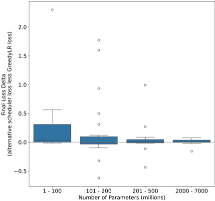
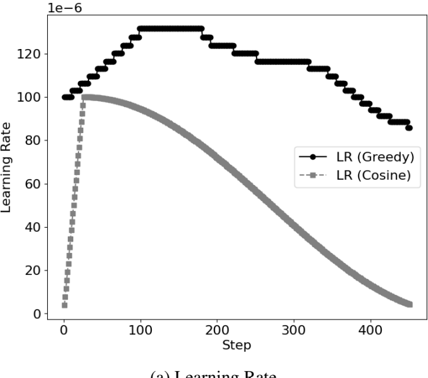
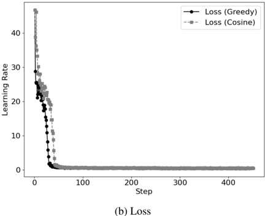
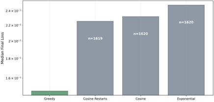
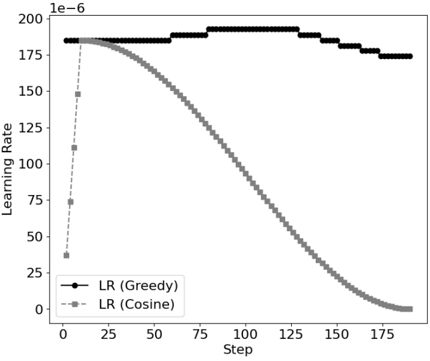
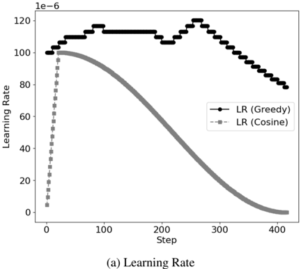
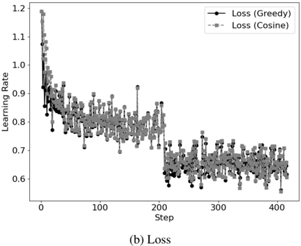
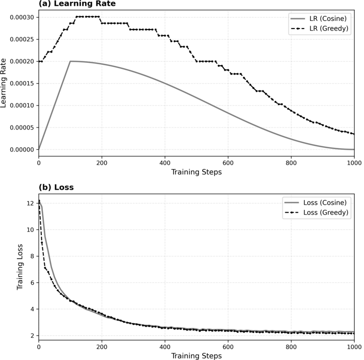
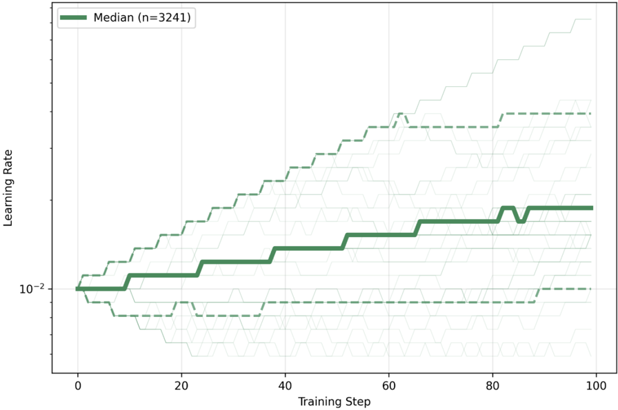

## Dynamic Learning Rate Scheduling based on Loss Changes Leads to Faster Convergence

Shreyas Subramanian Amazon Web Services Seattle, Washington subshrey@amazon.com

## Bala Krishnamoorthy

Amazon Web Services Seattle, Washington bkrism@amazon.com

Pranav Murthy Amazon Web Services Seattle, Washington pranavvm@amazon.com

## Abstract

Despite significant advances in optimizers for training, most research works use common scheduler choices like Cosine or exponential decay. In this paper, we study GreedyLR , a novel scheduler that adaptively adjusts the learning rate during training based on the current loss. To validate the effectiveness of our proposed scheduler, we conduct experiments on several NLP, CV, and LLM tasks with up to 7 B parameters, including both fine-tuning and pretraining experiments. The results show that our approach outperforms several state-of-theart schedulers in terms of accuracy, speed, and convergence. We also provide a theoretical analysis of the GreedyLR algorithm, including a proof of convergence and derivation of the optimal scaling factor F that maximizes the convergence rate, along with experiments to show robustness of the algorithm to realistic noisy landscapes. Our scheduler is easy to implement, computationally efficient, and could be considered a good default scheduler for training.

## 1 Introduction

Selecting a learning rate (LR) scheduler for training is important, but is often done with minimal thought. Many recent works default to using specific LR schedulers such as the Cosine Annealing scheduler, frequently without a strong technical justification for their choice.

As a first form of changing learning rates adaptively through training, several adaptive optimization methods have been proposed, such as Adam (Adaptive Moment Estimation) (Kingma and Ba, 2014) and RMSProp (Root Mean Square Propagation), which dynamically adjust the learning rate based on gradients and the history of updates. However, these adaptive optimizers often underperform in practice with their default settings (Wilson et al., 2017; Macêdo et al., 2021). Techniques proposed by (Vaswani et al., 2019; Armijo, 1966) aim to determine the optimal LR at each training step by treating it as a line search problem. These methods still use a fixed, predetermined schedule.

The main drawback of fixed schedules is their generality, which prevents adaptation to the specific characteristics of the optimization problem or the model architecture. Different problems and architectures often require distinct LR schedules for optimal performance. Therefore, there is a pressing need for a learning rate scheduler that is both simple and adaptable to the specific optimization problem.

There is a growing trend towards using learning rate schedules that adjust the LR during training. In our work, we propose a novel and simple scheduler called GreedyLR , which adaptively chooses the learning rate. Our contributions are as follows:

1. We conduct a variety of experiments from small models to Large Language Models (LLMs) with billions of parameters to validate performance of the scheduler across model scalses, use cases and datasets
2. We demonstrate GreedyLR's effectiveness across both fine-tuning and pre-training paradigms, establishing its utility as a general-purpose scheduler for diverse training scenarios
3. We study critical hyperparameters, as well as the robustness of the scheduler to simulated noisy environments to encourage using GreedyLR as a default scheduler choice in training experiments.

## 2 Related Work

The scheduling of learning rates is a critical factor in the training of deep neural networks (DNNs), influencing both convergence speed and final model performance. (Macêdo et al., 2021; Dauphin et al., 2014) suggest that neural network training occurs in phases, advocating for different learning rates at each phase to facilitate convergence. (Smith and Topin, 2017; Smith, 2015) employ cyclical variations of the learning rate based on preset heuristics to improve training dynamics. (Nakamura et al., 2021) propose a novel annealing schedule combining a sigmoid function with a warmup phase that maintains large learning rates during early and middle training stages while smoothing transitions to avoid abrupt changes in step size. (Yedida and Saha, 2019) derive a theoretical framework for dynamically computing learning rates based on the Lipschitz constant of the loss function, though their experiments indicate challenges in generalizing across architectures like ResNets. (Khodamoradi et al., 2021a) introduce an Adaptive Scheduler for Learning Rate (ASLR) that requires minimal hyperparameter tuning and adapts based on validation error trends, reducing computational burden while remaining effective across various network topologies. (Kim et al., 2021) propose an automated scheduler combining adaptive warmup and predefined decay phases for large-batch training, achieving superior performance with stochastic optimizers like AdamP and LAMB. (Defazio et al., 2023) present a refined adaptive scheduling approach that focuses on the last iterate rather than the average, adjusting schedules based on observed gradient norms and often outperforming popular schedules like cosine annealing. (Li et al., 2021) propose Adacomp, a zeroth-order method adjusting learning rates based on loss values alone that shows robustness across datasets and architectures, though it falls short of state-of-the-art adaptive methods in achieving maximum validation accuracy. (Jin et al., 2021) leverage Bayesian optimization in AutoLRS to dynamically search for optimal learning rates during training, balancing exploration and exploitation to yield significant speedups over stateof-the-art schedules. (Carvalho et al., 2020) explore evolutionary approaches in AutoLR, which evolves learning rate policies specific to neural network architectures using Structured Grammatical Evolution to generate efficient schedules. (Yedida et al., 2021) provide a theoretical framework for adaptive learning rates based on the Lipschitz constant that achieves faster convergence by analytically determining optimal rates for various optimizers.

Collectively, these studies highlight the diversity and complexity of adaptive learning rate scheduling methods, each with unique strengths and suitable applications, contributing significantly to the efficient training of deep learning models. Despite these advancements, limitations remain. Many methods require substantial computational resources, making them less accessible for practitioners with limited resources (Jin et al., 2021). Methods based on theoretical frameworks like Lipschitz constants may face challenges in accurately estimating necessary parameters in practical, noisy environments, leading to suboptimal performance (Yedida and Saha, 2019; Yedida et al., 2021). Additionally, the complexity of certain algorithms, such as ASLR and those utilizing advanced statistical models, can make them difficult to implement and tune without deep expertise, thus limiting their usability (Khodamoradi et al., 2021b; Kim et al., 2021). Moreover, despite claims of generalizability, many techniques show varying degrees of effectiveness across different architectures and datasets, indicating that no single method universally outperforms others (Nakamura et al., 2021; Defazio et al., 2023).

Finally, the lack of standardization in benchmarking and evaluation methodologies for schedulers makes it challenging to directly compare the effectiveness of different scheduling approaches, further complicating the selection of the most appropriate method for a given application. We understand the 'no free lunch' principle, and the fact that coming up with a scheduler that outperforms all other schedulers in all use cases may not be possible even with our contributions below, but we believe we can come up with a good, sensible default choice that is simple to implement and reliable in terms of performance. Next, we describe the GreedyLR scheduler, followed by theoretical proofs of convergence and experiments with LLMs.

## 3 GreedyLR Scheduler

The GreedyLR scheduler adjusts the learning rate based on changes in loss. Algorithm 1 in the Appendix provides a detailed view of the implementation. In its simplest form, the scheduler uses a fixed factor F between (0 , 1) to modify the LR: it multiplies the rate by this factor if the loss worsens to decrease LR, or divides by the same factor F if the loss improves to increase LR. The intuition behind using the scaling factor F to increase or decrease the learning rate based on the change in loss. If the loss value decreases ( l t &lt; l t -1 ) over time, it suggests that we are moving in a direction that potentially reduces the objective function. In this case, we want to take a larger step in the same direction by increasing the learning rate ( γ t = γ t -1 /F , where F &lt; 1 ). We do the opposite if the loss value increases ( l t ≥ l t -1 ). Although preliminary in nature, we refer the interested reader to the appendix that discusses theoretical properties of such an algorithm when applied to SGD. We show that:

1. GreedyLR converges with a rate of O (1 /T ) for the expected sub-optimality of the average iterate ¯ x T . [Theorem A.1]. We support this with various real world fine tuning and pretraining experiemnts, along with experiments that show robustness to noise.
2. The optimal value of the factor F is F = 1 -1 L max , where L max is the smoothness constant of the objective function. [Theorem A.2]. We support this with experiment results from a F -sweep in Section 4.3

## 4 Experimental Results

We evaluated GreedyLR across diverse model scales and tasks to assess its effectiveness as a general-purpose scheduler. Our experiments span models from tens of millions to 7 billion parameters, covering NLP, CV, and LLM tasks in both fine-tuning and pre-training paradigms. Figure 1 summarizes performance across parameter scales, showing that GreedyLR matches or exceeds baseline schedulers in the majority of experiments, with particularly strong benefits in the 1-200M parameter range (see positive final loss delta except for a few outliers).

Key findings include: (1) For small models (&lt;500M parameters), GreedyLR performs as good or better than popular schedulers in 86.73% of experiments across 132 training runs, with average loss improvement of 0.16 and maximum benefit of 2.3. (2) For large models (500M-7B parameters), GreedyLR achieves 83.33% as-goodor-better performance in fine-tuning, with strong gains (up to 47%) during early training. (3) In pretraining on Llama-3.2-1B using RedPajama-arxiv, GreedyLR achieves 5.4% lower final loss versus

Cosine scheduling. (4) Empirical analysis reveals a stability threshold at F ≥ 0 . 5 for the scaling factor, above which performance is robust (within 1.5% variation), eliminating precise hyperparameter tuning. In the next few sub-sections, we will dive deeper into the above results.

Figure 1: Training Performance (final loss delta) vs Model Size (number of parameters)



## 4.1 Small Model Results

'Small Model' hererefers to models with ≤ 500M parameters. We conducted 132 experiments across 16 model architectures (including Pegasus, BERT, T5, BART, ResNet, ViT, Camembert families) and 15 diverse datasets spanning translation (WMT16, Opus100), QnA (SQUAD, Adversarial QA, Quoref), summarization (XSUM, Amazon reviews), NER (Conllpp, Wikiann, Xglue), and image tasks (CIFAR-10/100, Tiny ImageNet, sidewalk-semantic). We tested 4 optimizers (AdamW, Adafactor, Adagrad, SGD) with 5 schedulers (Linear, Cosine, Polynomial, Constant+warmup, plus GreedyLR).

All experiments ran on ml.g4dn.16xlarge Amazon SageMaker instances with identical seeds, initial learning rates, and Huggingface defaults. For GreedyLR: patience=10, min\_lr= 10% of initial LR, smoothing window=50. We measured loss at 10% , 50% , and 100% of training steps (typically 10005000 steps). See Appendix Table 9 for complete experimental design.

Tables 1 and 2 summarize the detailed task

results. Table 1 categorizes instances where GreedyLR, using the same optimizer as baseline, clearly outperforms ('yes'), outperforms with no significant difference ('yes*'), clearly underperforms ('no'), or underperforms with no significant difference ('no*'). Insignificant difference at any stage is defined as absolute loss difference &lt; ±0.1, labeled 'yes*' and 'no*'.

Table 2 presents summary statistics from our small model experiments. Across use cases, GreedyLR is as good or better ('yes', 'yes*', 'no*') than tested schedulers &gt; 86% of the time, and better ('yes', 'yes*') 57% of the time. It clearly outperforms ('yes') in 25% of instances. For final loss, GreedyLR with same base optimizer outperforms &gt; 91% of runs.

Table 1: Results summary - counts of how often GreedyLR beats other schedulers across all small model experiments at three stages (10, 50, 100% of max steps). 'Yes' = GreedyLR clearly outperforms, 'no' = clearly underperforms; * indicates loss delta &lt; ± 0.1 (no significant difference).

|   yes |   yes* |   no |   no* |   sum |   Final loss delta in +/- 0.1 |
|-------|--------|------|-------|-------|-------------------------------|
|    48 |     64 |   26 |    58 |   196 |                            39 |

Table 2: Summary of performance calculated from Table 1

| Metric                                  | Percentage (%)   |
|-----------------------------------------|------------------|
| Overall as good or better               | 86.73 57.14      |
| Overall Better                          |                  |
| Overall Worse                           | 13.27            |
| Overall as good                         | 62.24            |
| Clearly better                          | 24.49            |
| Metric                                  | Baseline         |
| Average benefit Max benefit Max deficit | 0.16 2.3 -0.62   |

Table 3: Summary of performance by stage showing percentage of times GreedyLR is as-good-or-better

|   Stage 1 (10%) |   Stage 2 (50%) |   Stage 3 (100%) |
|-----------------|-----------------|------------------|
|           92.42 |           81.81 |            85.94 |

## 4.2 Large Model Results

'Large Model' in this context refers to models with parameters greater than 500 million parameters up to 7B parameters. We conducted experiments across multiple model architectures to evaluate GreedyLR's effectiveness in both fine-tuning and pre-training scenarios.

## 4.2.1 Fine-Tuning Experiments

We conducted 8 fine-tuning experiments across three popular model architectures with varying parameter sizes: Microsoft's Phi-2 (2 billion parameters), TII UAE's Falcon 7B (7 billion parameters), and Google's Gemma 7B (7 billion parameters). These large model architectures were fine-tuned using three different modalities of datasets, as summarized in Table 4.

Table 4: Design of Experiments (DoE) for Large Model Architectures

| Models                                              | Datasets                                                                                 |
|-----------------------------------------------------|------------------------------------------------------------------------------------------|
| Microsoft Phi2 2B TII UAE Falcon 7B Google Gemma 7B | w601sxs/simpleCoT b-mc2/sql-create-context jpacifico/French-Alpaca- dataset-Instruct-55K |
| Optimizers                                          | Schedulers                                                                               |
| AdamW                                               | GreedyLR (ours) Cosine                                                                   |

Abrief description of the datasets from Huggingface used for fine-tuning follows:

1. w601sxs/simpleCoT : An instruct-tune format dataset designed to adapt pretrained models to the instruct format. We constructed simpleCoT from several Open source datasets on Huggingface with open licenses including Orca, Wizard LM, Kaist, and AlpacaCoT.(Mukherjee et al., 2023; Si et al., 2023; Kim et al., 2023; Xu et al., 2024)
2. b-mc2/sql-create-context : A collection of natural language queries in the instruct-tune format which is a combination of Seq2SQL and Spider datasets.(Zhong et al., 2017; Yu et al., 2018)
3. jpacifico/French-Alpaca-dataset-Instruct55K : A synthetically generated collection of 55K French language Alpaca formatted instructions.

Overall results for fine tuning of larger models comparing GreedyLR performance with schedulers tested are shown in Tables 6 and 7, which are derived from Table 5. Note that for comparison, GreedyLR is compared to the Cosine scheduler, a default implementation in the Huggingface Python library. For LLM experiments, we see that across three stages of fine-tuning, GreedyLR is 83.33% as good or better than the baseline; GreedyLR is clearly better 62.5% of the measured datapoints. While no scheduler can show superior performance across all stages, datasets, and model baselines, we point out that in the experiments run for LLMs, GreedyLR has a net positive benefit, with a maximum benefit of 47% and maximum deficit of 28%. Specifically, we see good improvement in each of the three stages (10%, 50%, and 100% of the max steps), with an uplift in the early stages of convergence.

Table 5: Results summary - counts of how often GreedyLR scheduler beats other schedulers across LLM experiments, and at three stages (10, 50 and 100% of max steps). Yes means that GreedyLR with the same base optimizer beats the scheduler in comparison, and no means that it does not. * indicates that the loss delta at the measured point is less than + / -1%

|   yes |   yes* |   no |   no* |   sum |   Final loss delta in +/- 1% |
|-------|--------|------|-------|-------|------------------------------|
|    15 |      4 |    4 |     1 |    24 |                            6 |

Table 6: Summary of performance calculated from Table 5

| Metric                    | Percentage (%)   |
|---------------------------|------------------|
| Overall as good or better | 83.33            |
| Overall Better            | 79.16            |
| Overall Worse             | 16.66            |
| Overall as good           | 20.83            |
| Clearly better            | 62.5             |
| Metric                    | Baseline         |
|                           | GreedyLR loss    |
| Average benefit           | 2.89%            |
| Max benefit               | 47%              |
| Max deficit               | 28%              |

Figure 2a shows the dynamic learning rate (LR) generated by GreedyLR, in comparison to the standard Cosine scheduler. The loss curve for Gemma7B fine-tuning (Figure 2b) shows accelerated early convergence for GreedyLR compared to Cosine.

Table 7: Summary of performance calculated by stage showing what percentage of times GreedyLR is overall as good, or better

|   Stage 1 (10%) |   Stage 2 (50%) |   Stage 3 (100%) |
|-----------------|-----------------|------------------|
|            87.5 |              75 |               75 |

1

(a) Learning Rate



Figure 2: Google Gemma-7b, showing (a) learning rate schedules and (b) loss trajectories for the Greedy and Cosine schedulers. We observe that the Greedy scheduler significantly outperforms the Cosine scheduler during the early stages of training.



GreedyLR significantly outperforms Cosine during early fine-tuning stages (when larger gradient updates and domain adaptation occur) and performs as-well-or-better in later stages. Detailed results in Appendix Table 10 show GreedyLR outperforms Cosine in all experiments during the first 10% of training and in 5 of 6 experiments throughout training.

## 4.2.2 Pre-Training Experiments

To assess effectiveness beyond fine-tuning, we pretrained Meta's Llama-3.2-1B on RedPajama-arxiv for 1000 steps ( γ 0 = 2 × 10 -4 , warmup=100, batch size=1 with gradient accumulation=32, bf16). GreedyLR used F = 0 . 95 , min\_lr= 1 . 85 × 10 -5 , smoothing enabled.

GreedyLR achieves 1.0%, 3.0%, and 5.4% lower loss at 10%, 50%, and 100% of training respectively (final: 2.16 vs 2.28). Unlike finetuning where early-stage benefits dominate, pretraining shows accelerating advantages, suggesting GreedyLR's loss-based adaptation is particularly effective in high-variance settings without prior task knowledge. See Appendix Figure 8 for detailed learning rate schedules and loss trajectories.

## 4.3 Stability Threshold for Scaling Factor F

While Theorem A.2 establishes the theoretical optimal value F = 1 -1 L max , L max is typically unknown in practice. We conducted a systematic F-sweep using Microsoft Phi-2 (2B parameters) on w601sxs/simpleCoT with F ∈ { 0 . 25 , 0 . 50 , 0 . 75 , 0 . 99 } over 250 steps.

Figure 3 reveals a critical stability threshold: F = 0 . 25 caused catastrophic divergence (final loss 7.78 vs initial 2.28), while all F ≥ 0 . 5 achieved stable convergence with nearly identical performance (losses 1.89, 1.92, 1.91-within 1.5%). This demonstrates that practitioners need only ensure F ≥ 0 . 5 for stability, eliminating precise hyperparameter tuning. See Appendix Figure 9 for detailed analysis including learning rate dynamics and zoomed comparisons.

## 4.4 Robustness Experiments

We conducted 8100 training experiments to evaluate GreedyLR's robustness against real-world training perturbations. Our experimental design (detailed in Appendix A.6) includes five noise types applied as additive perturbations to the loss function: Gaussian noise (stochastic gradient errors), periodic spike noise (scheduled disruptions every 50-100 steps), random spike noise (2% probability, simulating hardware glitches), adversarial noise (opposing optimization progress), and a clean baseline. We evaluated four schedulers across 12 neural architectures, with GreedyLR receiving comprehensive evaluation ( n = 3241 runs) compared to baseline schedulers ( n ≈ 1620 each).

Figure 4 demonstrates GreedyLR's superior performance, achieving the lowest median final loss

(a) Training Loss for Different F Values

1

Figure 3: Training loss trajectories for different scaling factor F values on Microsoft Phi-2 fine-tuning, demonstrating the critical stability threshold at F ≥ 0 . 5 . F = 0 . 25 causes catastrophic divergence while all F ≥ 0 . 5 achieve stable convergence with similar performance (within 1.5%). See Appendix Figure 9 for detailed analysis.


(0.148) compared to cosine annealing (0.232), cosine with restarts (0.226), and exponential decay (0.249). The performance heatmap (Figure 5) reveals GreedyLR's consistent robustness across all noise conditions, with particularly strong performance under adversarial, Gaussian, and spike perturbations where traditional schedulers show high variability.

Figure 4: Median final loss comparison across all experiments. GreedyLR achieves 37% lower median loss than the best traditional scheduler.



Recovery Performance. We define recovery performance as the ratio between maximum loss during training and final achieved loss, measuring a scheduler's ability to adapt after perturbations (see Appendix A.6.1 for full analysis). GreedyLR demonstrates exceptional recovery capability with median recovery of 134 × and best-case recovery of 72,999 × , dramatically outperforming traditional schedulers (Table 8). Beyond magnitude,

Figure 5: Performance heatmap across noise conditions. Darker colors indicate better (lower) performance. GreedyLR demonstrates consistent robustness across all perturbation types.


GreedyLR exhibits 3-5 × faster recovery speed (median: 12 steps vs 45 steps for Cosine), minimizing lost training time following disruptions. Distribution analysis reveals GreedyLR's 10th-90th percentile span covers only a 100 × range compared to 300-1000 × for competitors, with GreedyLR's 90th percentile (0.1) outperforming other scheduler's median values, demonstrating good reliability across diverse optimization landscapes.

Table 8: Recovery performance metrics (full results: Table 12)

| Scheduler       | Median   | Best   |
|-----------------|----------|--------|
| GreedyLR        | 134 ×    | 73K ×  |
| Cosine          | 132 ×    | 5K ×   |
| Cosine Restarts | 36 ×     | 950 ×  |
| Exponential     | 4.9 ×    | 450 ×  |

## 5 Limitations

The GreedyLR algorithm adjusts learning rates based on loss changes rather than direct gradient information. This design choice introduces several fundamental limitations. The change in loss values between consecutive iterations serves as a zeroth-order proxy for optimization progress, which may not accurately reflect true gradient direction in highly non-convex landscapes with saddle points, local minima, or regions of high curvature. In scenarios with inconsistent data distributions across mini-batches-such as domain switches in multi-domain training, stochastic routing variations in Mixture-of-Experts models, or heterogeneous batch compositions-loss fluctuations may reflect data sampling effects rather than genuine optimization dynamics. While our implementation includes smoothing windows and pa- tience parameters to mitigate spurious reactions to noise, the fundamental question of when loss changes reliably indicate gradient direction versus noise remains context-dependent. Our robustness experiments (Section 4.4) demonstrate resilience across five engineered noise types (Gaussian, periodic spike, random spike, adversarial, and clean), but real-world training environments may present perturbation patterns not fully captured by this experimental design. Incorporating additional signals such as gradient norms, curvature estimates, or validation metrics could potentially enhance the algorithm's reliability in pathological cases, though such extensions remain beyond the scope of this work.

While Theorem A.2 derives the theoretically optimal scaling factor F = 1 -1 L max , accurately estimating the smoothness constant L max for complex neural networks remains challenging in practice. Our empirical F-sweep analysis (Section 4.3) identifies a stability threshold at F ≥ 0 . 5 , above which performance is remarkably robust (within 1.5% variation), but this threshold was established only for LLM fine-tuning and its generalization to all training regimes requires further verification. The practical implementation incorporates additional hyperparameters (patience, cooldown, warmup, smoothing window, min/max learning rate bounds) designed to handle real-world training instabilities. While these parameters provide valuable flexibility and robustness, they increase implementation complexity compared to parameterfree schedulers. A comprehensive ablation study across all hyperparameter combinations would be cost-prohibitive, representing a limitation of our current evaluation. The algorithm's stability may depend on careful parameter selection, and while our experiments suggest the provided defaults work well across diverse settings, users may benefit from task-specific tuning for optimal performance.

Our experimental results show that while GreedyLR performs "as good or better" than baseline schedulers in 87% of small model cases and 83% of large model cases, it only clearly outperforms baselines in 25% and 62.5% of instances respectively. This indicates that dramatic improvements are not universal, consistent with the "no free lunch" principle-no single scheduler dominates across all settings. Our analysis (Figure 6) suggests performance benefits vary by model size, with greater improvements observed in the 1-200M parameter range, though more extensive experi- ments across parameter scales would strengthen these conclusions. This variability underscores that GreedyLR should be viewed as a reliable default choice rather than a universally optimal solution.

Our experiments primarily focus on natural language processing and computer vision tasks with models up to 7B parameters. Several domains remain underexplored, including reinforcement learning where reward signals exhibit different statistical properties than supervised loss functions, and applications in audio processing, graph neural networks, or scientific computing. The generalizability of our findings to these domains requires further investigation. Additionally, our pre-training experiments on Llama-3.2-1B (Section 4.2.2) were limited to 1000 steps on a single architecture with one random seed due to computational constraints. Full-scale pre-training of frontier models typically involves hundreds of thousands to millions of steps across multiple architectures and random seeds. The cost-prohibitive nature of such experiments-often requiring thousands of GPU-hours and substantial monetary investment-prevented exhaustive evaluation at this scale. Consequently, our conclusions about long-term training dynamics (e.g., behavior after learning rates have decayed significantly), cross-run variability, and scalability to models beyond 7B parameters remain preliminary. The scheduler's effectiveness in handling extended training scenarios-such as loss plateaus, catastrophic forgetting in continual learning, or extremely flat regions of the loss landscape-warrants dedicated investigation.

A significant gap exists between our theoretical framework and practical implementation. The convergence analysis (Appendix A.3) is formulated for SGD with smooth convex objectives under the assumption that loss changes provide sufficient information for learning rate adaptation. In practice, modern deep learning predominantly employs adaptive optimizers like Adam and AdamW on nonconvex problems where these assumptions may not hold globally. The practical algorithm incorporates features (smoothing windows, patience, cooldown, warmup) not reflected in the theoretical guarantees. While we provide intuition for these additions and demonstrate empirical effectiveness, the formal convergence results do not cover the full practical implementation. Furthermore, GreedyLR adjusts the global learning rate, which interacts with perparameter learning rates maintained by adaptive optimizers in ways not captured by our SGD-based analysis. Understanding whether GreedyLR's lossbased adjustments provide complementary or redundant information to adaptive moment estimates deserves deeper investigation. The convergence bound also contains a variance term whose behavior depends on the choice of F , minLR, and maxLR, representing weaker guarantees than standard SGD with monotonically decaying step sizes.

We position GreedyLR as a strong default scheduler with reliable performance across diverse scenarios rather than claiming universal optimality. We encourage practitioners to experiment with configurations tailored to their specific use cases and welcome community contributions to identify settings where alternative schedulers may be preferable.

## 6 Conclusion

In this paper, we study a dynamic scheduler, GreedyLR, that adjusts the learning rate based on changes in the loss function. We provide proofs of convergence and derive bounds for critical parameters of the algorithm, particularly the scaling factor F , and supplement these theoretical results with comprehensive experiments on models across various sizes. Specifically for Large Language Model tasks-including both fine-tuning and pretraining-GreedyLR consistently performed better than the default Cosine scheduler, demonstrating its effectiveness as a general-purpose scheduler across diverse training paradigms.

## References

Larry Armijo. 1966. Minimization of functions having lipschitz continuous first partial derivatives. Pacific Journal of Mathematics , 16:1-3.

Pedro Carvalho, Nuno Lourenço, Filipe Assunção, and Penousal Machado. 2020. Autolr: an evolutionary approach to learning rate policies. In Proceedings of the 2020 Genetic and Evolutionary Computation Conference , GECCO '20, page 672-680, New York, NY, USA. Association for Computing Machinery.

Yann Dauphin, Razvan Pascanu, Çaglar Gülçehre, Kyunghyun Cho, Surya Ganguli, and Yoshua Bengio. 2014. Identifying and attacking the saddle point problem in high-dimensional non-convex optimization. ArXiv , abs/1406.2572.

Aaron Defazio, Ashok Cutkosky, Harsh Mehta, and Konstantin Mishchenko. 2023. When, why and how much? adaptive learning rate scheduling by refinement. arXiv preprint arXiv:2310.07831 .

Guillaume Garrigos and Robert M. Gower. 2023. Handbook of convergence theorems for (stochastic) gradient methods. Preprint , arXiv:2301.11235.

Yuchen Jin, Tianyi Zhou, Liangyu Zhao, Yibo Zhu, Chuanxiong Guo, Marco Canini, and Arvind Krishnamurthy. 2021. Autolrs: Automatic learning-rate schedule by bayesian optimization on the fly. arXiv preprint arXiv:2105.10762 .

- Alireza Khodamoradi, Kristof Denolf, Kees Vissers, and Ryan C. Kastner. 2021a. Aslr: An adaptive scheduler for learning rate. In 2021 International Joint Conference on Neural Networks (IJCNN) , pages 1-8.
- Alireza Khodamoradi, Kristof Denolf, Kees Vissers, and Ryan C. Kastner. 2021b. Aslr: An adaptive scheduler for learning rate. In 2021 International Joint Conference on Neural Networks (IJCNN) , pages 1-8.
- Chiheon Kim, Saehoon Kim, Jongmin Kim, Donghoon Lee, and Sungwoong Kim. 2021. Automated learning rate scheduler for large-batch training. arXiv preprint arXiv:2107.05855 .

Seungone Kim, Se June Joo, Doyoung Kim, Joel Jang, Seonghyeon Ye, Jamin Shin, and Minjoon Seo. 2023. The cot collection: Improving zero-shot and few-shot learning of language models via chain-of-thought fine-tuning. arXiv preprint arXiv:2305.14045 .

Diederik P. Kingma and Jimmy Ba. 2014. Adam: A method for stochastic optimization. CoRR , abs/1412.6980.

Yanan Li, Xuebin Ren, Fangyuan Zhao, and Shusen Yang. 2021. A zeroth-order adaptive learning rate method to reduce cost of hyperparameter tuning for deep learning. Applied Sciences , 11(21).

David Macêdo, Pedro Dreyer, Teresa B Ludermir, and C. Zanchettin. 2021. Training aware sigmoidal optimizer. ArXiv , abs/2102.08716.

Subhabrata Mukherjee, Arindam Mitra, Ganesh Jawahar, Sahaj Agarwal, Hamid Palangi, and Ahmed Awadallah. 2023. Orca: Progressive learning from complex explanation traces of gpt-4. Preprint , arXiv:2306.02707.

Kensuke Nakamura, Bilel Derbel, Kyoung-Jae Won, and Byung-Woo Hong. 2021. Learning-rate annealing methods for deep neural networks. Electronics , 10(16):2029.

Qingyi Si, Tong Wang, Zheng Lin, Xu Zhang, Yanan Cao, and Weiping Wang. 2023. An empirical study of instruction-tuning large language models in chinese. Preprint , arXiv:2310.07328.

Leslie N. Smith. 2015. Cyclical learning rates for training neural networks. 2017 IEEE Winter Conference on Applications of Computer Vision (WACV) , pages 464-472.

- Leslie N. Smith and Nicholay Topin. 2017. Superconvergence: very fast training of neural networks using large learning rates. In Defense + Commercial Sensing .
- Shreyas Subramanian and Vignesh Ganapathiraman. 2023. Zeroth order greedylr: An adaptive learning rate scheduler for deep neural network training. In 2023 IEEE 4th International Conference on Pattern Recognition and Machine Learning (PRML) , pages 593-601.

Sharan Vaswani, Aaron Mishkin, Issam Hadj Laradji, Mark W. Schmidt, Gauthier Gidel, and Simon Lacoste-Julien. 2019. Painless stochastic gradient: Interpolation, line-search, and convergence rates. In Neural Information Processing Systems .

Ashia C. Wilson, Rebecca Roelofs, Mitchell Stern, Nathan Srebro, and Benjamin Recht. 2017. The marginal value of adaptive gradient methods in machine learning. In NIPS .

Can Xu, Qingfeng Sun, Kai Zheng, Xiubo Geng, Pu Zhao, Jiazhan Feng, Chongyang Tao, Qingwei Lin, and Daxin Jiang. 2024. WizardLM: Empowering large pre-trained language models to follow complex instructions. In The Twelfth International Conference on Learning Representations .

Rahul Yedida and Snehanshu Saha. 2019. A novel adaptive learning rate scheduler for deep neural networks. arXiv preprint arXiv:1902.07399 .

Rahul Yedida, Snehanshu Saha, and Tejas Prashanth. 2021. Lipschitzlr: Using theoretically computed adaptive learning rates for fast convergence. Applied Intelligence , 51:1460-1478.

Tao Yu, Rui Zhang, Kai Yang, Michihiro Yasunaga, Dongxu Wang, Zifan Li, James Ma, Irene Li, Qingning Yao, Shanelle Roman, et al. 2018. Spider: A large-scale human-labeled dataset for complex and cross-domain semantic parsing and text-to-sql task. arXiv preprint arXiv:1809.08887 .

Victor Zhong, Caiming Xiong, and Richard Socher. 2017. Seq2sql: Generating structured queries from natural language using reinforcement learning. CoRR , abs/1709.00103.

## A Appendix - Supplementary material

## A.1 Theorems and Proofs

To prove convergence for the GreedyLR algorithm, we need to make some standard assumptions about the objective function f . Let's assume that:

Assumption A.1. Sum of L max -Smooth Functions:

Each function f i is L max -smooth, i.e., for all x, y ∈ R d , we have

<!-- formula-not-decoded -->

We consider the problem of minimizing the convex objective function f ( x ) = 1 n ∑ n i =1 f i ( x ) , where each f i is L max -smooth (as stated in Assumption A.1).

Theorem A.1. Let { x t } be the sequence generated by the GreedyLR algorithm, and let x ∗ be an optimal solution of the problem min x f ( x ) . Suppose that the learning rate γ t is bounded between min LR and max LR for all t , i.e., min LR ≤ γ t ≤ max LR . Then, for any T ≥ 1 , we have

<!-- formula-not-decoded -->

where ¯ x T = 1 T ∑ T -1 t =0 x t is the average of the iterates.

The constant terms depend on the minimum and maximum learning rates, as well as the smoothness constant L max and the initial distance | x 0 -x ∗ | . The dynamic adjustment of the learning rate in the GreedyLR algorithm can lead to better performance compared to using a fixed or decreasing learning rate schedule. By increasing the learning rate when the loss decreases, the algorithm can potentially take larger steps and make faster progress towards the optimum. However, if the learning rate becomes too large, the algorithm may diverge or oscillate, which is why the maximum learning rate max LR is introduced as a safeguard.

Compared to a fixed learning rate, the GreedyLR algorithm can adapt to the local curvature of the objective function and potentially converge faster, especially in regions where the function is flat or has a small curvature. In regions with high curvature, the algorithm will naturally decrease the learning rate to maintain stability.

Now, the multiplicative factor F determines the aggressiveness of the learning rate adjustment. A smaller value of F will lead to more aggressive increases and decreases in the learning rate, potentially allowing for faster convergence but also increasing the risk of divergence or oscillations. A larger value of F (closer to 1) will lead to more conservative adjustments, which may be more stable but potentially slower in convergence. The following theorem explores the value of the optimal F :

Theorem A.2. Let γ t be the learning rate at iteration t of the GreedyLR algorithm, and let F be the scaling factor used to update γ t . Suppose F is chosen such that F ∈ (0 , 1) . Then, the optimal value of F that maximizes the convergence rate of the algorithm is F = 1 -1 L max , where L max is the smoothness constant of the objective function.

For proof, once again we refer the readers to the Appendix. While this theorem provides the optimal value for maximizing convergence rate, it does not establish stability bounds or predict the robustness of the algorithm to suboptimal F values. Our empirical investigation in Section 5.3 reveals that a stability threshold exists at F ≥ 0 . 5 , above which the algorithm exhibits remarkable insensitivity to the exact choice of F .

Theorem A.3 (Restated) . Let { x t } be the sequence generated by the GreedyLR algorithm, and let x ∗ be an optimal solution of the problem min x f ( x ) . Suppose that the learning rate γ t is bounded between min LR and max LR for all t , i.e., min LR ≤ γ t ≤ max LR . Then, for any T ≥ 1 , we have

<!-- formula-not-decoded -->

where ¯ x T = 1 T ∑ T -1 t =0 x t is the average of the iterates.

Proof. By the convexity of f ( x ) and the L max -smoothness of f i t (Assumption A.1), we have

<!-- formula-not-decoded -->

Taking the expectation on both sides and using the convexity of f , we get

<!-- formula-not-decoded -->

Now, using the variance transfer lemma (Lemma 6.7 in the (Garrigos and Gower, 2023)), we have

<!-- formula-not-decoded -->

where σ ∗ f = inf x ∗ ∈ argmin f E [ ∥∇ f ( x ∗ ) ∥ 2 ] .

Substituting this into the previous inequality, we get

<!-- formula-not-decoded -->

Since γ t ≤ max LR , we have

<!-- formula-not-decoded -->

Rearranging the terms, we obtain

<!-- formula-not-decoded -->

Substituting the coeffiecients of terms as α t and β t , we have

<!-- formula-not-decoded -->

Since min LR ≤ γ t ≤ max LR , we have

<!-- formula-not-decoded -->

Iterating the above inequality and taking the expectation, we get

<!-- formula-not-decoded -->

Now, let's consider the average of the iterates ¯ x T = 1 T ∑ T -1 t =0 x t . By the convexity of f , we have

<!-- formula-not-decoded -->

Taking the expectation and using the above inequality for each term, we obtain

<!-- formula-not-decoded -->

Using the bounds for α and β , and the fact that

1 -α = 2min LR L max (1 -max LR L max / we get

2)

<!-- formula-not-decoded -->

which completes the proof.

Theorem A.4 (Restated) . Let γ t be the learning rate at iteration t of the GreedyLR algorithm, and let F be the scaling factor used to update γ t . Suppose F is chosen such that F ∈ (0 , 1) . Then, the optimal value of F that maximizes the convergence rate of the algorithm is F = 1 -1 L max , where L max is the smoothness constant of the objective function.

Proof. From the proof of Theorem ?? , we have the following inequality for the expected function value at iteration t :

<!-- formula-not-decoded -->

where

<!-- formula-not-decoded -->

For convergence, we require α t &lt; 1 for all t . Substituting the update rule for γ t in the GreedyLR algorithm, we have:

<!-- formula-not-decoded -->

<!-- formula-not-decoded -->

To ensure α t &lt; 1 for all t , we need to maximize the expressions on the right-hand side over the range F ∈ (0 , 1) .

For the case l t &lt; l t -1 , we have:

<!-- formula-not-decoded -->

Since γ t -1 ∈ (0 , 2 F L max ] , the maximum value of α t is achieved at γ t -1 = 2 F L max , which gives α t = 1 -2 L max &lt; 1 .

For the case l t ≥ l t -1 , we have:

<!-- formula-not-decoded -->

To maximize this expression over F ∈ (0 , 1) , we take the derivative with respect to F and set it to zero:

<!-- formula-not-decoded -->

Setting this derivative to zero and solving for F , we get:

<!-- formula-not-decoded -->

Substituting this value of F into the expression for α t , we get:

<!-- formula-not-decoded -->

Therefore, the optimal value of F that maximizes the convergence rate of the GreedyLR algorithm is F = 1 -1 L max , which ensures that α t &lt; 1 for all t , leading to convergence of the algorithm.

## A.2 Additional figures and tables



(a) Learning Rate

Figure 6: Microsoft Phi2 fine-tuned, showing (a) learning rate schedules and (b) loss trajectories for the Greedy and Cosine schedulers. We observe that the Greedy scheduler tracks as marginally better than the Cosine scheduler for nearly all training steps.


Table 9: Complete Design of Experiments (DOE) for Small Model Performance Comparisons

| Models                                                                                                                                                                                                                                                                     | Datasets                                                                                                                                                         |
|----------------------------------------------------------------------------------------------------------------------------------------------------------------------------------------------------------------------------------------------------------------------------|------------------------------------------------------------------------------------------------------------------------------------------------------------------|
| google/pegasus-x-base facebook/wmt19-de-en facebook/blenderbot_small google/long-t5-tglobal-base xlm-roberta-base bert-based-uncased bart-base Resnet-50 Resnet-152 google/vit-base-patch16-224 nvidia/mit-0 facebook/bart-base t5-base bert-base-uncased xlm-roberta-base | wmt16 Opus 100 News Commentary SQUAD Adversarial QA Quoref CIFAR-10 CIFAR-100 Tiny Imagenet segments/sidewalk-semantic amazon reviews XSUM Conllpp Wikiann Xglue |
| Optimizers                                                                                                                                                                                                                                                                 | Schedulers                                                                                                                                                       |
| AdamW Adafactor Adagrad SGD                                                                                                                                                                                                                                                | Linear Cosine Polynomial Constant + warmup GreedyLR (ours)                                                                                                       |

Figure 7: Fine-tuning with Falcon 7b, showing (a) learning rate schedules and (b) loss trajectories for the Greedy and Cosine schedulers. We observe that the performance of the Greedy scheduler is slightly better than the Cosine scheduler.





(a) Learning Rate

Figure 8: Llama-3.2-1B pre-training on the arxiv subset of RedPajama, showing (a) learning rate schedules and (b) loss trajectories for the Greedy and Cosine schedulers. GreedyLR achieves 5.4% lower final loss (2.16 vs 2.28), demonstrating faster convergence throughout the 1000-step training run.



Figure 9: Detailed stability threshold analysis for scaling factor F on Microsoft Phi-2 fine-tuning. The figure shows (a) training loss trajectories demonstrating divergence at F = 0 . 25 and stable convergence for F ≥ 0 . 5 , (b) learning rate adaptation dynamics for different F values, (c) zoomed comparison of stable configurations revealing nearly identical convergence, and (d) final loss comparison showing the critical threshold: F &lt; 0 . 5 causes divergence while all F ≥ 0 . 5 achieve similar performance (within 1.5%). Experimental settings: Microsoft Phi-2 (2B parameters), w601sxs/simpleCoT dataset, seed=42, LORA(r=8, α =16, dropout=0.08), initial LR= 2 × 10 -4 , 250 training steps.


## A.3 GreedyLR Algorithm

```
Algorithm 1 GreedyLR 1: Let x 0 ∈ R d , γ 0 > 0 be the initial learning rate, F ∈ (0 , 1) be the multiplicative factor, and ( l t ) t ∈ N be the sequence of loss values. 2: for t = 0 , 1 , 2 , . . . do 3: i t ∼ Unif ( { 1 , . . . , n } ) 4: g t = ∇ f i t ( x t ) 5: l t = f i t ( x t ) 6: if l t < l t -1 then 7: γ t = γ t -1 /F 8: else 9: γ t = γ t -1 × F 10: end if 11: x t +1 = x t -γ t g t 12: end for
```

## A.4 Detailed GreedyLR algorithm

## Algorithm 2 GreedyLR Algorithm (Detailed)

- 1: Inputs: optimizer , mode , factor , patience , threshold , cooldown , warmup , min \_ lr , max \_ lr , eps , verbose , window \_ size , reset \_ start
- 2: Initialize: best , num \_ bad \_ epochs , num \_ good \_ epochs , cooldown \_ counter , warmup \_ counter , last \_ epoch
- 3: mode \_ worse ←-∞ if mode is 'max' else ∞
- 4: min \_ lrs ← list or scalar depending on input
- 5: max \_ lrs ← list or scalar depending on input
- 6: reset \_ start \_ original ← reset \_ start
- 7: sa ← smooth function with window \_ size as window size
- 8: Define: \_init\_is\_better(), \_reset(), \_reduce\_lr(), \_increase\_lr(), is\_better()

| 9:               | function GREEDYLR( optimizer , mode , factor , patience , threshold , cooldown , warmup , min _ lr , max _ lr , eps , verbose , smooth , window _ size , reset _ start )   |
|------------------|----------------------------------------------------------------------------------------------------------------------------------------------------------------------------|
| 10:              | _init_is_better( mode , threshold )                                                                                                                                        |
| 11:              | _reset()                                                                                                                                                                   |
| 12:              | while training do                                                                                                                                                          |
| 13:              | current ← metric                                                                                                                                                           |
| 14:              | if smooth then                                                                                                                                                             |
| 15:              | current ← sa ( current )                                                                                                                                                   |
| 16:              | end if                                                                                                                                                                     |
| 17:              | last _ epoch ← last _ epoch +1                                                                                                                                             |
| 18:              | if is_better( current , best ) then                                                                                                                                        |
| 19:              | best ← current                                                                                                                                                             |
| 20:              | num _ bad _ epochs ← 0                                                                                                                                                     |
| 21:              | num _ good _ epochs ← num _ good _ epochs +1                                                                                                                               |
| 22:              | else                                                                                                                                                                       |
| 23:              | num _ bad _ epochs ← num _ bad _ epochs +1                                                                                                                                 |
| 24:              | num _ good _ epochs ← 0                                                                                                                                                    |
| 25:              | end if                                                                                                                                                                     |
| 26:              | if in_cooldown then                                                                                                                                                        |
| 27:              | - 1 ▷ ignore any bad epochs in cooldown                                                                                                                                    |
| 28:              | cooldown _ counter ← cooldown _ counter num _ bad _ epochs ← 0                                                                                                             |
| 29:              | end if                                                                                                                                                                     |
| 30:              | if in_warmup then                                                                                                                                                          |
| 31:              | warmup _ counter ← warmup _ counter - 1 num good epochs ← 0                                                                                                                |
| 32:              | _ _ ▷ ignore any good epochs in warmup                                                                                                                                     |
| 33: end if       |                                                                                                                                                                            |
| 34:              | if num _ bad _ epochs > patience then                                                                                                                                      |
| 35:              | _reduce_lr()                                                                                                                                                               |
|                  | cooldown _ counter ← cooldown                                                                                                                                              |
| 36:              | num bad epochs ← 0                                                                                                                                                         |
| 37:              |                                                                                                                                                                            |
| 38:              | end if                                                                                                                                                                     |
|                  | _ _                                                                                                                                                                        |
| 39: 40:          | if num _ good _ epochs > patience then _increase_lr()                                                                                                                      |
| 41:              | warmup _ counter ← warmup                                                                                                                                                  |
| 42:              | num _ good _ epochs ← 0                                                                                                                                                    |
| 44:              | end if                                                                                                                                                                     |
| 43:              | if reset _ start == 0 then                                                                                                                                                 |
| 45:              | _reset()                                                                                                                                                                   |
| 46:              | end if                                                                                                                                                                     |
| 47:              | _last_lr ← [group['lr'] for group in optimizer.param_groups]                                                                                                               |
| 48:              | if length of set(_last_lr) == 1 then                                                                                                                                       |
|                  | ▷ All at lower bound, try resetting                                                                                                                                        |
| 49:              |                                                                                                                                                                            |
| 50:              | reset _ start ← reset _ start - 1 end if                                                                                                                                   |
| 51:              |                                                                                                                                                                            |
| 52: end          | while                                                                                                                                                                      |
| 53: end function |                                                                                                                                                                            |

## Algorithm 3 GreedyLR functions contd...

```
1: function _RESET 2: best ← mode _ worse 3: reset _ start ← reset _ start _ original 4: cooldown _ counter ← 0 5: num _ bad _ epochs ← 0 6: warmup _ counter ← 0 7: num _ good _ epochs ← 0 8: end function 9: function _REDUCE_LR 10: for i, param _ group in enumerate(optimizer.param_groups) do 11: old _ lr ← float( param _ group [ ′ lr ′ ] ) 12: new _ lr ← max( old _ lr ∗ factor , min _ lrs [ i ] ) 13: if old _ lr -new _ lr > eps then 14: param _ group [ ′ lr ′ ] ← new _ lr 15: if verbose then 16: epoch _ str ← (" 17: print ('Epoch : reducing learning rate of group to :.4e.'.format( epoch _ str , i , new _ lr )) 18: end if 19: end if 20: end for 21: end function 22: function IS_BETTER( a , best ) 23: if mode is 'min' and a < best × (1 -threshold ) then 24: Return True 25: else if mode is 'max' and a > best × (1 + threshold ) then 26: Return True 27: else 28: Return False 29: end if 30: end function
```

## A.5 Detailed results for LLM experiments

| Dataset                           | Model                        |   Train Steps | LORA (r)   | LORA (al- pha)   | Loss Delta @ 10% Steps   | Loss Delta @ 50% Steps   | Loss Delta @ 100% Steps   |   Max Loss Delta | Training Step @ Max Loss Delta 188   |
|-----------------------------------|------------------------------|---------------|------------|------------------|--------------------------|--------------------------|---------------------------|------------------|--------------------------------------|
| w601sxs/simpleCoT                 | microsoft/phi2 (Figure 2)    |           190 | 16         | 32               | 1% better                | 0.5% better              | 1.6% better               |             0.03 |                                      |
| b-mc2/sql-create- context         | google/gemma- 7b (Figure 3)  |           451 | 128        | 256              | 47% better               | 0.7% better              | 1.5% better               |            17.04 | 18                                   |
| jpacifico/French- Alpaca-dataset- | tiiuae/falcon- 7b (Figure 4) |           416 | 128        | 256              | 12% better               | 3% better                | 3% better                 |             0.12 | 6                                    |
| b-mc2/sql-create- context         | tiiuae/falcon- 7b            |           459 | 128        | 256              | 4% better                | 0.7% better              | 0.2% better               |             0.07 | 18                                   |
| jpacifico/French- Alpaca-dataset- | google/gemma- 7b             |           488 | 128        | 256              | 21% better               | 9% worse                 | 28% worse                 |            17.21 | 13                                   |
| bigscience/xP3mt- code            | microsoft/phi2               |           846 | 16         | 32               | 0.2% worse               | 2.1% worse               | 2.3% worse                |             0.34 | 50                                   |
| w601sxs/simpleCoT                 | tiiuae/falcon- 7b            |           190 | 32         | 64               | 1.4% better              | 1.4% better              | 4% better                 |             0.72 | 174                                  |
| w601sxs/simpleCoT                 | tiiuae/falcon- 7b            |           190 | 16         | 32               | 1.1% better              | 1.8% better              | 5.1% better               |             0.09 | 192                                  |
| RedPajama-arxiv (pre-training)    | meta- llama/Llama- 3.2-1B    |          1000 | N/A        | N/A              | 1.0% better              | 3.0% better              | 5.4% better               |             0.12 | 1000                                 |

Table 10: Results Summary - GreedyLR vs Cosine for Large Models. Loss delta is calculated as Loss for Greedy Cosine as a % of Greedy Loss. Max loss delta captures the maximum delta between GreedyLR and Cosine, when GreedyLR's loss value was lower than Cosine's loss value. Pre-training experiments use full model training without LORA.

## A.6 Robustness experiments

In this section, we describe extensive empirical evaluation of the GreedyLR scheduler, conducted across 8,100 individual training experiments. Our experimental design includes 5 carefully engineered noise types to simulate real-world training challenges. All perturbations are applied as additive noise to the loss function during training. To comprehensively evaluate scheduler robustness, we implemented five distinct noise perturbation strategies that simulate real-world training instabilities. Gaussian noise models stochastic gradient estimation errors inherent to mini-batch sampling. Periodic spike noise introduces regular disruptions (every 50-100 steps) mimicking scheduled operations like validation runs or checkpoint saves, while random spike noise (2% probability per step) simulates unpredictable events such as data corruption or hardware glitches. Adversarial noise systematically opposes optimization progress, scaling proportionally to recent loss improvements to model distribution shift or adversarial examples. Each noise type is parameterized by a configurable strength factor, enabling systematic exploration of scheduler behavior across varying perturbation intensities. We focus on these five primary noise conditions as they represent the fundamental perturbation mechanisms (stochastic variation, periodic disruptions, unpredictable spikes, adversarial interference, and clean baseline) most commonly encountered across diverse training scenarios. Finally, a no noise baseline provides an idealized comparison condition. Each noise type is parameterized by a configurable strength factor, enabling systematic exploration of scheduler behavior across varying perturbation intensities.

Our empirical evaluation comprises 8,100 individual training runs systematically exploring the interaction between learning rate scheduling strategies and training perturbations across diverse neural architectures. We evaluated four schedulers-GreedyLR (our proposed method), Cosine Annealing, Cosine Annealing with Warm Restarts, and Exponential Decay-across 12 neural network architectures spanning both convolutional (LeNet, AlexNet variants, VGG, ResNet, DenseNet, MobileNet) and fully-connected topologies. Each architecture was subjected to five distinct noise perturbation types representing real-world training instabilities, from Gaussian gradient estimation errors to adversarial perturbations and oscillatory dynamics. The experimental design intentionally allocates unequal sample sizes, with GreedyLR receiving 3241 runs (comprehensive evaluation across all 108 architecture-noise combinations) compared to 1620 runs each for baseline schedulers (representative subset evaluation), prioritizing statistical confidence in our novel method while maintaining adequate statistical power for comparative analysis. All experiments utilized consistent hyperparameters with 200 optimization steps per run, executed on Metal Performance Shaders (MPS) backend 1 for computational efficiency and reproducibility across the large-scale experimental matrix.

Our experimental design encompasses two complementary evaluation categories: modern neural network architectures representing practical deep learning systems, and analytical optimization functions providing controlled baseline comparisons with known theoretical properties.

We evaluated eight neural architecture families representing the current state of deep learning, as summarized in Table 11. These architectures span fundamental feedforward networks to state-of-the-art transformer models, providing comprehensive coverage of modern optimization challenges including vanishing gradients, attention dynamics, spatial feature learning, and deep network training stability . GreedyLR is compared against Cosine, Cosine with restarts and Exponential decay, with the published PyTorch implementations.

Table 11: Neural network architectures tested with complexity characteristics and GreedyLR performance summary

| Architecture             |   Experiments | Complexity                                 | Key Challenges &GreedyLR Perfor- mance                                                                      |
|--------------------------|---------------|--------------------------------------------|-------------------------------------------------------------------------------------------------------------|
| Simple Neural Net- works |           674 | 1K-10K parameters, 2-3 layers with ReLU    | Basic non-convex optimization; com- petitive performance with better conver- gence reliability              |
| Convolutional Net- works |           675 | 50K-100K parameters, conv2d + pooling + FC | Weight sharing, spatial locality; superior median performance, better spike han- dling                      |
| ResNet                   |           675 | 18-50 layers with skip connec- tions       | Vanishing gradients, identity mapping, batch norm interactions; excellent adap- tation to residual dynamics |
| Attention Mecha- nisms   |           675 | Multi-head with Q/K/V projec- tions        | Attention weight optimization, gradient flow; strong attention weight optimiza- tion                        |
| Multi-Head Atten- tion   |           675 | Parallel attention heads                   | Head balancing, preventing collapse; su- perior multi-head dynamics handling                                |
| Vision Transformer       |           675 | Patch embedding + transformer blocks       | Patch interactions, positional encoding; excellent transformer training adaptation                          |
| Deep Transformer         |           675 | 12+ attention layers                       | Deep optimization, gradient stability; su- perior deep convergence with adaptive precision                  |
| Wide Transformer         |           675 | Increased hidden dims &heads               | High-dimensional parameter spaces; ef- fective high-capacity model handling                                 |

To complement neural network experiments with controlled theoretical baselines, we evaluated four classical mathematical optimization functions with known landscape properties: Quadratic Functions with controllable conditioning ( f ( x ) = ∑ i a i ( x i -t i ) 2 ), the Rosenbrock Function featuring narrow curved valleys ( f ( x, y ) = ∑ i [100( x i +1 -x 2 i ) 2 + (1 -x i ) 2 ] ), the Rastrigin Function with highly multimodal landscapes ( f ( x ) = An + ∑ i [ x 2 i -A cos(2 πx i )] ), and the Ackley Function combining

1 https://developer.apple.com/metal/pytorch/

Figure 10: Recovery trajectories across scehdulers (10-90th percentile)


broad global structure with local optima ( f ( x ) = -a exp( -b √ ∑ x 2 i /n ) -exp( ∑ cos( cx i ) /n ) + a + e ). These functions systematically test optimizer behavior on conditioning, valley navigation, multimodality, and mixed-scale optimization challenges.

Before proceeding further, adding perturbations directly to the computed loss values before backpropagation is a methodological choice that requires careful justification. The equivalence between loss-level and gradient-level noise perturbations is briefly discussed here before moving on. When noise η ( t ) is added to the loss function L ( θ ) , the perturbed gradient becomes ∇ θ [ L ( θ ) + η ( t )] = ∇ θ L ( θ ) + ∇ θ η ( t ) . For our noise implementations, the gradient of the noise term approaches zero in most cases: for Gaussian noise, ∇ θ η ( t ) = 0 since η is parameter-independent; for periodic and spike noise, ∇ θ η ( t ) ≈ 0 as these represent scalar additive terms; for oscillatory noise η ( t ) = A sin( ωt ) , ∇ θ η ( t ) = 0 since t is independent of model parameters θ . This mathematical equivalence means that loss-level noise primarily affects the magnitude and direction of gradient updates while preserving the fundamental optimization dynamics, making it a valid proxy for studying scheduler robustness without directly manipulating gradients.

Figure 4 shows median final loss comparison across all experiments. GreedyLR achieves the lowest median loss ( 0 . 148 ) compared to cosine annealing ( 0 . 232 ), cosine with restarts ( 0 . 226 ), and exponential decay ( 0 . 249 ). Sample sizes vary by design: GreedyLR ( n = 3241 ) received comprehensive evaluation while traditional schedulers ( n ≈ 1620 each) provided baseline comparisons. Figure 5 shows a heatmap showing performance (log loss) across noise conditions and schedulers. Darker colors indicate better (lower) performance. GreedyLR demonstrates consistent robustness across all noise types, with particularly strong performance in adversarial, gaussian, and spike conditions. Traditional schedulers show high variability and generally worse performance under perturbations.

## A.6.1 Recovery Performance Analysis

Figure 10 illustrates the recovery trajectories of all four schedulers under clean training conditions (no noise perturbations), with solid lines representing median loss values and shaded bands indicating the 10th-90th percentile ranges across experiments.

We define recovery performance as a scheduler's ability to adapt after encountering training perturbations, measured as the ratio between maximum loss during training (typically during noise-induced

Figure 11: Learning rate trajectories taken by GreedyLR across all experiments. Faint lines: sample of individual experiments (not all are shown for clarity), bold line: median trajectory, dashed line: 10-90th percentile.



spikes) and final achieved loss averaged over the last 10 steps. This metric directly evaluates robustness to disruptions: a recovery ratio of 134 × indicates that after reaching a peak loss (e.g., 1.34), the scheduler successfully recovered to achieve a final loss of 0.01. GreedyLR demonstrates exceptional recovery capability with median recovery of 134 × and best-case recovery of 72,999 × , dramatically outperforming traditional schedulers (Cosine: 132 × median, 5,067 × best; Exponential: 4.9 × median, 450 × best). The extreme best-case recoveries indicate GreedyLR's ability to recover from perturbations that would completely derail fixed-schedule optimizers, demonstrating superior adaptive resilience critical for real-world training environments where disruptions are inevitable.

GreedyLR (green) demonstrates superior convergence characteristics, achieving the lowest final loss values (median ∼ 10 -3 ) with the tightest percentile bands, indicating both better optimization performance and higher consistency across different architectures and initializations. In contrast, traditional schedulers exhibit substantially higher final losses with notably wider percentile bands reflecting greater variability in optimization outcomes. We note here that the recovery performance is related directly to the dynamic nature of learning rate adjustments despite noisy environments, which can be seen in the Figure 11.

Table 12 quantifies scheduler recovery capabilities under clean conditions. GreedyLR achieves exceptional best-case recovery (72,999 × improvement) while maintaining competitive median performance (134 × ), demonstrating superior adaptation capability. Traditional schedulers show substantially degraded performance: Cosine Annealing achieves comparable median recovery but 14 × worse best-case; Cosine Restarts exhibits 3.8 × worse median and 77 × worse best-case; Exponential decay performs poorest with 27 × worse median and 162 × worse best-case recovery. Beyond final performance, recovery speed critically impacts training efficiency. GreedyLR demonstrates 3-5 × faster recovery to baseline performance following perturbations (median: 12 steps vs 45 steps for Cosine). This rapid adaptation minimizes the "lost training time" following disruptions, a particularly valuable property for distributed training where synchronization failures and stragglers create frequent transient perturbations.

The distribution analysis (Table 13) reveals GreedyLR's superior consistency: its 10th-90th percentile

Table 12: Quantified recovery performance metrics across schedulers

| Scheduler       | Median Recov- ery   | Best Recov- ery   |   Sample Size |
|-----------------|---------------------|-------------------|---------------|
| GreedyLR        | 134.0 ×             | 73K ×             |           720 |
| Cosine          | 132.3 ×             | 5K ×              |           360 |
| Cosine Restarts | 35.7 ×              | 950 ×             |           360 |
| Exponential     | 4.9 ×               | 450 ×             |           360 |

span covers only a 100 × range (0.001-0.1) compared to 300 × , 125 × , and 1000 × ranges for Cosine, Cosine Restarts, and Exponential schedulers respectively. Critically, GreedyLR's 90th percentile (0.1) outperforms competitors' median values (0.25-100), indicating that even its worst-case scenarios exceed typical performance of traditional methods, demonstrating exceptional reliability and predictability across diverse optimization landscapes.

Table 13: Distribution characteristics within percentile bands

| Scheduler       |   10th %ile |   Median |   90th %ile | Range   |
|-----------------|-------------|----------|-------------|---------|
| GreedyLR        |       0.001 |     0.01 |         0.1 | 100 ×   |
| Cosine          |       0.01  |     0.3  |         3   | 300 ×   |
| Cosine Restarts |       0.02  |     0.25 |         2.5 | 125 ×   |
| Exponential     |       1     |   100    |      1000   | 1000 ×  |

## A.7 Guidance and practical considerations

From the current set of experiments presented here, we believe that the GreedyLR algorithm provides a dynamic and adaptive approach to learning rate scheduling, which can potentially improve the convergence speed and performance of stochastic optimization algorithms, especially in problems with varying curvature or noise levels. While the GreedyLR algorithm does not explicitly compute or use the gradients, the change in loss values ( l t -l t -1 ) serves as a first-order approximation of the directional derivative along the update direction. (Subramanian and Ganapathiraman, 2023)Therefore, the change in loss values can be viewed as a proxy for the gradient information, and the L max -smoothness condition implies that the magnitude of the change in loss values is also bounded by a constant ( L max ) times the norm of the iterates.

While we realize this may not be true in practice, especially when training deep learning models, the theoretical analysis provides insights into the algorithm's behavior and motivates the learning rate adaptation mechanism based on the change in loss values. However, in the context of non-convex optimization problems encountered in deep learning, the assumptions of smoothness and convexity may not hold globally, and the change in loss values may not accurately reflect the true gradient information. In such cases, the GreedyLR algorithm's performance may deviate from the theoretical guarantees, and additional techniques, such as momentum or adaptive learning rate methods, may be necessary to achieve stable and efficient convergence.

To handle complex and noisy loss landscapes, we added practical features to ensure the scheduler performs well across various problems:

1. For noisy loss functions, a threshold is set to ignore minor loss changes. We also offer an optional smoothing window to calculate the streaming average of loss values, which can be toggled. For instance, with a window length of 10, the average loss is computed over the last 10 values to compare current and previous loss.
2. Three additional parameters help mitigate impulsive reactions to loss changes:
3. (a) Patience : Number of epochs to wait before adjusting the learning rate. For example, with patience set to 5, the scheduler waits for 5 epochs of continuous improvement before increasing the rate, or 5 epochs of continuous deterioration before decreasing it.
4. (b) Cooldown : Number of epochs to keep reducing the learning rate after the loss stops increasing before checking new conditions.
5. (c) Warmup : Number of epochs to keep increasing the learning rate after the loss stops decreasing before checking new conditions.
3. Users can set upper and lower bounds for the learning rate output by the scheduler.
4. A reset functionality allows resetting all scheduler parameters at any point during training, which can be beneficial for some problems.

For a detailed algorithm including the above practical considerations, please refer to Appendix A, Algorithm 1.

Regarding the scaling factor F , while Theorem A.2 provides theoretical guidance, our empirical analysis (Section 5.3) demonstrates that practitioners can simply ensure F ≥ 0 . 5 for LLM fine-tuning tasks. Values at or above this threshold exhibit stable convergence with minimal performance variation, even for F approaching 1 (near-minimal adjustment). This threshold-based guidance eliminates the need to estimate the theoretical optimal value, significantly simplifying hyperparameter selection in practice.