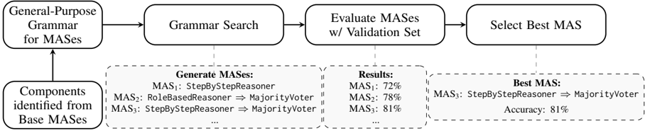

## Grammar Search for Multi-Agent Systems

Mayank Singh 1 * , Vikas Yadav 2 , Shiva Krishna Reddy Malay 2 , Shravan Nayak 3 , Sai Rajeswar 2 , Sathwik Tejaswi Madhusudhan 2 , Eduardo Blanco 1

1 University of Arizona

2 ServiceNow

3 Mila - Quebec AI Institute

## Abstract

Automatic search for Multi-Agent Systems has recently emerged as a key focus in agentic AI research. Several prior approaches have relied on LLM-based free-form search over the code space. In this work, we propose a more structured framework that explores the same space through a fixed set of simple, composable components. We show that, despite lacking the generative flexibility of LLMs during the candidate generation stage, our method outperforms prior approaches on four out of five benchmarks across two domains: mathematics and question answering. Furthermore, our method offers additional advantages, including a more cost-efficient search process and the generation of modular, interpretable multi-agent systems with simpler logic.

small scales, such manual design is labor-intensive and does not generalize across tasks (Wang et al., 2024a). To overcome these limitations, recent work has focused on automatic MAS search, where the goal is to discover effective MASes with minimal human input (Zhuge et al., 2024; Zhang et al., 2025a; Yue et al., 2025). These approaches define a search space of MASes and use optimization or exploration algorithms to navigate it.

## 1 Introduction

Large language models (LLMs) have emerged as powerful general-purpose reasoning systems capable of solving diverse tasks across language understanding, reasoning, and decision-making (Comanici et al., 2025; OpenAI, 2025). Increasingly, LLMs are deployed as autonomous agents for realworld applications such as coding (Yang et al., 2024), tool use (Schick et al., 2023), and computer interaction (He et al., 2024). This shift has inspired a growing line of work that organizes multiple LLMs into multi-agent systems (MASes), where specialized agents collaborate, exchange information, and refine each other's outputs to tackle complex problems (Du et al., 2023; Madaan et al., 2023; Yao et al., 2023). This paradigm reframes LLMs from being standalone solvers to components in a coordinated reasoning framework.

Early MASes were manually constructed, with researchers designing agent roles, communication patterns, and reasoning strategies by hand (Li et al., 2023; Park et al., 2023). While effective at

* Corresponding author: mayanks43@arizona.edu

Despite their progress, existing automatic methods face key challenges. Many methods such as ADAS (Hu et al., 2025) and AFlow (Zhang et al., 2025b) operate directly in code space, which, although expressive, often leads to syntactically invalid or semantically inconsistent programs that waste computational resources. In our analysis, ADAS generated invalid candidate MASes in more than 20% of search attempts. Furthermore, automatically discovered MASes can become unnecessarily complex, with large numbers of interconnected components that are difficult to interpret or extend. These issues limit the efficiency, transparency, and usability of MAS search.

To address these challenges, we introduce Grammar Search , a general framework for designing and discovering MASes that emphasizes modularity, simplicity, and correctness. The central idea is to represent MASes using a context-free grammar that defines how individual components can be assembled into larger systems. These components can be manually designed, obtained by decomposing existing MASes into smaller parts, or suggested by an LLM. The resulting components are constrained by our grammar, which encodes rules specifying how they can be connected. Sampling MASes from this grammar guarantees syntactic correctness and enables a structured search for novel MASes. The grammar is fully extensible and not restricted to the initial set of components. New components can be added as needed, making the framework adaptable to new tasks and domains.

Figure 1: Overview of our grammar-based approach to generate MASes. We search for multi-agent systems in code space without relying on LLMs for code generation. The grammar is general-purpose and specifies constraints on how to combine components; considering additional base MASes only requires identifying their components. The search process generates candidate MASes; the best one is selected based on validation accuracy.



By defining a structured space of valid MASes, Grammar Search effectively eliminates the need for LLM-based code generation during search, thereby preventing invalid programs and simplifying subsequent experimentation. Although the components are simple, the discovered MASes achieve competitive or superior performance compared to previous automatic methods across multiple reasoning benchmarks. At the same time, the search requires less computational effort, and the resulting MASes remain more interpretable.

In summary, our contributions are as follows: 1

1. We propose Grammar Search , a general framework for MAS discovery based on a context-free grammar that ensures modularity, correctness, and extensibility.
2. We demonstrate that our framework outperforms existing automatic search methods on four out of five benchmarks across two domains: mathematics and question answering.
3. Beyond accuracy, our framework provides a cheaper search stage and interpretable, simple, yet effective MASes.

## 2 Preliminaries

We begin by defining a few key terms used throughout this work.

Agents Following Plaat et al. (2025), we define agents as large language models (LLMs) that have been adapted for specific tasks through prompting or post-training, and that can reason through intermediate steps toward goals, act by executing operations or invoking external tools, and interact with users, environments, or other agents through communication channels such as web search, APIs,

1 Code at: https://github.com/mayanks43/grammar\_ search .

or memory modules.

Multi-Agent Systems A Multi-Agent System (MAS) is a collection of agents coordinating toward a shared goal. MASes are commonly represented as graphs (Zhuge et al., 2024), where nodes represent individual agents and edges represent channels of communication. Alternatively, MASes can be represented through executable code (Hu et al., 2025), where the structure of function calls and data flow explicitly defines the MAS.

MAS Search Space MASes span a large combinatorial search space that can vary along multiple axes, including the types of nodes, their interconnections, and the objectives used to evaluate them. We outline these axes at a conceptual level and provide examples from prior work in Section 3.

## 3 Related Work

Manually-designed MASes Most initial MASes were manually designed. Here, we describe some popular ones. Chain of Thought (CoT) (Wei et al., 2023) is often considered a trivial MAS, consisting of a single node with a prompt to solve the task step by step. Chain of Thought with SelfConsistency (CoT-SC) (Wang et al., 2023) builds on CoT by using multiple parallel CoT nodes, followed by a majority-voting node that selects the most common answer among parallel outputs. SelfRefine (Madaan et al., 2023) uses the same model to iteratively refine an initial answer based on selfgenerated feedback. In Multi-Agent Debate (Du et al., 2023), multiple agents debate over each other's answers, followed by a final decision agent that aggregates outputs from these agents. Treeof-Thoughts (Yao et al., 2023) solves problems by exploring a tree of possible next steps, evaluating each branch, and backtracking from mistakes

to find the optimal solution. Instead of manually designing MASes, in this work we focus on automatically searching for them given the task. We use the first four MASes as baselines for comparison, as well as a basis for our MAS grammar.

Automatic MAS Search Lately, there has been a plethora of methods for automatically searching for the best MASes. These methods differ in how they represent, evaluate, and search for the best MASes:

MAS Representation Different works have adopted different ways to represent MASes. Graphbased approaches such as GPTSwarm (Zhuge et al., 2024) and MaAS (Zhang et al., 2025a) represent agents as nodes and communication links as edges, allowing structural optimization of the graph. In contrast, code-based approaches such as ADAS (Hu et al., 2025) and AFlow (Zhang et al., 2025b) represent MASes as executable Python programs, where nodes correspond to API calls that can be connected in complex ways. This representation allows fine-grained logic such as branching, iteration, and function composition. Our method follows this latter direction, using a grammar to define composable code components that can be systematically explored.

Node Design and Optimization Each node in a MAS can be optimized along multiple dimensions. Prompts can be refined or evolved through techniques such as PromptBreeder (Fernando et al., 2023), or modified to encode distinct roles or personas for different agents (Du et al., 2023). LLM parameters can also be adapted through post-training, for example via fine-tuning as in Sirius (Zhao et al., 2025). In addition, new tools can be dynamically created when existing ones are insufficient for a task (Qiu et al., 2025).

Search Frequency and Scope MAS search can occur at different levels of granularity. Corpuslevel search methods such as ADAS, AFlow, and GPTSwarm discover one MAS that performs well across a dataset, while query-level methods such as MaAS, FlowReasoner (Gao et al., 2025), and MasRouter (Yue et al., 2025) generate or adapt a new MAS for each input query. Corpus-level methods are generally more efficient and stable, whereas query-level methods allow greater specialization. To maintain efficiency, we focus on corpus-level search in this work.

Search Objectives Search methods differ in their optimization objectives. Common objectives include benchmark accuracy, API call cost, latency, and safety considerations. Many recent approaches such as AFlow and MAS-ZERO (Ke et al., 2025a) adopt multi-objective optimization to balance these factors. In this work, we focus on benchmark accuracy and API call cost to discover MASes that achieve high accuracy while maintaining low search cost.

Evaluation and Candidate Selection Candidate MAS evaluation strategies also vary across works. GPTSwarm and ADAS select candidates based on validation set performance, while MASZERO uses prompting, i.e., asking an LLM to choose the better MAS based on observed behavior. In this work, we evaluate candidate MASes using validation performance, as it provides a more consistent and reliable measure of quality.

Search Algorithms Several strategies have been explored to traverse the MAS space. Iterative search (ADAS, MAS-ZERO) repeatedly asks an LLM to propose, refine, and build upon existing candidates. Reinforcement learning approaches such as GPTSwarm perform search and learning in parallel. Tree search variants such as Monte Carlo Tree Search (AFlow) have also been explored for structured exploration of MAS graphs. We adopt a random search strategy that explores the MAS space component by component.

Summary and Relation to This Work Across methods described in this section, the core challenge is the same: the MAS search space is vast. Our work differs in that it introduces a context-free grammar to define and constrain this space. This provides a principled way to systematically enumerate, compare, and analyze MASes while retaining the flexibility of code-based representations.

## 4 A Grammar for MASes

In this section, we describe our framework in detail. A context-free grammar serves as the central element of our approach. This grammar defines the structured design space that the framework explores when searching for valid MASes. We define a general-purpose grammar, shown in Figure 2, to enable systematic composition of MAS components. The MAS components appear in the figure as the terminals of the grammar. To obtain these

⟨

Figure 2: Our general-purpose context-free grammar to represent MASes. Note: SI = SingleInput, SO = SingleOutput, MI = MultiInput, MO = MultiOutput, cnt = count, and rnds = rounds.


| ⟨ System ⟩   | →     | ⟨ StartSI ⟩                                                                    |
|--------------|-------|--------------------------------------------------------------------------------|
| ⟨ StartSI ⟩  | → | | | ⟨ StartSISO ⟩ ⟨ StartSISO ⟩ ⟨ SI ⟩ ⟨ SIMO ⟩ ⟨ MI ⟩                             |
| ⟨ SI ⟩       | → | | | ⟨ SISO ⟩ ⟨ SISO ⟩ ⟨ SI ⟩ ⟨ SIMO ⟩ ⟨ MI ⟩                                       |
| ⟨ MI ⟩       | → | | | ⟨ MISO ⟩ ⟨ MISO ⟩ ⟨ SI ⟩ ⟨ MIMO ⟩ ⟨ MI ⟩                                       |
| StartSISO ⟩  | → |   | StepByStepReasoner[cnt=1] RoleBasedReasoner[cnt=1]                             |
| ⟨ SISO ⟩     | → | | | StepByStepReasoner[cnt=1] RoleBasedReasoner[cnt=1] SelfCriticIteration[rnds=5] |
| ⟨ SIMO ⟩     | → |   | StepByStepReasoner[cnt=5] RoleBasedReasoner[cnt=5]                             |
| ⟨ MISO ⟩     | → |   | MajorityVoter ConsensusBuilder                                                 |
| ⟨ MIMO ⟩     | → |   | DebateIteration[rnds=2] MultiSelfCriticIteration[rnds=5]                       |

components, we manually decompose several existing MASes into smaller subcomponents. We will refer to these MASes as base MASes to contrast them with the automatically discovered MASes obtained through search. By manually decompose , we mean that we examine the code implementations of these MASes and identify sections that can be encapsulated as stand-alone components. More specifically, we decompose four manually designed base MASes into smaller components: CoT, CoT-SC, Self-Refine, and Multi-Agent Debate. However, this decomposition is not limited to these four MASes and can be extended to any group of MASes that differ substantially.

The primary goal of our grammar is to enable the exploration of new MASes composed of the smaller components derived from this decomposition. It is designed to be general, allowing new components to be added as needed. We now describe the grammar in detail.

Grammar Non-terminals The core of our grammar consists of non-terminals , defined solely by their input-output structure. We distinguish four categories: SISO (Single Input, Single Output), SIMO (Single Input, Multiple Outputs), MISO (Multiple Inputs, Single Output), and MIMO (Multiple Inputs, Multiple Outputs), each specifying the number of inputs and outputs they allow.

As might be evident, our grammar generally enforces that input and output counts match between components when chained together. Some components, such as SelfCriticIteration (which refines a provided answer), cannot serve as the first component and therefore require additional logic.

Another constraint that enables seamless composition is that each component must return either a single complete answer or multiple complete answers. Subsequent components either build directly on the previous answers or generate their own, using the prior answers as a side input. This simple formulation allows any component of any MAS to naturally integrate into our grammar.

Grammar Terminals The terminals in our grammar correspond to concrete components that can be combined to construct new MASes. We now describe the major components obtained from decomposing the four basic MASes mentioned earlier. However, our grammar is designed to be extensible and can easily accommodate additional components beyond these.

StepByStepReasoner( count = x ) This is the Chain-of-Thought component. Given a task, the LLM is asked to answer step by step. The count parameter allows the generation of multiple answers in parallel. This component may behave as either SISO or SIMO depending on the number of answers generated.

RoleBasedReasoner( count = x ) This component functions similarly to StepByStepReasoner, but with the added instruction that the LLM should assume a specific role or persona. For example, it may be asked to take on the role of a math professor when solving math problems. The count parameter again enables the generation of multiple parallel answers. Depending on the value of count , this component may be either SISO or SIMO.

SelfCriticIteration( rounds = x ) This component consists of a critic agent followed by a reflect agent, connected in sequence and repeated over a number of rounds as specified by the rounds parameter. The critic agent critiques a response it receives from a previous component, and the reflect agent uses the critic's feedback to generate a better answer. This is strictly a SISO component.

DebateIteration( rounds = x ) This is a MIMO component that requires input from a SIMO or another MIMO component. It performs iterative

Table 1: The four base MASes we work with, their component sequences, and their derivations with our grammar. We condense the names of some components to save space. Component sequence depicts how the respective MAS is represented in our grammar. Derivation shows how to derive the MAS through our grammar rules.

| MAS         | Component Sequence                   | Grammar Derivation                                                                                                                                           |
|-------------|--------------------------------------|--------------------------------------------------------------------------------------------------------------------------------------------------------------|
| CoT         | StepByStep[1]                        | ⟨ System ⟩ →⟨ StartSI ⟩ ⟨ StartSI ⟩ →⟨ StartSISO ⟩ ⟨ StartSISO ⟩→ StepByStep[1]                                                                              |
| CoT-SC      | StepByStep[5] ⇒ MajorityVoter        | ⟨ System ⟩ →⟨ StartSI ⟩ ⟨ StartSI ⟩ →⟨ SIMO ⟩ ⟨ MI ⟩ ⟨ SIMO ⟩→ StepByStep[5] ⟨ MI ⟩ →⟨ MISO ⟩ ⟨ MISO ⟩→ MajorityVoter                                        |
| Self-Refine | StepByStep[1] ⇒ SelfCritic[5]        | ⟨ System ⟩ →⟨ StartSI ⟩ ⟨ StartSI ⟩ →⟨ StartSISO ⟩ ⟨ SI ⟩ ⟨ StartSISO ⟩→ StepByStep[1] ⟨ SI ⟩ →⟨ SISO ⟩ ⟨ SISO ⟩→ SelfCritic[5]                              |
| MA-Debate   | RoleBased[5] ⇒ Debate[2] ⇒ Consensus | ⟨ System ⟩ →⟨ StartSI ⟩ ⟨ StartSI ⟩ →⟨ SIMO ⟩ ⟨ MI ⟩ ⟨ SIMO ⟩→ RoleBased[5] ⟨ MI ⟩ →⟨ MIMO ⟩ ⟨ MI ⟩ ⟨ MIMO ⟩→ Debate[2] ⟨ MI ⟩ →⟨ MISO ⟩ ⟨ MISO ⟩→ Consensus |

debates among multiple agents using the input answers it receives. The rounds parameter specifies how many iterations the debate process undergoes.

MultiSelfCriticIteration( rounds = x ) This is a MIMO version of SelfCriticIteration. It applies the critic-and-reflect sequence in parallel across multiple input answer streams.

from the previous component as input and return a list of answers as output. The only exception is the first component, which takes the task details as input. For single-input components, the input list contains a single answer; likewise, the output list contains one answer for single-output components.

MajorityVoter This is a MISO component that condenses multiple answer streams into a single answer. As the name suggests, it selects the most common answer among those provided.

ConsensusBuilder This is another MISO component. Unlike MajorityVoter, it does not select an existing answer. Instead, the component synthesizes a new final answer based on the multiple answers it receives as input.

Note that MultiSelfCriticIteration is not a component of the base MASes. It was added as a representative example to demonstrate how easily new components can be integrated into the grammar.

Table 1 shows representative sequences in our grammar corresponding to the four initial MASes, along with their derivations.

## MASes from component sequences Each termi-

nal in our grammar corresponds to a code fragment. These fragments follow a simple input-output interface: they take the task details and a list of answers

To construct a MAS corresponding to a component sequence, the associated code fragments are stitched together, with inputs and outputs passed along the sequence. Each sequence therefore corresponds to a deterministic program representing a MAS. Example sequences and their corresponding MASes are provided in Appendix D.

## 5 Searching Over MAS Grammar

We use the grammar defined above to sample new component sequences and select the bestperforming corresponding MAS. By randomly sampling a sequence, we mean starting from the start symbol of the grammar and repeatedly choosing production rules at random until a terminal-only sequence is obtained.

Our general algorithm proceeds as follows:

1. Randomly sample a component sequence.
2. If the sequence has not been seen before, evaluate the corresponding MAS on the validation set.

After a fixed number of iterations, we select the best MAS based on the performance scores of the

sampled MASes on the validation set.

However, we find that pure random sampling often fails to include components that are buried deeper in the grammar. To ensure that all components are fairly represented, we adopt a forced sampling strategy.

In forced sampling, we repeatedly sample sequences until one containing a specific target component is found, and then evaluate the resulting MAS on the validation set. We depict the full algorithm in Appendix B but also summarize it here:

1. Maintain a count of how many times each component has been sampled.
2. Cluster components by their sampling counts.
3. Begin with the lowest-count cluster (initially 0) and force-sample sequences containing each component in the cluster, followed by evaluation of the resulting MAS.
4. Exhaust all components in the lower-count clusters before moving on to higher ones.

Over time, if a component falls behind in its sampling frequency, it will move into the lowestcount cluster and be force-sampled accordingly. This mechanism ensures that all components in the grammar are sampled and evaluated in a fair and balanced manner.

We also explored more sophisticated search methods, such as Thompson Sampling (Thompson, 1933) and Monte Carlo Tree Search (Kocsis and Szepesvári, 2006), to improve the discovery of the best component sequence. However, we did not observe any performance gains from their use and therefore chose to retain our simpler forced sampling strategy.

## 6 Evaluation

In this section, we discuss the evaluation setup and results for our method on various datasets.

Datasets We evaluate our method on four datasets: two from mathematics and two from question answering. We describe them below:

MATH (Hendrycks et al., 2021b): This dataset contains 12,000 competition-style math problems. For the search phase, we use 160 random problems from the training set as our validation set. For testing, we evaluate on two subsets: the 500-problem partition known as MATH500, and a separate partition of 486 level-5 problems, following the setup in AFlow.

AIME (Veeraboina, 2023): This dataset consists of questions from the American Invitational Math- ematics Examination and is more challenging than the MATH dataset. We use 160 random problems from the 1983-2019 set for validation. For testing, we use 133 problems from the years 2020-2024. We avoid the more common 30-problem split from the most recent year to ensure greater statistical power during evaluation (Hochlehnert et al., 2025).

MMLU-Pro (Wang et al., 2024b): MMLU-Pro is a more difficult variant of the MMLU benchmark (Hendrycks et al., 2021a), a general-domain QA dataset. Unlike the original MMLU, which provides 4 answer choices per question, MMLU-Pro includes 10 options per question. Because the provided validation set contains only 70 problems, we construct larger validation and test sets by splitting the full test set into two parts: one for validation and one for testing. From the validation split, we randomly select 160 problems for the validation set, and from the test split, we randomly select 500 problems for the test set. Some problems had to be dropped due to content policy triggers from our LLM API provider. As a result, the final validation and test sets contain 158 and 494 problems, respectively. To the best of our knowledge, we are the first to evaluate automatic MAS search methods on this dataset.

GPQA (Rein et al., 2023): The Google-Proof Question Answering dataset (GPQA) contains expert-authored questions across multiple disciplines, designed to resist shallow, web-searchbased answering. As our test set, we use the hard variant GPQA-Diamond, which contains 198 questions. To construct the validation set, we subtract the 198 Diamond problems from the main GPQA set, yielding 250 remaining problems. From these, we randomly sample 160 for the validation set.

Baselines As baselines, we use the four base MASes we have been working with: CoT, CoT-SC, Self-Refine, and Multi-Agent Debate. In addition, we compare our method against two leading corpuslevel automatic MAS search methods: AFlow and ADAS. We run ADAS for 30 iterations and AFlow for 20 iterations, following the default settings in their respective codebases. Similar to ADAS, we run our search algorithm for 30 iterations on all evaluated datasets.

Evaluation Metric The evaluation metric for all datasets is accuracy. Following recent works that employ LLMs for answer equivalence checking (Ho et al., 2025; Ke et al., 2025b), we consider a prediction correct if it matches the ground

Table 2: Results (accuracy and standard deviation across all runs) obtained with manually-designed MASes (top block) and three automatic MAS search methods (bottom block). Grammar Search, our approach, outperforms previous MAS search methods on average and in all but one benchmark. Additionally, Grammar Search never generates an invalid MAS and it is more efficient (Section 6).

|                              | Math       | Math       | Math       | Other Domains   | Other Domains   | Avg.   |
|------------------------------|------------|------------|------------|-----------------|-----------------|--------|
|                              | MATH500    | MATH lvl 5 | AIME       | GPQA-D          | MMLU-Pro        |        |
| Manually-Designed MASes      |            |            |            |                 |                 |        |
| Chain of Thought             | 77.7 ± 0.8 | 61.7 ± 1.7 | 7.6 ± 1.2  | 43.2 ± 2.5      | 65.9 ± 1.4      | 51.2   |
| CoT-Self Consistency         | 79.3 ± 0.7 | 64.2 ± 1.3 | 8.5 ± 1.6  | 43.7 ± 2.6      | 67.1 ± 0.8      | 52.6   |
| Self-Refine                  | 78.1 ± 1.1 | 62.8 ± 1.2 | 8.2 ± 1.7  | 43.3 ± 2.2      | 66.2 ± 1.1      | 51.7   |
| Multi-Agent Debate           | 79.8 ± 0.9 | 65.8 ± 1.1 | 10.4 ± 1.7 | 44.6 ± 2.5      | 67.4 ± 1.0      | 53.6   |
| Automatic MAS Search Methods |            |            |            |                 |                 |        |
| ADAS                         | 80.9 ± 0.9 | 66.6 ± 1.4 | 8.7 ± 1.3  | 46.2 ± 2.3      | 68.5 ± 1.2      | 54.2   |
| AFlow                        | 80.0 ± 1.0 | 65.7 ± 1.0 | 8.6 ± 1.5  | 42.8 ± 2.9      | 65.4 ± 0.8      | 52.5   |
| Grammar search (Ours)        | 81.4 ± 0.5 | 67.2 ± 1.6 | 11.1 ± 1.3 | 46.6 ± 2.0      | 68.4 ± 0.7      | 55.0   |

truth exactly or is judged equivalent by a strong LLM ( gpt-5 ; OpenAI 2025) when a direct equality check fails.

For all datasets, following Zhang et al. (2025b), we evaluate each problem five times on the validation set during the search phase and use the average accuracy to guide the search for the best MAS. In the test phase, we evaluate the best MAS found during the search phase eight times on the test sets of MATH and MMLU-Pro and report the average accuracy and standard deviation. Because the GPQA and AIME test sets are smaller, we evaluate them 20 and 30 times, respectively, following the recommendations of Hochlehnert et al. (2025) for repeated evaluations. These numbers were chosen to keep the total number of evaluations roughly consistent with those of MATH and MMLU-Pro.

LLM Setup Throughout our evaluations, we use gpt-4o-mini as the backbone LLM (i.e., the LLM powering the nodes in the MAS). If a method requires the use of an optimizer LLM or a metaagent (i.e., the LLM that proposes the next MAS to evaluate during the search phase), we use gpt-4.1-mini , as it is a newer and stronger model than gpt-4o-mini . Note that our method does not require an optimizer LLM.

Results We now discuss the results obtained by evaluating our method under the setup described above. The main results are shown in Table 2. We find that our method performs better than the next-best automatic search method, ADAS, on four out of five evaluated datasets as well as on average. Our method improves accuracy by 0.8 points over ADAS, 2.5 points over AFlow, and 1.4 points over the strongest manually designed MAS base- line (Multi-Agent Debate). On AIME in particular, our method achieves a 2.5% absolute improvement over other automatic search methods. In addition, we find that our method tends to produce lower standard deviations, with an average value of approximately 1.0 compared to 1.2 for ADAS, 1.2 for AFlow, and 1.4 for manually designed MASes. This indicates that Grammar Search not only performs better on average but also yields more stable and reliable MASes.

## 6.1 Evaluation Beyond Accuracy

Accuracy is not the only factor that matters when choosing a framework. Therefore, we further compare Grammar Search and ADAS on metrics related to efficiency and MAS quality, as summarized in Table 3. Grammar Search is more efficient, reliable, and interpretable than ADAS while achieving comparable accuracy. Our framework eliminates wasted computation during MAS generation, reduces overall API costs by approximately 12%, and always produces simpler, valid MASes. While ADAS occasionally discovers a strong MAS early in the search, it spends substantial computation on invalid or overly complex MASes, whereas Grammar Search reliably constructs valid and concise MASes through structured component composition. Note that by valid MASes, we mean those that do not contain any syntactic or runtime errors and achieve an accuracy greater than zero when evaluated on the validation set.

During the search phase, Grammar Search incurs zero cost for MAS generation because it does not rely on LLMs to generate code. All MASes are constructed from verified components, ensuring 100% validity and eliminating wasted computa-

|                             | ADAS    | Grammar   |
|-----------------------------|---------|-----------|
| Valid MASes                 | 77%     | 100%      |
| Avg. generation cost        | $0.06   | $0.00     |
| Avg. validation cost        | $10.19  | $8.37     |
| Avg. total cost             | $10.25  | $8.37     |
| Invalid MASes               | 23%     | 0%        |
| Avg. generation cost        | $0.25   | $0.00     |
| Avg. validation cost        | $0.96   | $0.00     |
| Avg. total cost             | $1.21   | $0.00     |
| All MASes                   |         |           |
| Avg. code length. (#chars.) | 8,611.8 | 4,391.5   |
| Avg. code growth (#chars.)  | 523.8   | 32.8      |
| Best MAS found at iteration | 3.0     | 11.5      |

Table 3: Analysis of MASes generated during the search phase of ADAS and Grammar Search. Code growth is measured with respect to the previously generated MAS. 23% of ADAS-generated MASes are invalid (the code does not run or they obtain 0% accuracy). Grammar Search is more efficient across the board, and the generated MASes grow at a slower pace and are shorter.

tion on invalid MASes. By contrast, ADAS incurs nontrivial generation costs ($0.06 per valid MAS and $0.25 per invalid MAS) and wastes computation on invalid generations, which occur in 23% of cases. For the evaluation of valid MASes, Grammar Search and ADAS perform a similar number of trials, leading to comparable evaluation costs. Overall, Grammar Search achieves an average total search cost of $8.37 per MAS, compared to $10.25 for ADAS, a reduction of about 12%.

Beyond cost, Table 3 also highlights major differences in MAS reliability and complexity. ADAS produces MASes with longer code (8,612 vs. 4,392 characters on average) and substantial code growth across search iterations (524 vs. 33 characters per iteration), yet this added complexity does not lead to higher accuracy. Moreover, ADAS tends to find its best MAS early (around iteration 3), suggesting that later iterations mainly generate redundant or inefficient code. In contrast, Grammar Search maintains steady exploration and discovers its best MAS later (around iteration 11.5), indicating a more systematic and stable search process.

Overall, Grammar Search achieves lower searchphase cost, guarantees valid MAS generation, and produces shorter, more interpretable MASes than ADAS, demonstrating that structured, grammarbased search can match or surpass the effectiveness of free-form code generation while being substantially more efficient and reliable.

Table 4: Validation accuracies of the best MASes found by Grammar Search with forced and random sampling. Random sampling performs worse on average.

| Dataset   | Forced     | Random     |
|-----------|------------|------------|
| MATH      | 81.6 ± 0.7 | 80.8 ± 0.7 |
| AIME      | 24.6 ± 2.2 | 24.0 ± 1.6 |
| GPQA      | 41.7 ± 3.0 | 41.6 ± 2.6 |
| MMLU-Pro  | 70.1 ± 1.8 | 69.5 ± 2.1 |
| Avg.      | 54.5 ± 2.0 | 54.0 ± 1.8 |

Best MASes found We depict the best MASes found through our method in Appendix A. Across datasets, the component sequences share several components, most notably DebateIteration and StepByStepReasoner (the SIMO version), suggesting that these are generally strong building blocks.

Ablation We also describe an ablation experiment comparing the forced sampling strategy with the random sampling strategy for sampling component sequences during the search phase. Table 4 presents the results of this ablation. While the gains are not large, they are consistent across datasets, indicating a clear advantage of the forced sampling strategy over random sampling.

## 7 Conclusion

In this work, we proposed Grammar Search , a new corpus-level framework for automatic MAS discovery in code space. Our method constructs a context-free grammar that defines a structured and extensible design space for composing multi-agent systems. This grammar constrains how buildingblock components can be combined, ensuring that only valid MASes are generated. By sampling from the grammar, we produce valid MAS candidates during the search phase, thereby avoiding wasted computation and API costs on invalid generations. To maintain coverage and prevent under-testing, we employed a simple forced-sampling strategy that balances the frequency of each component across sampled sequences.

We showed that Grammar Search outperforms existing automatic MAS search methods and manually designed baselines on four out of five benchmarks, as well as on average. Furthermore, the MASes produced by our framework are modular, interpretable, and efficient, providing simpler yet effective multi-agent systems while reducing search cost.

## Limitations

This work has several limitations. First, our approach lacks the free-form expressivity of LLMbased code generation, and the MASes it produces are constrained by the grammar we developed. However, this constraint offers practical benefits, as it enables a cheaper search stage and avoids wasted computation on invalid MASes. In addition, our grammar is extensible and could potentially be modified, for example by an LLM, to approach the expressivity of other methods.

Second, the best MASes generated by our method depend on the initial components defined in the grammar. If these components are weak, the resulting MASes will not achieve performance comparable to that of the best existing methods.

Finally, although we were able to achieve good results with a relatively simple random search strategy, we expect that expanding the grammar with more components will require more sophisticated search algorithms such as Monte Carlo Tree Search or Thompson sampling.

## Ethics

Wework with LLMs in this study, which are known to carry various social and ethical risks (Weidinger et al., 2021). Techniques such as RLHF have helped mitigate some of these risks, but unsafe behaviors may still arise due to methods like LLM jailbreaking.

All datasets, models, and code used in this study were obtained from public sources and used in accordance with their respective licenses and terms of use.

## Note on AI Assistant Usage

We acknowledge the use of AI tools such as GPT-5 and Claude Opus 4.1 for grammar checking, paraphrasing, and polishing the manuscript to improve clarity, as well as for assistance in writing and debugging portions of the associated code.

## References

Gheorghe Comanici, Eric Bieber, Mike Schaekermann, Ice Pasupat, Noveen Sachdeva, Inderjit Dhillon, Marcel Blistein, Ori Ram, Dan Zhang, Evan Rosen, and 1 others. 2025. Gemini 2.5: Pushing the frontier with advanced reasoning, multimodality, long context, and next generation agentic capabilities. arXiv preprint arXiv:2507.06261 .

Yilun Du, Shuang Li, Antonio Torralba, Joshua B Tenenbaum, and Igor Mordatch. 2023. Improving factuality and reasoning in language models through multiagent debate. In Forty-first International Conference on Machine Learning .

Chrisantha Fernando, Dylan Banarse, Henryk Michalewski, Simon Osindero, and Tim Rocktäschel. 2023. Promptbreeder: Self-referential self-improvement via prompt evolution. Preprint , arXiv:2309.16797.

Hongcheng Gao, Yue Liu, Yufei He, Longxu Dou, Chao Du, Zhijie Deng, Bryan Hooi, Min Lin, and Tianyu Pang. 2025. Flowreasoner: Reinforcing query-level meta-agents. arXiv preprint arXiv:2504.15257 .

Hongliang He, Wenlin Yao, Kaixin Ma, Wenhao Yu, Yong Dai, Hongming Zhang, Zhenzhong Lan, and Dong Yu. 2024. WebVoyager: Building an end-toend web agent with large multimodal models. In Proceedings of the 62nd Annual Meeting of the Association for Computational Linguistics (Volume 1: Long Papers) , pages 6864-6890, Bangkok, Thailand. Association for Computational Linguistics.

Dan Hendrycks, Collin Burns, Steven Basart, Andy Zou, Mantas Mazeika, Dawn Song, and Jacob Steinhardt. 2021a. Measuring massive multitask language understanding. Proceedings of the International Conference on Learning Representations (ICLR) .

Dan Hendrycks, Collin Burns, Saurav Kadavath, Akul Arora, Steven Basart, Eric Tang, Dawn Song, and Jacob Steinhardt. 2021b. Measuring mathematical problem solving with the math dataset. Preprint , arXiv:2103.03874.

Xanh Ho, Jiahao Huang, Florian Boudin, and Akiko Aizawa. 2025. Llm-as-a-judge: Reassessing the performance of llms in extractive qa. arXiv preprint arXiv:2504.11972 .

Andreas Hochlehnert, Hardik Bhatnagar, Vishaal Udandarao, Samuel Albanie, Ameya Prabhu, and Matthias Bethge. 2025. A sober look at progress in language model reasoning: Pitfalls and paths to reproducibility. arXiv preprint arXiv:2504.07086 .

Shengran Hu, Cong Lu, and Jeff Clune. 2025. Automated design of agentic systems. In The Thirteenth International Conference on Learning Representations .

Zixuan Ke, Austin Xu, Yifei Ming, Xuan-Phi Nguyen, Caiming Xiong, and Shafiq Joty. 2025a. Mas-zero: Designing multi-agent systems with zero supervision. Preprint , arXiv:2505.14996.

Zixuan Ke, Austin Xu, Yifei Ming, Xuan-Phi Nguyen, Caiming Xiong, and Shafiq Joty. 2025b. Mas-zero: Designing multi-agent systems with zero supervision. arXiv preprint arXiv:2505.14996 .

Levente Kocsis and Csaba Szepesvári. 2006. Bandit based monte-carlo planning. In European conference on machine learning , pages 282-293. Springer.

Guohao Li, Hasan Abed Al Kader Hammoud, Hani Itani, Dmitrii Khizbullin, and Bernard Ghanem. 2023. CAMEL: Communicative agents for 'mind' exploration of large language model society. In Thirtyseventh Conference on Neural Information Processing Systems .

Aman Madaan, Niket Tandon, Prakhar Gupta, Skyler Hallinan, Luyu Gao, Sarah Wiegreffe, Uri Alon, Nouha Dziri, Shrimai Prabhumoye, Yiming Yang, and 1 others. 2023. Self-refine: Iterative refinement with self-feedback. Advances in Neural Information Processing Systems , 36:46534-46594.

OpenAI. 2025. Introducing gpt-5. https:// openai.com/index/introducing-gpt-5/ . Accessed: 2025-10-05.

Joon Sung Park, Joseph O'Brien, Carrie Jun Cai, Meredith Ringel Morris, Percy Liang, and Michael S. Bernstein. 2023. Generative agents: Interactive simulacra of human behavior. In Proceedings of the 36th Annual ACM Symposium on User Interface Software and Technology , UIST '23, New York, NY, USA. Association for Computing Machinery.

Aske Plaat, Max van Duijn, Niki van Stein, Mike Preuss, Peter van der Putten, and Kees Joost Batenburg. 2025. Agentic large language models, a survey. Preprint , arXiv:2503.23037.

Jiahao Qiu, Xuan Qi, Tongcheng Zhang, Xinzhe Juan, Jiacheng Guo, Yifu Lu, Yimin Wang, Zixin Yao, Qihan Ren, Xun Jiang, Xing Zhou, Dongrui Liu, Ling Yang, Yue Wu, Kaixuan Huang, Shilong Liu, Hongru Wang, and Mengdi Wang. 2025. Alita: Generalist agent enabling scalable agentic reasoning with minimal predefinition and maximal self-evolution. Preprint , arXiv:2505.20286.

David Rein, Betty Li Hou, Asa Cooper Stickland, Jackson Petty, Richard Yuanzhe Pang, Julien Dirani, Julian Michael, and Samuel R. Bowman. 2023. Gpqa: A graduate-level google-proof q&amp;a benchmark. Preprint , arXiv:2311.12022.

Timo Schick, Jane Dwivedi-Yu, Roberto Dessi, Roberta Raileanu, Maria Lomeli, Eric Hambro, Luke Zettlemoyer, Nicola Cancedda, and Thomas Scialom. 2023. Toolformer: Language models can teach themselves to use tools. In Thirty-seventh Conference on Neural Information Processing Systems .

William R Thompson. 1933. On the likelihood that one unknown probability exceeds another in view of the evidence of two samples. Biometrika , 25(3/4):285294.

Hemish Veeraboina. 2023. Aime problem set 19832024.

Lei Wang, Chen Ma, Xueyang Feng, Zeyu Zhang, Hao Yang, Jingsen Zhang, Zhiyuan Chen, Jiakai Tang, Xu Chen, Yankai Lin, Wayne Xin Zhao, Zhewei Wei, and Jirong Wen. 2024a. A survey on large language model based autonomous agents. Frontiers Comput. Sci. , 18(6):186345.

Xuezhi Wang, Jason Wei, Dale Schuurmans, Quoc V Le, Ed H. Chi, Sharan Narang, Aakanksha Chowdhery, and Denny Zhou. 2023. Self-consistency improves chain of thought reasoning in language models. In The Eleventh International Conference on Learning Representations .

Yubo Wang, Xueguang Ma, Ge Zhang, Yuansheng Ni, Abhranil Chandra, Shiguang Guo, Weiming Ren, Aaran Arulraj, Xuan He, Ziyan Jiang, and 1 others. 2024b. Mmlu-pro: A more robust and challenging multi-task language understanding benchmark. Advances in Neural Information Processing Systems , 37:95266-95290.

Jason Wei, Xuezhi Wang, Dale Schuurmans, Maarten Bosma, Brian Ichter, Fei Xia, Ed Chi, Quoc Le, and Denny Zhou. 2023. Chain-of-thought prompting elicits reasoning in large language models. Preprint , arXiv:2201.11903.

Laura Weidinger, John Mellor, Maribeth Rauh, Conor Griffin, Jonathan Uesato, Po-Sen Huang, Myra Cheng, Mia Glaese, Borja Balle, Atoosa Kasirzadeh, Zac Kenton, Sasha Brown, Will Hawkins, Tom Stepleton, Courtney Biles, Abeba Birhane, Julia Haas, Laura Rimell, Lisa Anne Hendricks, and 4 others. 2021. Ethical and social risks of harm from language models. Preprint , arXiv:2112.04359.

John Yang, Carlos E Jimenez, Alexander Wettig, Kilian Lieret, Shunyu Yao, Karthik Narasimhan, and Ofir Press. 2024. Swe-agent: Agent-computer interfaces enable automated software engineering. Advances in Neural Information Processing Systems , 37:5052850652.

Shunyu Yao, Dian Yu, Jeffrey Zhao, Izhak Shafran, Tom Griffiths, Yuan Cao, and Karthik Narasimhan. 2023. Tree of thoughts: Deliberate problem solving with large language models. Advances in neural information processing systems , 36:11809-11822.

Yanwei Yue, Guibin Zhang, Boyang Liu, Guancheng Wan, Kun Wang, Dawei Cheng, and Yiyan Qi. 2025. Masrouter: Learning to route llms for multi-agent systems. arXiv preprint arXiv:2502.11133 .

Guibin Zhang, Luyang Niu, Junfeng Fang, Kun Wang, Lei Bai, and Xiang Wang. 2025a. Multi-agent architecture search via agentic supernet. arXiv preprint arXiv:2502.04180 .

Jiayi Zhang, Jinyu Xiang, Zhaoyang Yu, Fengwei Teng, Xiong-Hui Chen, Jiaqi Chen, Mingchen Zhuge, Xin Cheng, Sirui Hong, Jinlin Wang, Bingnan Zheng, Bang Liu, Yuyu Luo, and Chenglin Wu. 2025b. AFlow: Automating agentic workflow generation. In The Thirteenth International Conference on Learning Representations .

Wanjia Zhao, Mert Yuksekgonul, Shirley Wu, and James Zou. 2025. Sirius: Self-improving multi-agent systems via bootstrapped reasoning. arXiv preprint arXiv:2502.04780 .

Mingchen Zhuge, Wenyi Wang, Louis Kirsch, Francesco Faccio, Dmitrii Khizbullin, and Jürgen Schmidhuber. 2024. Gptswarm: Language agents as optimizable graphs. In Forty-first International Conference on Machine Learning .

## A Appendix 1

The best component sequences discovered across each dataset using Grammar Search are depicted in Table 5.

## B Appendix 2

Simplified python code for Grammar Search with Forced Sampling can be found in Listing 1.

## C Appendix 3

Our code infrastructure for calling LLMs inside MASes is similar to ADAS. A simplified version is depicted in Listing 2.

## D Appendix 4

We depict code for several MASes generated through our framework in Listings 3, 4 and 5.

```
1 def grammar_mas_search(grammar , validation_set , iterations): 2 """ 3 Grammar -based Multi -Agent System search with forced component sampling. 4 5 Args: 6 grammar: Grammar rules for MAS generation 7 validation_set: Validation dataset for evaluation 8 iterations: Total number of iterations 9 10 Returns: 11 best_sequence: Best component sequence found 12 """ 13 # Initialize component counts and evaluated sequences 14 component_counts = {c: 0 for c in get_all_components(grammar)} 15 evaluated_sequences = set () 16 sequence_scores = {} 17 18 for t in range (1, iterations + 1): 19 # Find components with minimum observation count 20 min_count = min (component_counts.values()) 21 components_with_min_count = [c for c, count in component_counts.items() 22 if count == min_count] 23 24 # Force each minimum -count component 25 for component in components_with_min_count: 26 # Sample sequences until target component appears 27 while True: 28 # expand_grammar(): randomly derive terminal sequence from ↪ → grammar 29 sequence = expand_grammar(grammar) 30 31 # Check if component in sequence and sequence is new 32 if component in sequence and tuple (sequence) not in ↪ → evaluated_sequences: 33 break 34 35 # evaluate_sequence(): run sequence on validation set, return ↪ → accuracy 36 score = evaluate_sequence(sequence , validation_set) 37 38 # Update tracking structures 39 evaluated_sequences.add( tuple (sequence)) 40 sequence_scores[ tuple (sequence)] = score 41 component_counts[component] += 1 42 43 # Return sequence with highest score 44 best_sequence = max (sequence_scores.keys(), key= lambda s: ↪ → sequence_scores[s]) 45 return list (best_sequence)
```

Listing 1: Grammar MAS Search with Forced Sampling

| Dataset   | Best component sequence found                                                                             |
|-----------|-----------------------------------------------------------------------------------------------------------|
| AIME      | StepByStepReasoner(5) → DebateIteration(2) → DebateIteration(2) → MajorityVoter                           |
| GPQA      | StepByStepReasoner(5) → MultiSelfCriticIteration(5) → DebateIteration(2) → ConsensusBuilder               |
| MATH      | StepByStepReasoner(5) → DebateIteration(2) → ConsensusBuilder                                             |
| MMLU-Pro  | StepByStepReasoner(5) → DebateIteration(2) → MajorityVoter → RoleBasedReasoner(1) → StepByStepReasoner(1) |

Table 5: We present the best component sequence discovered for each dataset using Grammar Search with the forced sampling strategy. For brevity, parameter names are omitted.

```
1 # Named tuple for information passing between agents 2 from collections import namedtuple 3 Info = namedtuple('Info', ['name', 'author', 'content', 'iteration_idx']) 4 5 class LLMAgentBase: 6 """Base class for LLM agents.""" 7 def __init__(self, agent_name , role='assistant', temperature=0.5): 8 self.agent_name = agent_name 9 self.role = role 10 self.temperature = temperature 11 12 def __call__(self, inputs , instruction , iteration_idx=-1): 13 # Construct prompt from inputs and instruction 14 prompt = self.format_inputs(inputs) + instruction 15 # Query LLM and return Info object 16 response = query_llm(prompt , self.temperature) 17 return Info('answer', self.agent_name , response , iteration_idx) 18 19 class AgentSystem: 20 """Base class for multi -agent systems.""" 21 def forward(self, taskInfo): 22 # To be implemented by generated code 23 pass
```

Listing 2: Core Infrastructure Components

```
1 def forward(self, taskInfo): 2 # Component function definitions 3 def component_0_step_by_step_plural(taskInfo , prev_answer=None): 4 '''Multiple parallel step -by-step reasoners''' 5 inputs = [taskInfo] 6 instruction = "Please think step by step and then solve the task. Put ↪ → your final answer in \\boxed{}." 7 8 if prev_answer is not None: 9 inputs.append(prev_answer) 10 instruction = "Based on the previous solution above , please think ↪ → step by step and provide your own solution. Put your final answer in ↪ → \\boxed{}." 11 12 N = 5 13 agents = [LLMAgentBase('Chain-of-Thought Agent', temperature=0.8) for _ ↪ → in range (N)] 14 15 all_results = [] 16 for i in range (N): 17 answer = agents[i](inputs , instruction) 18 all_results.append(answer) 19 20 return all_results , agents 21 22 def component_1_majority_voter(taskInfo , all_results): 23 '''Apply semantic -aware majority voting using LLM''' 24 voting_instruction = "Given these " + str ( len (all_results)) + " ↪ → solutions to the same problem:\\n\\n" 25 for i, response in enumerate (all_results , 1): 26 voting_instruction += "\\nSolution " + str (i) + ":\\n" + ↪ → response.content + "\\n" 27 28 voting_instruction += "\\nAnalyze these solutions and identify which ↪ → answer appears most frequently.\\n" 29 voting_instruction += "Copy that ENTIRE solution verbatim , including ↪ → all reasoning steps.\\n" 30 voting_instruction += "After copying the solution , ensure your final ↪ → answer is in \\boxed{}." 31 32 voting_agent = LLMAgentBase('Voting Agent', temperature=0.1) 33 final_answer = voting_agent([taskInfo], voting_instruction) 34 35 return final_answer 36 37 # Orchestration 38 all_results , agents = component_0_step_by_step_plural(taskInfo) 39 answer = component_1_majority_voter(taskInfo , all_results) 40 return answer
```

Listing 3: Generated MAS: Self-Consistency with Voting

```
1 def forward(self, taskInfo): 2 # Component function definitions 3 def component_0_step_by_step_singular(taskInfo , prev_answer=None): 4 '''StepByStepReasoner: Chain -of-Thought reasoning with single agent''' 5 inputs = [taskInfo] 6 instruction = "Please think step by step and then solve the task. Put ↪ → your final answer in \\boxed{}." 7 8 if prev_answer is not None: 9 inputs.append(prev_answer) 10 instruction = "Based on the previous solution above , please think ↪ → step by step and provide your own solution. Put your final answer in ↪ → \\boxed{}." 11 12 agent = LLMAgentBase('Chain-of-Thought Agent') 13 answer = agent(inputs , instruction) 14 return answer , agent 15 16 def component_1_self_critic_plural(taskInfo , answer , agent=None): 17 '''Pure refinement iteration -multiple rounds''' 18 if agent is None: 19 agent = LLMAgentBase('Refinement Agent') 20 21 inputs = [taskInfo] 22 23 critic_instruction = "Please review the answer above and provide ↪ → detailed feedback on any errors or improvements needed. " 24 critic_instruction += "At the end of your feedback , write either ↪ → [CORRECT] or [INCORRECT]." 25 26 critic_agent = LLMAgentBase('Critic Agent') 27 28 reflect_instruction = "Given previous attempts and feedback , carefully ↪ → consider where you could go wrong. " 29 reflect_instruction += "Using insights from previous attempts , try to ↪ → solve the task better. Put your final answer in \\boxed{}." 30 31 N_max = 5 32 for i in range (N_max): 33 feedback = critic_agent([taskInfo , answer], critic_instruction , i) 34 if '[CORRECT]' in feedback.content: 35 break 36 inputs.extend([answer , feedback]) 37 answer = agent(inputs , reflect_instruction , i + 1) 38 39 return answer 40 41 # Orchestration 42 answer , agent = component_0_step_by_step_singular(taskInfo) 43 answer = component_1_self_critic_plural(taskInfo , answer , agent) 44 return answer
```

Listing 4: Generated MAS: Single Reasoner with Self-Criticism

```
1 def forward(self, taskInfo): 2 # Component function definitions 3 def component_0_role_based_plural(taskInfo , prev_answer=None): 4 '''Multiple role -based agents with different perspectives''' 5 inputs = [taskInfo] 6 instruction = "Please think step by step and then solve the task. Put ↪ → your final answer in \\boxed{}." 7 8 if prev_answer is not None: 9 inputs.append(prev_answer) 10 instruction = "Based on the previous solution above , please think ↪ → step by step from your role perspective and provide your own solution. ↪ → Put your final answer in \\boxed{}." 11 12 roles = ['Math Professor', 'Grade School Teacher', 'Math Enthusiast', ↪ → 'Research Scientist', 'Teaching Assistant'] 13 agents = [LLMAgentBase('Role-Based Agent', temperature=0.8, role=role) ↪ → for role in roles] 14 15 all_results = [] 16 for agent in agents: 17 answer = agent(inputs , instruction) 18 all_results.append(answer) 19 20 return all_results , agents 21 22 def component_1_debate_plural(taskInfo , all_results , agents): 23 '''Pure iteration loop where agents debate over multiple rounds''' 24 iteration_instruction = "Given solutions to the problem from all agents ↪ → (including yourself), " 25 iteration_instruction += "consider all perspectives and provide an ↪ → updated solution and answer. " 26 iteration_instruction += "Put your final answer in \\boxed{}." 27 28 N_max = 2 29 for round_num in range (N_max): 30 current_results = [] 31 for i in range ( len (agents)): 32 answer = agents[i]([taskInfo] + all_results , ↪ → iteration_instruction) 33 current_results.append(answer) 34 35 all_results = current_results 36 37 return all_results , agents 38 39 def component_2_consensus_builder(taskInfo , all_results): 40 '''Final decision -making by synthesizing all solutions''' 41 final_instruction = "Given all the above solutions , analyze them ↪ → carefully and provide a final solution and answer. " 42 final_instruction += "Put your final answer in \\boxed{}." 43 final_agent = LLMAgentBase('Final Decision Agent', temperature=0.1) 44 45 answer = final_agent([taskInfo] + all_results , final_instruction) 46 return answer 47 48 # Orchestration 49 all_results , agents = component_0_role_based_plural(taskInfo) 50 all_results , agents = component_1_debate_plural(taskInfo , all_results , ↪ → agents) 51 answer = component_2_consensus_builder(taskInfo , all_results) 52 return answer
```

Listing 5: Generated MAS: Role-Based Debate with Consensus