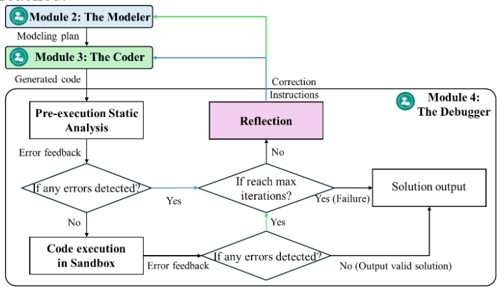
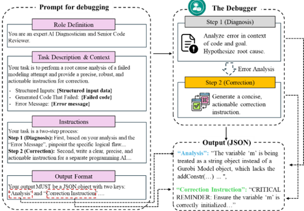
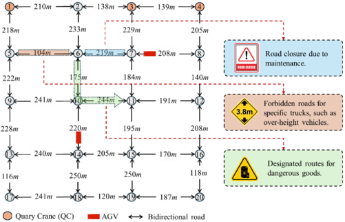

## PortAgent: LLM -driven Vehicle Dispatching Agent for Port Terminals

Jia Hu, Senior Member, IEEE , Junqi Li, Weimeng Lin, Peng Jia, Yuxiong Ji, and Jintao Lai, Member, IEEE

Abstract -Vehicle  Dispatching  Systems  (VDSs)  are  critical  to the  operational  efficiency  of  Automated  Container  Terminals (ACTs). However, their widespread commercialization is hindered due to their low transferability across diverse terminals. This transferability challenge stems from three limitations: high reliance  on  port  operational  specialists,  a  high  demand  for terminal-specific  data,  and  time-consuming  manual  deployment processes. Leveraging the emergence of Large Language Models (LLMs), this paper proposes PortAgent, an LLM-driven vehicle dispatching  agent  that  fully  automates  the  VDS  transferring workflow. It bears three features: i) no need for port operations specialists; ii) low need of data; and  iii) fast  deployment. Specifically,  specialist  dependency  is  eliminated  by  the  Virtual Expert  Team  (VET).  The  VET  collaborates  with  four  virtual experts,  including  a  Knowledge Retriever, Modeler, Coder, and Debugger, to emulate a human  expert  team  for  the  VDS transferring workflow. These experts specialize in the domain of terminal VDS  via a few-shot example learning approach. Through  this  approach,  the  experts  are  able  to  learn  VDSdomain  knowledge  from  a  few  VDS  examples.  These  examples are  retrieved  via  a  Retrieval-Augmented  Generation  (RAG) mechanism,  mitigating  the  high  demand  for  terminal-specific data. Furthermore, an automatic VDS  design workflow is established among these experts to avoid extra manual interventions. In this workflow, a self-correction loop inspired by the  LLM Reflexion framework is created to enable human-free validation and  correction of the experts' solutions, thereby reducing manual deployment time. A comprehensive evaluation confirms PortAgent's performance: it achieves 86.67% to 100% success  rates  when  transferring  VDS  across  unseen  scenarios, reduces  deployment  time  to  an  average  of  83.23  seconds,  and requires  only  one  example  to  attain  a  93.33%  average  success rate. Crucially, its effectiveness is independent of user expertise (p &gt; 0.05), thereby eliminating the need for specialists.

Index  Terms -Large language model; Automated container terminal; Vehicle dispatching system; Multi-expert systems; Agentic technology

Jia Hu, Junqi Li, and Yuxiong Ji are with the Key Laboratory of Road and Traffic Engineering of the Ministry of Education, Tongji University, Shanghai, China, 201804. (e-mail: hujia@tongji.edu.cn; junqilee@tongji.edu.cn; yxji@tongji.edu.cn)

Weimeng Lin is with COSCO SHIPPING Ports Limited, COSCO Tower No. 658 Dongdaming Road, Shanghai, China (e-mail: lin.weimeng@coscoshipping.com).

Peng  Jia  is  with  Collaborative  Innovation  Center  for  Transport  Studies, Dalian Maritime University, Dalian 116026, Liaoning, China (e-mail: jiapeng@dlmu.edu.cn).

Jintao  Lai  is  with  the  Department  of  Control  Science  and  Engineering, Tongji University, No.4800 Cao'an Road, Shanghai, China , 201804. (e-mail: jintao\_lai@tongji.edu.cn).

## I. INTRODUCTION

ehicle Dispatching Systems (VDSs) play an important  role  in  Automated  Container  Terminals (ACTs).  The  adoption  of  ACTs  has  accelerated  to meet demands for higher efficiency in the global supply chain, with  their  number  increasing  exponentially  over  the  past decade [1]. At the core of ACT operations lies the VDS, which is  responsible  for  coordinating  the  real-time  movements  of Automated  Guided  Vehicle  (AGV)  fleets.  The  objective  of these  systems  is  to  ensure  the  precise,  just-in-time  arrival  of AGVs  at  their  destinations,  as  any  arrival  deviations  can cascade into significant operational disruptions. Early arrivals result  in  vehicle  queuing  and  congestion  at  the  destination, while delayed arrivals lead  to  the  idling  of  Quayside  Cranes (QCs) and Yard Cranes (YCs), both of which degrade overall terminal  performance.  The  significance  of  this  system  is underscored  by  studies  demonstrating  that  optimized  vehicle dispatching can improve terminal operational efficiency by up to  30%  [2],  [3].  Consequently,  VDS  represents  a  critical leverage  point  for  enhancing  the  performance  of  container terminals. V

However,  the  commercialization  of  VDS  has  been  held back  as  it  is  challenging  to  deploy  them  across  different terminals. This  difficulty  arises  from  variations  in  network layouts, resource and task configuration, and operational requirements,  each  of  which  impacts  the  VDS  deployment strategies. Firstly, differing network layouts, which can range from  simple  unidirectional  loops  to  complex  bidirectional grids, mean that a vehicle dispatching logic developed for one topology  will  be  inefficient  or  invalid  in  another  [4],  [5]. Secondly, differences in resource and task configuration, such as fleet size, vehicle types, spatial distribution of tasks, and the placement  of  cranes  [6],  require  adjustments  to  the  system ' s core  resource  allocation  settings.  Directly  deploying  VDS without  these  settings  adjustments  would  lead  to  degraded performance. Thirdly, differing operational requirements, which  govern  everything  from  vehicle  priorities  to  speed limits [7], often require the core logic of the dispatching model to  be  rewritten  for  each  terminal.  Because  a  VDS  is  coupled with these terminal-specific characteristics, a system developed for one terminal rarely functions perfectly or, more often, fails entirely in another. Consequently,  efforts  are required to transfer the VDS across various terminals.

For  existing  VDSs  in  the  literature,  transferring  them across  terminals  is  costly  due  to  their  heavy  reliance  on specialists or data. These systems can be broadly divided into

three  categories: i)  Experience-driven  dispatching  systems: These systems rely on the engineering and operational experience  of  specialists (engineers)  to develop  a  set  of specific  dispatching  schemes  suitable  for  various  operational scenarios  (e.g.,  first-come-first-served,  shortest  queue  first) [8], [9], [10], [11]. Terminal operational scenarios are diverse because they are constantly subject to external variables (e.g., ship  arrivals,  weather  conditions)  and  internal  state  changes (e.g., equipment  breakdowns, varying traffic congestion). Consequently, this approach often requires multiple engineers, each  with  specialized  experience  in  different  scenarios  (e.g., quayside  operations,  yard  management).  Transferring  such  a system  requires  a  team  of  these  highly-paid  engineers  to manually analyze the new  terminal's characteristics and develop a tailored  scheme,  leading  to  significant  labor  costs. ii)  Knowledge-driven  dispatching  systems: They  rely  on  the operations research (OR) knowledge of the specialists (scientists)  to  design  a  general  dispatching  approach  that covers  various  operational  scenarios  [12],  [13],  [14],  [15], [16]. Their transfer requires a scientist-level specialist with a rare and advanced skill set. The scientist should have a deep understanding of OR theory, as well as the specific knowledge of  the  new  terminal ' s  operational  characteristics,  to  correctly develop  a  vehicle  dispatching  scheme.  This  requirement  for specialists  with  such  cross-domain  knowledge  makes  them scarce  and  commands  extremely  high  compensation,  thereby resulting in extremely high labor costs for  transferability. iii) Data-driven dispatching systems: These systems are typically developed using machine learning models, particularly Reinforcement  Learning  (RL)  and  its  deep  learning  variants [5], [17], [18], [19], [20]. They demand large volumes of highquality, terminal-specific data for effective training and validation.  If  the  VDS  is  transferred  to  a  new  terminal,  the machine learning model must be retrained on the  new terminal 's  unique  operational  data  to  maintain  performance. For  new  terminals,  the  cost  required  to  collect,  cleanse,  and label this high-volume data presents a major financial barrier. In  summary,  transferring  the  existing  VDSs  is  faced  with expertise and data bottlenecks, resulting in high cost.

Another challenge of transferring these VDSs is the timeconsuming deployment process required for repetitive manual checks and refinements. The  deployment process is typically fragmented to satisfy the requirements of multiple stakeholders. For example, three common stakeholders can be involved in the deployment process: operational staff propose a  new  operational  demand,  which  is  then  passed  to an optimization specialist for model reformulation, and subsequently  to  a  software  engineer  for  implementation  and testing  [6],  [13],  [21].  These  handoffs  between  stakeholders introduce  significant  communication  overhead  and  potential for misinterpretation,  prolonging the deployment  process. More  importantly,  repetitive  manual trials and  errors  are usually required to refine the VDS deployment. They can cost a  lot  of  manual  effort  and  further  prolong  the  deployment process. For  instance,  humans  must  manually  check  the generated code for syntax errors, test the proposed dispatching system, and iteratively refine it. This time-consuming, manual validation  loop  can  span  weeks  or  even  months.  As  a  result, this  fragmented  workflow  and  iterative  refinement  process result  in  long  deployment  cycles,  creating  a  severe process bottleneck for fast deployment.

Fortunately,  the  recent  emergence  of  Large  Language Models  (LLMs)  provides  a  possible  opportunity  to  achieve cheap  and  fast  VDS  transferability.  LLMs ' vast  pre-trained knowledge holds the potential to reduce the reliance on human specialists [22], [23], [24], thereby lowering deployment costs. Besides, their powerful contextual understanding and reasoning capabilities support the automated interpretation of dispatching  requirements  [25],  [26],  [27],  [28],  enabling  the rapid,  automated  transferring  and  configuration  of  the  entire dispatching system for a new environment. These two attributes can be utilized to address the bottlenecks identified above.

However,  applying  LLMs  to  the  domain  of  transferring VDSs across ACTs still faces critical challenges that prevent them from being a reliable solution:

i) Port operation specialists are still required to cope with the  unreliable  reasoning  of  LLMs. The  transfer  of  VDS  is  a complex,  multi-step  task  requiring  long-chain  reasoning.  A general-purpose  LLM,  when  faced  with  such  an  intensive reasoning task, is susceptible to the inherent instability of its long-chain inference. In this case, it often produces logically flawed or incomplete outputs [29], [30]. Consequently, a port operations  specialist  is  still  required  to  guide  the  LLM ' s reasoning and validate its answer, ultimately failing to eliminate the human expertise bottleneck.

ii) Much specific-domain data is required to specialize the LLMs in the domain of vehicle dispatching in ACTs. Although LLMs have a broad knowledge base, they may lack the highfidelity,  domain-specific  knowledge  of  vehicle  dispatching. This  gap  frequently  results  in ' hallucinations ' ,  which  means the  generation  of  plausible  but  inaccurate  outputs  [31],  [32]. To improve the accuracy of generated answers, the LLM must be specialized in the domain of interest. The current mainstream approach for such specialization is  to fine-tune a general-purpose LLM to be a specialized one. However, this requires  a  large  volume  of  domain-specific  data  [33],  [34]. Thus, it is still urgent to address the data bottleneck inherent in the VDS transfer.

iii)  Directly  utilizing  the  LLMs  to  transfer  VDS  across terminals does not really save enough deployment time. This is  because  LLMs  are  fundamentally  passive  text  generators and lack an autonomous execution capability to interact with external tools [27], [28], [35], [36]. Therefore, they require a human-in-the-loop to execute the generated code, validate the solution ' s correctness, and provide corrective feedback. Because  LLMs '  answers are  not  always  correct  on  the  first attempt,  frequent  human  interventions  are  often  required  to validate and correct the answers. This dependency on manual intervention  means  that  directly  using  an  LLM  does  not eliminate  the  time-consuming  manual  deployment  process, thereby failing to solve the deployment time bottleneck.

To  bridge  these  gaps,  this  paper  proposes  PortAgent,  an LLM-driven agent for transferring VDS across various ACTs. To  the  best  of  our  knowledge,  this  is  the  first  attempt  at designing such an agent for vehicle dispatching in ACTs. The proposed agent exhibits three key features:

- No need for port operations specialists;
- Low need of data;
- Fast deployment.

## II. HIGHLIGHTS

To enable the aforementioned features, the following contributions of this study are highlighted:

A virtual expert team to avoid the involvement of a port operations  specialist. To  overcome the expertise bottleneck, the  agent  constructs  a  Virtual  Expert  Team  (VET)  to  fully harness the reasoning capabilities of LLMs.  This team, composed  of  specialized experts including a  Knowledge Retriever,  Modeler,  Coder,  and  Debugger,  is  activated  via role-prompting. Each expert is instructed to focus only on its specific sub-task, effectively decomposing the complex problem  into a series of shorter reasoning chains. This approach  significantly  mitigates  the  risk  of logical  flaws common  in  long-chain  reasoning,  thereby  improving  VDS solution reliability and demonstrating the capability to replace human specialists.

Few-shot example learning for low data. To address the data  bottleneck,  few-shot  learning  is  employed,  enabling  the agent to adapt quickly with only a limited number of domainspecific examples. Through this approach, the experts are able to learn VDS-domain knowledge from a few VDS examples. This is facilitated by integrating a Retrieval-Augmented Generation  (RAG)  mechanism,  which  draws  VDS  examples from  a  curated  knowledge  base.  By  leveraging  few-shot learning, the agent retrieves and incorporates the most relevant examples into the LLM's context window, allowing for rapid in-context adaptation. As a result, the agent gains grounding in precise domain expertise through few-shot examples, enabling it to generalize effectively to diverse and  new  terminal scenarios without relying on extensive datasets.

## An automatic VDS design workflow for fast deployment.

To  address  the  process  bottleneck,  an  automatic  dispatching workflow is designed. This workflow integrates code generation, execution, and refinement into a closed loop. This is  achieved  through  a  self-correction  mechanism  inspired  by the  LLM  Reflexion  framework,  which  focuses  on  learning from past failures to improve subsequent attempts. Specifically,  this  mechanism enables  the  agent  to  execute its generated  code,  reflect  on  any  resulting  error  feedback  to perform  a  root-cause  analysis,  and  then  provide  a  correction instruction to guide the next generation attempt. This autonomous  cycle  automates  the  process  of  manual  checks and refinements, drastically reducing deployment time.

## III. PROBLEM STATEMENT

The problem addressed in this paper is to find an optimal VDS solution  for  a  new  terminal  environment.  This  task  leads  to  a

VDS searching problem ( P0 ):  finding  an  optimal VDS solution from  the  entire  space  of  possible  solutions  that  maximizes  the terminal ' s operational performance.

## VDS searching problem definition

Let 𝔼 be the set of terminal environments and ℙ be the set of all possible VDS solutions. They are defined as:

<!-- formula-not-decoded -->

<!-- formula-not-decoded -->

<!-- formula-not-decoded -->

Therefore, P0 is to find an optimal VDS solution, 𝑝 ∗ (ℰ) ∈ ℙ , for  a  given  environment ℰ ∈ 𝔼 that  maximizes  a  performance functional 𝒥 :

<!-- formula-not-decoded -->

where 𝒥: ℙ  ×  𝔼  →  ℝ is the performance functional, a mapping from a given VDS solution and an environment to a real-valued performance  metric  (e.g.,  throughput,  makespan), 𝑝 ∗ (ℰ) is  the optimal VDS solution for the given environment ℰ subject to a set of rules, and 𝑝(ℰ) is a feasible VDS solution for environment ℰ :

<!-- formula-not-decoded -->

where 𝑥 are the decision variables of the VDS (e.g., vehicle route choice variables, task assignment variables, etc.), 𝐷 is the domain of  these  decision  variables, 𝑍(𝑥|ℰ) is  the  objective  function measuring  the  VDS 's performance  under  the  environment ℰ , 𝐺𝑘 (𝑥|ℰ) represents  the  set  of  operational  constraints  derived from  the  specific  terminal  environment ℰ ,  and 𝑥 ∗ (ℰ) is  the optimal decisions for VDS under the environment ℰ .

## VDS transferring problem definition

Since directly searching the infinite space ℙ is intractable, the problem P0 is  unsolvable. Therefore, P0 is  reformulated  into  a solvable transferring problem ( P1 ). Instead of searching the entire space, P1 aims to generate a high-performance VDS solution by transferring knowledge from existing and finite VDS solutions.

This transfer process is governed by a transfer operator ℱ . ℱ is a mapping from the environment 𝔼 and knowledge base spaces 𝕂 to the VDS solution space ℙ :

<!-- formula-not-decoded -->

The transfer operator is then defined as:

<!-- formula-not-decoded -->

where 𝒦 is  the  utilized  knowledge,  a  subset  retrieved  from  the overall VDS knowledge base 𝕂. 𝕂 is a finite set of tuples pairing known environments with their optimal VDS solutions, defined by:

<!-- formula-not-decoded -->

By substituting (6) into (3), P1 is  formally defined as finding the  optimal  transfer  operator ℱ that  maximizes  the  terminal performance after the transfer process, according to the performance functional 𝒥 :

<!-- formula-not-decoded -->

In  this  work,  PortAgent  is  developed  to  find  the  optimal transfer operator ℱ ∗ for ensuring VDS performance.

## IV. METHODOLOGY

This  section  details  the  methodology  employed  in  this

study.  We  first  introduce  PortAgent's modular  architecture, followed by a formal description of the structured inputs and the details of each module.

A. The PortAgent Architecture

The architecture  of  PortAgent  is  illustrated  in Fig.  1.  It  is built upon three foundational designs that directly address the three transferability bottlenecks:

Virtual Expert

(VET)

Team

Fig. 1 The architecture of PortAgent.

VET : This design constructs a team composed of specialized experts to eliminate reliance on human specialists. The  'experts'  are  not  multiple  LLMs  but  rather  specialized competencies  activated  within  a  single  foundational  LLM instance  through  a  Role-Prompting  Mechanism  [37].  Each expert  focuses  only  on  a  specific  sub-task  within  the  VDS transfer workflow.

Few-shot  example  learning : This  design  leverages  the LLM ' s in-context learning capabilities to achieve dataefficient learning for the experts. It utilizes the  RAG mechanism [38] to retrieve the most relevant domain knowledge (e.g. model and code examples) and inject it into the LLM ' s context.

Self-correction : This design enables a closed-loop validation and refinement process for human-free deployment. If  an  error  is  detected,  the  workflow  does  not  terminate. Instead, it generates correction instructions and initiates a new generation attempt.

These designs are implemented through a modular workflow  executed  by  four  specialized  virtual  experts.  The sequential functions of these modules are defined as follows:

Module 1 (The Knowledge Retriever): This expert operationalizes  the  knowledge  base 𝕂 .  It  accumulates  the VDS  knowledge  and  executes  a  targeted  RAG  retrieval, fetching  the  most  relevant  modeling  primitives  and  code exemplars  ( 𝒦 ).  The  expert  provides  the  domain  knowledge for the subsequent experts.

Module 2 (The Modeler): The Modeler learns the retrieved modeling knowledge and conducts a Chain-of-Thought (CoT) reasoning to translate the structured environment inputs ℰ into a formal natural language modeling scheme.

Module  3  (The  Coder): The  Coder's function is to translate  the  Modeler's modeling  scheme  into  an  executable Python  script,  yielding  the  candidate  solution 𝑝(ℰ) . It is achieved by learning code examples and CoT reasoning.

Module  4  (The  Debugger): The  Debugger ' s  role  is  to validate  and  correct  the  candidate  solution 𝑝(ℰ) .  It  performs static analysis and sandboxed execution to detect any syntactic or runtime errors. Upon  detecting an error, it performs reflection  to  analyze  the  root  cause  and  generates  feedback directed  to  Module  2  and  Module  3,  initiating  a  correction cycle. If the instance is successfully solved, the resulting pair (ℰ𝑖 , 𝑝 ∗ (ℰ𝑖 )) is  integrated  back  into  Module  1 ' s  knowledge base 𝕂 , thereby enhancing the agent's future capability.

## B. Structured Inputs

The input of  a  terminal  environment  ( ℰ ∈ 𝔼 )  is  structured across three distinct JSON files, as illustrated in Fig.  2. It is defined as a tuple ℰ = (ℰ𝑁𝑒𝑡 , ℰ 𝐶𝑜𝑛𝑓𝑖𝑔 , ℰ 𝑅𝑒𝑞𝑠 ) :

## Structured Inputs of a Terminal Environment

Fig.  2 The structured input of a terminal environment.

Network Topology ( 𝓔𝑵𝒆𝒕 ): It defines the terminal's network topology. It contains a list of nodes with their properties and a list of edges, each specifying its source, target, and length.

Resource  and  task  configuration  ( 𝓔𝑪𝒐𝒏𝒇𝒊𝒈 ): This  file includes the AGV and task information.

Operational Requirements ( 𝓔𝑹𝒆𝒒𝒔 ): This file introduces the local  rules  and  dynamic  constraints  communicated  in  natural language. These requirements translate into specific constraints 𝐺𝑘 (𝑥|ℰ) .

## C. Module 1: The Knowledge Retriever

The  Knowledge  Retriever  is  the  initial  expert  within  the VET  workflow. Its responsibility is to manage domain knowledge, executing two key operations: knowledge accumulation and retrieval.

## Knowledge accumulation

The expert accumulates the VDS knowledge via a knowledge  base.  This  bridges  the  semantic  gap  between natural language requirements and formal code. The knowledge base contains two components, as shown in Fig. 3:

## Modeling Primitives

## Code Exemplars

Fig. 3 The structure of the knowledge base.

Modeling  primitives: This  component  teaches  the  agent

the basic mathematical primitives of VDS. The primitives are organized as a structured dictionary defining the elements for standard optimization problems, including:

-  Variable definitions: Structured definitions for variables.
-  Constraint formulations: Canonical formulations for foundational  constraints  (e.g.,  flow  balance,  initial  and terminal conditions).
-  Objective  functions:  Standard  objectives,  such  as  the minimization of total travel time.

Code  exemplars: This  component  consists  of  specialistwritten Python scripts specifically tailored for designing VDSs.  Its  primary  role  is  not  to  solve  the  specific  target problem  directly,  but  to  teach  the  agent  the  overarching structural  workflow.  It  demonstrates  best  practices  for  the entire  workflow,  including  data  loading  and  preprocessing, model construction and solving, and structured result extraction and output formatting.

## Knowledge retrieval

The  Knowledge  Retriever  executes  a  targeted  retrieval process via RAG to ensure the high context fidelity required for  effective  knowledge  injection. For  each  system  transfer attempt,  the  Retriever  analyzes  the  user ' s  environment  input and queries the knowledge base, executing the RAG mechanism to retrieve the most semantically relevant modeling  primitives  and  code  exemplars.  These  retrieved components are then dynamically assembled and injected into the  prompt ' s  context  window,  creating  a  rich,  context-aware prompt that is passed to the Modeler and Coder.

## D. Module 2: The Modeler

Following the knowledge  grounding  facilitated by the Knowledge  Retriever,  the  Modeler  translates  the  terminal environment inputs and the retrieved knowledge into a mathematical modeling scheme.

As  illustrated  in  Fig.    4,  the  Modeler  receives  the  RAGaugmented prompt, which contains the structured input data, retrieved  modeling  primitives,  and  the  correction  instruction feedback  by  the  Debugger  (Module  4).  Upon  receiving  this, the Modeler engages in two core cognitive processes:

i) Model learning: The Modeler utilizes the retrieved model examples  to  understand  the  canonical  structure  of  the  VDS problem. It articulates how to adapt these examples to the new terminal  environment,  ensuring  that  the  synthesized  model adheres to established optimization best practices.

ii)  CoT reasoning: The Modeler is instructed to generate a natural language 'reasoning' text, which serves as the explicit CoT process [39]. This CoT details the step-by-step mathematical plan before any code is synthesized. The Modeler outlines its  understanding of  the problem,  identifies the  necessary  mathematical  components  (decision  variables, constraints,  and  objective  function),  and  articulates  how  it adapts to a new terminal environment by utilizing the retrieved model examples.

The output of this module is the model formulation scheme accompanied by the CoT reasoning process.

Prompt for modeling

Fig.  4 The process of modeling conducted by The Modeler.

## E. Module 3: The Coder

Once  the  mathematical  scheme  is  established,  the  Coder takes over to synthesize the executable script.

As shown in Fig.  5 ,  the  Coder's input context is enriched with  the  RAG  augmented  prompt  and  the  natural  language model  f ormulation  generated  by  the  Modeler.  The  Coder's task is not to generate code from scratch, but rather to perform a  highly  accurate  assembly  process.  It  utilizes  the  Modeler's output as a strict logical specification to guide the  generation of  logical  components.  The  Coder  performs  two  specialized operations:

i)  Code  learning :  The  Coder  relies  on  the  provided  code exemplars  for  the  overall  procedural  structure.  This  ensures correct  implementation  of  data  loading,  model  initialization, solver execution, and structured result formatting.

ii)  CoT  reasoning :  To  ensure  verifiability  and  traceability, the  Coder  generates  a  CoT  reasoning  text  that  details  the process of translating the Modeler ' s abstract modeling scheme into functional code.

The  output  of  this  module  is  the  complete,  executable Python code script with CoT reasoning process.

Prompt for

coding

Fig.  5 The process of code generation conducted by The Coder.

## F. Module 4: The Debugger

The  Debugger  is  responsible  for  executing,  detecting,  and resolving errors in the generated code.

The complete process of this module is illustrated in Fig.  6. As  shown  in  the  figure,  after  an  initial  code  generation attempt, the agent enters a systematic loop that includes static code  analysis,  execution,  and,  upon  failure,  reflection.  This process continues until a valid, executable solution is produced,  or  a  predefined  maximum  number  of  iterations  is reached.

Fig.  6 The flowchart of The Debugger.

## Pre-execution static analysis

Pre-execution  static  analysis  is  the  first  attempt  at  code validation.  Before  running  the  generated  script,  the  agent performs  a  lightweight  check  using  Abstract  Syntax  Trees (AST) [40]. This technique parses the code into a structured tree representation, allowing the Debugger to verify its structural integrity  and  confirm  the  presence  of  required modeling  components.  This  step  can  pre-emptively  catch certain  structural  or  syntactic  flaws,  thereby  reducing  the frequency of costly execution attempts.

## Execution and error feedback

If the pre-execution static analysis passes, the agent executes the generated Python script in a sandboxed environment. The system is designed to capture all forms of feedback from this execution attempt, which can be categorized  into  two  error  types:  i)  Syntax  errors:  Failures where  the Python interpreter cannot parse the code. ii) Runtime  errors:  Errors  that  occur  during  code  execution, including exceptions raised by the solver (e.g., invalid variable indexing or incorrect handling of input data).

The error message and the failed code are then fed into the reflection phase.

## Reflection

Upon detecting  any  error,  the  reflection  phase  is  initiated, which  is fundamentally inspired  by  the  LLM  Reflexion framework that leverages past failures to improve subsequent attempts [41]. As shown in Fig.  7, the Debugger's task is not to  fix  the  code  directly  but  to  perform  a  two-step  root-cause analysis that drives the refinement cycle:

i)  Diagnosis.  The  expert  engages  in  a  focused  CoT-based reasoning process. It analyzes the error message in the context of the failed code, hypothesizes the root cause, and proposes a conceptual  fix.  This  ensures  a  deep  understanding  of  the problem before a solution is prescribed.

- ii) Correction. The expert outputs a concise naturallanguage  correction  instruction.  This  correction  instruction acts  as  a  direct  guide  for  the  Modeler  and  Coder,  instructing them on how to avoid the previous mistake.

Fig.  7 The process of reflection conducted by The Debugger.

## V. EVALUATION

Experiments  have  been  designed  to  evaluate  the  proposed agent.  The  performance  of  the  agent  is  evaluated  from  the following aspects: i) transferability; ii) specialist-free deployment capability; iii) low data requirement; iv) deployment speed.

## A. Experiment Design

To assess the capabilities of the proposed agent, a comprehensive experiment is designed.

## VDS type of interest

The PortAgent ' s transferability is evaluated using the MultiAGV Path Planning (MAPP) problem. MAPP is an ideal VDS type because it represents the critical execution layer in ACTs where dynamic constraints most frequently manifest.

MAPP  is defined on a directed graph 𝐺 = (𝑁, 𝐸) , representing the terminal's road network. 𝑁 is the set of nodes (locations)  and 𝐸 is  the  set  of  edges  (unidirectional  road segments),  with  each  edge (𝑖 , 𝑗) ∈ 𝐸 having  an  associated length 𝑑𝑖𝑗 .  Consider  a  fleet  of  AGVs 𝑉 , and  a set of transportation tasks 𝑇 .  Each task is pre-assigned to a specific AGV,  defining  an  origin-destination  pair (𝑠 𝑣 , 𝑡 𝑣 ) for  each vehicle 𝑣 ∈ 𝑉 .  The  objective  is  to find  a  set  of  paths {𝑃 𝑣 |𝑣 ∈ 𝑉} that  minimizes  the  total  travel  time  for  the  entire  fleet, formulated as:

<!-- formula-not-decoded -->

<!-- formula-not-decoded -->

where 𝑏𝑣𝑖 is defined as:

<!-- formula-not-decoded -->

The decision variables 𝑥𝑣𝑖𝑗 is a binary variable that equals 1

if AGV 𝑣 traverses edge (𝑖 , 𝑗) , and 0 otherwise.

## Scenarios for test

To evaluate the agent ' s performance against different scenarios  for  transferring  VDSs,  three  typical  scenarios  of MAPP are selected for test, as listed in Table 1.

Table 1 Typical scenarios for test.

| Scenario                              | Description                                                                                                                                                                                                                        |
|---------------------------------------|------------------------------------------------------------------------------------------------------------------------------------------------------------------------------------------------------------------------------------|
| Road closure                          | An unexpected operational disruption renders a bidirectional road segment impassable (e.g., due to an accident or maintenance).                                                                                                    |
| Forbidden roads for specific trucks.  | A truck with specific physical attributes (e.g., over- height, excess weight, or excess width) is prohibited from traversing a designated road segment due to infrastructure limitations (e.g., a low bridge) or safety protocols. |
| Designated routes for dangerous goods | A specific task (e.g., T3, carrying dangerous goods) must follow a mandatory and safe sub-path.                                                                                                                                    |

The experimental testbed is built upon a representative port network (30 AGVs, 20 nodes), as shown in Fig. 8. To ensure statistical robustness, for each scenario of the three scenarios, five  unique  instances  were  generated  using  distinct  random seeds  to  sample  the  AGV  origin  and destination  nodes.  This resulted in a total of 15 base scenarios.

Fig. 8 The network for test.

## Expertise levels of human input

To investigate the agent's robustness to the expertise levels of  human  inputs,  each  tested  scenario  was  articulated  using three  distinct  linguistic  styles,  simulating  different  levels  of operational expertise. Table 2 summarizes the three styles of expertise level.

Table 2 Three styles of expertise levels.

| Expertise level   | Input style                                                                                                         | Example phrasing (e.g., road closure)                              | Purpose                                                   |
|-------------------|---------------------------------------------------------------------------------------------------------------------|--------------------------------------------------------------------|-----------------------------------------------------------|
| Technician-level  | Informal, physical description. Uses everyday language, describing the physical situation rather than formal rules. | 'The road between Node 6 and Node 7 is closed. '                   | Simulates a user with no formal OR training.              |
| Engineer-level    | Clear, operational terminology. Uses unambiguous operational terms but avoids mathematical formalism.               | 'The road segment connecting (6, 7) is closed in both directions.' | Simulates an expert user with good operational knowledge. |

The three distinct linguistic styles resulted in a comprehensive  testbed  of  15  base  scenarios  ×   3  expertise levels  =  45  unique  test  instances.  The  complete  prompts  for each scenario and expertise level are provided in Appendix A.

## Benchmark method

The  proposed  agent  was  benchmarked  against  solutions derived from a traditional specialist-driven method. For each of the test instances, a human expert with a background in OR manually  translated  the  problem  description  into  a  precise mathematical  formulation  and  implemented  it  in  a  Python script using the Gurobi solver. This manually-coded implementation  serves  as  the  ground  truth,  representing  the optimal solution for each test instance.

## Measures of Effectiveness (MoEs)

The  performance  of  the  agent  is  quantified  from  two aspects: solution correctness and computational efficiency.

## The MoEs of solution correctness:

i)  Code  executability  rate  (CER): This  metric  assesses  the agent ' s  fundamental capability to generate syntactically valid and executable Python code. A run is deemed executable if it completes without any runtime errors. The CER is defined as:

<!-- formula-not-decoded -->

where 𝑁𝑒𝑥𝑒𝑐𝑢𝑡𝑒𝑑 is  the  number  of  test  instances  that  generate successfully executed scripts and 𝑁𝑡𝑜𝑡𝑎𝑙 is the total number of test instances.

ii)  Solver  success  rate  (SSR):  This  metric  measures  the semantic and logical correctness of the formulated optimization model. A case is deemed successful if it matches the objective value of the Gurobi ground truth solution within a predefined tolerance. The SSR is defined as:

<!-- formula-not-decoded -->

where 𝑁𝑠𝑜𝑙𝑣𝑒𝑑 is  the  number  of  test  instances  where  the generated script yields a correct solution.

## The MoEs of computational efficiency:

i)  Iterations:  This  metric  quantifies  the  performance of  the agent's  self -correction  mechanism.  It  records  the  number  of generation-and-review  cycles  required  to  produce  a  final, error-free, and validated script.

ii)  Computation time: This metric measures the end-to-end time  required  for  the  agent  to  proceed  from  receiving  the initial natural language prompt to outputting the final solution, thereby  quantifying  the  overall  efficiency  of  the  automated workflow.

## Experimental settings

All  experiments  were  conducted  on  a  personal  computer equipped  with  a  13th  Gen  Intel(R)  Core  (TM)  i5-13500H processor and 16 GB of RAM. The agent and the benchmark method were implemented in Python 3.9.

## Foundational LLM :

- Reasoning engine for the agent: Gemini 2.5 Flash.
- Temperature: 0.
- Communication with the LLM: standard API.

## Agent configuration:

- The maximum iterations: 3.
- Number of examples for learning: 1.
- Permitted optimality error: 1e-4.

## Optimization tool:

- Modeling language: Pyomo.
- Solver: Gurobi Optimizer version 12.0.3.
- Solving time limit: 300 seconds.

## B. Results

Results confirm the agent could meet the outlined objectives:  i)  The  agent  demonstrates  robust  transferability, achieving a 100% CER and an SSR ranging from 86.67% to 100% across different dispatching scenarios. ii) It effectively reduces the need  for optimization specialists, with even ' Technician-level ' users  achieving  an  86.67%  average  SSR, and  shows  no  statistically  significant  performance  difference across expertise levels. iii) The agent operates with high data efficiency,  requiring  only  a  single  example  to  achieve  an average SSR of 93.33%. iv) It enables fast deployment, with an average end-to-end computation time of just 83.23 seconds .

## Transferability

## i) Transfer success rate

Fig.  9  presents  the  results  of  the  transfer  success  rate, demonstrating  the  agent's  capability  of  transferring  VDSs across different terminal scenarios. Fig. 9(a) shows the transfer  success  rate  for  code  execution.  It  demonstrates  that the agent consistently generated syntactically valid and executable  code,  achieving  a  perfect  100%  CER.  Fig.  9(b) shows the transfer success rate for solution correctness, which represents the  agent's  performance  in  generating  logically correct  solutions.  The  SSR  ranged  from  86.67%  to  100% across the three scenarios, indicating that the agent  can reliably  transfer  its  knowledge  to  solve  a  variety  of  unseen terminal scenarios.

Fig. 9 Transfer success rate across different terminal scenarios.

## ii) Root-cause analysis for transfer failures

To  better  understand  the  agent's  limitations,  a  root -cause analysis  is  performed.  Out  of  the  45  total  test  instances,  the

agent  successfully  solved  42,  yielding  an  overall  SSR  of 93.33%. The failures of the 3 unsuccessful test instances were categorized as shown in Table 3. As summarized in the table, all failures were uniformly categorized as 'Misinterpretation' , wherein  the  generated  code  executed  successfully,  yet  the resulting solution was incorrect.

Table 3 Error types of the 3 unsolved test instances.

| Error Category     | Specific Description                                                                                             |   Count |
|--------------------|------------------------------------------------------------------------------------------------------------------|---------|
| Misinterpre tation | The model did not correctly enforce the bidirectional nature of the road closure constraint.                     |       2 |
|                    | The model incorrectly constrained the entire path to the designated route, instead of treating it as a sub-path. |       1 |

This analysis reveals a clear boundary  in the agent's capabilities: it cannot autonomously address failures caused by semantic misinterpretation, where the generated code is syntactically perfect but yields a logically flawed solution. The underlying reasons for these failures stem from two factors: i) Ambiguity of user input: The requirements are often communicated by users in natural language. This input can be inherently ambiguous, leading to potential misinterpretation of the user's intended mathematical formulation by the agent. ii) Probabilistic LLM  output: As a probabilistic generative model,  the  underlying  LLM  exhibits  inherent  randomness. Even identical inputs may occasionally lead to logical variance  in  the  output  (i.e.,  some  random  seeds  correctly interpret the constraint, while others do not).

Therefore, future research should focus on two corresponding  directions:  improving  semantic  understanding to reduce the inherent ambiguity of user inputs and enhancing output  consistency  to  mitigate  the  effects  of  probabilistic randomness.

## Specialist-free deployment capability

This section evaluates the agent's performance when provided  with  instructions  from  users  with  varying  expertise levels. The agent's performance was assessed in two aspects: solution correctness and computational efficiency.

## i) Solution correctness with/without specialists

Fig. 10 presents the agent's solution correctness, as measured  by  CER  and  SSR,  demonstrating  that  it  achieves robust  and  consistently  high  performance  irrespective  of  the user's  expertise  level. The  agent  achieved  a  perfect  100% CER. While minor variations were observed in the SSR, the agent achieved consistently high performance across all expertise levels. Notably, the ' Scientistlevel' input yielded a perfect 100%  SSR. This success is attributable to the unambiguous, formal, and often mathematical phrasing, which minimizes the potential for semantic misinterpretation. Conversely,  the  SSR  for  'Technician'  and  'Engineer'  level inputs,  while  still  strong,  fell  slightly  below  100%.  This outcome  aligns  perfectly  with  the  root-cause  analysis  in  the aforementioned:  their  use  of  more  vague  natural  language introduces ambiguity, increasing the risk of the  LLM misinterpreting the required constraints.

Fig.  10 Solution correctness across different expertise levels.

## ii) Computational efficiency with/without specialists

Fig. 11 demonstrates that the agent's computational efficiency,  quantified  by  the  number  of  iterations  and  total computation time, is not significantly impacted by the  users ' expertise  levels. It  is  observed  that ' Engineer-level ' inputs resulted  in  slightly  more  iterations  on  average.  The  reason behind this phenomenon is that they are more complex than a ' Technician-level ' description,  introducing  subtle  syntactical or  logical  complexities,  yet  lack  the  formal  precision  of  a ' Scientist-level ' input,  which  makes  them  more  likely  to generate initial code with errors that trigger the self-correction mechanism.

Fig.  11 Computational efficiency across different expertise levels.

## iii) Significance of specialists

Table 4 provides the results of statistical tests, showing no statistically  significant  differences  in  any  of  the  four  MoEs across the three expertise levels. This leads to a key finding of this  study:  the  expertise  level  of  the  user  has  no  significant impact  on  the  agent's  ability  to  correctly  solve  the  problem, nor on the time required to do so. This quantitatively proves that  the  proposed  agent  eliminates  the  dependency  on  port operations specialists, including engineers and scientists, thus successfully addressing the expertise bottleneck.

Table 4 Statistical analysis of the impact of expertise level.

| Aspect               | MoEs         | Test                   | Statistics   |   p-value | Significance *   |
|----------------------|--------------|------------------------|--------------|-----------|------------------|
| Solution correctness | CER          | Chi- squared           | χ² = 0.0000  |    1      | Not Significant  |
| Solution correctness | SSR          | (χ²)                   | χ² = 2.1429  |    0.3425 | Not Significant  |
| Efficiency           | Iteration s  | ANOV A (F- statistic ) | F= 2.3117    |    0.1125 | Not Significant  |
| Efficiency           | Comput ation | ANOV A (F- statistic ) | F= 2.6326    |    0.0846 | Not Significant  |

Time

Significance is determined at the p &lt; 0.05 level.

## Low data requirement

This section evaluates the agent's data efficiency by analyzing its performance with a varying number and types of examples. The expertise level is set as 'Engineer -level'.

## i) Example quantity needed

To validate the agent's low data requirement, its performance was evaluated under three conditions: 0-shot, 1shot, and 3-shot. The 0-shot setting provided no code example, while the 1-shot setting provided a single example solving the classic MAPP model presented in Equations (9) - (11). The 3shot setting provided three distinct examples, each solving one of the tested dispatching scenarios.

As illustrated in Fig.  12, the results confirm that the agent operates  with  high  data  efficiency,  as  its  performance  across key metrics saturates with only a single example (1-shot). The 1-shot  configuration  consistently  achieves  the  highest  CER and  SSR  and  the  lowest  computation  time,  establishing  it  as the most effective approach.

A counterintuitive finding emerged when comparing 1-shot to 3-shot learning: providing more examples led to a degradation  in  performance.  This  occurs  because  multiple, slightly  different  examples  can  introduce  conflicting  patterns or ' contextual  noise, ' which  may  confuse  the  LLM  during code generation rather than providing clearer guidance.

Notably,  another  paradox  was  observed:  while  the  1-shot configuration  required  the  most  self-correction  iterations  on average, it was also the fastest in terms of computation time. This  suggests  that  the  single,  simple  example  leads  to  a straightforward  initial  code  generation  attempt.  When  this attempt fails, the resulting errors are typically simple, allowing the  self-correction  mechanism  to  diagnose  and  resolve  them rapidly. This highlights that the 1-shot approach provides the optimal  balance  between  sufficient  guidance  and  minimal complexity, enabling both high accuracy and high efficiency.

Fig.  12 Impact of number of examples across all MoEs.

## ii) Example type required

The requirement of the single example type (1-shot configuration)  is  investigated.  An  experiment  was  conducted comparing  the  agent's  performance  when  guided  by  four different example types: a classic dispatching example versus three  customized  examples,  each  pre-solved  for  one  of  the three specific testing scenarios.

The  results,  presented  in  Fig.    13,  are  striking.  The  agent guided by  the  classic  dispatching  example  achieved  superior or  joint-best  performance  across  both  CER  (100%)  and  SSR (93.33%), significantly outperforming agents guided by examples  that  were  supposedly  more  relevant  to  the  target scenario. Besides, while the classic example required the most iterations on average (1.73), it was by far the most efficient in computation time (101.07 seconds).

This  occurs  because  the  classic  example  provides  a  clean structural  workflow.  It  teaches  the  agent  the  fundamental workflow without introducing scenario-specific logical knowledge .  The  agent's  initial  code  is  therefore  simple,  and any necessary corrections are easily localized and computationally  fast  to  resolve.  In  contrast,  a  specialized example  introduces  'contextual  noise,'  causing  the  LLM  to generate more complicated initial code that may be overfit to irrelevant  details.  When  this  more  complex  code  fails,  the debugging  process  is  more  involved,  leading  to  fewer  but significantly  longer  iterations  (e.g.,  the  agent  guided  by  the road closure example averaged 300.60 seconds).

This  leads  to  a  powerful  design  principle  for  LLM-driven code generation agents: the few-shot example should primarily teach  the  fundamental  workflow,  not  the  specific  problem logic. This is a more  effective and robust strategy for achieving high transferability performance.

Fig.  13 Performance comparison of the agent when guided by a single basic vs. a specialized example.

## Deployment speed

Table 5 provides a comparison between the agent's automated  workflow  time  and  the  typical  time  required  for manual  specialists,  confirming  the  agent ' s  capability  of  fast deployment. By automating the end-to-end process of model formulation, coding, and debugging, the agent reduces a task that  takes  hours  or  even  days  to  an  average  of  just  83.20 seconds. The  ability to generate a validated, executable optimization model in under two minutes validates the agent ' s critical role in enabling fast deployment  and  addressing

dynamic operational challenges in real-time port environments.

Table 5 Comparison of deployment time.

| Method                                            | Computation time               |
|---------------------------------------------------|--------------------------------|
| Benchmark (Traditional specialist- driven method) | Several hours to several days. |
| PortAgent                                         | 83.20 seconds (on average)     |

## Ablation study

To isolate and quantify the contributions of the agent's key architectural components, an ablation study is conducted. The performance  of  the  full  PortAgent  was  benchmarked  against two degraded configurations, using 'Engineer -level' prompts. The ablated configurations were:

- i)  PortAgent w/o RAG: This configuration removes access to  the  RAG  mechanism, meaning the agent operates without its curated knowledge base, including the modeling primitives and the few-shot code exemplar. This validates the necessity of the knowledge grounding module.
2. ii) PortAgent w/o self-correction: This configuration restricts the agent to a single, non-iterative generation attempt, effectively disabling the closed-loop reflection and refinement mechanism. This demonstrates the critical role of autonomous debugging.

Table 6 provides the results of the ablation study, demonstrating the significance of both modules. Without the RAG,  the agent's performance degrades, with the  SSR dropping to a mere 26.7%. This underscores the necessity of the  knowledge  base  for  grounding  the  LLM's  reasoning  and providing the essential modeling primitives required to formulate valid models. Similarly, without the self-correction, the SSR falls to 33.33%. This demonstrates that the reflection and  iterative  refinement  loop  is  indispensable.  Even  when provided with the RAG, the LLM's initial generation attempt often  contains  errors;  the  self-correction  module  is  essential for catching and fixing these errors.

Collectively, these results validate the proposed architecture, proving that both RAG (specific-domain knowledge  grounding)  and  the  self-correction  mechanism (autonomous  debugging)  are essential and non-redundant components required to achieve the agent's high performance.

Table 6 Ablation experiments on RAG and self -correction mechanisms.

| Method                        | CER    | SSR    |
|-------------------------------|--------|--------|
| PortAgent with full modules   | 100%   | 93.3%  |
| PortAgent w/o RAG             | 40.0%  | 26.7%  |
| PortAgent w/o self-correction | 33.33% | 33.33% |

## VI. CONCLUSION AND FUTURE WORK

This  paper  proposes  an  LLM-driven  vehicle  dispatching agent,  PortAgent.  This  agent  automates  the  transfer  of  VDS across various ACTs. It has the following features: (i) no need for a port operations specialist; (ii) low need of data; (iii) fast deployment.  To  validate these features,  a  comprehensive evaluation  was  conducted  across  various  vehicle  dispatching scenarios. PortAgent has been compared against the traditional specialist-driven method. The results show that:

- i)  The  proposed  agent  demonstrates  robust  transferability,

achieving a 100% CER and an SSR ranging from 86.67% to 100% across different dispatching scenarios.

- ii) It effectively reduces the need for optimization specialists.  It  shows  no  statistically  significant  difference  in performance across user expertise levels, with even ' Technician-level ' users achieving an 86.67% average SSR.
- iii)  The  agent operates with high data efficiency, requiring only one example to achieve an average SSR of 93.33%. It is suggested that.
- iv)  It  enables  fast  deployment,  reducing  a  process  that typically takes hours or days to an average end-to-end computation time of just 83.23 seconds.
- v) The results also revealed two interesting methodological insights crucial for LLM-driven agent design:
-  Less  is  more: Increasing  the  number  of  examples  for few-shot learning can be detrimental to solution correctness and computational efficiency, indicating that optimal  performance  relies  on  example  quality  over quantity.
-  Fundamental  is  the  key: Few-shot  example  learning  is most effective when targeted towards learning the fundamental knowledge, rather than attempting to directly find complex and specific problem answers. This approach can maximize the reliability of the transferred VDSs.

Future work: While PortAgent marks a significant advance,  one  limitation  remains:  semantic  misinterpretation. The  limitation  stems  from  the  inherent  ambiguity  of  natural language user inputs and the probabilistic randomness of LLM outputs.  Accordingly,  our  future  research  will  develop  novel methods  to  enhance  the  agent's  semantic  understanding  and ensure greater output consistency.

## APPENDIX

## A. Prompts for Test Scenarios

Table  7  provides  the  full  text  of  the  natural  language prompts  used  for  each  test  scenario  across  the  three  defined expertise levels.

Table 7 The full description of vehicle dispatching scenarios.

| Scenario                            | Expertise level   | Natural language prompts                                                                                                                          |
|-------------------------------------|-------------------|---------------------------------------------------------------------------------------------------------------------------------------------------|
| Road Closure                        | Technician-level  | ' That road between node 6 and node 7 can't be used today. '                                                                                      |
| Road Closure                        | Engineer-level    | 'Attention: The bidirectional road segment connecting nodes (6, 7) is completely closed.'                                                         |
| Road Closure                        | Scientist-level   | ' The model must satisfy a topology constraint: remove the edge subset E' = {(6,7), (7,6)} from the network graph. '                              |
| Forbidden roads for specific trucks | Technician-level  | 'AGV -4 in the fleet is one of those extra-tall ones; it can't get under the low bridge between node 5 and node 6.'                               |
| Forbidden roads for specific trucks | Engineer-level    | 'Attention: AGV -4 in the fleet is an over-height vehicle and cannot pass through the bidirectional height- restricted gantry connecting (5, 6).' |
| Forbidden roads for specific trucks | Scientist-level   | 'A vehicle -path compatibility constraint must be enforced: for v=4, the decision variable 𝑥 𝑣𝑒 must be 0 for all 𝑒 in {(5,6), (6,5)}.'           |

| Designated routes for dangerous goods   | Technician-level   | 'The container for T3 has dangerous goods, so it has to stick to the safe route: go from 6 to 10, then from 10 to 11. No exceptions.'             |
|-----------------------------------------|--------------------|---------------------------------------------------------------------------------------------------------------------------------------------------|
|                                         | Engineer-level     | ' Task T3 involves dangerous goods and must follow the designated one-way safety corridor (6->10- >11). '                                         |
|                                         | Scientist-level    | 'A mandatory subpath constraint must be applied to the AGV assigned to task T3, ensuring its solution path contains the subsequence (6, 10, 11).' |

## DATA AVAILABILITY

The data and code supporting the findings of this study are available  from  the  corresponding  author  upon  reasonable request.

## REFERENCES

- [1] D. Naeem, M. Gheith, and A. Eltawil, 'A comprehensive review and directions for future research on the integrated scheduling of quay cranes and automated guided vehicles and yard cranes in automated container terminals,' Computers &amp; Industrial Engineering , vol. 179, p. 109149, May 2023, doi: 10.1016/j.cie.2023.109149.
- [2] H. Li, J. Li, L. An, X. Zhang, Z. Xu, and J. Hu, 'A Dispatching Method for Automated Container Terminals: What is Next When Precise Execution is Available?,' in 2023 IEEE 26th International Conference on Intelligent Transportation Systems (ITSC) , Sept. 2023, pp. 2434 -2439. doi: 10.1109/ITSC57777.2023.10421806.
- [3] J. Li, H. Li, L. An, Z. Xu, and J. Hu, 'A right -of-way allocation method for automated container terminals*,' in 2024 IEEE Intelligent Vehicles Symposium (IV) , June 2024, pp. 1 -3. doi: 10.1109/IV55156.2024.10588806.
- [4] S. Chen, H. Wang, and Q. Meng, 'Autonomous truck scheduling for container transshipment between two seaport terminals considering platooning and speed optimization,' Transportation Research Part B: Methodological , vol. 154, pp. 289 -315, Dec. 2021, doi: 10.1016/j.trb.2021.10.014.
- [5] M. Ma, F. Yu, T. Xie, and Y. Yang, 'A hybrid speed optimization strategy based coordinated scheduling between AGVs and yard cranes in Ushaped container terminal,' Computers &amp; Industrial Engineering , vol. 198, p. 110712, Dec. 2024, doi: 10.1016/j.cie.2024.110712.
- [6] D. Naeem, M. Gheith, and A. Eltawil, 'A comprehensive review and directions for future research on the integrated scheduling of quay cranes and automated guided vehicles and yard cranes in automated container terminals,' Computers &amp; Industrial Engineering , vol. 179, p. 109149, May 2023, doi: 10.1016/j.cie.2023.109149.
- [7] Y. Gao and Y.E. Ge, 'Integrated scheduling of yard cranes, external trucks, and internal trucks in maritime container terminal operation,' Maritime Policy &amp; Management , vol. 50, no. 5, pp. 629 -650, July 2023, doi: 10.1080/03088839.2022.2135177.

[8]

Y.-

C. Shen and J. E. Kobza, 'A dispatching

-rule-based algorithm for automated guided vehicle systems design: Production Planning &amp;

Control: Vol 9, No 1.' Accessed: Oct. 19, 2025. [Online]. Available:

https://www.tandfonline.com/doi/abs/10.1080/095372898234514

- [9] K. H. Kim and J. W. Bae, 'A Look -Ahead Dispatching Method for Automated Guided Vehicles in Automated Port Container Terminals | Transportation Science.' Accessed: Oct. 19, 2025. [Online]. Available: https://pubsonline.informs.org/doi/abs/10.1287/trsc.1030.0082
- [10] D. Briskorn, A. Drexl, and S. Hartmann, 'Inventory -based dispatching of automated guided vehicles on container terminals,' OR Spectrum , vol. 28, no. 4, pp. 611 -630, Apr. 2006, doi: 10.1007/s00291-0060033-8.
- [11] M. Grunow, H.O. Günther, and M. Lehmann, 'Dispatching multi -load AGVs in highly automated seaport container terminals,' OR Spectrum , vol. 26, no. 2, pp. 211 -235, Mar. 2004, doi: 10.1007/s00291-003-0147-1.
- [12] S. Li, and L. Fan, 'A hierarchical solution framework for dynamic and conflictfree AGV scheduling in an automated container terminal,'

Transportation Research Part C: Emerging Technologies , vol. 165, p. 104724, Aug. 2024, doi: 10.1016/j.trc.2024.104724.

- [13] Y. Cao, A. Yang, Y. Liu, Q. Zeng, and Q. Chen, 'AGV dispatching and bidirectional conflict-free routing problem in automated container terminal,' Computers &amp; Industrial Engineering , vol. 184, p. 109611, Oct. 2023, doi: 10.1016/j.cie.2023.109611.
- [14] L. Li, Y. Li, R. Liu, Y. Zhou, and E. Pan, 'A Two -stage Stochastic Programming for AGV scheduling with random tasks and battery swapping in automated container terminals,' Transportation Research Part E: Logistics and Transportation Review , vol. 174, p. 103110, June 2023, doi: 10.1016/j.tre.2023.103110.
- [15] Z. Wang, Q. Zeng, X. Li, and C. Qu, 'A branch -and-price heuristic algorithm for the ART and external truck scheduling problem in an automated container terminal with a parallel layout,' Transportation Research Part E: Logistics and Transportation Review , vol. 184, p. 103464, Apr. 2024, doi: 10.1016/j.tre.2024.103464.
- [16] M. Zhong, Y. Yang, S. Sun, Y. Zhou, O. Postolache, and Y.-E. Ge, 'Priority -based speed control strategy for automated guided vehicle path planning in automated container terminals,' Transactions of the Institute of Measurement and Control , vol. 42, no. 16, pp. 3079 -3090, Dec. 2020, doi: 10.1177/0142331220940110.
- [17] K. Chargui, A. E. Fallahi, M. Reghioui, and T. Zouadi, 'A reactive multi-agent approach for online (re)scheduling of resources in port container terminals,' IFAC-PapersOnLine , vol. 52, no. 13, pp. 124 -129, 2019, doi: 10.1016/j.ifacol.2019.11.163.
- [18] K. Guo, J. Zhu, and L. Shen, 'An Improved Acceleration Method Based on Multi-Agent System for AGVs Conflict-Free Path Planning in Automated Terminals,' IEEE Access , vol. 9, pp. 3326 -3338, 2021, doi: 10.1109/ACCESS.2020.3047916.
- [19] H. Hu, X. Yang, S. Xiao, and F. Wang, 'Anti -conflict AGV path planning in automated container terminals based on multi-agent reinforcement learning,' International Journal of Production Research , vol. 61, no. 1, pp. 65 -80, Jan. 2023, doi: 10.1080/00207543.2021.1998695.
- [20] R. Zhong, K. Wen, C. Fang, and E. Liang, 'Real -time multi-resource jointed scheduling of container terminals with uncertainties using a reinforcement learning approach,' in 2022 13th Asian Control Conference (ASCC) , May 2022, pp. 110 -115. doi: 10.23919/ASCC56756.2022.9828161.
- [21] M. De Ryck, M. Versteyhe, and F. Debrouwere, 'Automated guided vehicle systems, state-of-theart control algorithms and techniques,' Journal of Manufacturing Systems , vol. 54, pp. 152 -173, Jan. 2020, doi: 10.1016/j.jmsy.2019.12.002.
- [22] M. Chi et al. , 'A generalized neural solver based on LLM -guided heuristic evoluation framework for solving diverse variants of vehicle routing problems,' Expert Systems with Applications , vol. 296, p. 128876, Jan. 2026, doi: 10.1016/j.eswa.2025.128876.
- [23] B. Romera-Paredes et al. , 'Mathematical discoveries from program search with large language models,' Nature , vol. 625, no. 7995, pp. 468 -475, Jan. 2024, doi: 10.1038/s41586-023-06924-6.
- [24] H. Ye, J. Wang, H. Liang, Z. Cao, Y. Li, and F. Li, 'GLOP: Learning Global Partition and Local Construction for Solving Large-Scale Routing Problems in RealTime,' Proceedings of the AAAI Conference on Artificial Intelligence , vol. 38, no. 18, pp. 20284 -20292, Mar. 2024, doi: 10.1609/aaai.v38i18.30009.
- [25] A. Forootani, 'A Survey on Mathematical Reasoning and Optimization with Large Language Models,' ArXiv , vol. abs/2503.17726, Mar. 2025, doi: 10.48550/arXiv.2503.17726.
- [26] Y. Huang, S. Wu, W. Zhang, J. Wu, L. Feng, and K. C. Tan, 'Autonomous Multi -Objective Optimization Using Large Language Model,' IEEE Transactions on Evolutionary Computation , pp. 1 -1, 2025, doi: 10.1109/TEVC.2025.3561001.
- [27] F. Liu et al. , 'Evolution of Heuristics: Towards Efficient Automatic Algorithm Design Using Large Language Model,' June 01, 2024, arXiv : arXiv:2401.02051. doi: 10.48550/arXiv.2401.02051.
- [28] H. Ye et al. , 'ReEvo: Large Language Models as Hyper -Heuristics with Reflective Evolution,' 2024.
- [29] K. Liang et al. , 'LLM for Large -Scale Optimization Model AutoFormulation: A Lightweight FewShot Learning Approach,' 2025.
- [30] B. Zhang and P. Luo, 'OR -LLM-Agent: Automating Modeling and Solving of Operations Research Optimization Problem with Reasoning Large Language Model,' Mar. 13, 2025, arXiv : arXiv:2503.10009. doi: 10.48550/arXiv.2503.10009.

- [31] Z. Fan, B. Ghaddar, X. Wang, L. Xing, Y. Zhang, and Z. Zhou, 'Artificial intelligence for optimization: Unleashing the potential of parameter generation, model formulation, and solution methods,' European Journal of Operational Research , Sept. 2025, doi: 10.1016/j.ejor.2025.08.029.
- [32] Y. Zhang, R. Cheng, G. Yi, and K. C. Tan, 'A Systematic Survey on Large Language Models for Evolutionary Optimization: From Modeling to Solving,' Sept. 10, 2025, arXiv : arXiv:2509.08269. doi: 10.48550/arXiv.2509.08269.
- [33] N. Ding et al. , 'Parameter -efficient fine-tuning of large-scale pretrained language models,' Nature Machine Intelligence , vol. 5, pp. 220 -235, Mar. 2023, doi: 10.1038/s42256-023-00626-4.
- [34] G. I. Kim, S. Hwang, and B. Jang, 'Efficient Compressing and Tuning Methods for Large Language Models: A Systematic Literature Review,' ACM Computing Surveys , vol. 57, pp. 1 -39, Apr. 2025, doi: 10.1145/3728636.
- [35] Y. Wang, J. Wang, and Z. Chu, 'Multi -agent large language models as evolutionary optimizers for scheduling optimization,' Computers &amp; Industrial Engineering , vol. 206, p. 111197, Aug. 2025, doi: 10.1016/j.cie.2025.111197.
- [36] S. Yao et al. , 'ReAct: Synergizing Reasoning and Acting in Language Models,' Mar. 10, 2023, arXiv : arXiv:2210.03629. doi: 10.48550/arXiv.2210.03629.
- [37] R. Wang et al. , 'Role Prompting Guided Domain Adaptation with General Capability Preserve for Large Language Models,' Mar. 05, 2024, arXiv : arXiv:2403.02756. doi: 10.48550/arXiv.2403.02756.
- [38] P. Zhao et al. , 'Retrieval -Augmented Generation for AI-Generated Content: A Survey,' June 21, 2024, arXiv : arXiv:2402.19473. doi: 10.48550/arXiv.2402.19473.
- [39] Z. Zhang, A. Zhang, M. Li, and A. Smola, 'Automatic Chain of Thought Prompting in Large Language Models,' Oct. 07, 2022, arXiv : arXiv:2210.03493. doi: 10.48550/arXiv.2210.03493.
- [40] J. Zhang, X. Wang, H. Zhang, H. Sun, K. Wang, and X. Liu, 'A Novel Neural Source Code Representation Based on Abstract Syntax Tree,' in 2019 IEEE/ACM 41st International Conference on Software Engineering (ICSE) , May 2019, pp. 783 -794. doi: 10.1109/ICSE.2019.00086.
- [41] N. Shinn, F. Cassano, A. Gopinath, K. Narasimhan, and S. Yao, 'Reflexion: language agents with verbal reinforcement learning,' in Advances in Neural Information Processing Systems , A. Oh, T. Naumann, A. Globerson, K. Saenko, M. Hardt, and S. Levine, Eds., Curran Associates, Inc., 2023, pp. 8634 -8652. [Online]. Available: https://proceedings.neurips.cc/paper\_files/paper/2023/file/1b44b878bb 782e6954cd888628510e90-Paper-Conference.pdf