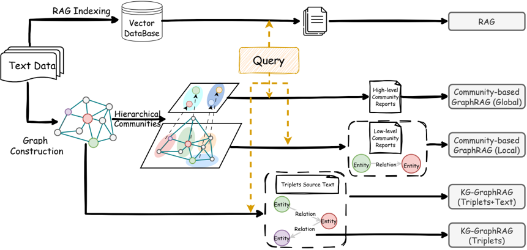
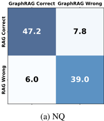
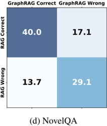
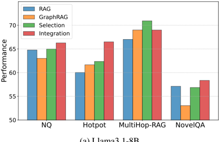
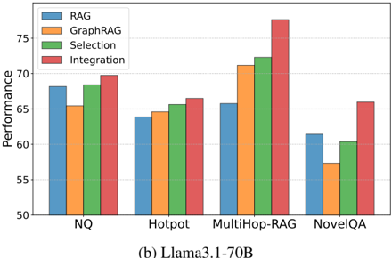
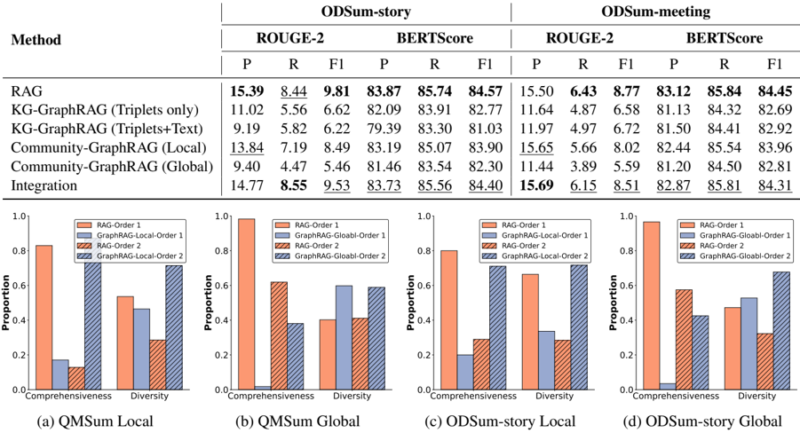
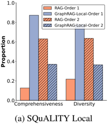
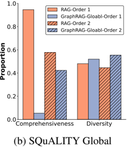
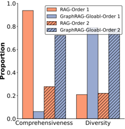

## RAG vs. GraphRAG: A Systematic Evaluation and Key Insights

## Haoyu Han 1 , Yu Wang 2 , Harry Shomer 1 , Yongjia Lei, 2 , Kai Guo 1 , Zhigang Hua 3 , Bo Long 3 , Hui Liu 1 , Jiliang Tang

Michigan State University, University of Oregon, {hanhaoy1, shomerha, guokai1, {yuwang, yongjia}@uoregon.edu, {zhua, bolong}@meta.com

1 1 2 3 Meta liuhui7, tangjili}@msu.edu

## Abstract

Retrieval-Augmented Generation (RAG) enhances the performance of LLMs across various tasks by retrieving relevant information from external sources, particularly on textbased data. For structured data, such as knowledge graphs, GraphRAG has been widely used to retrieve relevant information. However, recent studies have revealed that structuring implicit knowledge from text into graphs can benefit certain tasks, extending the application of GraphRAG from graph data to general text-based data. Despite their successful extensions, most applications of GraphRAG for text data have been designed for specific tasks and datasets, lacking a systematic evaluation and comparison between RAG and GraphRAG on widely used text-based benchmarks. In this paper, we systematically evaluate RAG and GraphRAG on well-established benchmark tasks, such as Question Answering and Querybased Summarization. Our results highlight the distinct strengths of RAG and GraphRAG across different tasks and evaluation perspectives. Inspired by these observations, we investigate strategies to integrate their strengths to improve downstream tasks. Additionally, we provide an in-depth discussion of the shortcomings of current GraphRAG approaches and outline directions for future research.

## 1 Introduction

Retrieval-Augmented Generation (RAG) has emerged as a powerful approach to enhance downstream tasks by retrieving relevant knowledge from external data sources. It has achieved remarkable success in various real-world applications, such as healthcare (Xu et al., 2024), law (Wiratunga et al., 2024), finance (Zhang et al., 2023), and education (Miladi et al., 2024). This success has been further amplified with the advent of Large Language Models (LLMs), as integrating RAG with LLMs significantly improves their faithfulness by mitigating hallucinations, reducing privacy risks, and enhancing robustness (Zhao et al., 2023; Huang et al., 2023). In most existing RAG systems, retrieval is primarily conducted from text databases using lexical and semantic search.

Graphs, as a fundamental data structure, encode rich relational information and have been extensively utilized across real-world domains, including knowledge representation, social network analysis, and biomedical research (Wu et al., 2020; Ma and Tang, 2021; Wu et al., 2023). Motivated by this, GraphRAG has recently gained attention for retrieving graph-structured data, such as knowledge graphs (KGs) and molecular graphs (Han et al., 2024; Peng et al., 2024). Beyond leveraging existing graphs, GraphRAG has also demonstrated its effectiveness for text-based tasks after structuring implicit knowledge from text into graph representations, benefiting applications such as global summarization (Edge et al., 2024; Zhang et al., 2024), planning (Lin et al., 2024) and reasoning (Han et al., 2025).

While previous studies have demonstrated the potential of GraphRAG for text-based tasks by converting sequential text into graphs, most of them primarily focus on specific tasks and welldesigned datasets. Consequently, the applicability of GraphRAG to broader, real-world text-based tasks remains unclear, particularly when compared to RAG, which has seen widespread adoption across diverse applications. This raises a critical question: What are the advantages and disadvantages of applying GraphRAG to general text-based tasks compared to RAG?

To bridge this gap, we systematically evaluate the performance of RAG and GraphRAG on general text-based tasks using widely adopted datasets, including Question Answering and Query-based Summarization. Specifically, we assess two representative GraphRAG methods: (1) Knowledge Graph-based GraphRAG (Liu, 2022), which ex-

tracts a Knowledge Graph (KG) from text and performs retrieval solely based on the KG and (2) Community-based GraphRAG (Edge et al., 2024), which retrieves information not only from the constructed KG but also from hierarchical communities within the graph. For the Question Answering task, we conduct experiments on both singlehop and multi-hop QA under single-document and multi-document scenarios. Similarly, for the Querybased Summarization task, we evaluate both singledocument and multi-document summarization to comprehensively assess the effectiveness of RAG and GraphRAG.

Based on our comprehensive evaluation, we conduct an in-depth analysis of the strengths and weaknesses of RAG and GraphRAG across different tasks. Our findings reveal that RAG and GraphRAG are complementary, each excelling in different aspects. For the Question Answering task, we observe that RAG performs better on singlehop questions and those requiring detailed information, while GraphRAG is more effective for multi-hop questions. In the Query-based Summarization task, RAG captures fine-grained details, whereas GraphRAG generates more diverse and multi-faceted summaries. Building on these insights, we investigate two strategies from different perspectives to integrate their unique strengths and enhance the overall performance. Our main contributions are as follows:

- Systematical Evaluation : This is the very first work to systematically evaluate and compare RAG and GraphRAG on text-based tasks using widely adopted datasets and evaluations.
- Task-Specific Insights : We provide an in-depth analysis of the distinct strengths of RAG and GraphRAG, demonstrating their complementary advantages across different types of queries and objectives.
- Hybrid Retrieval Strategies: Based on our findings on the unique strengths of RAG and GraphRAG, we propose two strategies to improve overall performance: (1) Selection, where queries are dynamically assigned to either RAG or GraphRAG based on their characteristics, and (2) Integration, where both methods are integrated to leverage their complementary strengths.
- Challenges and Future Directions: We discuss the limitations of current GraphRAG approaches and outline potential future research directions for broader applicability.

## 2 Related Works

## 2.1 Retrieval-Augmented Generation

Retrieval-Augmented Generation (RAG) has been widely applied to enhance the performance of Large Language Models (LLMs) by retrieving relevant information from external sources, addressing the limitation of LLMs' restricted context windows, improving factual accuracy, and mitigating hallucinations (Fan et al., 2024; Gao et al., 2023). Most RAG systems primarily process text data by first splitting it into chunks (Finardi et al., 2024). When a query is received, RAG retrieves relevant chunks either through lexical search (Ram et al., 2023) or by computing semantic similarity (Karpukhin et al., 2020), embeddings both the query and text chunks into a shared vector space. Advanced techniques, such as pre-retrieval processing (Ma et al., 2023; Zheng et al., 2023a) and post-retrieval processing (Dong et al., 2024; Xu et al., 2023), as well as fine-tuning strategies (Li et al., 2023), have further enhanced RAG's effectiveness across various domains, including QA) (Yan et al., 2024), dialogue generation (Izacard et al., 2023), and text summarization (Jiang et al., 2023).

Several studies have evaluated the effectiveness of RAG systems across various tasks (Yu et al., 2024; Chen et al., 2024; Es et al., 2023), such as multi-hop question answering (Tang and Yang, 2024), biomedical question answering (Xiong et al., 2024), and text generation (Liu et al., 2023). However, no existing study has simultaneously and systematically evaluated and compared RAG and GraphRAG on these general text-based tasks.

## 2.2 Graph Retrieval-Augmented Generation

While RAG primarily processes text data, many real-world scenarios involve graph-structured data, such as knowledge graphs (KGs), social graphs, and molecular graphs (Xia et al., 2021; Ma and Tang, 2021). GraphRAG (Han et al., 2024; Peng et al., 2024) aims to retrieve information from various types of graph-structured data. The inherent structure of graphs enhances retrieval by capturing relationships between connected nodes. For example, hyperlinks between documents can improve retrieval effectiveness in question answering tasks(Li et al., 2022). Currently, most GraphRAG studies focus on retrieving information from existing KGs for downstream tasks such as KG-based QA (Tian et al., 2024; Yasunaga et al., 2021) and Fact-Checking (Kim et al., 2023).

Figure 1: The illustration of RAG, KG-based GraphRAGs and Community-based GraphRAGs.

Despite leveraging the existing graphs, recent studies have explored incorporating graph construction into GraphRAG to enhance text-based tasks. For example, Dong et al. (2024) construct document graphs using Abstract Meaning Representation (AMR) to improve document ranking. Edge et al. (2024) construct graphs from documents using LLMs, where nodes represent entities and edges capture relationships between them. Based on these graphs, they generate hierarchical communities and corresponding community summaries or reports. Their approach focuses on the global query summarization task, retrieving information from both the constructed graphs and their hierarchical communities. Additionally, Han et al. (2025) propose an iterative graph construction approach using LLMs to improve reasoning tasks.

These studies highlight the potential of GraphRAG in processing text-based tasks by constructing graphs from textual data. However, their focus is limited to specific tasks and evaluation settings. It remains unclear how GraphRAG performs on general text-based tasks compared to RAG. More importantly, when and how should GraphRAG be applied to such tasks for optimal effectiveness? Our work aims to bridge this gap by systematically evaluating GraphRAG and comparing it with RAG on general text-based tasks.

## 3 Evaluation Methodology

In this section, we introduce the details of our evaluation framework. We primarily evaluate one representative RAG system and two representative GraphRAG systems, as illustrated in Figure 1.

## 3.1 RAG

We adopt a representative semantic similaritybased retrieval approach as our RAG method (Karpukhin et al., 2020). Specifically, we first split the text into chunks, each containing approximately 256 tokens. For indexing, we use OpenAI's text-embedding-ada-002 model, which has demonstrated effectiveness across various tasks (Nussbaum et al., 2024). For each query, we retrieve chunks with Top-10 similarity scores. To generate responses, we employ two open-source models of different sizes: Llama-3.1-8B-Instruct and Llama-3.1-70B-Instruct (Dubey et al., 2024).

For single-document tasks, we generate a separate RAG system for each document, ensuring that queries corresponding to a specific document are processed within its respective indexed chunk pool. For multi-document tasks, we use a shared RAG system by indexing all documents together.

## 3.2 GraphRAG

We select two representative GraphRAG methods for a comprehensive evaluation, as shown in Figure 1, namely KG-based GraphRAG and Community-based GraphRAG.

In the KG-based GraphRAG (KGGraphRAG) (Liu, 2022), a knowledge graph is first constructed from text chunks using LLMs through triplet extraction. When a query is received, its entities are extracted and matched to those in the constructed KG using LLMs. The retrieval process then traverses the graph from the matched entities and gathers triplets (head, relation, tail) from their multi-hop neighbors as the retrieved

content. Additionally, for each triplet, we can retrieve the corresponding text associated with it. We define two variants of KG-GraphRAG: (1) KG-GraphRAG (Triplets) , which retrieves only the triplets, and (2) KG-GraphRAG (Triplets+Text) , which retrieves both the triplets and their associated source text. We implement the KG-GraphRAG methods using LlamaIndex (Liu, 2022) 1 .

For the Community-based GraphRAG (Edge et al., 2024), in addition to generating KGs using LLMs, hierarchical communities are constructed using graph community detection algorithms, as shown in Figure 1. Each community is associated with a corresponding text summary or report, where lower-level communities contain detailed information from the original text. The higherlevel communities further provide summaries of the lower-level communities. Due to the hierarchical community structure, there are two primary retrieval methods for retrieving relevant information given a query: Local Search and Global Search . In Local Search, entities, relations, their descriptions, and lower-level community reports are retrieved based on entity matching between the query's extracted entities and the constructed graph. We refer to this method as Community-GraphRAG (Local) . In Global Search, only high-level community summaries are retrieved based on semantic similarity to the query. We refer to this method as Community-GraphRAG (Global) . The CommunityGraphRAG methods are implemented using Microsoft GraphRAG (Edge et al., 2024) 2 .

To ensure a fair comparison, we adopt the same settings for both RAG and GraphRAG methods. This includes the chunking strategy, embedding model, and LLMs. We select two representative RAG tasks, i.e., Question Answering and Query-based Summarization, to evaluate RAG and GraphRAG simultaneously.

## 4 Question Answering

QA is one of the most widely used tasks for evaluating the performance of RAG systems. QA tasks come in various forms, such as single-hop QA, multi-hop QA, and open-domain QA (Wang, 2022). To systematically assess the effectiveness of RAG and GraphRAG in these tasks, we evaluate them on widely used QA datasets and employ standard evaluation metrics.

1 https://www.llamaindex.ai/

2 https://microsoft.github.io/graphrag

## 4.1 Datasets and Evaluation Metrics

To comprehensively evaluate the performance of GraphRAG on general QA tasks, we select four widely used datasets that cover different perspectives. For the single-hop QA task, we select the Natural Questions (NQ) dataset (Kwiatkowski et al., 2019). For the multi-hop QA task, we select HotPotQA (Yang et al., 2018) and MultiHopRAG (Tang and Yang, 2024) datasets. The MultiHop-RAG dataset categorizes queries into four types: Inference, Comparison, Temporal, and Null queries. To further analyze the performance of RAG and GraphRAG at a finer granularity, we also include NovelQA (Tang and Yang, 2024), which contains 21 different types of queries. For more details, please refer to Appendix A.1.1. We use Precision (P), Recall (R), and F1-score as evaluation metrics for the NQ and HotPotQA datasets, while accuracy is used for the MultiHop-RAG and NovelQA datasets following their original papers.

## 4.2 QA Main Results

The performance comparison for the NQ and HotPotQA datasets is presented in Table 1, while that of MultiHop-RAG is shown in Table 2. Due to space constraints, partial results of NovelQA with the Llama 3.1-8B model are shown in Table 3, with the full results available in Appendix A.2. Based on these results, we make the following observations:

1. RAG excels on detailed single-hop queries . RAG performs well on single-hop queries and queries that require detailed information. This is evident from its performance on the singlehop dataset (NQ) as well as the single-hop (sh) and detail-oriented (dtl) queries in the NovelQA dataset, as shown in Table 1 and Table 3.
2. GraphRAG, particularly CommunityGraphRAG (Local), excels on multi-hop queries. For instance, it achieved the best performance on both the HotPotQA and MultiHop-RAG datasets. Although its overall performance on the NovelQA dataset is lower than that of RAG, it still performs well on the multi-hop (mh) queries in NovelQA dataset.
3. Community-GraphRAG (Global) often struggles on QA tasks . This is due to the global search retrieves only high-level communities, leading to a loss of detailed information. This is particularly evident from its lower performance on detail-oriented queries in the NovelQA dataset. Additionally, Community-GraphRAG (Global) tends to hallucinate in QA tasks, as

Table 1: Performance comparison (%) on NQ and Hotpot datasets. The best results are highlighted in bold, and the second-best results are underlined.

|                             | NQ           | NQ           | NQ           | NQ            | NQ            | NQ            | Hotpot       | Hotpot       | Hotpot       | Hotpot        | Hotpot        | Hotpot        |
|-----------------------------|--------------|--------------|--------------|---------------|---------------|---------------|--------------|--------------|--------------|---------------|---------------|---------------|
| Method                      | Llama 3.1-8B | Llama 3.1-8B | Llama 3.1-8B | Llama 3.1-70B | Llama 3.1-70B | Llama 3.1-70B | Llama 3.1-8B | Llama 3.1-8B | Llama 3.1-8B | Llama 3.1-70B | Llama 3.1-70B | Llama 3.1-70B |
|                             | P            | R            | F1           | P             | R             | F1            | P            | R            | F1           | P             | R             | F1            |
| RAG                         | 71.7         | 63.93        | 64.78        | 74.55         | 67.82         | 68.18         | 62.32        | 60.47        | 60.04        | 66.34         | 63.99         | 63.88         |
| KG-GraphRAG (Triplets only) | 40.09        | 33.56        | 34.28        | 37.84         | 31.22         | 28.50         | 26.88        | 24.81        | 25.02        | 32.59         | 30.63         | 30.73         |
| KG-GraphRAG (Triplets+Text) | 58.36        | 48.93        | 50.27        | 60.91         | 52.75         | 53.88         | 45.22        | 42.85        | 42.60        | 51.44         | 48.99         | 48.75         |
| Community-GraphRAG (Local)  | 69.48        | 62.54        | 63.01        | 71.27         | 65.46         | 65.44         | 64.14        | 62.08        | 61.66        | 67.20         | 64.89         | 64.60         |
| Community-GraphRAG (Global) | 60.76        | 54.99        | 54.48        | 61.15         | 55.52         | 55.05         | 45.72        | 47.60        | 45.16        | 48.33         | 48.56         | 46.99         |

Table 2: Performance comparison (%) on the MultiHop-RAG dataset across different query types.

| Method                      | LLama 3.1-8B   | LLama 3.1-8B   | LLama 3.1-8B   | LLama 3.1-8B   | LLama 3.1-8B   | Llama 3.1-70B   | Llama 3.1-70B   | Llama 3.1-70B   | Llama 3.1-70B   | Llama 3.1-70B   |
|-----------------------------|----------------|----------------|----------------|----------------|----------------|-----------------|-----------------|-----------------|-----------------|-----------------|
|                             | Inference      | Comparison     | Null           | Temporal       | Overall        | Inference       | Comparison      | Null            | Temporal        | Overall         |
| RAG                         | 92.16          | 57.59          | 96.01          | 30.7           | 67.02          | 94.85           | 56.31           | 91.36           | 25.73           | 65.77           |
| KG-GraphRAG (Triplets only) | 55.76          | 22.55          | 98.67          | 18.7           | 41.24          | 76.96           | 32.36           | 94.35           | 19.55           | 50.98           |
| KG-GraphRAG (Triplets+Text) | 67.4           | 34.7           | 97.34          | 17.15          | 48.51          | 85.91           | 35.98           | 86.38           | 21.61           | 54.58           |
| Community-GraphRAG (Local)  | 86.89          | 60.63          | 80.07          | 50.6           | 69.01          | 92.03           | 60.16           | 88.70           | 49.06           | 71.17           |
| Community-GraphRAG (Global) | 89.34          | 64.02          | 19.27          | 53.34          | 64.4           | 89.09           | 66.00           | 13.95           | 59.18           | 65.69           |

Table 3: Performance comparison (%) on the NovelQA dataset across different query types with LLama 3.1-8B.

|     |       | RAG   | RAG   | RAG   | RAG   | RAG   | RAG   | RAG   | KG-GraphRAG (Triplets+Text)   | KG-GraphRAG (Triplets+Text)   | KG-GraphRAG (Triplets+Text)   | KG-GraphRAG (Triplets+Text)   | KG-GraphRAG (Triplets+Text)   | KG-GraphRAG (Triplets+Text)   | KG-GraphRAG (Triplets+Text)   | KG-GraphRAG (Triplets+Text)   | KG-GraphRAG (Triplets+Text)   |
|-----|-------|-------|-------|-------|-------|-------|-------|-------|-------------------------------|-------------------------------|-------------------------------|-------------------------------|-------------------------------|-------------------------------|-------------------------------|-------------------------------|-------------------------------|
|     | chara | mean  | plot  | relat | settg | span  | times | avg   |                               | chara                         | mean                          | plot                          | relat                         | settg                         | span                          | times                         | avg                           |
| mh  | 68.75 | 52.94 | 58.33 | 75.28 | 92.31 | 64.00 | 33.96 | 47.34 | mh                            | 52.08                         | 52.94                         | 44.44                         | 55.06                         | 69.23                         | 64.00                         | 28.61                         | 38.37                         |
| sh  | 69.08 | 62.86 | 66.11 | 75.00 | 78.35 | -     | -     | 68.73 | sh                            | 36.84                         | 45.71                         | 40.17                         | 87.50                         | 36.08                         | -                             | -                             | 39.93                         |
| dtl | 64.29 | 45.51 | 78.57 | 10.71 | 83.78 | -     | -     | 55.28 | dtl                           | 38.57                         | 30.90                         | 42.86                         | 21.43                         | 32.43                         | -                             | -                             | 33.60                         |
| avg | 67.78 | 50.57 | 67.37 | 60.80 | 80.95 | 64.00 | 33.96 | 57.12 | avg                           | 40.00                         | 36.23                         | 41.09                         | 49.60                         | 38.10                         | 64.00                         | 28.61                         | 37.80                         |

|     |       |       |       |       |       |       |       |       | Community-GraphRAG (Global)   | Community-GraphRAG (Global)   | Community-GraphRAG (Global)   | Community-GraphRAG (Global)   | Community-GraphRAG (Global)   | Community-GraphRAG (Global)   | Community-GraphRAG (Global)   | Community-GraphRAG (Global)   | Community-GraphRAG (Global)   |
|-----|-------|-------|-------|-------|-------|-------|-------|-------|-------------------------------|-------------------------------|-------------------------------|-------------------------------|-------------------------------|-------------------------------|-------------------------------|-------------------------------|-------------------------------|
|     | chara | mean  | plot  | relat | settg | span  | times | avg   |                               | chara                         | mean                          | plot                          | relat                         | settg                         | span                          | times                         | avg                           |
| mh  | 68.75 | 64.71 | 55.56 | 67.42 | 92.31 | 52.00 | 35.83 | 47.01 | mh                            | 54.17                         | 58.82                         | 55.56                         | 56.18                         | 53.85                         | 68.00                         | 20.59                         | 34.39                         |
| sh  | 59.87 | 58.57 | 65.69 | 87.50 | 64.95 | -     | -     | 63.43 | sh                            | 45.39                         | 50.00                         | 55.65                         | 87.50                         | 38.14                         | -                             | -                             | 49.65                         |
| dtl | 54.29 | 37.64 | 62.50 | 25.00 | 70.27 | -     | -     | 46.88 | dtl                           | 28.57                         | 29.78                         | 32.14                         | 87.50                         | 40.54                         | -                             | -                             | 30.89                         |
| avg | 60.00 | 44.91 | 64.05 | 59.20 | 68.71 | 52.00 | 35.83 | 53.03 | avg                           | 42.59                         | 36.98                         | 51.66                         | 52.00                         | 40.14                         | 68.00                         | 20.59                         | 39.17                         |

shown by its poor performance on Null queries in the MultiHop-RAG dataset, which should ideally be answered as 'insufficient information.' However, this summarization approach may be beneficial for queries that require comparing different topics or understanding their temporal ordering, such as Comparison and Temporal queries in the MultiHop-RAG dataset, as shown in Table 2.

## 4.3 Comparative QA Analysis

4. KG-based GraphRAG also generally underperform on QA tasks . This is because it retrieves information solely from the constructed knowledge graph, which contains only entities and their relations. However, the extracted entities and relations may be incomplete, leading to gaps in the retrieved information. To verify this, we calculated the ratio of answer entities present in the constructed KG. We found that only around 65.8% of answer entities exist in the constructed KG for the Hotpot dataset and 65.5% for the NQ dataset. These findings highlight a key limitation in KG-based retrieval and suggest the need for improved KG construction methods to enhance graph completeness for QA.

In this section, we conduct a detailed analysis of the behavior of RAG and GraphRAG, focusing on their strengths and weaknesses. In the following discussion, we refer to Community-GraphRAG (Local) as GraphRAG, as it demonstrates performance comparable to RAG. We categorize queries into four groups: (1) Queries correctly answered by both methods, (2) Queries correctly answered only by RAG (RAG-only), (3) Queries correctly answered only by GraphRAG (GraphRAG-only), and (4) Queries answered incorrectly by both methods.

The confusion matrices representing these four groups using the Llama 3.1-8B model are shown in Figure 2. Notably, the proportions of queries correctly answered exclusively by GraphRAG and RAG are significant. For example, 13.6% of queries are GraphRAG-only, while 11.6% are RAGonly on MultiHop-RAG dataset. This phenomenon highlights the complementary properties of RAG and GraphRAG, and each method has its own strengths and weaknesses. Therefore, leveraging their unique advantages has the potential to improve overall performance .

Figure 2: Confusion matrices comparing GraphRAG and RAG correctness across datasets using Llama 3.1-8B.

## 4.4 Improving QA Performance

## both strategies generally enhance overall per-

Building on the complementary properties of RAG and GraphRAG, we investigate the following two strategies to enhance overall QA performance.

## Strategy 1: RAG vs. GraphRAG Selection.

In Section 4.2, we observe that RAG generally performs well on single-hop queries and those requiring detailed information, while GraphRAG (Community-GraphRAG (Local)) excels in multihop queries that require reasoning. Therefore, we hypothesize that RAG is well-suited for fact-based queries, which rely on direct retrieval and detailed information, whereas GraphRAG is more effective for reasoning-based queries that involve chaining multiple facts together. Therefore, given a query, we employ a classification mechanism to determine whether it is fact-based or reasoning-based. Each query is then assigned to either RAG or GraphRAG based on the classification results. Specifically, we leverage the in-context learning ability of LLMs for classification (Dong et al., 2022; Wei et al., 2023). Further details and prompts can be found in Appendix A.3. In this strategy, either RAG or GraphRAG is selected for each query, and we refer to this strategy as Selection .

## Strategy 2: RAG and GraphRAG Integration.

We also explore the Integration strategy to leverage the complementary strengths of RAG and GraphRAG. Both RAG and GraphRAG retrieve information for a query simultaneously. The retrieved results are then concatenated and fed into the generator to produce the final output.

We conduct experiments to verify the effectiveness of the two proposed strategies. Specifically, we evaluate overall performance across all selected datasets. For the MultiHop-RAG and NovelQA datasets, we use the overall accuracy, while for the NQ and HotPotQA datasets, we use the F1 score as the evaluation metric. The results are shown in Figure 3. From these results, we observe that formance . For example, on the MultiHop-RAG dataset with Llama 3.1-70B, Selection and Integration improve the best method by 1.1% and 6.4%, respectively. When comparing the Selection and Integration strategies, the Integration strategy usually achieves higher performance than the Selection strategy. However, the Selection strategy processes each query using either RAG or GraphRAG, making it more efficient. In contrast, the Integration strategy yields better performance but requires each query to be processed by both RAG and GraphRAG, increasing computational cost.

## 5 Query-Based Summarization

Query-based summarization tasks are widely used to evaluate the performance of RAG systems (Ram et al., 2023; Yu et al., 2023). GraphRAG has also demonstrated its effectiveness in summarization tasks (Edge et al., 2024). However, Edge et al. (2024) only evaluate its effectiveness on the global summarization task and rely on LLM-as-aJudge (Zheng et al., 2023b) for performance assessment. In Section 5.3, we show that the LLMas-a-Judge evaluation method for summarization tasks introduces position bias, which can impact the reliability of results. A systematic comparison of RAG and GraphRAG on general query-based summarization across widely used datasets remains unexplored. To address this gap, we conduct a comprehensive evaluation in this section, leveraging widely used datasets and evaluation metrics.

## 5.1 Datasets and Evaluation Metrics

We adopt two widely used single-document querybased summarization datasets, SQuALITY (Wang et al., 2022) and QMSum (Zhong et al., 2021), and two multi-document query-based summarization datasets, ODSum-story and ODSummeeting (Zhou et al., 2023), for our evaluation. Unlike the LLM-generated global queries used in

(a) Llama3.1-8B

(b) Llama3.1-70B

Figure 3: Overall QA performance comparison of different methods.

the unreleased datasets of Edge et al. (2024), most queries in the selected datasets focus on specific roles or events. Since these datasets contain one or more ground truth summaries for each query, we use ROUGE-2 (Lin, 2004) and BERTScore (Zhang et al., 2019) as evaluation metrics to measure lexical and semantic similarity between the predicted and ground truth summaries.

## 5.3 Position Bias in Existing Evaluation

## 5.2 Summarization Experimental Results

We evaluate both the KG-based and Communitybased GraphRAG methods, along with the Integration strategy discussed in Section 4.4. The results of Llama3.1-8B model on Query-based single document summarization and multiple document summarization are shown in Table 4 and Table 5, respectively. The results of Llama3.1-70B are shown in Appendix A.4. Based on these results, we can make the following observations:

1. RAGgenerally performs well on query-based summarization tasks . This is particularly true on multi-document summarization datasets, where they are often the best method.
2. KG-based GraphRAG benefit from combining triplets with their corresponding text . This improves performance by incorporating more details, making predictions closer to the ground truth summaries.
3. Community-based GraphRAG performs better with the Local search method . Local search retrieves entities, relations, and lowlevel communities, while the Global search method retrieves only high-level summaries. This demonstrates the importance of detailed information in the selected datasets.
4. The Integration strategy is often comparable to RAG only performance . This strategy integrates retrieved content from both RAG and Community-GraphRAG (Local), resulting in performance similar to RAG alone.

From the results in Section 5.2, the Communitybased GraphRAG, particularly with global search, generally underperforms compared to RAG on the selected datasets. This contrasts with the findings of Edge et al. (2024), where Community-based GraphRAG with global search outperformed both local search and RAG. There are two key differences between our evaluation and Edge et al. (2024). First, their study primarily focuses on global summarization, which captures the overall information of an entire corpus, whereas the selected datasets in our evaluation contain queries related to specific roles or events. Second, Edge et al. (2024) assess performance by comparing RAG and GraphRAG outputs using LLM-as-a-Judge without ground truth, whereas we evaluate results against ground truth summaries using ROUGE and BERTScore. These metrics emphasize similarity to the reference summaries, which often contain more detailed information.

Wefurther conduct an evaluation following Edge et al. (2024), using the LLM-as-a-Judge method to compare RAG and Community-based GraphRAG from two perspectives: Comprehensiveness and Diversity. Comprehensiveness focuses on detail, addressing the question: "How much detail does the answer provide to cover all aspects and details of the question?" Meanwhile, Diversity emphasizes global information, evaluating "Does the answer provide a broad and globally inclusive perspective?" . The prompt and details are shown in Appendix A.5. Specifically, we input the summaries generated by RAG and GraphRAG into the prompt and ask the LLM to select the better one for each metric, following Edge et al. (2024). Additionally, to better account for the order in which the summaries are presented, we consider two scenarios. Order 1 (O1) : We place the RAG summary appears

Table 4: The performance of query-based single document summarization task using Llama3.1-8B.

|                             | SQuALITY   | SQuALITY   | SQuALITY   | SQuALITY   | SQuALITY   | SQuALITY   | QMSum   | QMSum   | QMSum   | QMSum     | QMSum     | QMSum     |
|-----------------------------|------------|------------|------------|------------|------------|------------|---------|---------|---------|-----------|-----------|-----------|
| Method                      | ROUGE-2    | ROUGE-2    | ROUGE-2    | BERTScore  | BERTScore  | BERTScore  | ROUGE-2 | ROUGE-2 | ROUGE-2 | BERTScore | BERTScore | BERTScore |
|                             | P          | R          | F1         | P          | R          | F1         | P       | R       | F1      | P         | R         | F1        |
| RAG                         | 15.09      | 8.74       | 10.08      | 74.54      | 81.00      | 77.62      | 21.50   | 3.80    | 6.32    | 81.03     | 84.45     | 82.69     |
| KG-GraphRAG (Triplets only) | 11.99      | 6.16       | 7.41       | 82.46      | 84.30      | 83.17      | 13.71   | 2.55    | 4.15    | 80.16     | 82.96     | 81.52     |
| KG-GraphRAG (Triplets+Text) | 15.00      | 9.48       | 10.52      | 84.37      | 85.88      | 84.92      | 16.83   | 3.32    | 5.38    | 80.92     | 83.64     | 82.25     |
| Community-GraphRAG (Local)  | 15.82      | 8.64       | 10.10      | 83.93      | 85.84      | 84.66      | 20.54   | 3.35    | 5.64    | 80.63     | 84.13     | 82.34     |
| Community-GraphRAG (Global) | 10.23      | 6.21       | 6.99       | 82.68      | 84.26      | 83.30      | 10.54   | 1.97    | 3.23    | 79.79     | 82.47     | 81.10     |
| Integration                 | 15.69      | 9.32       | 10.67      | 74.56      | 81.22      | 77.73      | 21.97   | 3.80    | 6.34    | 80.89     | 84.47     | 82.63     |

Table 5: The performance of query-based multiple document summarization task using Llama3.1-8B.

| ODSum-story   | ODSum-story   | ODSum-story   | ODSum-story   | ODSum-story   | ODSum-story   | ODSum-meeting   | ODSum-meeting   | ODSum-meeting   | ODSum-meeting   | ODSum-meeting   | ODSum-meeting   |
|---------------|---------------|---------------|---------------|---------------|---------------|-----------------|-----------------|-----------------|-----------------|-----------------|-----------------|
| ROUGE-2       | ROUGE-2       | ROUGE-2       | BERTScore     | BERTScore     | BERTScore     | ROUGE-2         | ROUGE-2         | ROUGE-2         | BERTScore       | BERTScore       | BERTScore       |
| P             | R             | F1            | P             | R             | F1            | P               | R               | F1              | P               | R               | F1              |
| 15.39         | 8.44          | 9.81          | 83.87         | 85.74         | 84.57         | 15.50           | 6.43            | 8.77            | 83.12           | 85.84           | 84.45           |
| 11.02         | 5.56          | 6.62          | 82.09         | 83.91         | 82.77         | 11.64           | 4.87            | 6.58            | 81.13           | 84.32           | 82.69           |
| 9.19          | 5.82          | 6.22          | 79.39         | 83.30         | 81.03         | 11.97           | 4.97            | 6.72            | 81.50           | 84.41           | 82.92           |
| 13.84         | 7.19          | 8.49          | 83.19         | 85.07         | 83.90         | 15.65           | 5.66            | 8.02            | 82.44           | 85.54           | 83.96           |
| 9.40          | 4.47          | 5.46          | 81.46         | 83.54         | 82.30         | 11.44           | 3.89            | 5.59            | 81.20           | 84.50           | 82.81           |
| 14.77         | 8.55          | 9.53          | 83.73         | 85.56         | 84.40         | 15.69           | 6.15            | 8.51            | 82.87           | 85.81           | 84.31           |

Figure 4: Comparison of LLM-as-a-Judge evaluations for RAG and GraphRAG. "Local" refers to the evaluation of RAG vs. GraphRAG-Local, while "Global" refers to RAG vs. GraphRAG-Global.

before the GraphRAG summary and Order 2 (O2) : GraphRAG appears before RAG. We compare the proportion of selected best samples from RAG and GraphRAG, where a higher proportion indicates better performance as predicted by the LLM.

The results of RAG vs. GraphRAG (Local) and RAG vs. GraphRAG (Global) on the QMSum and ODSum-story datasets are presented in Figure 4. More result can be found in Appendix A.6. We can make the following observations: (1) Position bias (Shi et al., 2024; Wang et al., 2024) is evident in the LLM-as-a-Judge evaluations for summarization task , as changing the order of the two methods significantly affects the predictions. This effect is particularly strong in the comparison between RAG and GraphRAG (Local), where the LLMs make completely opposite decisions depending on the order, as shown in Figures 4a and 4c. However, (2) Comparison between RAG and GraphRAG (Global): While the proportions vary, RAG consistently outperforms GraphRAG (Global) in Comprehensiveness but underperforms in Diversity as shown in Figures 4b and 4d. This result suggests that Community-based GraphRAG with Global Search focuses more on the global aspects of whole corpus, whereas RAG captures more detailed information.

## 6 Conclusion

In this paper, we systematically evaluate and compare RAG and GraphRAG on general text-based tasks. Our analysis reveals the distinct strengths of RAG and GraphRAG in QA and query-based summarization, as well as evaluation challenges in summarization tasks, providing valuable insights for future research. Building on these findings, we propose two strategies to enhance QA performance. Future work can explore improving GraphRAG through better graph construction or developing novel approaches to combine RAG and GraphRAG methods for both effectiveness and efficiency.

## Limitations

In this paper, we evaluate and compare RAG and GraphRAG on Question Answering and Querybased Summarization tasks. Future work can extend this study to additional tasks to further assess the strengths and applicability of GraphRAG. Additionally, the graph construction in all GraphRAG methods explored in this work relies on LLM-based construction, where LLMs extract entities and relations. However, other graph construction models designed for text processing exist and can be investigated in future studies. Finally, we primarily evaluate generation performance using Llama 3.18B-Instruct and Llama 3.1-70B-Instruct. Future research can explore other generation models for a more comprehensive comparison.

## References

Jiawei Chen, Hongyu Lin, Xianpei Han, and Le Sun. 2024. Benchmarking large language models in retrieval-augmented generation. In Proceedings of the AAAI Conference on Artificial Intelligence , volume 38, pages 17754-17762.

Jialin Dong, Bahare Fatemi, Bryan Perozzi, Lin F Yang, and Anton Tsitsulin. 2024. Don't forget to connect! improving rag with graph-based reranking. arXiv preprint arXiv:2405.18414 .

Qingxiu Dong, Lei Li, Damai Dai, Ce Zheng, Jingyuan Ma, Rui Li, Heming Xia, Jingjing Xu, Zhiyong Wu, Tianyu Liu, et al. 2022. A survey on in-context learning. arXiv preprint arXiv:2301.00234 .

Abhimanyu Dubey, Abhinav Jauhri, Abhinav Pandey, Abhishek Kadian, Ahmad Al-Dahle, Aiesha Letman, Akhil Mathur, Alan Schelten, Amy Yang, Angela Fan, et al. 2024. The llama 3 herd of models. arXiv preprint arXiv:2407.21783 .

Darren Edge, Ha Trinh, Newman Cheng, Joshua Bradley, Alex Chao, Apurva Mody, Steven Truitt, and Jonathan Larson. 2024. From local to global: A graph rag approach to query-focused summarization. arXiv preprint arXiv:2404.16130 .

Shahul Es, Jithin James, Luis Espinosa-Anke, and Steven Schockaert. 2023. Ragas: Automated evaluation of retrieval augmented generation. arXiv preprint arXiv:2309.15217 .

Wenqi Fan, Yujuan Ding, Liangbo Ning, Shijie Wang, Hengyun Li, Dawei Yin, Tat-Seng Chua, and Qing Li. 2024. A survey on rag meeting llms: Towards retrieval-augmented large language models. In Proceedings of the 30th ACM SIGKDD Conference on Knowledge Discovery and Data Mining , pages 64916501.

| Paulo Finardi, Leonardo Avila, Rodrigo Castaldoni, Pe- dro Gengo, Celio Larcher, Marcos Piau, Pablo Costa, and Vinicius Caridá. 2024. The chronicles of rag: The retriever, the chunk and the generator. arXiv preprint arXiv:2401.07883 .                                                                                      |
|---------------------------------------------------------------------------------------------------------------------------------------------------------------------------------------------------------------------------------------------------------------------------------------------------------------------------------|
| Yunfan Gao, Yun Xiong, Xinyu Gao, Kangxiang Jia, Jinliu Pan, Yuxi Bi, Yi Dai, Jiawei Sun, and Haofen Wang. 2023. Retrieval-augmented generation for large language models: A survey. arXiv preprint arXiv:2312.10997 .                                                                                                          |
| Haoyu Han, Yu Wang, Harry Shomer, Kai Guo, Jiayuan Ding, Yongjia Lei, Mahantesh Halappanavar, RyanA Rossi, Subhabrata Mukherjee, Xianfeng Tang, et al. 2024. Retrieval-augmented generation with graphs (graphrag). arXiv preprint arXiv:2501.00309 .                                                                           |
| Haoyu Han, Yaochen Xie, Hui Liu, Xianfeng Tang, Sreyashi Nag, William Headden, Yang Li, Chen Luo, Shuiwang Ji, Qi He, et al. 2025. Reasoning with graphs: Structuring implicit knowledge to enhance llms reasoning. arXiv preprint arXiv:2501.07845 .                                                                           |
| Lei Huang, Weijiang Yu, Weitao Ma, Weihong Zhong, Zhangyin Feng, Haotian Wang, Qianglong Chen, Weihua Peng, Xiaocheng Feng, Bing Qin, et al. 2023. A survey on hallucination in large language models: Principles, taxonomy, challenges, and open questions. arXiv preprint arXiv:2311.05232 .                                  |
| Gautier Izacard, Patrick Lewis, Maria Lomeli, Lucas Hosseini, Fabio Petroni, Timo Schick, Jane Dwivedi- Yu, Armand Joulin, Sebastian Riedel, and Edouard Grave. 2023. Atlas: Few-shot learning with retrieval augmented language models. Journal of Machine Learning Research , 24(251):1-43.                                   |
| Zhengbao Jiang, Frank F Xu, Luyu Gao, Zhiqing Sun, Qian Liu, Jane Dwivedi-Yu, Yiming Yang, Jamie Callan, and Graham Neubig. 2023. Ac- tive retrieval augmented generation. arXiv preprint arXiv:2305.06983 .                                                                                                                    |
| Vladimir Karpukhin, Barlas O˘ guz, Sewon Min, Patrick Lewis, Ledell Wu, Sergey Edunov, Danqi Chen, and Wen-tau Yih. 2020. Dense passage retrieval for open-domain question answering. arXiv preprint arXiv:2004.04906 .                                                                                                         |
| Jiho Kim, Sungjin Park, Yeonsu Kwon, Yohan Jo, James Thorne, and Edward Choi. 2023. Factkg: Fact veri- fication via reasoning on knowledge graphs. arXiv preprint arXiv:2305.06590 .                                                                                                                                            |
| Tom Kwiatkowski, Jennimaria Palomaki, Olivia Red- field, Michael Collins, Ankur Parikh, Chris Alberti, Danielle Epstein, Illia Polosukhin, Jacob Devlin, Ken- ton Lee, et al. 2019. Natural questions: a benchmark for question answering research. Transactions of the Association for Computational Linguistics , 7:453- 466. |

Xinze Li, Zhenghao Liu, Chenyan Xiong, Shi Yu, Yu Gu, Zhiyuan Liu, and Ge Yu. 2023. Structureaware language model pretraining improves dense

retrieval on structured data. arXiv preprint arXiv:2305.19912 .

Yongqi Li, Wenjie Li, and Liqiang Nie. 2022. Dynamic graph reasoning for conversational open-domain question answering. ACM Transactions on Information Systems (TOIS) , 40(4):1-24.

Chin-Yew Lin. 2004. Rouge: A package for automatic evaluation of summaries. In Text summarization branches out , pages 74-81.

Fangru Lin, Emanuele La Malfa, Valentin Hofmann, Elle Michelle Yang, Anthony Cohn, and Janet B Pierrehumbert. 2024. Graph-enhanced large language models in asynchronous plan reasoning. arXiv preprint arXiv:2402.02805 .

Jerry Liu. 2022. LlamaIndex.

Yi Liu, Lianzhe Huang, Shicheng Li, Sishuo Chen, Hao Zhou, Fandong Meng, Jie Zhou, and Xu Sun. 2023. Recall: A benchmark for llms robustness against external counterfactual knowledge. arXiv preprint arXiv:2311.08147 .

Xinbei Ma, Yeyun Gong, Pengcheng He, Hai Zhao, and Nan Duan. 2023. Query rewriting for retrievalaugmented large language models. arXiv preprint arXiv:2305.14283 .

Yao Ma and Jiliang Tang. 2021. Deep learning on graphs . Cambridge University Press.

Fatma Miladi, Valéry Psyché, and Daniel Lemire. 2024. Leveraging gpt-4 for accuracy in education: A comparative study on retrieval-augmented generation in moocs. In International Conference on Artificial Intelligence in Education , pages 427-434. Springer.

Zach Nussbaum, John X Morris, Brandon Duderstadt, and Andriy Mulyar. 2024. Nomic embed: Training a reproducible long context text embedder. arXiv preprint arXiv:2402.01613 .

Boci Peng, Yun Zhu, Yongchao Liu, Xiaohe Bo, Haizhou Shi, Chuntao Hong, Yan Zhang, and Siliang Tang. 2024. Graph retrieval-augmented generation: A survey. arXiv preprint arXiv:2408.08921 .

Ori Ram, Yoav Levine, Itay Dalmedigos, Dor Muhlgay, Amnon Shashua, Kevin Leyton-Brown, and Yoav Shoham. 2023. In-context retrieval-augmented language models. Transactions of the Association for Computational Linguistics , 11:1316-1331.

Lin Shi, Chiyu Ma, Wenhua Liang, Weicheng Ma, and Soroush Vosoughi. 2024. Judging the judges: A systematic investigation of position bias in pairwise comparative assessments by llms. arXiv preprint arXiv:2406.07791 .

Yixuan Tang and Yi Yang. 2024. Multihop-rag: Benchmarking retrieval-augmented generation for multihop queries. arXiv preprint arXiv:2401.15391 .

Yijun Tian, Huan Song, Zichen Wang, Haozhu Wang, Ziqing Hu, Fang Wang, Nitesh V Chawla, and Panpan Xu. 2024. Graph neural prompting with large language models. In Proceedings of the AAAI Conference on Artificial Intelligence , volume 38, pages 19080-19088.

Alex Wang, Richard Yuanzhe Pang, Angelica Chen, Jason Phang, and Samuel R Bowman. 2022. Squality: Building a long-document summarization dataset the hard way. arXiv preprint arXiv:2205.11465 .

Zhen Wang. 2022. Modern question answering datasets and benchmarks: A survey. arXiv preprint arXiv:2206.15030 .

Ziqi Wang, Hanlin Zhang, Xiner Li, Kuan-Hao Huang, Chi Han, Shuiwang Ji, Sham M Kakade, Hao Peng, and Heng Ji. 2024. Eliminating position bias of language models: A mechanistic approach. arXiv preprint arXiv:2407.01100 .

Jerry Wei, Jason Wei, Yi Tay, Dustin Tran, Albert Webson, Yifeng Lu, Xinyun Chen, Hanxiao Liu, Da Huang, Denny Zhou, et al. 2023. Larger language models do in-context learning differently. arXiv preprint arXiv:2303.03846 .

Nirmalie Wiratunga, Ramitha Abeyratne, Lasal Jayawardena, Kyle Martin, Stewart Massie, Ikechukwu NkisiOrji, Ruvan Weerasinghe, Anne Liret, and Bruno Fleisch. 2024. Cbr-rag: case-based reasoning for retrieval augmented generation in llms for legal question answering. In International Conference on CaseBased Reasoning , pages 445-460. Springer.

Yaozu Wu, Yankai Chen, Zhishuai Yin, Weiping Ding, and Irwin King. 2023. A survey on graph embedding techniques for biomedical data: Methods and applications. Information Fusion , 100:101909.

Zonghan Wu, Shirui Pan, Fengwen Chen, Guodong Long, Chengqi Zhang, and S Yu Philip. 2020. A comprehensive survey on graph neural networks. IEEE transactions on neural networks and learning systems , 32(1):4-24.

Feng Xia, Ke Sun, Shuo Yu, Abdul Aziz, Liangtian Wan, Shirui Pan, and Huan Liu. 2021. Graph learning: A survey. IEEE Transactions on Artificial Intelligence , 2(2):109-127.

Guangzhi Xiong, Qiao Jin, Zhiyong Lu, and Aidong Zhang. 2024. Benchmarking retrievalaugmented generation for medicine. arXiv preprint arXiv:2402.13178 .

Fangyuan Xu, Weijia Shi, and Eunsol Choi. 2023. Recomp: Improving retrieval-augmented lms with compression and selective augmentation. arXiv preprint arXiv:2310.04408 .

Ran Xu, Wenqi Shi, Yue Yu, Yuchen Zhuang, Bowen Jin, May D Wang, Joyce C Ho, and Carl Yang. 2024. Ram-ehr: Retrieval augmentation meets clinical predictions on electronic health records. arXiv preprint arXiv:2403.00815 .

Shi-Qi Yan, Jia-Chen Gu, Yun Zhu, and Zhen-Hua Ling. 2024. Corrective retrieval augmented generation. arXiv preprint arXiv:2401.15884 .

Zhilin Yang, Peng Qi, Saizheng Zhang, Yoshua Bengio, William W Cohen, Ruslan Salakhutdinov, and Christopher D Manning. 2018. Hotpotqa: A dataset for diverse, explainable multi-hop question answering. arXiv preprint arXiv:1809.09600 .

Michihiro Yasunaga, Hongyu Ren, Antoine Bosselut, Percy Liang, and Jure Leskovec. 2021. Qagnn: Reasoning with language models and knowledge graphs for question answering. arXiv preprint arXiv:2104.06378 .

Hao Yu, Aoran Gan, Kai Zhang, Shiwei Tong, Qi Liu, and Zhaofeng Liu. 2024. Evaluation of retrievalaugmented generation: A survey. In CCFConference on Big Data , pages 102-120. Springer.

Zichun Yu, Chenyan Xiong, Shi Yu, and Zhiyuan Liu. 2023. Augmentation-adapted retriever improves generalization of language models as generic plug-in. arXiv preprint arXiv:2305.17331 .

Boyu Zhang, Hongyang Yang, Tianyu Zhou, Muhammad Ali Babar, and Xiao-Yang Liu. 2023. Enhancing financial sentiment analysis via retrieval augmented large language models. In Proceedings of the fourth ACMinternational conference on AI in finance , pages 349-356.

Haozhen Zhang, Tao Feng, and Jiaxuan You. 2024. Graph of records: Boosting retrieval augmented generation for long-context summarization with graphs. arXiv preprint arXiv:2410.11001 .

Tianyi Zhang, Varsha Kishore, Felix Wu, Kilian Q Weinberger, and Yoav Artzi. 2019. Bertscore: Evaluating text generation with bert. arXiv preprint arXiv:1904.09675 .

Wayne Xin Zhao, Kun Zhou, Junyi Li, Tianyi Tang, Xiaolei Wang, Yupeng Hou, Yingqian Min, Beichen Zhang, Junjie Zhang, Zican Dong, et al. 2023. A survey of large language models. arXiv preprint arXiv:2303.18223 .

Huaixiu Steven Zheng, Swaroop Mishra, Xinyun Chen, Heng-Tze Cheng, Ed H Chi, Quoc V Le, and Denny Zhou. 2023a. Take a step back: Evoking reasoning via abstraction in large language models. arXiv preprint arXiv:2310.06117 .

Lianmin Zheng, Wei-Lin Chiang, Ying Sheng, Siyuan Zhuang, Zhanghao Wu, Yonghao Zhuang, Zi Lin, Zhuohan Li, Dacheng Li, Eric Xing, et al. 2023b. Judging llm-as-a-judge with mt-bench and chatbot arena. Advances in Neural Information Processing Systems , 36:46595-46623.

Ming Zhong, Da Yin, Tao Yu, Ahmad Zaidi, Mutethia Mutuma, Rahul Jha, Ahmed Hassan Awadallah, Asli Celikyilmaz, Yang Liu, Xipeng Qiu, et al. 2021.

Qmsum: A new benchmark for query-based multidomain meeting summarization. arXiv preprint arXiv:2104.05938 .

Yijie Zhou, Kejian Shi, Wencai Zhang, Yixin Liu, Yilun Zhao, and Arman Cohan. 2023. Odsum: New benchmarks for open domain multi-document summarization. arXiv preprint arXiv:2309.08960 .

## A Appendix

## A.1 Dataset

In this section, we introduce the used datasets in the question answering tasks and query-based summarization tasks.

## A.1.1 Question Answering

In the QA tasks, we use the following four widely used datasets:

- Natural Questions (NQ) (Kwiatkowski et al., 2019): The NQ dataset is a widely used benchmark for evaluating open-domain question answering systems. Introduced by Google, it consists of real user queries from Google Search with corresponding answers extracted from Wikipedia. Since it primarily contains single-hop questions, we use NQ as the representative dataset for single-hop QA. We treat NQ as a single-document QA task, where multiple questions are associated with each document. Accordingly, we build a separate RAG system for each document in the dataset.
- Hotpot (Yang et al., 2018): HotpotQA is a widely used multi-hop question dataset that provides 10 paragraphs per question. The dataset includes varying difficulty levels, with easier questions often solvable by LLMs. To ensure a more challenging evaluation, we randomly selected 1,000 hard bridging questions from the development set of HotpotQA. Additionally, we treat HotpotQA as a multi-document QA task and build a single RAG system to handle all questions.
- MultiHop-RAG (Tang and Yang, 2024): MultiHop-RAG is a QA dataset designed to evaluate retrieval and reasoning across multiple documents with metadata in RAG pipelines. Constructed from English news articles, it contains 2,556 queries, with supporting evidence distributed across 2 to 4 documents. The dataset includes four query types: Inference queries, which synthesize claims about a bridge entity to identify it; Comparison queries, which compare similarities or differences and typically yield "yes" or "no" answers; Temporal queries, which examine event ordering with answers like "before" or "after"; and Null queries, where no answer can be derived from the retrieved documents. It is also a multi-document QA task.
- NovelQA (Tang and Yang, 2024): NovelQA is a benchmark designed to evaluate the long-text understanding and retrieval ability of LLMs using manually curated questions about English novels exceeding 50,000 words. The dataset includes queries that focus on minor details or require crosschapter reasoning, making them inherently challenging for LLMs. It covers various query types such as details, multi-hop, single-hop, character, meaning, plot, relation, setting, span, and times. Key challenges highlighted by NovelQA include grasping abstract meanings (meaning questions), understanding nuanced relationships (relation questions), and tracking temporal sequences and spatial extents (span and time questions), emphasizing the difficulty of maintaining and applying contextual information across long narratives. We use it for single-document QA task.

## A.1.2 Query-based Summarization

In the Query-based Summarization tasks, we adopt the following four widely used datasets:

- SQuALITY (Wang et al., 2022): SQuALITY (Summary-format QUestion Answering with Long Input Texts) is a question-focused, long-document, multi-reference summarization dataset. It consists of short stories from Project Gutenberg, each ranging from 4,000 to 6,000 words. Each story is paired with five questions, and each question has four reference summaries written by Upwork writers and NYU undergraduates. SQuALITY is designed as a single-document summarization task, making it a valuable benchmark for evaluating summarization models on long-form content.
- QMSum (Zhong et al., 2021): QMSum is a human-annotated benchmark for query-based, multidomain meeting summarization, containing 1,808 query-summary pairs from 232 meetings across multiple domains. We use QMSum as a single-document summarization task in our evaluation.

- ODSum (Zhou et al., 2023): The ODSum dataset is designed to evaluate modern summarization models in multi-document contexts and consists of two subsets: ODSum-story and ODSum-meeting. ODSum-story is derived from the SQuALITY dataset, while ODSum-meeting is constructed from QMSum. We use both ODSum-story and ODSum-meeting for the multi-document summarization task in our evaluation.

## A.2 More results on NovelQA dataset

In this section, we present the missing results for the NovelQA dataset from the main sections. These include the performance of KG-GraphRAG (Triplets) with LLaMA 3.1-8B (Table 6), RAG with LLaMA 3.170B (Table 7), KG-GraphRAG (Triplets) with LLaMA 3.1-70B (Table 8), KG-GraphRAG (Triplets+Text) with LLaMA 3.1-70B (Table 9), Community-GraphRAG (Local) with LLaMA 3.1-70B (Table 10), and Community-GraphRAG (Global) with LLaMA 3.1-70B (Table 11).

Table 6: The performance of KG-GraphRAG (Triplets) with Llama 3.1-8B model on NovelQA dataset.

| KG-GraphRAG(Triplet)   |   character |   meaning |   plot |   relat |   settg | span   | times   |   avg |
|------------------------|-------------|-----------|--------|---------|---------|--------|---------|-------|
| mh                     |       31.25 |     17.65 |  41.67 |   50.56 |   38.46 | 64     | 26.47   | 32.89 |
| sh                     |       35.53 |     45.71 |  30.54 |   62.5  |   27.84 | -      | -       | 33.75 |
| dtl                    |       31.43 |     24.72 |  35.71 |   17.86 |   27.03 | -      | -       | 27.37 |
| avg                    |       33.7  |     29.81 |  32.63 |   44    |   28.57 | 64     | 26.47   | 31.88 |

Table 7: The performance of RAG with Llama 3.1-70B model on NovelQA dataset.

| RAG   |   character |   meaning |   plot |   relat |   settg | span   | times   |   avg |
|-------|-------------|-----------|--------|---------|---------|--------|---------|-------|
| mh    |       64.58 |     82.35 |  77.78 |   69.66 |   84.62 | 36     | 36.63   | 48.5  |
| sh    |       70.39 |     70    |  76.57 |   75    |   83.51 | -      | -       | 75.27 |
| dtl   |       60    |     51.12 |  76.79 |   67.86 |   83.78 | -      | -       | 61.25 |
| avg   |       66.67 |     58.11 |  76.74 |   69.6  |   83.67 | 36     | 36.63   | 61.42 |

Table 8: The performance of KG-GraphRAG (Triplets) with Llama 3.1-70B model on NovelQA dataset.

| KG-GraphRAG (Triplets)   |   character |   meaning |   plot |   relat |   settg | span   | times   |   avg |
|--------------------------|-------------|-----------|--------|---------|---------|--------|---------|-------|
| mh                       |       50    |     76.47 |  75    |   43.82 |   76.92 | 24     | 22.46   | 33.72 |
| sh                       |       52.63 |     62.86 |  55.23 |   12.5  |   50.52 | -      | -       | 54.06 |
| dtl                      |       35.71 |     26.97 |  39.29 |   53.57 |   37.84 | -      | -       | 33.6  |
| avg                      |       47.78 |     39.62 |  54.68 |   44    |   49.66 | 24     | 22.46   | 41.18 |

Table 9: The performance of KG-GraphRAG (Triplets+Text) with Llama 3.1-70B model on NovelQA dataset.

| KG-GraphRAG (Triplets+Text)   |   character |   meaning |   plot |   relat |   settg | span   | times   |   avg |
|-------------------------------|-------------|-----------|--------|---------|---------|--------|---------|-------|
| mh                            |       56.25 |     58.82 |  63.89 |   51.69 |   84.62 | 24     | 21.39   | 33.72 |
| sh                            |       51.97 |     61.43 |  55.65 |   50    |   50.52 | -      | -       | 54.42 |
| dtl                           |       34.29 |     25.28 |  41.07 |   50    |   37.84 | -      | -       | 32.52 |
| avg                           |       48.15 |     36.98 |  54.08 |   51.2  |   50.34 | 24     | 21.39   | 41.05 |

## A.3 RAG vs. GraphRAG Selection

We classify QA queries into Fact-based and Reasoning-based queries. Fact-based queries are processed using RAG, while Reasoning-based queries are handled by GraphRAG. The Query Classification prompt is shown in Figure 5.

Table 10: The performance of Community-GraphRAG (Local) with Llama 3.1-70B model on NovelQA dataset.

| Community-GraphRAG (Local)   |   character |   meaning |   plot |   relat |   settg | span   | times   |   avg |
|------------------------------|-------------|-----------|--------|---------|---------|--------|---------|-------|
| mh                           |       77.08 |     70.59 |  63.89 |   77.53 |   92.31 | 28     | 32.35   | 46.68 |
| sh                           |       68.42 |     71.43 |  74.9  |   62.5  |   74.23 | -      | -       | 72.44 |
| dtl                          |       55.71 |     37.08 |  69.64 |   64.29 |   75.68 | -      | -       | 51.49 |
| avg                          |       66.67 |     48.3  |  72.81 |   73.6  |   76.19 | 28     | 32.35   | 57.32 |

Table 11: The performance of Community-GraphRAG (Global) with Llama 3.1-70B model on NovelQA dataset.

| Community-GraphRAG (Global)   |   character |   meaning |   plot |   relat |   settg | span   | times   |   avg |
|-------------------------------|-------------|-----------|--------|---------|---------|--------|---------|-------|
| mh                            |       47.92 |     58.82 |  55.56 |    57.3 |   61.54 | 16     | 35.83   | 41.53 |
| sh                            |       42.76 |     42.86 |  54.39 |    25   |   40.21 | -      | -       | 47    |
| dtl                           |       24.29 |     22.47 |  32.14 |    50   |   35.14 | -      | -       | 27.64 |
| avg                           |       38.89 |     30.19 |  50.76 |    53.6 |   40.82 | 16     | 35.83   | 40.21 |

## Prompt for Query Classification

System Prompt: Classifying Queries into Fact-Based and Reasoning-Based Categories You are an AI model tasked with classifying queries into one of two categories based on their complexity and reasoning requirements.

## Category Definitions

## 1. Fact-Based Queries

- The answer can be directly retrieved from a knowledge source or requires details.
- The query does not require multi-step reasoning, inference, or cross-referencing multiple sources.

## 2. Reasoning-Based Queries

- The answer cannot be found in a single lookup and requires cross-referencing multiple sources, logical inference, or multi-step reasoning.

## Examples

## Fact-Based Queries

{{ Fact-Based Queries Examples }}

## Reasoning-Based Queries

- {{ Reasoning-Based Queries Examples }}

Figure 5: Prompt for Query Classification.

## A.4 Query-based Summarization Results with Llama3.1-70B model

In this section, we present the results for Query-based Summarization tasks using the LLaMA 3.1-70B model. The results for single-document summarization are shown in Table 12, while the results for multi-document summarization are provided in Table 13.

Table 12: The performance of query-based single document summarization task using Llama3.1-70B.

|                            | SQuALITY   | SQuALITY   | SQuALITY   | SQuALITY   | SQuALITY   | SQuALITY   | QMSum   | QMSum   | QMSum   | QMSum     | QMSum     | QMSum     |
|----------------------------|------------|------------|------------|------------|------------|------------|---------|---------|---------|-----------|-----------|-----------|
| Method                     | ROUGE-2    | ROUGE-2    | ROUGE-2    | BERTScore  | BERTScore  | BERTScore  | ROUGE-2 | ROUGE-2 | ROUGE-2 | BERTScore | BERTScore | BERTScore |
|                            | P          | R          | F1         | P          | R          | F1         | P       | R       | F1      | P         | R         | F1        |
| RAG                        | 11.85      | 14.24      | 11.00      | 85.96      | 85.76      | 85.67      | 10.42   | 10.00   | 9.53    | 86.14     | 85.92     | 86.02     |
| KG-GraphRAG(Triplets only) | 8.53       | 10.28      | 7.46       | 84.13      | 83.97      | 83.89      | 10.62   | 6.25    | 7.48    | 83.20     | 84.72     | 83.94     |
| KG-GraphRAG(Triplets+Text) | 6.57       | 10.14      | 6.00       | 80.52      | 82.23      | 81.07      | 8.64    | 7.85    | 7.29    | 84.10     | 84.55     | 84.31     |
| Community-GraphRAG(Local)  | 12.54      | 10.31      | 9.61       | 84.50      | 85.33      | 84.71      | 13.69   | 7.43    | 9.14    | 84.09     | 85.85     | 84.95     |
| Community-GraphRAG(Global) | 8.99       | 4.78       | 5.60       | 81.64      | 83.64      | 82.44      | 10.97   | 4.40    | 6.01    | 81.93     | 84.67     | 83.26     |
| Combine                    | 13.59      | 11.32      | 10.55      | 84.88      | 85.76      | 85.12      | 13.16   | 8.67    | 9.93    | 85.18     | 86.21     | 85.69     |

Table 13: The performance of query-based multiple document summarization task using Llama3.1-70B.

|                            | ODSum-story   | ODSum-story   | ODSum-story   | ODSum-story   | ODSum-story   | ODSum-story   | ODSum-meeting   | ODSum-meeting   | ODSum-meeting   | ODSum-meeting   | ODSum-meeting   | ODSum-meeting   |
|----------------------------|---------------|---------------|---------------|---------------|---------------|---------------|-----------------|-----------------|-----------------|-----------------|-----------------|-----------------|
| Method                     | ROUGE-2       | ROUGE-2       | ROUGE-2       | BERTScore     | BERTScore     | BERTScore     | ROUGE-2         | ROUGE-2         | ROUGE-2         | BERTScore       | BERTScore       | BERTScore       |
|                            | P             | R             | F1            | P             | R             | F1            | P               | R               | F1              | P               | R               | F1              |
| RAG                        | 15.60         | 9.98          | 11.09         | 74.80         | 81.29         | 77.89         | 18.81           | 6.41            | 8.97            | 83.56           | 85.16           | 84.34           |
| KG-GraphRAG(Triplets only) | 10.08         | 9.12          | 8.48          | 75.71         | 81.93         | 78.66         | 11.52           | 3.41            | 4.79            | 81.19           | 83.07           | 82.11           |
| KG-GraphRAG(Triplets+Text) | 10.98         | 16.67         | 11.42         | 76.74         | 81.92         | 79.21         | 13.09           | 6.31            | 7.70            | 84.07           | 84.24           | 84.14           |
| Community-GraphRAG(Local)  | 14.20         | 11.34         | 11.25         | 75.44         | 81.81         | 78.46         | 16.17           | 7.87            | 9.23            | 84.17           | 84.85           | 84.49           |
| Community-GraphRAG(Global) | 10.46         | 6.30          | 7.08          | 74.63         | 81.24         | 77.77         | 10.65           | 1.99            | 3.28            | 79.78           | 82.53           | 81.12           |
| Combine                    | 14.76         | 12.17         | 11.72         | 75.39         | 81.75         | 78.41         | 17.57           | 8.64            | 10.34           | 84.51           | 85.14           | 84.81           |

## A.5 The LLM-as-a-Judge Prompt

The LLM-as-a-Judge prompt can be found in Figure 6.

## LLM-as-a-Judge Prompt

You are an expert evaluator assessing the quality of responses in a query-based summarization task.

Below is a query, followed by two LLM-generated summarization answers. Your task is to evaluate the best answer based on the given criteria. For each aspect, select the model that performs better.

## Query

{{query}}

Answers Section

The Answer of Model 1:

{{answer 1}}

The Answer of Model 2:

{{answer 2}}

Evaluation Criteria Assess each LLM-generated answer independently based on the following two aspects:

## 1. Comprehensiveness

- Does the answer fully address the query and include all relevant information?
- A comprehensive answer should cover all key points, ensuring that no important details are missing.
- It should present a well-rounded view, incorporating relevant context when necessary.
- The level of detail should be sufficient to fully inform the reader without unnecessary omission or excessive brevity.

## 2. Global Diversity

- Does the answer provide a broad and globally inclusive perspective?
- A globally diverse response should avoid narrow or region-specific biases and instead consider multiple viewpoints.
- The response should be accessible and relevant to a wide, international audience rather than assuming familiarity with specific local contexts.

Figure 6: LLM-as-a-Judge Prompt.

## A.6 The LLM-as-a-Judge Results on more datasets

In the main section, we present LLM-as-a-Judge results for the OMSum and ODSum-story datasets. Here, we provide additional results on the SQuALITY and ODSum-meeting datasets, as shown in Figure 7.

Proportion

(d) ODSum-meeting Global

Figure 7: Comparison of LLM-as-a-Judge evaluations for RAG and GraphRAG. "Local" refers to the evaluation of RAG vs. GraphRAG-Local, while "Global" refers to RAG vs. GraphRAG-Global. "Order 1" corresponds to the prompt where RAG result is presented before GraphRAG, whereas "Order 2" corresponds to the reversed order.