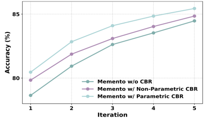
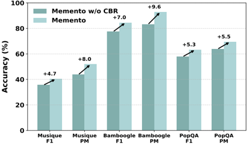

## Memento: Fine-tuning LLM Agents without Fine-tuning LLMs

Huichi Zhou* 1,2 , Yihang Chen* 2 , Siyuan Guo 3 , Xue Yan 4 , Kin Hei Lee , Zihan Wang , Ka Yiu Lee 2 , Guchun Zhang 2 , Kun Shao 2 , Linyi Yang† 2 , and Jun Wang† 1

1 AI Centre, UCL, 2 Huawei Noah's Ark Lab, UK, 3 Jilin University, 4 Institute of Automation, CAS

## Abstract

In this paper, we introduce a novel learning paradigm for Adaptive Large Language Model (LLM) agents that eliminates the need for fine-tuning the underlying LLMs. Existing approaches are often either rigid, relying on static, handcrafted reflection workflows, or computationally intensive, requiring gradient updates of LLM model parameters. In contrast, our method enables low-cost continual adaptation via memory-based online reinforcement learning. We formalise this as a Memory-augmented Markov Decision Process (M-MDP), equipped with a neural case-selection policy to guide action decisions. Past experiences are stored in an episodic memory, either differentiable or non-parametric. The policy is continually updated based on environmental feedback through a memory rewriting mechanism, whereas policy improvement is achieved through efficient memory reading (retrieval). We instantiate our agent model in the deep research setting, namely Memento , which attains top-1 on GAIA validation ( 87.88% Pass@ 3 ) and 79.40% on the test set. It reaches 66.6% F1 and 80.4% PM on the DeepResearcher dataset, outperforming the state-of-the-art training-based method, while case-based memory adds 4.7% to 9.6% absolute points on out-of-distribution tasks. Our approach offers a scalable and efficient pathway for developing generalist LLM agents capable of continuous, real-time learning without gradient updates, advancing machine learning towards open-ended skill acquisition and deep research scenarios. The code is available at https://github.com/Agent-on-the-Fly/Memento .

100

Memento manus.ai

100

Memento

Aworld manus.ai

80

OpenAI DR

Aworld

OWL++

OpenAI DR

80

OWL++

0.59

0.59

60

60

40

0.33

Accuracy (%)

40

0.24

20

Accuracy (%)

0.33

0.24

20

0

0.0

Val-Level1

Val-Level2

Val-Level3

Test-Level1

Test-Level2

Test-Level3

0.0

DeepResearcher

0

100

85 100 (a) Memento vs. Baselines on GAIA validation and test sets. Val-Level1 Val-Level2 Val-Level3 Test-Level1 Test-Level2 Test-Level3 Val-Level1 Val-Level2 Val-Level3 Test-Level1 Test-Level2 Test-Level3

+7.0 +9.6 Memento w/o CBR Memento 100 +9.6 (b) Ablation study of Memento across benchmarks. DeepResearcher SimpleQA HLE

80

Accuracy (%)

80

60

Accuracy (%)

40

60

40

20

20

Memento w/ Non-Parametric CBR

0

Memento w/ Non-Parametric CBR

0

Musique

5

Musique

5

Iteration

SimpleQA

HLE

0

Memento w/o CBR

(c) Continual learning curves across memory designs.

(d) Memento 's accuracy improvement on OOD datasets.

Figure 1: Overview of Memento evaluation across baselines, benchmarks, memory designs and generalisation.

Huichi Zhou and Yihang Chen contributed equally. Siyuan Guo, Xue Yan, Kin Hei Lee, and Zihan Wang conducted this work while visiting Prof. Jun Wang. Corresponding author(s): Linyi Yang: yangly6@sustech.edu.cn, and Jun Wang: jun.wang@cs.ucl.ac.uk

79.7

79.7

## 1. Introduction

A Large Language Model (LLM) agent refers to a system that leverages one or more LLMs to autonomously perform complex tasks through interaction, reasoning, and decision making, often with access to external tools, memory, or environments (Christianos et al., 2023, Yang et al., 2025). Unlike passive LLMs that respond to prompts in isolation, LLM agents operate proactively and iteratively, guided by explicit goals. They are increasingly deployed as autonomous problem solvers (Choudhary et al., 2021, Wei et al., 2022, Yao et al., 2023) spanning various domains. Notable examples include deep research agents (OpenAI, 2025, Google, 2025, ByteDance, 2025), tool-enhanced execution systems (Li et al., 2025c, Zheng et al., 2025, Qian et al., 2025), and code generation agents (Cui et al., 2021, Guo et al., 2024, Grosnit et al., 2024, Guo et al., 2025), all of which demonstrate strong capabilities in complex scientific and engineering tasks.

Despite recent progress, current LLM agents typically follow two prevailing paradigms, each exhibiting fundamental limitations. The first approach builds specialised frameworks with fixed workflows and hardcoded reasoning, which work well for narrow tasks but lack flexibility. After deployment, such agents are static: they neither incorporate online information nor adapt to novel situations. The second paradigm focuses on updating the LLM itself through parameter tuning of underlying LLMs - via supervised fine-tuning or reinforcement learning - which allows for more flexible behaviour (Christianos et al., 2023, Shi et al., 2025) but comes at a high computational cost. These approaches are inefficient for continuous adaptation and online learning, impractical for agents deployed in open-ended scenarios. This observation raises a central research challenge towards generalist agents:

How can we build LLM agents that learn continuously from a changing environment without the prohibitive cost of fine-tuning the underlying LLMs?

Inspired by human memory mechanisms, we address this challenge by proposing a memory-based learning framework that enables continual adaptation without modifying the underlying LLMs. We observe that humans' performance steadily improves because each experience is (i) encoded as an episodic trace (Pritzel et al., 2017), (ii) distilled into abstract rules during sleep-dependent consolidation (Squire et al., 2015), (iii) selectively reinforced by dopamine-driven credit assignment (Glimcher, 2011), and (iv) retrieved through case- or analogy-based reasoning when similar problems arise (Ashley, 1992). Thus, instead of fine-tuning the base model, LLM agents leverage an external memory to store past trajectories - including successes and failures labels - and draw from similar past experiences to guide decision making. This approach aligns with the principles of case-based reasoning (CBR) (Aamodt and Plaza, 1994, Guo et al., 2024, 2025), a psychologically grounded learning strategy supported by evidence that humans often solve problems by recalling analogous past situations (Anderson, 2013, Ross, 1989). For example, in a deep research scenario, deep research agents that have previously succeeded on a web-based task can leverage their experience to solve never-seen and structurally similar tasks (Wiratunga et al., 2024). Our method offers a novel path to continual learning for deep research agents - efficient, generalizable, and inspired by how humans learn.

To this end, we introduce Memento , a non-parametric, learn-on-the-fly framework for CBR (Smyth and McClave, 2001, Hatalis et al., 2025), instantiated as a planner-executor architecture grounded in a memorybased Markov Decision Process (MDP). Memento comprises three principal components: (i) a planner, (ii) a tool-enabled executor, and (iii) a growing Case Bank that stores past trajectories as episodic memory. Instead of relying solely on the LLM's parametric memory, which is fixed after training, online case-based reasoning in Memento is implemented by storing rich episodic traces.

Our experiments are conducted on 4 benchmarks, where GAIA (Mialon et al., 2023) for long-horizon tool use, DeepResearcher (Zheng et al., 2025) for real-time web research, SimpleQA (Wei et al., 2024) for factual precision, and HLE (Phan et al., 2025) for long-tail academic reasoning. We use a planner-executor architecture with GPT4.1 as the planner and o 4 -mini as the default executor (o 3 for GAIA), instrumented with tools, namely Memento . We achieve top-1 on GAIA validation ( 87.88% Pass@ 3 ) and 79.40% on the private test leaderboard, and it reaches 66.6% F 1 and 80.4% PM on the DeepResearcher dataset, outperforming the state-of-the-art training-based system, while case-based memory adds 4.7 to 9.6 absolute points on out-of-distribution tasks and yields 95.0% PM on SimpleQA. To our knowledge, we are the first to cast case-based continual learning for LLM agents, achieving the top-level performance on the GAIA benchmark, thereby providing a principled framework for continual adaptation of Deep Research agents.

## 2. Related Work

We first review methods that equip LLMs with continual-learning capabilities. Then, we discuss approaches that augment agents with external tools and multi-agent coordination. Lastly, we introduce agent memory mechanisms, characterising design choices in representation, retrieval, and decay, and their implications for continual learning.

## 2.1. Continual-learning in LLM Agent Systems

Continual-learning strategies for LLM agents can be categorised into two camps. Parametric approaches (Zhu et al., 2025b,a) update the LLM through post-training (e.g., Reinforcement Learning (Wang et al., 2025)) or supervised fine-tuning (e.g., START (Li et al., 2025a)), achieving high task fidelity at the expense of considerable compute, data, and the danger of catastrophic forgetting (Li et al., 2024). It is often assumed that achieving the capability to solve complex reasoning problems requires substantial changes to the model's parameters, and therefore, full fine-tuning is widely applied during RL (Liu et al., 2025). However, when tackling long-horizon, complex tasks (Mialon et al., 2023, Phan et al., 2025), LLM agent systems must spend substantial time rolling out trajectories to gather training data, and they additionally depend on large volumes of human-annotated questions. Differently, non-parametric approaches freeze the LLM and attach an external memory to optimise the prompt construction process. Human intelligence relies heavily on memory systems, especially episodic memory, which supports learning from both successes and failures (Baddeley, 1983). Cognitive science suggests that such memories are segmented and selectively replayed to inform future decisions (Anderson et al., 1997, Khosla et al., 2023, Fountas et al., 2024). This inspired early AI paradigms like Case-Based Reasoning (CBR) (Francis and Ram, 1993). While modern Retrieval-Augmented Generation (RAG) systems (Lewis et al., 2020) share surface similarities with CBR, they typically query static document corpora and lack mechanisms for continual adaptation (Gao et al., 2023).

## 2.2. Tool-augmented LLM

Language agents increasingly incorporate external tools to overcome context limitations and computational bottlenecks. Prompt-based methods, including WebGPT (Nakano et al., 2021), embed tool calls directly in the generation trace. However, tackling long-horizon tasks often requires multi-hop tool calls. Therefore, recent works propose multi-agent pipelines, such as AutoGen (Wu et al., 2023), OWL (Camel-AI, 2025) and DeerFlow (ByteDance, 2025) to coordinate specialised agents via dialogue. To address long-horizon decision-

making in dynamic, multi-turn interactions with external tool environments, Agentic Reinforcement Learning (Agentic RL) has emerged as a promising training paradigm. This approach shifts LLM training from static task-solving (e.g., math or code) to dynamic, agent-environment reasoning. Supervised Fine-tuning methods, including Toolformer (Schick et al., 2023), API-Bench (Li et al., 2023), and GRPO-based optimisation (Wang et al., 2025, Qian et al., 2025, Feng et al., 2025) teach models when and how to invoke APIs, but require costly retraining and often assume a fixed, small toolset (e.g., Code and Search). However, without explicit planning, deciding when and which tools to invoke remains a major bottleneck for long-horizon tasks. We model planning as a stateful MDP with explicit memory for past cases. By bringing case-based reasoning into planning, the executor is steered toward strategic tool calls and consistently strong performance.

## 2.3. Agent Memory Mechanism

Recent work has centred on endowing LLM agents with explicit memory structures. A growing body of work (Camel-AI, 2025, Liang et al., 2025, Google, 2025, ByteDance, 2025) has shown that current LLM agents are designed for fixed environments, limiting their ability to evolve. While some efforts, such as ReAct-style agents and reflective prompting pipelines (Shinn et al., 2023, Yao et al., 2023) demonstrate improvement through feedback, they remain constrained by pre-defined heuristics and do not achieve true lifelong learning. DS-Agent (Guo et al., 2024) stabilises planning by mining prior Kaggle solutions and turning them into executable pipelines. Agent-K (Grosnit et al., 2024) adds structured memory and credit assignment to reuse past work, enabling end-to-end automation of Kaggle-style workflows. Furthermore, Agent-KB (Tang et al., 2025) and Alita (Qiu et al., 2025) construct shared knowledge bases and optimised toolsets for agentic problem-solving. However, most systems keep adding cases without selective curation, leading to the classic swamping problem where retrieval costs outweigh utility (Francis and Ram, 1993).

LLM agents are increasingly equipped with long-term memory that grows and adapts over time, allowing them to accumulate knowledge, recall prior context, and adjust behaviour based on experience. MemoryBank (Zhong et al., 2024) couples retrieval with an Ebbinghaus-style forgetting schedule so older, low-utility items decay while user-relevant facts are reinforced. Building on this idea, SAGE (Liang et al., 2024) unifies reflection with an Ebbinghaus-based memory optimiser to support continual self-refinement. Mem0 (Chhikara et al., 2025) adopts a structured memory mechanism with explicit operations (ADD, UPDATE, DELETE, NOOP). A-MEM (Xu et al., 2025) maintains memory via a typological network. MemInsight (Salama et al., 2025) pushes further on semantics by augmenting raw memories with summaries and tags to aid retrieval. Several lines of work distil operational knowledge from interaction traces: ExpeL (Zhao et al., 2024) collects trajectories and converts them into reusable natural-language insights and rules; AutoGuide (Fu et al., 2024) compresses offline logs into concise, conditional, context-aware guidelines; and Agent Workflow Memory (Wang et al., 2024) induces frequently used subtask sequences as auxiliary skills. Finally, Agent-KB (Tang et al., 2025) and Alita (Qiu et al., 2025) construct shared knowledge bases and optimised toolsets to support agentic problem solving. Differently, we formulate planning as a memory-augmented MDP and learn a neural case-selection policy over an episodic case bank via online soft Q-learning, enabling continual adaptation without fine-tuning the underlying LLM parameters.

## 3. Methodology: Memory-Based MDP with Case-based Reasoning Policy

In this work, we integrate LLM agents with case-based reasoning, a classic problem-solving paradigm that solves new problems by learning from solutions to previously encountered similar problems. As such, LLM

Figure 2: A graphical model of memory-based Markov Decision Process.

agents can achieve continuous improvement without parameter fine-tuning by learning from experiences stored in memory. To begin with, we model the sequential decision-making process of CBR agents as a Memory-Based Markov Decision Process (M-MDP) as below.

Definition 3.1 (Memory-Based Markov Decision Process) . A Memory-Based Markov Decision Process is a tuple ⟨ 𝒮 , 𝒜 , 𝒫 , ℛ , γ , ℳ ⟩ , where 𝒮 is the state space, 𝒜 is the action space, 𝒫 ∶ 𝒮 × 𝒜 → ∆ ( 𝒮 ) is the transition dynamics, ℛ ∶ 𝒮 × 𝒜 → R is the reward function, γ ∈ [ 0, 1 ) is the discount factor, and ℳ = ( 𝒮 × 𝒜 × R ) ∗ is the memory space.

The graphical model of M-MDP is illustrated in Figure 2. Note that the key difference from standard MDP is that we introduce a memory space as a set of past experiences. In the CBR agent setting, both state space and action space are defined as the set of all finite-length sequences over a predefined vocabulary 𝒱 .

With the M-MDP formulation, the behaviour of the CBR agent can be formally described as follows. At timestep t , we maintain a case bank (i.e., the memory) Mt = { ci } Nt i = 1 , with each case ci a tuple ( si , ai , ri ) , and Nt the number of cases in the current case bank. Given the current state st , the CBR agent first retrieves a case ct ∼ µ ( ⋅ ∣ st , Mt ) , and then reuses and adapts it via the LLM, i.e., at ∼ p LLM ( ⋅ ∣ st , ct ) . Here, µ denotes the case retrieval policy, whose implementation details will be presented later. Taking the action at , the CBR agent receives the reward rt = ℛ ( st , at ) and observes the next state st + 1 ∼ 𝒫 ( ⋅ ∣ st , at ) . The CBR agent also retains the new case in the case bank, i.e., Mt + 1 = Mt ∪ {( st , at , rt )} . In this way, we can define the overall policy of the CBR agent as below.

Definition 3.2 (Case-Based Reasoning Agent) . A Case-Based Reasoning Agent is an agent that makes decisions based on both the current state and a finite memory of past experiences. Formally, let s ∈ 𝒮 denote the current state; M ∈ ℳ denote the current case bank, consisting of past cases c ; a ∈ 𝒜 denote the action; µ ( c ∣ s , M ) denote a case retrieval policy, assigning a probability distribution over M given the current state s ; p LLM ( a ∣ s , c ) denote the action likelihood of a large language model (LLM) conditioned on the current state s and a retrieved case c ∈ M . Then, the overall policy π of a CBR agent is defined as:

<!-- formula-not-decoded -->

Overall, the trajectory τ of the CBR agent can be described as: τ = { M 0 , s 0 , c 0 , a 0 , r 0 , M 1 , s 1 , c 1 , a 1 , r 1 , ⋯ } . The

probability of sampling the trajectory τ can be modelled as:

<!-- formula-not-decoded -->

where I ( ⋅ ) is the indicator function, assigning probability 1 if the condition holds and 0 otherwise, modelling the deterministic reward function and memory update, and T denotes the maximum trajectory length. Note that the reward function and memory update can also be probabilistic in some specific cases, which we leave as future work. Among them, (1) Retrieve, (2) Reuse and Revise, and (4) Retain describe the agent behaviour; (3) Evaluation and (5) Transition model the environment dynamics.

Soft Q-Learning for CBR Agent. To optimise the CBR policy π in Eq. (1), we aim to learn the case retrieval policy µ with the LLM component p LLM fixed. In this context, the "action" of µ is to select a case c = ( s , a , r ) from the case bank M . To optimise it while encouraging diversity in retrieved cases, we apply the maximum entropy RL framework (Haarnoja et al., 2018) and derive the following optimisation objective:

<!-- formula-not-decoded -->

where ℋ denotes the entropy, and α denotes the hyper-parameter of the entropy weight in the final reward. Under this framework, the value function can be defined as:

<!-- formula-not-decoded -->

Also, the Q value function for taking an "action" (i.e., selecting a case), given a state, can be defined as:

<!-- formula-not-decoded -->

where Mt + 1 denotes the updated memory after ( st , at , rt ) is added. Let d π ( s , M ) = ∑ ∞ t = 0 γ t -1 P ( st = s , Mt = M ) denote the discounted visitation frequency of ( s , M ) under π . The expected value function objective is then defined as:

<!-- formula-not-decoded -->

Then, we can derive the closed-form solution of the optimal retrieval policy as a softmax over the optimal Q value:

<!-- formula-not-decoded -->

The detailed derivation can be found in Appendix A. In this way, we can derive the optimal retrieval policy by learning the Q-function Q , which can be achieved by the temporal difference (TD) learning in soft Q-learning (Haarnoja et al., 2017) as:

<!-- formula-not-decoded -->

where η denotes the learning rate. Next, we provide a simpler way to learn the Q-function by learning a similarity kernel over states.

## Algorithm 1 Fine-tuning CBR agent with soft Q-learning and state similarity

Require: Kernel network parameters θ , LLM policy p LLM, entropy weight α , discount factor γ , learning rate η , target-network update period K , averaging weight β , initial case bank M 0 = ∅ , initial episodic memory 𝒟 = ∅ and initial replay buffer ℬ = ∅

- 1: Initialize target retrieval network ¯ θ ← θ
- 3: Retrieve : Sample case ct ∼ µθ ( ⋅ ∣ st , Mt
- 2: for timestep t = 0, 1, 2, . . . do
- ) ▷ Memory Reading, following Eq. (7) and Eq. (9)
- 4: Reuse &amp; Revise : Sample action at ∼ p LLM ( ⋅ ∣ st , ct )
- 5: Execute at and observe reward rt and next state st + 1
- 6: Retain : Mt + 1 = Mt ∪ {( st , at , rt )}
- 7: Store transition ( st , ct , rt , st + 1 , Mt + 1 ) in ℬ
- 8: Append Episodic Memory 𝒟 ← 𝒟 ∪ {( , ,
- st ct Qt )}
- 9: Sample mini-batch {( si , ci , ri , s ′ i , M ′ i )} ∼ ℬ
- 10: θ ← θ -η ▽ θ ℒ i
- 12: ¯ θ ← β ¯ θ + ( 1 -β ) θ
- 11: if t mod K = 0 then

▷ Memory Writing

▷

Following Eq. (10)

▷ Update target network

- 13: end if
- 14: end for

Enhance Q-Learning Based on State Similarity. As in Eq. (8), we can learn the Q function from scratch via TD learning. However, directly learning the Q function is challenging due to complex state and case descriptions in the form of natural language. To this end, we propose to approximate the Q value via kernel-based estimation, following episodic control (EC) algorithms (Pritzel et al., 2017). Specifically, we maintain an episodic memory 𝒟 = {( s , c , Q )} , including the state, the retrieved case, and the Q value of each interaction. Then, we approximate the Q function via a kernel network k θ ( ⋅ , ⋅ ) , parametrised by θ :

<!-- formula-not-decoded -->

where 𝒟 c = {( si , ci , Qi ) ∈ 𝒟 ∶ ci = c } denotes the past interactions stored in the episodic memory 𝒟 with the same retrieved case c . By substituting Eq. (9) in Eq. (8), we can learn the Q function by optimising the kernel parameter θ via TD learning, i.e.,

<!-- formula-not-decoded -->

where ¯ θ denotes the target kernel network, s ′ denotes the next state and M ′ = M ∪ { c } denotes the updated case bank. More specifically, we provide the gradient of the TD learning loss with respective of θ as:

<!-- formula-not-decoded -->

where wi = k θ ( s , si ) ∑ s j ∈ 𝒟 c k θ ( s , sj ) , f θ ( s , c ) = ∑ ( si , Qi ) ∈ 𝒟 c wiQi , and y = r + γα log ∑ c ′ ∈ M ′ exp ( f ¯ θ ( s ′ , c ′ )) .

Figure 3: The architecture of Memento with parametric memory. Memento is instantiated as a planner-executor framework alternating between Case-Based Planning (Stage 1) and Tool-Based Execution (Stage 2). The planner is an LLM-based CBR agent enhanced by a Case Memory module that supports both Write, which records new cases and online refines the Q-function, and Read, which retrieves cases via the learned retrieval policy for adaptive case selection. The executor is an LLM-based MCP client that invokes external tools hosted on the MCP servers through the MCP protocol.

## 4. Implementation: Deep Research Agent

We implement stateful prompt engineering via M-MDP methodology (§ 3) in Deep Research scenarios (Huang et al., 2025), where agents must solve complex, long-horizon tasks by iteratively interacting with their environment, invoking external tools, retrieving information from external sources, and processing heterogeneous data for dynamic reasoning. As illustrated in Figure 3, Memento alternates between two core stages: Case-Based Planning and Tool-Based Execution.

## 4.1. Framework

To address the challenges of long-horizon reasoning, Memento follows the plan-and-act paradigm (Erdogan et al., 2025), where the planner and executor operate in an alternating loop to iteratively advance task completion. For effective coordination, Memento integrates three memory modules:Case Memory (vectorised storage of prior cases for high-level planning), Subtask Memory (text-based storage of active subtasks and their results), and Tool Memory (text-based logs of tool interactions for each subtask).

In the planning stage, Planner, instantiated as an LLM-driven CBR agent, receives the task instruction and queries the case memory for relevant case triplets ( si , ai , ri ) K i = 1 , where si is the task, ai is the plan, ri indicates success, and K is the retrieval count. This process is supported by a Case Memory module, which retrieves relevant experiences from a case bank through either a similarity-based retriever or online-updating Q-function, thus enabling the planner to leverage both parametric and non-parametric memory as priors. The retrieved cases are concatenated with the current task instruction to form the prompt, guiding the LLM to generate a plan for each subtask. Once the initial task is decomposed, a Subtask Memory module orchestrates the interaction between the planner and executor, recording generated subtasks and their execution outcomes. After each iteration, the planner uses the accumulated execution history to assess task

completion. If the task is unfinished, the planner replans based on updated context; otherwise, the final result is returned, and the case memory is updated with new experiences only upon task completion.

The execution stage is managed by an Executor, powered by a general-purpose LLM, which is responsible for executing each subtask as an autonomous episode (Sumers et al., 2023) using the MCP protocol. Unlike prior agents (Zheng et al., 2025, Weng et al., 2025), Memento 's executor supports rich reasoning and flexible tool composition. For each subtask, the executor consults the tool memory, determines the appropriate tool invocation, and updates the results.which operates as a Model Context Protocol (MCP) 1 client. The executor reads pending subtasks from the subtask memory, accesses relevant history from a Tool Memory (scoped per subtask), and determines whether to invoke an external tool or return a result. MCP serves as a standardised, model-agnostic interface, enabling flexible coordination with diverse external tools and data sources. By unifying access under a single protocol layer, Memento can seamlessly integrate dynamic reasoning and compositional tool use across multiple domains.

## 4.2. Case Memory Management

The case memory is an online-growing case bank Mt operated with Write and Read operations, available in non-parametric and parametric variants. In the non-parametric setting, Write simply appends ( st , at , rt ) , and Read retrieves cases by similarity for computational efficiency. In the parametric setting, Write further online updates a Q-function to shape the retrieval distribution, while Read is driven by the learned Q-function, thereby realising adaptive case selection. More details are provided in Appendix B.

Memory Storage. Following the CBR agent in Definition 3.2, the Write operation appends each historical case ( st , at , rt ) to the case bank Mt , after each time step t :

<!-- formula-not-decoded -->

In this process, the state st is encoded using a frozen text encoder, while the action at and reward rt are preserved in their original forms, as only the state representation requires vectorisation for subsequent retrieval operations. This Write operation is continuously performed throughout the agent's execution, allowing the case bank to grow into a comprehensive and transferable repository of experiences incrementally. By accumulating both successes and failures, the memory not only enables retrospective analysis for informed avoidance of past mistakes but also provides successful trajectories that prospectively guide future planning.

Non-Parametric Memory Retrieval. A cornerstone of Memento is its dynamically evolving Case Bank, which underpins its continual learning capability. At each planning step, this non-parametric memory module receives the task instruction and then retrieves relevant cases, comprising a mixture of successful and failed cases. This CBR method mirrors human analogical learning, where previously encountered outcomes shape decision-making (Aamodt and Plaza, 1994). Specifically, we retrieve the K nearest past cases from the case bank by computing the semantic similarity between the current state and past states. This design follows the mainstream CBR paradigm, which assumes that similar problems should have similar solutions (Wiratunga et al., 2024, Guo et al., 2025), thereby allowing the agent to prioritise cases whose historical contexts are most aligned with the current task. Formally, the Read operator of the non-parametric memory is defined as:

<!-- formula-not-decoded -->

1 https://github.com/modelcontextprotocol

where st and Mt denote the query and case bank at time step t , respectively. Here, enc ( ⋅ ) represents the pretrained textual encoder and sim ( ⋅ ) denotes the cosine similarity function.

Parametric Memory Retrieval. To empower the agent to selectively leverage high-utility cases to augment planning from past experiences, we design a differential memory mechanism in Memento via a parametric Q-function. When writing new cases to the case bank, the parametric method, in contrast to the nonparametric approach that merely appends the tuple as in Eq. (12), concurrently updates the Q-function online. Meanwhile, with CBR applied only for planning in Memento , the CBR planner can be simplified to a single-step setting instead of a multi-step M-MDP. This single-step setting collapses the TD target in Eq. (10) to the immediate reward, thereby simplifying the learning objective. Without bootstrapping, the updating reduces to a supervised learning paradigm, which avoids non-stationary targets. Therefore, we can train a parametric Q-function Q ( s , c ; θ ) end-to-end, dispensing with the kernel-based estimation in Eq. (9). Accordingly, the single-step Q-learning loss can be formulated as:

<!-- formula-not-decoded -->

where the tuple {( s , c , r )} is stored in the replay buffer ℬ and Q is implemented as a neural network. Noting that the reward signal in deep research tasks is binary ( r ∈ { 0, 1 } ), we replace the Mean Squared Error (MSE) objective with a cross-entropy (CE) loss, since MSE loss suffers from vanishing gradients near 0/1, whereas CE loss provides more numerically stable signals. Thus, we reformulate the training objective as a binary classification loss:

<!-- formula-not-decoded -->

where Q can be seen as a normalised value representing the probability p ( r = 1 ∣ s , c ; θ ) , i.e., the likelihood that the retrieved case c is a good reference for the current state s given the case bank M . Unlike the non-parametric approach that only preserves new cases, the parametric memory also refines the Q-function during Write, enabling each update to both record a new case and update the overall Q-value landscape.

During retrieval, the learned Q-function is used to compute the retrieval policy distribution via Eq. (7), from which cases can be sampled. To reduce the randomness of case selection and enhance the interpretability of the agent's decision process, the Read operation of the parametric memory applies a TopK operator to select the K cases with the highest Q-values, which are used as planning references:

<!-- formula-not-decoded -->

By continually updating the Q-function with new samples, the parametric memory module learns to capture the latent patterns between states and cases, thereby producing a closer approximation to the underlying distribution of the case retrieval policy µ ∗ .

## 4.3. Tool Usage

Besides the inherent requirement for long task execution sequences and multi-turn interactions, deep research tasks also place stringent demands on the atomic actions, which require the agent to be able to acquire external information and subsequently process, integrate, and analyse it. Thus, we design a suite of tools for Memento accessible via the MCP protocol, comprising modules for information retrieval such as search engines and web crawlers, as well as components for processing and analysing multimodal information, including video and image data, and files in various formats.

External Information Acquisition. To support open-ended tasks requiring access to up-to-date external knowledge (e.g., GAIA, BrowseComp), we design a search toolkit that integrates both retrieval and content acquisition capabilities. Specifically , we employ searxng 2 , a self-hosted metasearch engine that aggregates results from multiple sources such as Google 3 , Bing 4 , Duckduckgo 5 , and Brave 6 . Retrieved candidates are then re-ranked based on semantic similarity to the query context, ensuring relevance and precision. To supplement this, we incorporate Crawl4AI 7 to fetch and parse the full web content of selected results when deeper understanding is required by the executor. In other words, the search tool functions as a coarse filter based on keyword matching in the user query, while the crawler serves as a fine-grained mechanism to extract detailed information from the retrieved sources when necessary.

Multimodal Heterogeneous Information Processing. To support downstream reasoning over heterogeneous data sources, we implemented a versatile and fine-grained document processing toolkit that automatically extracts information from a broad spectrum of file types and modalities. For example, images are captioned using a vision-language model (VLM); audio is transcribed via automated speech recognition; PowerPoint files are parsed slide-by-slide with embedded image descriptions; spreadsheets are converted to a readable row-wise layout; archives are unpacked; plain text and code files are read directly; JSON and XML are parsed into structured objects; Word documents are translated into Markdown; and videos receive natural-language summaries from VLMs. For PDFs or unsupported formats, a fallback extraction via Chunkr AI 8 or plain-text parsing is used. This toolkit offers a unified interface for accessing and interpreting content across diverse file types and modalities, streamlining the handling of heterogeneous data in real-world scenarios.

Reasoning. The reasoning and analysis toolkit integrates code execution and mathematical computation to support robust, automated analysis within the Memento framework. The Code tool provides a sandboxed environment for writing, running, and managing code within a unified workspace. Users can create files, execute shell or Python commands, and inspect outputs - all within a persistent task directory. Python scripts are validated against a security whitelist to ensure safe execution, supporting commonly used libraries such as numpy, pandas, and torch. The workspace maintains state across steps, enabling iterative development. This agent is crucial for solving data analysis, automation, or dynamic code generation tasks. Complementing this, the Math tool handles fundamental arithmetic operations.

## 5. Experiments

In this paper, we investigate the Deep Research agent, which necessitates tool use and supports multiple rounds of interaction with external, real-world environments. To comprehensively evaluate the agent's capabilities, we select four datasets, each representing a distinct aspect of the research challenge: (i) long-horizon tool use and planning (GAIA) (Mialon et al., 2023), (ii) real-time web-based research (DeepResearcher) (Zheng et al., 2025), (iii) concise factual accuracy (SimpleQA) (Wei et al., 2024), and (iv) exploration at the frontier of human knowledge (HLE) (Phan et al., 2025).

2 https://github.com/searxng/searxng-docker

3 https://www.google.com/

4 https://www.bing.com/

5 https://duckduckgo.com/

6 https://brave.com/

7 https://github.com/unclecode/crawl4ai

8 https://chunkr.ai/

| Method                                | NQ   | NQ   | TQ   | TQ   | HotpotQA   | HotpotQA   | 2Wiki   | 2Wiki   | Musique   | Musique   | Bamboogle   | Bamboogle   | PopQA   | PopQA   | Avg   | Avg   |
|---------------------------------------|------|------|------|------|------------|------------|---------|---------|-----------|-----------|-------------|-------------|---------|---------|-------|-------|
|                                       | F1   | PM   | F1   | PM   | F1         | PM         | F1      | PM      | F1        | PM        | F1          | PM          | F1      | PM      | F1    | PM    |
| Prompt Based                          |      |      |      |      |            |            |         |         |           |           |             |             |         |         |       |       |
| CoT                                   | 19.8 | 32.0 | 45.6 | 48.2 | 24.4       | 27.9       | 26.4    | 27.3    | 8.5       | 7.4       | 22.1        | 21.6        | 17.0    | 15.0    | 23.6  | 26.1  |
| CoT + RAG                             | 42.0 | 59.6 | 68.9 | 75.8 | 37.1       | 43.8       | 24.4    | 24.8    | 10.0      | 10.0      | 25.4        | 27.2        | 46.9    | 48.8    | 37.7  | 43.2  |
| Search-o1 (Web) (Li et al., 2025c)    | 32.4 | 55.1 | 58.9 | 69.5 | 33.0       | 42.4       | 30.9    | 37.7    | 14.7      | 19.7      | 46.6        | 53.6        | 38.3    | 43.4    | 35.2  | 45.0  |
| Training Based                        |      |      |      |      |            |            |         |         |           |           |             |             |         |         |       |       |
| Search-r1-base (Jin et al., 2025)     | 45.4 | 60.0 | 71.9 | 76.2 | 55.9       | 63.0       | 44.6    | 47.9    | 26.7      | 27.5      | 56.5        | 57.6        | 43.2    | 47.0    | 48.3  | 53.8  |
| Search-r1-instruct (Jin et al., 2025) | 33.1 | 49.6 | 44.7 | 49.2 | 45.7       | 52.5       | 43.4    | 48.8    | 26.5      | 28.3      | 45.0        | 47.2        | 43.0    | 44.5    | 39.6  | 45.6  |
| R1-Searcher (Song et al., 2025)       | 35.4 | 52.3 | 73.1 | 79.1 | 44.8       | 53.1       | 59.4    | 65.8    | 22.8      | 25.6      | 64.8        | 65.6        | 42.7    | 43.4    | 47.1  | 53.7  |
| DeepResearcher (Zheng et al., 2025)   | 39.6 | 61.9 | 78.4 | 85.0 | 52.8       | 64.3       | 59.7    | 66.6    | 27.1      | 29.3      | 71.0        | 72.8        | 48.5    | 52.7    | 51.8  | 60.5  |
| Ours                                  |      |      |      |      |            |            |         |         |           |           |             |             |         |         |       |       |
| Memento (GPT-4.1 + o4-mini)           | 42.0 | 74.6 | 85.5 | 93.9 | 66.5       | 81.6       | 81.4    | 94.1    | 40.6      | 53.3      | 86.2        | 92.8        | 64.0    | 72.5    | 66.6  | 80.4  |

Table 1: Performance comparison of prompt-based, training-based, and our approach on seven open-domain QA datasets. We report the F 1 score and PM scores. The last two columns give the weighted average ( Avg ) across all benchmarks, where Bamboogle contributes 125 examples and every other dataset 512 examples. The results of prompt-based and training-based methods using Qwen 2.5 ( 7 B) are referred to DeepResearcher (Zheng et al., 2025).

## 5.1. Datasets

To evaluate the general-purpose reasoning capabilities of Memento , we adopt the GAIA benchmark (Mialon et al., 2023), which comprises 450 non-trivial questions with unambiguous answers - 300 in the test set and 150 in the validation set. Each question requires varying levels of tool use and autonomous planning, and the dataset is stratified into three difficulty levels: Level 1: Requires approximately 5 steps using a single tool; Level 2: Requires 5-10 steps involving multiple tools; Level 3: Involves up to 50 steps with no restrictions on the number or type of tools. Each level includes a public validation split and a private test split with hidden ground-truth answers and metadata.

We further evaluate Memento on broader benchmarks compiled in DeepResearcher (Zheng et al., 2025), which draws from seven open-domain QA datasets: Natural Questions (NQ) (Kwiatkowski et al., 2019), TriviaQA (TQ) (Joshi et al., 2017), HotpotQA (Yang et al., 2018), 2Wiki (Ho et al., 2020), MusiQue (Trivedi et al., 2022), Bamboogle (Press et al., 2022), and PopQA (Mallen et al., 2022). Each dataset contributes 512 examples, except Bamboogle, which provides 125 high-quality samples curated to minimise contamination and emphasise web-based synthesis.

Additionally, we include two challenging benchmarks: 1) SimpleQA (Wei et al., 2024), consisting of 4,330 fact-seeking questions, focuses on factual accuracy. 2) Humanity's Last Exam (HLE) (Phan et al., 2025), with 2,500 questions across diverse academic subjects, assesses the limits of broad-domain reasoning.

## 5.2. Evaluation Metrics

As each GAIA query has a single reference answer, we follow the GAIA leaderboard and use the Exact Match (EM) metric, which marks a prediction as correct only if it exactly matches the ground-truth answer after standard normalisation (lowercasing, punctuation and article removal, whitespace normalisation). The EM score reflects the percentage of perfectly matched answers.

However, EM cannot accurately reflect the capabilities of an LLM agent, as it overlooks the diversity of expression. We use the macro-F1 score to evaluate the DeepResearcher, SimpleQA, and HLE datasets.

Table 2: Top results on the GAIA Leaderboard as of June 26, 2025, Memento achieves the Top-1 performance on the validation set and the test set in open-source agent frameworks.

| Agent name                | Model family                                         | Average score (%)   | Level 1 (%)         | Level 2 (%)         | Level 3 (%)         |
|---------------------------|------------------------------------------------------|---------------------|---------------------|---------------------|---------------------|
| Valiadation Dataset       | Valiadation Dataset                                  | Valiadation Dataset | Valiadation Dataset | Valiadation Dataset | Valiadation Dataset |
| Memento (Pass@3)          | GPT4.1, o3                                           | 87.88               | 96.23               | 90.70               | 61.54               |
| Alita                     | Claude 4 Sonnet, GPT-4o                              | 87.27               | 88.68               | 89.53               | 76.92               |
| Skywork Super Agents v1.1 | skywork-agent, Claude 3.7 Sonnet, Whisper            | 82.42               | 92.45               | 83.72               | 57.69               |
| Langfun Agent             | Gemini 2.5 Pro                                       | 79.39               | 88.68               | 80.23               | 57.69               |
| AWorld                    | GPT-4o, DeepSeek-V3, Claude 4, Gemini 2.5 Pro        | 77.58               | 88.68               | 77.91               | 53.85               |
| Manus                     | -                                                    | 73.30               | 86.50               | 70.10               | 57.70               |
| OWL-Workforce             | Claude 3.7 Sonnet                                    | 69.09               | 84.91               | 67.44               | 42.31               |
| OpenAI DeepResearch       | o3                                                   | 67.40               | 74.30               | 69.10               | 47.60               |
| OWL-Roleplaying           | GPT-4o and o3-mini                                   | 58.18               | 81.13               | 54.65               | 23.08               |
| Open Deep Research        | o1                                                   | 55.15               | 67.92               | 53.49               | 34.62               |
| Test Dataset              | Test Dataset                                         | Test Dataset        | Test Dataset        | Test Dataset        | Test Dataset        |
| Su Zero Ultra             | -                                                    | 80.40               | 93.55               | 77.36               | 65.31               |
| h2oGPTe Agent v1.6.33     | Claude 3.7 Sonnet, Gemini 2.5 Pro                    | 79.73               | 89.25               | 79.87               | 61.22               |
| Memento                   | GPT4.1, o3                                           | 79.40               | 90.32               | 75.47               | 71.43               |
| h2oGPTe Agent v1.6.32     | Claude 3.7 Sonnet, Gemini 2.5 Pro                    | 79.07               | 90.32               | 77.99               | 61.22               |
| Aworld                    | GPT-4o, DeepSeek-V3, Claude 4 sonnet, Gemini 2.5 Pro | 77.08               | 93.55               | 76.73               | 46.94               |

Meanwhile, Partial Match (PM) indicates the partial semantic match scores between LLMs' generated answers and gold answers. We utilise GPT-4o-mini as the answer evaluator to give the scores and the prompt the same as DeepResearcher (Zheng et al., 2025).

## 5.3. Model Configurations

The Planner is powered by GPT-4.1 , the Executor by o3 for GAIA and o4-mini for other datasets, the image processing by GPT-4o , the video agent by Gemini 2.5 Pro and the audio agent by Assembly AI . For the non-parametric CBR, we encode sentences with SimCSE and rank candidate cases using cosine similarity. For the parametric CBR, we initialise sentence representations with SimCSE and implement the Q-function as a two-layer MLP to assign the Q value. Meanwhile, the CBR planner's state at each step often contains information inherited from previous states. To avoid redundant storage, only the state, action, and reward from the final step of each trajectory are written to memory, ensuring that the case bank remains both compact and informative.

The Offline Executor setting refers to one static executor, removing the planner, case memory, and all external tools, so it reflects only raw parametric knowledge from LLMs. The Online Executor starts from that stripped-down baseline but reconnects the same executor to live search and other MCP tools, reflecting the value of real-time retrieval and tool execution. Memento (w/o CBR) keeps episodic memory disabled, allowing us to measure the extra gain delivered specifically by case-based reasoning.

## 5.4. Experimental Results

Deep Researcher. We include this dataset to test real-time web research, evidence retrieval, cross-page synthesis, and multi-hop reasoning. As shown in Table 1, Memento augmented with MCP tools (e.g., search engine, browser) reaches an average 66.6% F1 across the seven DeepResearcher benchmarks, nearly doubling the 37.7% F1 of the CoT + RAG baseline. This demonstrates that real-time, online retrieval tools can rival or

30

25

20

15

10

5

0

GPT-5

Memento

Gemini-2.5 Pro o3-high

o4-mini-high

Figure 4: Performance on SimpleQA and HLE. The SimpleQA results are from WebSailor (Li et al., 2025b), and the HLE results are from the official website.

even exceed carefully curated static databases.

GAIA (Validation &amp; Test). To assess robustness in long-horizon planning, tool orchestration, and execution, we employ the GAIA benchmark. Memento attains the top1 ranking on the validation set and 4 th place on the test set, outperforming most existing agent frameworks (Table 2). Notably, it surpasses widely used open-source frameworks, including Manus (Liang et al., 2025), Aworld (Alibaba, 2025), and OWL (Camel-AI, 2025), on both validation and test sets.

For the GAIA validation evaluation, we initialise memory from scratch and iteratively store both successful and failed trajectories in the case bank over three iterations. Using GPT-4.1 as the planner and o3 as the executor, Memento achieves 87.88% accuracy on the validation set. For the GAIA test set, performance is based solely on the case bank accumulated during validation, yielding an accuracy of 79.40% . Although Memento demonstrates strong overall performance, challenges remain for Level 3 tasks that require extended reasoning horizons and advanced tool coordination.

Humanity's Last Exam (HLE). To evaluate the frontier of human knowledge and the complex reasoning ability in long-tail, specialised domains, we include the HLE 9 . Using our planner executor architecture, with planner GPT4.1 and executor o 4 -mini with tools, Memento attains 24.4% PM, ranking second overall and within 0.92 points of GPT5 at 25.32% , while outperforming Gemini2.5 -Pro at 21.64% , o 3 -high at 20.32% , and o 4 -mini-high at 18.08% . These results demonstrate that continual learning through CBR effectively transforms episodic experiences into reusable knowledge, offering a complementary pathway to generalisation even in long-tail domains where conventional tool usage and retrieval methods struggle.

SimpleQA. To evaluate Memento 's reliability and robustness against hallucination in single-hop factual question answering, we employ the SimpleQA benchmark. As illustrated in Figure 4, Memento , implemented with a planner-executor framework (GPT-4.1 as the planner and o4-mini as the executor) augmented with tool use, achieves the highest accuracy among all baselines. Specifically, it reaches an accuracy of

9 https://scale.com/leaderboard/humanitys\_last\_exam

Accuracy (%)

25.32

24.40

21.64

20.32

HLE

18.08

Table 3: The performance of Memento on the DeepResearcher dataset across different numbers of cases. We use gpt4.1 as the planner and o 4 -mini as the executor.

| Dataset                        | K=0   | K=0   | K=1   | K=1   | K=2   | K=2   | K=4   | K=4   | K=8   | K=8   | K=16   | K=16   | K=32   | K=32   |
|--------------------------------|-------|-------|-------|-------|-------|-------|-------|-------|-------|-------|--------|--------|--------|--------|
| Dataset                        | F1    | PM    | F1    | PM    | F1    | PM    | F1    | PM    | F1    | PM    | F1     | PM     | F1     | PM     |
| NQ (Kwiatkowski et al., 2019)  | 39.5  | 67.8  | 41.1  | 74.4  | 41.3  | 72.7  | 41.9  | 73.0  | 41.7  | 73.8  | 42.1   | 73.2   | 42.2   | 75.4   |
| TQ (Joshi et al., 2017)        | 81.1  | 89.1  | 86.1  | 93.8  | 86.2  | 93.9  | 86.3  | 94.1  | 85.8  | 94.1  | 85.9   | 94.3   | 85.5   | 93.9   |
| HotpotQA (Yang et al., 2018)   | 62.0  | 76.0  | 65.4  | 80.7  | 65.7  | 81.3  | 67.4  | 84.2  | 66.6  | 82.0  | 65.5   | 82.0   | 66.4   | 83.2   |
| 2Wiki (Ho et al., 2020)        | 78.3  | 90.0  | 81.3  | 94.9  | 80.9  | 94.1  | 81.0  | 94.7  | 82.0  | 94.5  | 81.1   | 93.6   | 81.0   | 94.1   |
| Musique (Trivedi et al., 2022) | 35.6  | 43.8  | 39.8  | 50.2  | 40.1  | 52.1  | 41.6  | 51.0  | 41.0  | 52.1  | 39.6   | 51.4   | 40.3   | 50.4   |
| Bamboogle (Press et al., 2022) | 77.5  | 83.2  | 85.9  | 91.2  | 84.1  | 91.2  | 84.7  | 90.4  | 84.9  | 91.2  | 85.2   | 92.0   | 83.0   | 87.2   |
| PopQA (Mallen et al., 2022)    | 57.9  | 63.9  | 62.6  | 70.1  | 63.4  | 71.3  | 63.6  | 70.9  | 62.7  | 69.2  | 64.1   | 70.9   | 63.2   | 69.4   |
| Average                        | 59.9  | 72.2  | 63.6  | 77.9  | 63.7  | 78.1  | 64.5  | 78.5  | 64.1  | 78.2  | 63.9   | 78.1   | 63.9   | 78.1   |

Table 4: Performance improvement of Memento over five learning iterations on the DeepResearcher dataset, demonstrating the benefit of accumulating cases in the Case Bank.

| Method                        | Iter 1                        | Iter 2                        | Iter 3                        | Iter 4                        | Iter 5                        |
|-------------------------------|-------------------------------|-------------------------------|-------------------------------|-------------------------------|-------------------------------|
| Baseline                      | Baseline                      | Baseline                      | Baseline                      | Baseline                      | Baseline                      |
| Memento w/o CBR               | 78.65                         | 80.93                         | 82.62                         | 83.53                         | 84.47                         |
| Case-based Continual Learning | Case-based Continual Learning | Case-based Continual Learning | Case-based Continual Learning | Case-based Continual Learning | Case-based Continual Learning |
| Memento w/ Non-Parametric CBR | 79.84                         | 81.87                         | 83.09                         | 84.03                         | 84.85                         |
| Memento w/ Parametric CBR     | 80.46                         | 82.84                         | 84.10                         | 84.85                         | 85.44                         |

95.0% , outperforming WebSailor ( 93.5% ), WebDancer ( 90.5% ), WebThinker ( 77.5% ), and DeepSeek-r1React ( 72.2% ). These results demonstrate that Memento provides strong factual reliability and substantially mitigates hallucination on straightforward single-hop queries, establishing a new state-of-the-art over prior web-agent baselines.

## 5.5. Ablation Studies

We analyse Memento 's hyper-parameter selection, component-wise Analysis, learning curves for both parametric and non-parametric case-based reasoning, out-of-distribution performance, and token costs.

## 5.5.1. Hyper-parameter Selection

Increasing the number of retrieved cases in CBR raises computational cost and can introduce noise from irrelevant examples. To evaluate this, we vary K in 0, 2, 4, 8, 16, 32 on the DeepResearcher dataset. As shown in Table 3, performance improves up to K = 4 - yielding the highest F1 (64.5) and PM (78.5) - but plateaus or slightly declines for larger K . This suggests that CBR benefits from a small, high-quality memory, unlike few-shot prompting, where more examples often help (Agarwal et al., 2024). Careful case selection and memory curation are thus crucial for continual learning.

## 5.5.2. Component-wise Analysis

From Table 5, we observe a consistent pattern across HLE, SimpleQA, and DeepResearcher. Moving from an offline executor to live tools generally reduces hallucination and increases both F 1 and PM, though the

| Model            | Humanities/SC   | Math        | Chemistry   | Other       | Physics     | Engineering   | Biology/Medicine   | CS/AI       | Avg         |
|------------------|-----------------|-------------|-------------|-------------|-------------|---------------|--------------------|-------------|-------------|
| Offline Executor | 5.2/9.6         | 7.1/5.8     | 2.3/7.9     | 2.9/11.4    | 7.6/4.6     | 12.8/14.0     | 5.2/17.7           | 6.5/11.9    | 6.4/8.7     |
| Online Executor  | 10.8/24.9       | 13.1/16.0   | 6.9/9.3     | 14.0/16.3   | 7.8/10.2    | 7.5/5.3       | 5.7/17.2           | 13.3/15.4   | 11.2/15.8   |
| Memento w/o CBR  | 25.5/29.2       | 24.9/16.3   | 17.4/21.1   | 24.8/24.1   | 18.4/10.8   | 15.8/8.8      | 10.0/18.7          | 25.4/12.4   | 22.2/17.4   |
| Memento          | 28.4 / 33.0     | 30.9 / 24.2 | 18.7 / 22.7 | 28.5 / 32.4 | 22.9 / 19.1 | 15.9 / 12.1   | 14.0 / 26.1        | 28.5 / 18.5 | 26.7 / 24.4 |

## (a) HLE

| Model            | Art         | Geography   | Science & Tech   | Politics    | Sports      | Other       | TV Shows    | Music       | History     | Video Games   | Avg         |
|------------------|-------------|-------------|------------------|-------------|-------------|-------------|-------------|-------------|-------------|---------------|-------------|
| Offline Executor | 16.5/19.6   | 25.7/31.1   | 20.1/24.7        | 25.8/24.8   | 18.8/19.0   | 15.8/14.9   | 12.6/13.3   | 15.7/17.6   | 25.9/26.6   | 15.5/13.3     | 19.7/21.5   |
| Online Executor  | 49.7/82.9   | 45.1/82.5   | 59.4/87.7        | 51.6/86.9   | 46.6/90.1   | 48.7/86.4   | 39.5/84.3   | 43.1/88.5   | 49.7/83.8   | 34.7/78.6     | 48.5/84.8   |
| Memento w/o CBR  | 83.8/92.2   | 71.8/84.9   | 87.1/94.1        | 83.7/90.8   | 77.4/86.4   | 81.2/90.7   | 70.0/81.6   | 80.7/89.1   | 79.1/86.1   | 81.2/88.9     | 81.0/89.7   |
| Memento          | 86.9 / 96.4 | 76.6 / 91.7 | 89.3 / 96.9      | 87.1 / 95.6 | 82.2 / 93.5 | 84.2 / 95.4 | 77.3 / 90.8 | 83.3 / 95.0 | 85.7 / 94.8 | 86.3 / 95.6   | 84.7 / 95.0 |

## (b) SimpleQA

| Method           | NQ          | TQ          | HotpotQA    | 2Wiki       | Musique     | Bamboogle   | PopQA       | Avg         |
|------------------|-------------|-------------|-------------|-------------|-------------|-------------|-------------|-------------|
| Offline Executor | 39.7/70.1   | 75.8/89.1   | 50.7/67.2   | 44.8/56.0   | 26.9/35.7   | 76.0/84.0   | 48.0/53.5   | 48.8/62.8   |
| Online Executor  | 23.3/55.3   | 41.9/80.7   | 34.4/67.8   | 33.6/66.2   | 23.0/39.7   | 45.8/77.6   | 24.9/50.2   | 30.8/60.7   |
| Memento w/o CBR  | 39.5/67.8   | 81.8/89.1   | 62.0/76.0   | 78.3/90.0   | 35.6/43.8   | 77.5/83.2   | 57.9/63.9   | 59.9/72.2   |
| Memento          | 42.0 / 74.6 | 85.5 / 93.9 | 66.5 / 81.6 | 81.4 / 94.1 | 40.6 / 53.3 | 86.2 / 92.8 | 64.0 / 72.5 | 66.6 / 80.4 |

(c) DeepResearcher

Table 5: Ablation results across three benchmarks. Each cell shows F1/PM . We use gpt4.1 as the planner and o 4 -mini as the executor.

magnitude depends on task type (SimpleQA: + 28.8 F 1 / + 63.3 PM, HLE: + 4.8 / + 7.1 ), and may even hurt on open-domain data (DeepResearcher: -18.0 / -2.1 ). Introducing planning ( Memento w/o CBR) yields robust gains on each benchmark (HLE: + 11.0 / + 1.6 , SimpleQA: + 32.5 / + 4.9 , DeepResearcher: + 29.1 / + 11.5 ), indicating that explicit decomposition and tool orchestration systematically improve execution. Finally, case-based reasoning provides consistent, additive improvements (HLE: + 4.5 / + 7.0 , SimpleQA: + 3.7 / + 5.3 , DeepResearcher: + 6.7 / + 8.2 ). For HLE, however, without sufficient domain knowledge encoded in the backbone model, neither tool usage nor planning alone can reliably produce correct answers on long-tail, expert-level tasks. For DeepResearcher, we also identify data contamination (Shumailov et al., 2024) across the seven evaluated benchmarks, evidenced by a noticeable drop in both F 1 and PM when moving from the offline executor to the online executor without planning (DeepResearcher: -18.0 F 1 / -2.1 PM). This aligns with broader findings in the field (Sun et al., 2022, Yu et al., 2022, Zhou et al., 2025): simply using external knowledge can sometimes negatively affect the model, while the internal knowledge within the model plays an important role in QA tasks and can even outperform RAG.

## 5.5.3. Continual Learning Ability Boosted by Parametric and Non-Parametric CBR

Figure 1c and Table 4 present the continual learning curves across different memory designs for the Memento framework, comparing the performance of three configurations: Memento with non-parametric CBR or parametric CBR and Memento without CBR. The results demonstrate that the full Memento architecture consistently outperforms the ablated versions across all iterations, achieving higher accuracy at each step. Notably, removing CBR leads to a noticeable decline in performance, highlighting the effectiveness and complementary benefits of both parametric CBR and non-parametric CBR components in enhancing the

Figure 5: The average number of each task type per level, highlighting the dominance of code, search, and crawl tasks as difficulty level increases.

continual learning capability of Memento . More importantly, we observe a learning curve of the accuracy on the DeepResearcher dataset with increased iterations, suggesting that memory-based approaches can effectively enhance LLM agents without requiring parameter updates.

Although we attempted to locate any performance drops along the learning curve, in practice, such inflexion points are elusive. With only about 3 k training data, the Case Bank saturates quickly. Each additional iteration, therefore, contains progressively fewer previously unseen (and thus potentially failing) cases. In our simulated, open-ended, but ultimately finite environment, we observe rapid convergence with only marginal gains after a few iterations. Consequently, adding many more iterations yields diminishing returns and contributes little to our understanding of memory-based continual learning.

## 5.5.4. Generalisation across Tasks

To assess out-of-distribution (OOD) generalisation, we follow the evaluation protocol of Zheng et al. (2025). Specifically, MusiQue (Trivedi et al., 2022), Bamboogle (Press et al., 2022), and PopQA (Mallen et al., 2022) are selected as OOD datasets due to their distinct question styles and information distributions, while NQ (Kwiatkowski et al., 2019), TQ (Joshi et al., 2017), HotpotQA (Yang et al., 2018), and 2Wiki (Ho et al., 2020) are used for training. We first collect and store trajectories from the training datasets in the case bank. During inference, Memento retrieves the four most relevant cases from the case bank for each target query. As shown in Figure 1d, Memento achieves substantial improvements on all OOD benchmarks, with absolute gains ranging from 4.7% to 9.6%. These results highlight the effectiveness of case-based reasoning in enhancing generalisation to unseen tasks.

## 6. Discussion and Analysis

Building on the results in § 5 that establish the effectiveness of Memento , we further analyse its efficiency and operational behaviour. Specifically, we (i) analyse the average number of tool calls per task across three difficulty levels to assess how the MCP framework adapts as task complexity increases, (ii) characterise tool-call statistics, and (iii) evaluate the impact of using reasoning-oriented versus general-purpose models.

Table 6: The impact of fast and slow think mode on GAIA validation dataset (pass@1).

| Planner        | Executor   | Level 1   | Level 2   | Level 3   | Average   |
|----------------|------------|-----------|-----------|-----------|-----------|
| gpt-4.1        | o3         | 77.36%    | 69.77%    | 61.54%    | 70.91%    |
| o3             | o3         | 73.58%    | 63.95%    | 38.46%    | 63.03%    |
| Qwen3-32B-Fast | o4-mini    | 62.26%    | 56.98%    | 26.92%    | 53.94%    |
| Qwen3-32B-Slow | o4-mini    | 56.60%    | 36.05%    | 23.08%    | 40.61%    |

## 6.1. The Number of Tokens per Task

As shown in Figure 5, code, search, and crawl tasks dominate across all levels, with their usage increasing notably as difficulty rises. Importantly, while overall tool usage grows with task complexity, the most challenging problems increasingly rely on the model's internal reasoning to interpret and aggregate evidence from prior tool outputs, rather than simply calling more tools via MCP. This highlights the importance of effective integration between planning, memory, and evidence aggregation for solving open-ended, long-horizon deep research tasks.

## 6.2. Statistics of MCP Tools

As shown in Figure 6, we randomly sample 10 tasks from the GAIA validation, respectively, to calculate the tokens and costs per task. Average response tokens rise sharply with task difficulty: Level 1 queries required 26 k input tokens and 4.7 k output tokens, Level 2 grew to 48 k / 6.9 k , and Level 3 peaked at 121 k / 9.8 k . This highlights that the primary computational burden in complex scenarios stems from integrating and analysing multi-step tool outputs, rather than from generating long responses.

We observe that the output tokens remain stable across task levels, as the final answers typically require only short responses. This demonstrates that our system effectively controls generation length and avoids unnecessary verbosity during inference. However, due to the

Figure 6: Token costs on the GAIA.

complexity and unpredictability of real-world environments, the input context grows significantly with task difficulty . As tasks become more complex, more detailed observations, plans, tool outputs, and intermediate reasoning steps must be incorporated into the input prompts, resulting in a substantial increase in the number of input tokens.

## 6.3. The Impact of Fast and Slow Think Mode

Table 6 compares the impact of fast- and slow-thinking planners on overall system performance (pass@1) across different task difficulties. The results show that pairing the fast, non-deliberative GPT-4.1 planner with the o3 executor yields the highest average accuracy (70.9%), outperforming the more deliberative o3 planner (63.03%) even when both use the same executor. Similarly, when using the o4-mini executor, GPT-4.1 achieves a substantial 16.4% improvement over o3. The Qwen3-32B models further confirm this trend, with the fast planner consistently outperforming its slow counterpart.

Analysis of system traces reveals several key reasons for the fast planner's superiority. The planner relying on the o3 model often either answers directly - skipping plan generation altogether - or produces overly verbose plans, which can mislead the executor with incomplete instructions. Additionally, in complex multi-step reasoning fields, the slow planner tends to compress solutions into a single, convoluted chain of thought, while the fast planner effectively decomposes problems into manageable sub-tasks.

Overall, these findings highlight that in modular LLM systems, concise and structured planning leads to more effective downstream execution. Overly deliberative planning not only introduces unnecessary context and redundancy but also induces role confusion, thereby undermining the very specialisation that the two-stage architecture is designed to exploit.

## 7. Conclusion

We introduce Memento , a memory-based learning paradigm that enables LLM agents to adapt online search without updating model weights. Memento formalises deep research agents as a memory-based Markov Decision Process (MDP) and implements it within a planner-executor framework, leveraging an episodic case bank to record and retrieve trajectories for continual policy improvement. Empirically, we achieve strong performance across GAIA, DeepResearcher, and SimpleQA. Ablation studies reveal that both parametric and non-parametric CBR are critical to the significant performance gains, and that a small, curated memory yields optimal results. These findings motivate future work on deep research tasks using memory-based MDP.

## References

Agnar Aamodt and Enric Plaza. Case-based reasoning: Foundational issues, methodological variations, and system approaches. AI communications , 7(1):39-59, 1994.

Rishabh Agarwal, Avi Singh, Lei Zhang, Bernd Bohnet, Luis Rosias, Stephanie Chan, Biao Zhang, Ankesh Anand, Zaheer Abbas, Azade Nova, et al. Many-shot in-context learning. Advances in Neural Information Processing Systems , 37:76930-76966, 2024.

Alibaba. Aworld: A unified agent playground for computer and phone use tasks, 2025. URL https: //github.com/inclusionAI/AWorld .

John R Anderson. The architecture of cognition . Psychology Press, 2013.

John R Anderson, Michael Matessa, and Christian Lebiere. Act-r: A theory of higher level cognition and its relation to visual attention. Human-Computer Interaction , 12(4):439-462, 1997.

Kevin D Ashley. Case-based reasoning and its implications for legal expert systems. Artificial Intelligence and Law , 1(2):113-208, 1992.

Alan David Baddeley. Working memory. Philosophical Transactions of the Royal Society of London. B, Biological Sciences , 302(1110):311-324, 1983.

ByteDance. Deerflow: Deep exploration and efficient research framework. https://deerflow.tech/z , 2025.

| Camel-AI. Owl: Optimized workforce learning for general multi-agent assistance in real-world task automa- tion, 2025. URL https://github.com/camel-ai/owl .                                                                                                                                                                                                   |
|---------------------------------------------------------------------------------------------------------------------------------------------------------------------------------------------------------------------------------------------------------------------------------------------------------------------------------------------------------------|
| Prateek Chhikara, Dev Khant, Saket Aryan, Taranjeet Singh, and Deshraj Yadav. Mem0: Building production- ready ai agents with scalable long-term memory. arXiv preprint arXiv:2504.19413 , 2025.                                                                                                                                                              |
| Gautam Choudhary, Natwar Modani, and Nitish Maurya. React: A review comment dataset for actionability (and more). In Web Information Systems Engineering-WISE 2021: 22nd International Conference on Web Information Systems Engineering, WISE 2021, Melbourne, VIC, Australia, October 26-29, 2021, Proceedings, Part II 22 , pages 336-343. Springer, 2021. |
| Filippos Christianos, Georgios Papoudakis, Matthieu Zimmer, Thomas Coste, Zhihao Wu, Jingxuan Chen, Khyati Khandelwal, James Doran, Xidong Feng, Jiacheng Liu, et al. Pangu-agent: A fine-tunable generalist agent with structured reasoning. arXiv preprint arXiv:2312.14878 , 2023.                                                                         |
| Can Cui, Wei Wang, Meihui Zhang, Gang Chen, Zhaojing Luo, and Beng Chin Ooi. Alphaevolve: A learning framework to discover novel alphas in quantitative investment. In Proceedings of the 2021 International conference on management of data , pages 2208-2216, 2021.                                                                                        |
| Lutfi Eren Erdogan, Nicholas Lee, Sehoon Kim, Suhong Moon, Hiroki Furuta, Gopala Anumanchipalli, Kurt Keutzer, and Amir Gholami. Plan-and-act: Improving planning of agents for long-horizon tasks. arXiv preprint arXiv:2503.09572 , 2025.                                                                                                                   |
| Jiazhan Feng, Shijue Huang, Xingwei Qu, Ge Zhang, Yujia Qin, Baoquan Zhong, Chengquan Jiang, Jinxin Chi, and Wanjun Zhong. Retool: Reinforcement learning for strategic tool use in llms. arXiv preprint arXiv:2504.11536 , 2025.                                                                                                                             |
| Zafeirios Fountas, Martin A Benfeghoul, Adnan Oomerjee, Fenia Christopoulou, Gerasimos Lampouras, Haitham Bou-Ammar, and Jun Wang. Human-like episodic memory for infinite context llms. arXiv preprint arXiv:2407.09450 , 2024.                                                                                                                              |
| Anthony G Francis and Ashwin Ram. The utility problem in case-based reasoning. In Case-Based Reasoning: Papers from the 1993 Workshop , pages 160-161, 1993.                                                                                                                                                                                                  |
| Yao Fu, Dong-Ki Kim, Jaekyeom Kim, Sungryull Sohn, Lajanugen Logeswaran, Kyunghoon Bae, and Honglak Lee. Autoguide: Automated generation and selection of state-aware guidelines for large language model agents. CoRR , 2024.                                                                                                                                |
| Yunfan Gao, Yun Xiong, Xinyu Gao, Kangxiang Jia, Jinliu Pan, Yuxi Bi, Yixin Dai, Jiawei Sun, Haofen Wang, and Haofen Wang. Retrieval-augmented generation for large language models: A survey. arXiv preprint arXiv:2312.10997 , 2(1), 2023.                                                                                                                  |
| Paul WGlimcher. Understanding dopamine and reinforcement learning: the dopamine reward prediction error hypothesis. Proceedings of the National Academy of Sciences , 108(supplement_3):15647-15654, 2011.                                                                                                                                                    |
| Google. Gemini deep research -your personal research assistant. https://gemini.google/overview/ deep-research/?hl=en-GB , 2025.                                                                                                                                                                                                                               |

Antoine Grosnit, Alexandre Maraval, James Doran, Giuseppe Paolo, Albert Thomas, Refinath Shahul Hameed Nabeezath Beevi, Jonas Gonzalez, Khyati Khandelwal, Ignacio Iacobacci, Abdelhakim Benechehab, et al. Large language models orchestrating structured reasoning achieve kaggle grandmaster level. arXiv preprint arXiv:2411.03562 , 2024.

Siyuan Guo, Cheng Deng, Ying Wen, Hechang Chen, Yi Chang, and Jun Wang. Ds-agent: Automated data science by empowering large language models with case-based reasoning. In International Conference on Machine Learning (ICML) , pages 16813-16848. PMLR, 2024.

Siyuan Guo, Huiwu Liu, Xiaolong Chen, Yuming Xie, Liang Zhang, Tao Han, Hechang Chen, Yi Chang, and Jun Wang. Optimizing case-based reasoning system for functional test script generation with large language models. In Proceedings of the 31st ACM SIGKDD Conference on Knowledge Discovery and Data Mining , pages 4487-4498, 2025.

Tuomas Haarnoja, Haoran Tang, Pieter Abbeel, and Sergey Levine. Reinforcement learning with deep energy-based policies. In International conference on machine learning , pages 1352-1361. PMLR, 2017.

Tuomas Haarnoja, Aurick Zhou, Kristian Hartikainen, George Tucker, Sehoon Ha, Jie Tan, Vikash Kumar, Henry Zhu, Abhishek Gupta, Pieter Abbeel, et al. Soft actor-critic algorithms and applications. arXiv preprint arXiv:1812.05905 , 2018.

Kostas Hatalis, Despina Christou, and Vyshnavi Kondapalli. Review of case-based reasoning for llm agents: theoretical foundations, architectural components, and cognitive integration. arXiv preprint arXiv:2504.06943 , 2025.

Xanh Ho, Anh-Khoa Duong Nguyen, Saku Sugawara, and Akiko Aizawa. Constructing a multi-hop qa dataset for comprehensive evaluation of reasoning steps. arXiv preprint arXiv:2011.01060 , 2020.

Yuxuan Huang, Yihang Chen, Haozheng Zhang, Kang Li, Meng Fang, Linyi Yang, Xiaoguang Li, Lifeng Shang, Songcen Xu, Jianye Hao, Shao Kun, and Jun Wang. Deep research agents: A systematic examination and roadmap. arXiv preprint arXiv:2506.18096 , 2025.

Bowen Jin, Hansi Zeng, Zhenrui Yue, Jinsung Yoon, Sercan Arik, Dong Wang, Hamed Zamani, and Jiawei Han. Search-r1: Training llms to reason and leverage search engines with reinforcement learning. arXiv preprint arXiv:2503.09516 , 2025.

Mandar Joshi, Eunsol Choi, Daniel S Weld, and Luke Zettlemoyer. Triviaqa: A large scale distantly supervised challenge dataset for reading comprehension. arXiv preprint arXiv:1705.03551 , 2017.

Savya Khosla, Zhen Zhu, and Yifei He. Survey on memory-augmented neural networks: Cognitive insights to ai applications. arXiv preprint arXiv:2312.06141 , 2023.

TomKwiatkowski, Jennimaria Palomaki, Olivia Redfield, Michael Collins, Ankur Parikh, Chris Alberti, Danielle Epstein, Illia Polosukhin, Jacob Devlin, Kenton Lee, et al. Natural questions: a benchmark for question answering research. Transactions of the Association for Computational Linguistics , 7:453-466, 2019.

Patrick Lewis, Ethan Perez, Aleksandra Piktus, Fabio Petroni, Vladimir Karpukhin, Naman Goyal, Heinrich Küttler, Mike Lewis, Wen-tau Yih, Tim Rocktäschel, et al. Retrieval-augmented generation for knowledgeintensive nlp tasks. Advances in neural information processing systems , 33:9459-9474, 2020.

Chengpeng Li, Mingfeng Xue, Zhenru Zhang, Jiaxi Yang, Beichen Zhang, Xiang Wang, Bowen Yu, Binyuan Hui, Junyang Lin, and Dayiheng Liu. Start: Self-taught reasoner with tools. arXiv preprint arXiv:2503.04625 , 2025a.

- Hongyu Li, Liang Ding, Meng Fang, and Dacheng Tao. Revisiting catastrophic forgetting in large language model tuning. arXiv preprint arXiv:2406.04836 , 2024.
- Kuan Li, Zhongwang Zhang, Huifeng Yin, Liwen Zhang, Litu Ou, Jialong Wu, Wenbiao Yin, Baixuan Li, Zhengwei Tao, Xinyu Wang, et al. Websailor: Navigating super-human reasoning for web agent. arXiv preprint arXiv:2507.02592 , 2025b.
- Minghao Li, Yingxiu Zhao, Bowen Yu, Feifan Song, Hangyu Li, Haiyang Yu, Zhoujun Li, Fei Huang, and Yongbin Li. Api-bank: A comprehensive benchmark for tool-augmented llms. arXiv preprint arXiv:2304.08244 , 2023.
- Xiaoxi Li, Guanting Dong, Jiajie Jin, Yuyao Zhang, Yujia Zhou, Yutao Zhu, Peitian Zhang, and Zhicheng Dou. Search-o1: Agentic search-enhanced large reasoning models. arXiv preprint arXiv:2501.05366 , 2025c.
- Xinbin Liang, Jinyu Xiang, Zhaoyang Yu, Jiayi Zhang, Sirui Hong, Sheng Fan, and Xiao Tang. Openmanus: An open-source framework for building general ai agents, 2025. URL https://doi.org/10.5281/ zenodo.15186407 .
- Xuechen Liang, Yangfan He, Yinghui Xia, Xinyuan Song, Jianhui Wang, Meiling Tao, Li Sun, Xinhang Yuan, Jiayi Su, Keqin Li, et al. Self-evolving agents with reflective and memory-augmented abilities. arXiv preprint arXiv:2409.00872 , 2024.

Zichen Liu, Changyu Chen, Wenjun Li, Penghui Qi, Tianyu Pang, Chao Du, Wee Sun Lee, and Min Lin. Understanding r1-zero-like training: A critical perspective. arXiv preprint arXiv:2503.20783 , 2025.

Alex Mallen, Akari Asai, Victor Zhong, Rajarshi Das, Hannaneh Hajishirzi, and Daniel Khashabi. When not to trust language models: Investigating effectiveness and limitations of parametric and non-parametric memories. arXiv preprint arXiv:2212.10511 , 7, 2022.

Grégoire Mialon, Clémentine Fourrier, Thomas Wolf, Yann LeCun, and Thomas Scialom. Gaia: a benchmark for general ai assistants. In The Twelfth International Conference on Learning Representations , 2023.

Reiichiro Nakano, Jacob Hilton, Suchir Balaji, Jeff Wu, Long Ouyang, Christina Kim, Christopher Hesse, Shantanu Jain, Vineet Kosaraju, William Saunders, et al. Webgpt: Browser-assisted question-answering with human feedback. arXiv preprint arXiv:2112.09332 , 2021.

OpenAI. Deep research system card. Technical report, OpenAI, 2025. URL https://cdn.openai.com/ deep-research-system-card.pdf .

Long Phan, Alice Gatti, Ziwen Han, Nathaniel Li, Josephina Hu, Hugh Zhang, Chen Bo Calvin Zhang, Mohamed Shaaban, John Ling, Sean Shi, et al. Humanity's last exam. arXiv preprint arXiv:2501.14249 , 2025.

Ofir Press, Muru Zhang, Sewon Min, Ludwig Schmidt, Noah A Smith, and Mike Lewis. Measuring and narrowing the compositionality gap in language models. arXiv preprint arXiv:2210.03350 , 2022.

| Alexander Pritzel, Benigno Uria, Sriram Srinivasan, Adria Puigdomenech Badia, Oriol Vinyals, Demis Hassabis, Daan Wierstra, and Charles Blundell. Neural episodic control. In International conference on machine learning , pages 2827-2836. PMLR, 2017.                                 |
|-------------------------------------------------------------------------------------------------------------------------------------------------------------------------------------------------------------------------------------------------------------------------------------------|
| Cheng Qian, Emre Can Acikgoz, Qi He, Hongru Wang, Xiusi Chen, Dilek Hakkani-Tür, Gokhan Tur, and Heng Ji. Toolrl: Reward is all tool learning needs. arXiv preprint arXiv:2504.13958 , 2025.                                                                                              |
| Jiahao Qiu, Xuan Qi, Tongcheng Zhang, Xinzhe Juan, Jiacheng Guo, Yifu Lu, Yimin Wang, Zixin Yao, Qihan Ren, Xun Jiang, et al. Alita: Generalist agent enabling scalable agentic reasoning with minimal predefinition and maximal self-evolution. arXiv preprint arXiv:2505.20286 , 2025.  |
| Brian H Ross. Some psychological results on case-based reasoning. In Proceedings: Case-based reasoning workshop , pages 144-147. Morgan Kaufmann, 1989.                                                                                                                                   |
| Rana Salama, Jason Cai, Michelle Yuan, Anna Currey, Monica Sunkara, Yi Zhang, and Yassine Benajiba. Meminsight: Autonomous memory augmentation for llm agents. arXiv preprint arXiv:2503.21760 , 2025.                                                                                    |
| Timo Schick, Jane Dwivedi-Yu, Roberto Dessì, Roberta Raileanu, Maria Lomeli, Eric Hambro, Luke Zettlemoyer, Nicola Cancedda, and Thomas Scialom. Toolformer: Language models can teach themselves to use tools. Advances in Neural Information Processing Systems , 36:68539-68551, 2023. |
| Wenxuan Shi, Haochen Tan, Chuqiao Kuang, Xiaoguang Li, Xiaozhe Ren, Chen Zhang, Hanting Chen, Yasheng Wang, Lifeng Shang, Fisher Yu, et al. Pangu deepdiver: Adaptive search intensity scaling via open-web reinforcement learning. arXiv preprint arXiv:2505.24332 , 2025.               |
| Noah Shinn, Federico Cassano, Ashwin Gopinath, Karthik Narasimhan, and Shunyu Yao. Reflexion: Language agents with verbal reinforcement learning. Advances in Neural Information Processing Systems , 36:8634- 8652, 2023.                                                                |
| Ilia Shumailov, Zakhar Shumaylov, Yiren Zhao, Nicolas Papernot, Ross Anderson, and Yarin Gal. Ai models collapse when trained on recursively generated data. Nature , 631(8022):755-759, 2024.                                                                                            |
| Barry Smyth and Paul McClave. Similarity vs. diversity. In International conference on case-based reasoning pages 347-361. Springer, 2001.                                                                                                                                                |
| Huatong Song, Jinhao Jiang, Yingqian Min, Jie Chen, Zhipeng Chen, Wayne Xin Zhao, Lei Fang, and Ji-Rong Wen. R1-searcher: Incentivizing the search capability in llms via reinforcement learning. arXiv preprint arXiv:2503.05592 , 2025.                                                 |
| Larry R Squire, Lisa Genzel, John T Wixted, and Richard G Morris. Memory consolidation. Cold Spring Harbor perspectives in biology , 7(8):a021766, 2015.                                                                                                                                  |
| Theodore Sumers, Shunyu Yao, Karthik Narasimhan, and Thomas Griffiths. Cognitive architectures for language agents. Transactions on Machine Learning Research , 2023.                                                                                                                     |
| Zhiqing Sun, Xuezhi Wang, Yi Tay, Yiming Yang, and Denny Zhou. Recitation-augmented language models. arXiv preprint arXiv:2210.01296 , 2022.                                                                                                                                              |
| Xiangru Tang, Tianrui Qin, Tianhao Peng, Ziyang Zhou, Daniel Shao, Tingting Du, Xinming Wei, Peng Xia, Fang Wu, He Zhu, et al. Agent kb: Leveraging cross-domain experience for agentic problem solving. arXiv preprint arXiv:2507.06229 , 2025.                                          |

- Harsh Trivedi, Niranjan Balasubramanian, Tushar Khot, and Ashish Sabharwal. Musique: Multihop questions via single-hop question composition. Transactions of the Association for Computational Linguistics , 10: 539-554, 2022.
- Hongru Wang, Cheng Qian, Wanjun Zhong, Xiusi Chen, Jiahao Qiu, Shijue Huang, Bowen Jin, Mengdi Wang, Kam-Fai Wong, and Heng Ji. Otc: Optimal tool calls via reinforcement learning. arXiv preprint arXiv:2504.14870 , 2025.
- Zora Zhiruo Wang, Jiayuan Mao, Daniel Fried, and Graham Neubig. Agent workflow memory. arXiv preprint arXiv:2409.07429 , 2024.
- Jason Wei, Xuezhi Wang, Dale Schuurmans, Maarten Bosma, Fei Xia, Ed Chi, Quoc V Le, Denny Zhou, et al. Chain-of-thought prompting elicits reasoning in large language models. Advances in neural information processing systems , 35:24824-24837, 2022.
- Jason Wei, Nguyen Karina, Hyung Won Chung, Yunxin Joy Jiao, Spencer Papay, Amelia Glaese, John Schulman, and William Fedus. Measuring short-form factuality in large language models. arXiv preprint arXiv:2411.04368 , 2024.
- Yixuan Weng, Minjun Zhu, Guangsheng Bao, Hongbo Zhang, Jindong Wang, Yue Zhang, and Linyi Yang. Cycleresearcher: Improving automated research via automated review. In The Thirteenth International Conference on Learning Representations , 2025. URL https://openreview.net/forum?id=bjcsVLoHYs .
- Nirmalie Wiratunga, Ramitha Abeyratne, Lasal Jayawardena, Kyle Martin, Stewart Massie, Ikechukwu Nkisi-Orji, Ruvan Weerasinghe, Anne Liret, and Bruno Fleisch. Cbr-rag: case-based reasoning for retrieval augmented generation in llms for legal question answering. In International Conference on Case-Based Reasoning , pages 445-460. Springer, 2024.
- Qingyun Wu, Gagan Bansal, Jieyu Zhang, Yiran Wu, Beibin Li, Erkang Zhu, Li Jiang, Xiaoyun Zhang, Shaokun Zhang, Jiale Liu, et al. Autogen: Enabling next-gen llm applications via multi-agent conversation. arXiv preprint arXiv:2308.08155 , 2023.
- Wujiang Xu, Kai Mei, Hang Gao, Juntao Tan, Zujie Liang, and Yongfeng Zhang. A-mem: Agentic memory for llm agents. arXiv preprint arXiv:2502.12110 , 2025.
- Xue Yan, Yan Song, Xidong Feng, Mengyue Yang, Haifeng Zhang, Haitham Bou Ammar, and Jun Wang. Efficient reinforcement learning with large language model priors. The Thirteenth International Conference on Learning Representations(ICLR) , 2025.
- Yingxuan Yang, Mulei Ma, Yuxuan Huang, Huacan Chai, Chenyu Gong, Haoran Geng, Yuanjian Zhou, Ying Wen, Meng Fang, Muhao Chen, et al. Agentic web: Weaving the next web with ai agents. arXiv preprint arXiv:2507.21206 , 2025.
- Zhilin Yang, Peng Qi, Saizheng Zhang, Yoshua Bengio, William W Cohen, Ruslan Salakhutdinov, and Christopher D Manning. Hotpotqa: A dataset for diverse, explainable multi-hop question answering. arXiv preprint arXiv:1809.09600 , 2018.
- Shunyu Yao, Jeffrey Zhao, Dian Yu, Nan Du, Izhak Shafran, Karthik Narasimhan, and Yuan Cao. React: Synergizing reasoning and acting in language models. In International Conference on Learning Representations (ICLR) , 2023.

Wenhao Yu, Dan Iter, Shuohang Wang, Yichong Xu, Mingxuan Ju, Soumya Sanyal, Chenguang Zhu, Michael Zeng, and Meng Jiang. Generate rather than retrieve: Large language models are strong context generators. arXiv preprint arXiv:2209.10063 , 2022.

Andrew Zhao, Daniel Huang, Quentin Xu, Matthieu Lin, Yong-Jin Liu, and Gao Huang. Expel: Llm agents are experiential learners. In Proceedings of the AAAI Conference on Artificial Intelligence , volume 38, pages 19632-19642, 2024.

Yuxiang Zheng, Dayuan Fu, Xiangkun Hu, Xiaojie Cai, Lyumanshan Ye, Pengrui Lu, and Pengfei Liu. Deepresearcher: Scaling deep research via reinforcement learning in real-world environments. arXiv preprint arXiv:2504.03160 , 2025.

Wanjun Zhong, Lianghong Guo, Qiqi Gao, He Ye, and Yanlin Wang. Memorybank: Enhancing large language models with long-term memory. In Proceedings of the AAAI Conference on Artificial Intelligence , volume 38, pages 19724-19731, 2024.

Huichi Zhou, Kin-Hei Lee, Zhonghao Zhan, Yue Chen, and Zhenhao Li. Trustrag: Enhancing robustness and trustworthiness in rag. arXiv preprint arXiv:2501.00879 , 2025.

Minjun Zhu, Yixuan Weng, Linyi Yang, and Yue Zhang. Deepreview: Improving llm-based paper review with human-like deep thinking process. arXiv preprint arXiv:2503.08569 , 2025a.

Minjun Zhu, Qiujie Xie, Yixuan Weng, Jian Wu, Zhen Lin, Linyi Yang, and Yue Zhang. Ai scientists fail without strong implementation capability. arXiv preprint arXiv:2506.01372 , 2025b.

## A. Derivation of the Optimal Policy in Soft-Q Learning

The soft value function over the state s is defined as:

<!-- formula-not-decoded -->

The Q function over the state, case pair is defined as:

<!-- formula-not-decoded -->

Define the visitation frequency over the state, case bank for the policy π as: d π ( s , M ) = ∑ ∞ t = 0 γ t -1 P ( st = s , Mt = M ) . Then, our goal is to derive the optimal retrieval policy by expected value function:

<!-- formula-not-decoded -->

For simplicity, let µ c = µ ( c ∣ s , M ) and Qc = Q π ( s , M , c ) , and introduce the Lagrange multiplier λ to constrain that ∑ c µ c = 1 . Then, for any state, case bank pair, we have the optimisation objective:

<!-- formula-not-decoded -->

whose derivative concerning µ c is:

<!-- formula-not-decoded -->

Let ∂ 𝒥 ({ µ c } , λ ) ∂µ c = 0 , then we have:

<!-- formula-not-decoded -->

where K = exp ( -λ α -1 ) . Thus, by performing the normalisation and shaping the optimal Q, we have:

<!-- formula-not-decoded -->

Note that when α → 0 , the soft Q learning deteriorates to standard Q-learning. The softmax form of the policy is also used in previous LLM-based agents with LLM prior (Yan et al. (2025)).

## B. Analysis of Memory Mechanisms

Table 7: Detail comparison of memory mechanisms.

| Method                          | Kernel   | Neural Q   | Q-Function     | Read        | Write    | Gradient   |
|---------------------------------|----------|------------|----------------|-------------|----------|------------|
| Tabular Q-learning              | w/o      | w/o        | Q-Table        | Exact Match | Eq. (8)  | -          |
| Deep Q-learning                 | w/o      | w/         | Neural Network | Eq. (7)     | Eq. (24) | Eq. (25)   |
| Neural Episodic Control         | w/       | w/o        | Eq. (9)        | Eq. (7)     | Eq. (10) | Eq. (11)   |
| Non-Parametric Memory in Sec. 4 | w/o      | w/o        | w/o            | Eq. (13)    | Eq. (12) | -          |
| Parametric Memory in Sec. 4     | w/o      | w/         | Neural Network | Eq. (16)    | Eq. (15) | Eq. (26)   |

Here, we consider several representative memory mechanisms, emphasising their Read and Write operations as summarised in Table 7. Specifically, we discuss tabular and parametric Q-value representations, as well as EC-based methods.

In the tabular setting, the memory maintains an explicit table Q ∶ 𝒮 × 𝒜 → R , where Read is a direct lookup of table Q ( s , M , a ) and Write corresponds to updating the entry for the state-action pair after observing a transition, following the standard TD learning in Eq. (8). To extend beyond discrete spaces, deep Q-learning learns the Q function by a neural network Q ( s , M , a ; θ ) , with Read operation sampling cases from the retrieval policy µ following Eq. (7) and Write operation updates the parameters θ via minimising the TD error:

<!-- formula-not-decoded -->

where ¯ θ is the target Q network. The gradient of the TD learning loss with respect to θ is given by:

<!-- formula-not-decoded -->

where y = r + γα log ∑ c ′ ∈ M ′ exp ( Q ( s ′ , M ′ , c ′ ; ¯ θ )) . This parametric formulation enables generalisation across states and action spaces through the shared parameters θ , in contrast to tabular methods, which only memorise individual entries. However, this benefit comes at the cost of optimisation instability and large data demand, since approximation errors may propagate globally through the parameter space. This limitation motivates the EC-based methods in Section 3, where value estimation is regularised through a learnable kernel (see Eq. (9)). Within this memory design, the Read operation samples cases from the retrieval policy distribution defined in Eq. (7) while the Write operation additionally store ( s , c , Q ) into an episodic memory and updates the kernel parameters θ by Eq. (10) with gradient in Eq. (11) optimising the weighting function. This approach only parameterises the kernel to regularise the historical Q-values of matched states, thereby ensuring generalisation across the state space while retaining data-efficient adaptation and improved stability compared with deep Q-learning.

In section 4, the CBR agent is implemented as a planner, applying both non-parametric and parametric memory mechanisms. For the non-parametric variant, the Write operation appends each observed case ( st , at , rt ) into the case bank as in Eq.(12), while the Read operation retrieves the most relevant experiences by performing cosine-similarity matching between the current query embedding and stored states, followed by a TopK selection as in Eq. (13). This similarity-based retrieval, without further parameterisation,

is a common design in CBR and provides an effective means of reusing past experiences. Alongside the non-parametric approach, the single-step nature of the deep research setting permits fitting a parametric Q-function directly, as the reduced state space substantially lowers data requirements. In the single-step case, the temporal-difference bootstrap vanishes, so the learning objective reduces to Eq.(14). Furthermore, since the reward signal in the deep research scenario is binary, we replace the MSE objective with a CE loss. This choice avoids the vanishing-gradient problem near the boundaries 0 and 1 , while providing more numerically stable training signals. Consequently, the final updating objective is reformulated as a binary classification loss in Eq.(15), and the resulting gradient is as follows:

<!-- formula-not-decoded -->

To further stabilise case selection, we also apply a TopK operator in the parametric Read operator Eq. (16) rather than sampling from the retrieval policy µ .